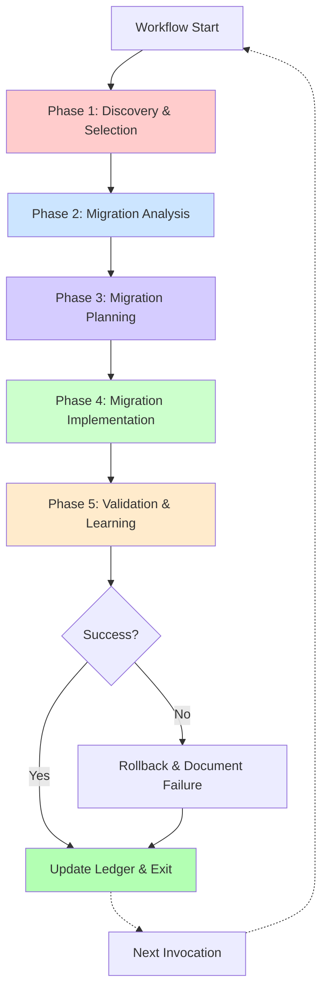

# **AI Native Development Architecture**

## **Autonomous ANDA Migration Workflow**
### **Self-Discovering Architecture Transformation System**

---

## **1. Introduction & Core Philosophy**

### **1.1. Executive Summary**

This document outlines the **Autonomous ANDA Migration Workflow** - a revolutionary 5-phase system specifically designed to transform existing codebases into the Agent-Navigable Dataflow Architecture (Living Blueprint). Unlike traditional development workflows that require comprehensive upfront planning, this system operates on an **autonomous discovery model** where each invocation independently explores the codebase, selects the optimal migration target, and executes a complete feature transformation.

The architecture is built on the principle of **single-feature autonomy**: every workflow execution is self-contained, discovering what needs to be done, planning only for that specific migration, implementing it completely, and updating the Architectural Ledger before exiting. This mirrors the original DiagnosticsResearcher model - focused, autonomous, and complete.

### **1.2. The Autonomous Discovery Principle**

The foundational philosophy is **"Discover, Decide, Execute, Repeat"**:

```yaml
Invocation N:
  1. DISCOVER: Explore database schema & codebase state
  2. DECIDE: Autonomously select next migration target
  3. PLAN: Create migration plan for that ONE feature
  4. EXECUTE: Implement complete replacement
  5. LEARN: Update ledger and exit

Invocation N+1:
  Starts fresh, discovers new state, selects different target...
```

**Key Insight:** No master roadmap exists. The system learns from the ledger, scores candidates based on impact factors, and autonomously chooses what to migrate next. Each run delivers a complete, production-ready migration.

### **1.3. Target Architecture: ANDA (Living Blueprint)**

The workflow systematically migrates codebases to adopt four foundational pillars:

1. **Type-Safe Data Layer**: PostgreSQL → Drizzle ORM → tRPC → React (end-to-end types)
2. **Smart Component Cells**: Self-contained components with manifests, pipelines, and behavioral assertions
3. **Specialized Procedure Architecture**: One procedure per file (≤200 lines), domain routers for aggregation (≤50 lines), no monolithic API files
4. **Architectural Ledger**: Immutable history of all changes with architecture health metrics for AI agent context

**Ultimate Goal:** 100% ANDA adoption where every component is a Cell, every data query flows through specialized tRPC procedures, every architecture violation is detected early, and the codebase maintains absolute leanness optimized for AI agent development.

### **1.4. System Goals & Principles**

**Primary Goals:**

* **Autonomous Operation**: Zero human intervention required for migration decisions
* **Incremental Value**: Each invocation delivers a complete, working migration
* **Complete Replacement**: No parallel versions, no feature flags, no "TODO later"
* **AI Agent Optimization**: Transform codebases into navigable, explicit systems
* **100% Adoption**: Systematic progression toward full ANDA architecture

**Guiding Principles:**

* **Atomic Completeness**: Each migration is one commit - new Cell created, old component deleted
* **Zero Tolerance for Drift**: Immediate cleanup, no temporary implementations
* **Ledger-First Development**: Every action documented for AI agent long-term memory
* **Evidence-Based Selection**: Autonomous decisions based on measurable criteria
* **Learning-Driven Evolution**: Each invocation learns from past successes and failures

---

## **2. The 5-Phase Autonomous Migration Workflow**

### **2.1. Phase Overview**

Each workflow invocation executes all 5 phases for ONE feature migration:



### **2.2. Phase 1: Discovery & Selection (MigrationScout)**

**Primary Agent:** `MigrationScout`  
**Mission:** Autonomously explore the current state and decide what to migrate next

**Discovery Protocol:**

```yaml
Autonomous Exploration:
  1. Query Ledger:
     - What's already migrated?
     - What failed previously?
     - Learn from past attempts
  
  2. Scan Database Schema:
     - Query Supabase for all tables
     - Identify data relationships
     - Find unmigrated data flows
  
  3. Analyze Codebase:
     - Find components using direct Supabase calls
     - Detect components without Cell structure
     - Identify type-unsafe data flows
     - Look for -v2/-fixed anti-patterns
  
  4. Measure Impact:
     - Count component usage frequency
     - Check if it's on critical path
     - Assess migration complexity
  
  5. Autonomous Decision:
     - Score all candidates
     - Select highest-scoring target
     - Document selection rationale
```

**Selection Algorithm:**

```typescript
interface MigrationCandidate {
  component: string
  path: string
  score: number
  factors: {
    hasDirectDbCalls: boolean      // +30 points
    hasTypeErrors: boolean          // +25 points
    highUsage: boolean              // +20 points (>10 imports)
    hasAntiPatterns: boolean        // +15 points (-v2, -fixed)
    complexity: 'low'|'medium'|'high' // low: +10
    isUserFacing: boolean           // +5 points
  }
  reason: string
}

// Autonomous selection - highest score wins
const winner = candidates
  .filter(c => !alreadyMigrated.includes(c.path))
  .sort((a, b) => b.score - a.score)[0]
```

**Technical Specifications:**

* **Tool Access:** `bash`, `read`, `grep`, `glob`, `list`, `supabase_*`, `ledger-query`
* **Operational Parameters:**

```yaml
DISCOVERY_DIR: "thoughts/shared/discoveries/"
MAX_CANDIDATES_EVALUATED: 50
COMPLEXITY_THRESHOLD: "medium"
MIN_SCORE_THRESHOLD: 40
PRIORITIZE_QUICK_WINS: true
```

**Output:** Discovery Report

```yaml
discovery-report:
  timestamp: "2025-10-02T14:30:00Z"
  selected: "components/dashboard/BudgetOverview.tsx"
  score: 75
  reason: "High-usage component (15 imports) with direct Supabase calls and missing type safety"
  factors:
    hasDirectDbCalls: true
    hasTypeErrors: true
    highUsage: true
    complexity: "medium"
  dependencies:
    database: ["cost_breakdown", "po_mappings"]
    imports: ["recharts", "date-fns", "@/lib/supabase"]
  estimatedImpact: "Affects 12 components, core dashboard feature"
```

### **2.3. Phase 2: Migration Analysis (MigrationAnalyst)**

**Primary Agent:** `MigrationAnalyst`  
**Mission:** Deep dive into selected feature to understand everything needed for migration

**Analysis Protocol:**

```yaml
For Selected Component:
  1. Code Analysis:
     - Read complete component code
     - Trace all data flows
     - Map state management patterns
     - List all dependencies
  
  2. Database Analysis:
     - Identify all queries used
     - Map to required Drizzle schemas
     - Plan tRPC procedures needed
     - Analyze data transformations
  
  3. Behavioral Analysis:
     - Extract implicit requirements
     - Document current functionality
     - Identify edge cases
     - Note accessibility features
  
  4. Integration Analysis:
     - Find all components that import this
     - Check for shared state
     - Identify potential breaking changes
     - Map dependency graph
```

**Specialized Subagents:**

* **codebase-analyzer**: Traces execution flows and data dependencies
* **database-schema-analyzer**: Maps database queries to schema requirements
* **component-pattern-analyzer**: Identifies reusable patterns and anti-patterns
* **dependency-tracer**: Maps import chains and usage

**Technical Specifications:**

* **Tool Access:** `bash`, `read`, `grep`, `glob`, `list`, `supabase_*`, `ast-parser`
* **Operational Parameters:**

```yaml
ANALYSIS_DIR: "thoughts/shared/analysis/"
ANALYSIS_DEPTH: "comprehensive"
TRACE_DEPTH: 3
INCLUDE_USAGE_PATTERNS: true
EXTRACT_BEHAVIORAL_ASSERTIONS: true
```

**Output:** Analysis Report

```yaml
analysis-report:
  component: "BudgetOverview.tsx"
  currentImplementation:
    lineCount: 350
    queries:
      - "SELECT * FROM cost_breakdown WHERE project_id = ?"
      - "SELECT * FROM po_mappings WHERE cost_breakdown_id IN (?)"
    stateManagement: "local useState, no persistence"
    dependencies:
      ui: ["recharts"]
      data: ["@supabase/supabase-js"]
      utils: ["date-fns"]
  
  requiredChanges:
    drizzleSchemas:
      - name: "costBreakdown"
        fields: ["id", "projectId", "subBusinessLine", "costLine", "budgetCost"]
      - name: "poMappings"
        fields: ["id", "costBreakdownId", "poNumber", "actualCost"]
    
    trpcProcedures:
      - file: "procedures/budget/get-overview.procedure.ts"
        input: { projectId: "uuid", dateRange: { from: "Date", to: "Date" }}
        output: "CostOverview[]"
      - file: "procedures/budget/get-breakdown.procedure.ts"
        input: { projectId: "uuid" }
        output: "CostBreakdownItem[]"
      - file: "procedures/budget/budget.router.ts"
        purpose: "Aggregates budget procedures"
    
    cellStructure:
      location: "components/cells/budget-overview/"
      manifest: "5 behavioral assertions required"
      pipeline: "Standard validation gates + performance benchmarks"
      complexity: "medium"
  
  dependencies:
    importedBy: 12
    criticalPath: true
    testCoverage: 0
```

### **2.4. Phase 3: Migration Planning (MigrationArchitect)**

**Primary Agent:** `MigrationArchitect`  
**Mission:** Create detailed implementation plan for this ONE feature migration

**Planning Protocol:**

```yaml
Create Surgical Plan:
  1. Data Layer Plan:
     - Define exact tRPC procedure signatures
     - Specify Zod input/output schemas
     - Plan error handling strategy
     - Design data transformation logic
  
  2. Cell Structure Plan:
     - Design manifest.json structure
     - Define behavioral assertions
     - Specify pipeline validation gates
     - Plan test coverage strategy
  
  3. Migration Sequence:
     - Order implementation steps
     - Define validation checkpoints
     - Identify rollback points
     - Plan atomic commit strategy
  
  4. Validation Plan:
     - Define success criteria
     - Set performance benchmarks
     - Create test scenarios
     - Plan integration verification
```

**Critical Patterns:**

* **Complete Replacement**: Plan includes deletion of old component
* **Ledger Integration**: Every step documented for future reference
* **Pipeline-Driven**: Success = all validation gates pass
* **Type-Safety First**: Ensure end-to-end type flow before UI work

**Technical Specifications:**

* **Tool Access:** `bash`, `write` (plans only), `read`, `grep`, `glob`, `list`
* **Operational Parameters:**

```yaml
PLANS_DIR: "thoughts/shared/plans/"
PLAN_FORMAT: "migration-v2"
VALIDATION_GATES: ["types", "tests", "build", "performance", "accessibility"]
REQUIRE_ROLLBACK_STRATEGY: true
ATOMIC_COMMIT_REQUIRED: true
```

**Output:** Migration Plan

```yaml
migration-plan:
  target: "BudgetOverview"
  migrationId: "mig_20251002_143000_budgetOverview"
  
  steps:
    1:
      phase: "Data Layer"
      action: "Create Drizzle schemas"
      files:
        - "packages/db/src/schema/cost-breakdown.ts"
        - "packages/db/src/schema/po-mappings.ts"
      validation: "Schema compiles, matches DB"
    
    2:
      phase: "Data Layer"
      action: "Create specialized tRPC procedures"
      files:
        - "packages/api/src/procedures/budget/get-overview.procedure.ts"
        - "packages/api/src/procedures/budget/get-breakdown.procedure.ts"
        - "packages/api/src/procedures/budget/budget.router.ts"
      validation: "Each procedure is in its own file. Test with curl."
    
    3:
      phase: "Cell Creation"
      action: "Create Cell structure"
      location: "components/cells/budget-overview/"
      files:
        - "component.tsx"
        - "manifest.json"
        - "pipeline.yaml"
        - "state.ts"
      validation: "Manifest schema valid"
    
    4:
      phase: "Implementation"
      action: "Implement component with tRPC"
      validation: "All tests pass, coverage ≥80%"
    
    5:
      phase: "Integration"
      action: "Update imports & delete old"
      files:
        - "Update 12 importing components"
        - "DELETE components/dashboard/BudgetOverview.tsx"
      validation: "Build succeeds, no broken imports"
    
    6:
      phase: "Validation"
      action: "Full validation suite"
      validation: "Types pass, tests pass, performance ≤110% baseline"
    
    7:
      phase: "Completion"
      action: "Update ledger and commit"
      commit: "Migrate BudgetOverview to Cell architecture"
      ledgerEntry: true
  
  rollbackStrategy:
    trigger: "Any step fails validation"
    action: "git revert migration commit"
    documentation: "Update ledger with failure details"
  
  successCriteria:
    - "All validation gates pass"
    - "Old component deleted"
    - "Zero direct Supabase calls"
    - "End-to-end type safety verified"
    - "Ledger updated"
```

### **2.5. Phase 4: Migration Implementation (MigrationExecutor)**

**Primary Agent:** `MigrationExecutor`  
**Mission:** Execute the plan with zero deviation, complete replacement only

**Implementation Protocol:**

```yaml
Execute Plan (Zero Deviation):
  1. Create tRPC Infrastructure:
     - Write Drizzle schemas
     - Implement tRPC procedures
     - Test endpoints with curl
     - Verify type flow
  
  2. Build Cell Structure:
     - Create directory
     - Write component.tsx
     - Create manifest.json with assertions
     - Setup pipeline.yaml
     - Write state.ts if needed
  
  3. Implement Component:
     - Use tRPC queries (no direct DB)
     - Memoize all objects/arrays
     - Use z.string().transform() for dates
     - Add comprehensive tests
     - Document behavioral assertions
  
  4. Complete Replacement:
     - Update ALL imports atomically
     - DELETE old component
     - Verify no references remain
     - Run full test suite
  
  5. Atomic Commit:
     - Single commit with all changes
     - Clear commit message
     - Ledger entry included
```

**Critical Rules:**

* **NO partial implementations** - Complete or rollback
* **NO monolithic API routers** - one procedure, one file
* **NO keeping old code** "just in case"
* **NO feature flags** or conditional logic
* **Complete replacement** is the only acceptable outcome

**Implementation Patterns:**

```typescript
// ✅ CORRECT: Memoized date range
const dateRange = useMemo(() => {
  const now = new Date()
  const from = new Date(now)
  from.setMonth(from.getMonth() - 6)
  from.setHours(0, 0, 0, 0)
  
  const to = new Date(now)
  to.setMonth(to.getMonth() + 6)
  to.setHours(23, 59, 59, 999)
  
  return { from, to }
}, [])

// ✅ CORRECT: tRPC with typed response
const { data } = trpc.budget.getOverview.useQuery({
  projectId,
  dateRange
})

// ✅ CORRECT: Date handling in tRPC
.input(z.object({
  dateRange: z.object({
    from: z.string().transform(val => new Date(val)),
    to: z.string().transform(val => new Date(val))
  })
}))
```

**Technical Specifications:**

* **Tool Access:** `bash`, `write`, `edit`, `read`, `grep`, `glob`, `list`, `tavily_*`, `exa_*`, `context7_*`, `supabase_*`, `shadcn_*`
* **EXCLUSIVE:** `edit: true` (only agent that can modify source code)
* **Operational Parameters:**

```yaml
IMPLEMENTATIONS_DIR: "thoughts/shared/implementations/"
VALIDATION_CHECKPOINTS: ["syntax", "types", "tests", "build", "integration"]
ROLLBACK_ON_FAILURE: true
REQUIRE_ATOMIC_COMMIT: true
CELL_STRUCTURE_REQUIRED: true
DELETE_OLD_COMPONENT: true
```

**Output:** Implementation Report + Modified Source Code

```yaml
implementation-report:
  migrationId: "mig_20251002_143000_budgetOverview"
  timestamp: "2025-10-02T14:45:00Z"
  
  filesCreated:
      - "packages/api/src/procedures/budget/get-overview.procedure.ts"
      - "packages/api/src/procedures/budget/get-breakdown.procedure.ts"
      - "packages/api/src/procedures/budget/budget.router.ts"
      - "components/cells/budget-overview/component.tsx"
      - "components/cells/budget-overview/manifest.json"
      - "components/cells/budget-overview/pipeline.yaml"
  
  filesModified:
    - "app/dashboard/page.tsx"
    - "components/ProjectView.tsx"
    # ... 10 more importing components
  
  filesDeleted:
    - "components/dashboard/BudgetOverview.tsx"
  
  validation:
    typeCheck: "✓ Pass"
    tests: "✓ Pass (87% coverage)"
    build: "✓ Success"
    performance: "✓ 105% of baseline (acceptable)"
  
  commit:
    sha: "abc123def"
    message: "Migrate BudgetOverview to Cell architecture"
  
  ledgerUpdated: true
```

### **2.6. Phase 5: Validation & Architecture Health Monitoring (MigrationValidator)**

**Primary Agent:** `MigrationValidator` (Architecture Health Monitor)  
**Mission:** Dual-level responsibility - validate THIS migration succeeded AND assess SYSTEM-WIDE architecture health

**REVOLUTIONARY TRANSFORMATION:** Phase 5 is now an Architecture Health Monitor that operates on two critical levels:

**Dual-Level Validation Protocol:**

```yaml
LEVEL 1: Migration Validation (Did THIS migration work?)
  
  1. Technical Validation:
     - TypeScript compiles with zero errors
     - All tests pass (≥80% coverage)
     - Build succeeds
     - No console errors
     - No `any` types introduced
  
  2. Functional Validation:
     - Feature works identically to before
     - Performance within acceptable range (≤110%)
     - No visual regressions
     - Accessibility maintained/improved
  
  3. Integration Validation:
     - All importers still work
     - No broken dependencies
     - API contracts maintained
     - Database queries optimized
  
  4. Architectural Validation (Cell-specific):
     - Cell structure complete
     - Manifest defines all assertions
     - Pipeline gates configured
     - Old component deleted
     - Ledger updated

LEVEL 2: Architecture Health Assessment (Is the SYSTEM healthy?)

  1. ANDA Pillar Integrity Scan:
     - Type Safety: Scan for `any` types, direct DB calls
     - Cell Quality: Check manifests, assertions, pipeline coverage
     - Ledger Completeness: Verify all migrations documented
  
  2. Specialized Procedure Architecture Compliance:
     - Scan all procedure files for 200-line limit violations
     - Check domain routers for 50-line limit compliance
     - Detect MONOLITHIC FILES (>500 lines) - architectural emergency
     - Verify M1-M4 mandate compliance
  
  3. Anti-Pattern Detection:
     - Parallel component implementations (-v2, -fixed, -worldclass)
     - Large non-Cell components
     - Feature flags (conditional architecture)
     - Categorize by severity (Critical/High/Medium/Low)
  
  4. Trend Analysis:
     - Compare with last 5 migrations
     - Detect consecutive degradations (early warning system)
     - Identify improving/stable/degrading metrics
     - Project future architecture state
  
  5. Architecture Health Score Calculation:
     - Weighted formula: (type_safety*25% + procedure_compliance*25% + 
                          cell_quality*20% + ledger*15% + navigability*10%)
     - Apply anti-pattern penalties (-5 points each)
     - Determine status: Excellent (≥90) / Good (75-89) / Fair (60-74) / Poor (<60)
     - Apply trend modifiers (degrading trends lower thresholds)
  
  6. Strategic Recommendations Generation:
     - Transform findings into actionable improvement roadmap
     - Prioritize: Urgent / High / Medium / Low
     - Provide specific remediation steps with effort estimates
     - Systemic fixes for degrading trends
  
  7. Learning Capture:
     - Document migration patterns that worked
     - Note pitfalls encountered
     - Extract architecture learnings
     - Update success metrics for next run
```

**Failure Recovery & Architecture Governance:**

```yaml
If Migration Validation Fails (Level 1):
  1. Immediately halt
  2. git revert migration commit
  3. Generate detailed failure report
  4. Update ledger with failure details
  5. Exit workflow
  
If Architecture Health POOR (<60) or CRITICAL Issues (Level 2):
  1. Complete migration validation first
  2. Generate architecture health report
  3. ⚠️ PAUSE MIGRATIONS - Display critical warning
  4. Provide refactoring roadmap
  5. Exit with status: "Architecture refactoring required before continuing"
  
Next Invocation:
  - Learns from failure report
  - Checks architecture health status
  - If health restored (≥60): Resume migrations
  - If health still poor: Requires manual architecture refactoring
  - May retry failed migration with different approach
  - Or selects different migration target
```

**Technical Specifications:**

* **Tool Access:** `bash`, `write` (reports only), `read`, `grep`, `glob`, `list`, `test-runner`, `lighthouse`
* **Operational Parameters:**

```yaml
VALIDATIONS_DIR: "thoughts/shared/validations/"
PERFORMANCE_THRESHOLD: 1.10
COVERAGE_THRESHOLD: 0.80
ACCESSIBILITY_STANDARD: "WCAG_AA"
REQUIRE_ZERO_REGRESSIONS: true
```

**Output:** Dual-Level Reports + Enhanced Ledger Entry

```yaml
# LEVEL 1: Migration Validation Report
validation-report:
  migrationId: "mig_20251002_143000_budgetOverview"
  status: "SUCCESS"
  
  validations:
    technical:
      typescript: "✓ Zero errors"
      tests: "✓ 87% coverage (target: 80%)"
      build: "✓ Production build successful"
      linting: "✓ Zero warnings"
    
    functional:
      featureParity: "✓ Identical behavior verified"
      performance: "✓ 105% of baseline (target: ≤110%)"
      visualRegression: "✓ No regressions detected"
    
    architectural:
      cellStructure: "✓ Complete"
      manifest: "✓ 5 behavioral assertions defined"
      pipeline: "✓ All gates configured"
      oldComponentDeleted: "✓ Confirmed"
      ledgerUpdated: "✓ Entry created"
  
  learnings:
    migration:
      - "Date memoization prevented infinite render loops"
      - "tRPC types eliminated 3 potential runtime errors"
      - "Cell manifest made implicit requirements explicit"
    architecture:
      - "Specialized procedure pattern maintained granularity"
      - "No monolithic files detected - architecture healthy"

# LEVEL 2: Architecture Health Report (NEW)
architecture-health-report:
  timestamp: "2025-10-02T14:45:00Z"
  healthScore: 92
  status: "EXCELLENT"
  trend: "STABLE"
  
  anda_pillars:
    type_safety_integrity: 95
    cell_quality_score: 88
    ledger_completeness: 100
  
  specialized_architecture:
    procedure_compliance: 100  # All procedures ≤200 lines
    router_compliance: 100      # All routers ≤50 lines
    monolithic_file_count: 0    # 🟢 No architectural emergencies
  
  anti_patterns:
    critical: 0
    high: 0
    medium: 1  # One large non-Cell component identified
    low: 0
    total_debt: 0  # Within threshold (max: 3)
  
  trends:
    direction: "stable"
    degrading_metrics: []
    consecutive_warnings: 0
  
  recommendations:
    count: 1
    urgent: 0
    high: 0
    medium: 1
    low: 0
    next_action: "Continue migrations confidently"

# Enhanced Ledger Entry with Architecture Metrics:
ledger-entry:
  iterationId: "mig_20251002_143000_budgetOverview"
  timestamp: "2025-10-02T14:45:00Z"
  humanPrompt: "Run ANDA migration workflow"
  
  artifacts:
    created:
      - type: "cell"
        id: "budget-overview"
        path: "components/cells/budget-overview"
      - type: "trpc-procedure"
        id: "budget.getOverview"
        path: "packages/api/src/procedures/budget/get-overview.procedure.ts"
      - type: "trpc-procedure"
        id: "budget.getBreakdown"
        path: "packages/api/src/procedures/budget/get-breakdown.procedure.ts"
      - type: "domain-router"
        id: "budget.router"
        path: "packages/api/src/procedures/budget/budget.router.ts"
    
    modified:
      - "app/dashboard/page.tsx"
      - "components/ProjectView.tsx"
    
    replaced:
      - type: "component"
        id: "BudgetOverview"
        path: "components/dashboard/BudgetOverview.tsx"
        deletedAt: "2025-10-02T14:45:00Z"
        reason: "Migrated to Cell architecture"
  
  schemaChanges: []
  
  metadata:
    agent: "MigrationExecutor"
    duration: 900000
    validationStatus: "SUCCESS"
    adoptionProgress: "18/250 components migrated (7.2%)"
    
    # NEW: Architecture Health Metrics
    architecture_metrics:
      health_score: 92
      anda_pillars:
        type_safety_integrity: 95
        cell_quality_score: 88
        ledger_completeness: 100
      specialized_architecture:
        procedure_compliance: 100
        router_compliance: 100
        monolithic_file_count: 0
      anti_patterns:
        critical_count: 0
        high_count: 0
        total_debt: 0
      trends:
        direction: "stable"
        degrading_metrics_count: 0
        consecutive_warnings: 0
      architecture_status: "healthy"
      recommendations_count: 1
```

---

## **3. Agent Architecture & Specialized Subagents**

### **3.1. Primary Migration Agents**

| Agent | Phase | Core Mission | Key Tools |
|-------|-------|--------------|-----------|
| **MigrationScout** | 1 | Autonomous feature discovery and selection | `ledger-query`, `grep`, `glob`, `supabase` |
| **MigrationAnalyst** | 2 | Deep component and data flow analysis with specialized procedure architecture awareness | `codebase-analyzer`, `database-schema-analyzer` |
| **MigrationArchitect** | 3 | Surgical migration plan creation with specialized procedure specifications | `write`, `read`, `pattern-analyzer` |
| **MigrationExecutor** | 4 | Exclusive implementation authority enforcing specialized procedure architecture | `edit`, `write`, `tRPC`, `drizzle` |
| **MigrationValidator** | 5 | **Architecture Health Monitor** - Dual-level validation (migration + system-wide health) | `bash`, `grep`, `test-runner`, `architecture-scanner`, `ledger-write` |

### **3.2. Specialized Subagents**

| Subagent | Purpose | Used By |
|----------|---------|---------|
| **anti-pattern-detector** | Finds `-v2`, `-fixed` components and direct DB calls | MigrationScout |
| **type-coverage-analyzer** | Calculates percentage of typed vs `any` code | MigrationScout |
| **codebase-analyzer** | Deep code comprehension and execution flow tracing | MigrationAnalyst |
| **database-schema-analyzer** | Supabase schema analysis and query mapping | MigrationAnalyst |
| **dependency-tracer** | Maps component usage and import chains | MigrationAnalyst |
| **manifest-generator** | Creates manifest.json from component analysis | MigrationArchitect |
| **pipeline-builder** | Generates pipeline.yaml with validation gates | MigrationArchitect |
| **behavioral-validator** | Verifies behavioral assertions are met | MigrationValidator |
| **performance-benchmarker** | Compares before/after performance metrics | MigrationValidator |
| **ledger-historian** | Queries and updates architectural ledger | All Agents |

---

## **4. Autonomous Decision Engine**

### **4.1. Scoring Algorithm**

The system uses a weighted scoring algorithm that runs fresh each invocation:

```typescript
class MigrationDecisionEngine {
  async selectNextMigration(): Promise<MigrationTarget> {
    // 1. Query ledger for history
    const history = await ledger.getAllMigrations()
    const completed = history.filter(e => e.status === 'SUCCESS')
    const failed = history.filter(e => e.status === 'FAILED')
    
    // 2. Discover candidates
    const candidates = await this.discoverCandidates()
    
    // 3. Filter out already migrated
    const available = candidates.filter(c => 
      !completed.some(m => m.component === c.path)
    )
    
    // 4. Score each candidate
    const scored = available.map(c => ({
      ...c,
      score: this.calculateScore(c, failed)
    }))
    
    // 5. Select highest score
    const winner = scored.sort((a, b) => b.score - a.score)[0]
    
    if (!winner || winner.score < MIN_SCORE_THRESHOLD) {
      return null // No suitable candidates
    }
    
    return winner
  }
  
  calculateScore(component: Component, failedAttempts: Migration[]): number {
    let score = 0
    
    // Critical factors (high impact)
    if (component.hasDirectDbCalls) score += 30
    if (component.hasTypeErrors) score += 25
    if (component.usageCount > 10) score += 20
    if (component.hasAntiPatterns) score += 15
    
    // Preference factors
    if (component.complexity === 'low') score += 10
    if (component.complexity === 'medium') score += 5
    if (component.isUserFacing) score += 5
    if (component.hasTests) score += 5
    
    // Learning adjustments
    const previousFailure = failedAttempts.find(f => f.component === component.path)
    if (previousFailure) {
      score -= 20 // Deprioritize previously failed migrations
    }
    
    return score
  }
  
  async discoverCandidates(): Promise<Component[]> {
    const candidates = []
    
    // Find components with direct Supabase calls
    const directDbComponents = await grep('supabase.from\\(', {
      include: '*.tsx',
      exclude: 'node_modules'
    })
    
    // Find components without Cell structure
    const nonCellComponents = await glob('components/**/*.tsx')
      .filter(f => !f.includes('/cells/'))
      .filter(f => !f.includes('/ui/'))
    
    // Find components with anti-patterns
    const antiPatternComponents = await glob('**/*-{v2,fixed,new,worldclass}.tsx')
    
    // Analyze each candidate
    for (const path of [...new Set([...directDbComponents, ...nonCellComponents])]) {
      const analysis = await this.analyzeComponent(path)
      candidates.push(analysis)
    }
    
    return candidates
  }
}
```

### **4.2. Learning from History**

Each invocation queries the ledger to learn:

```typescript
interface LedgerLearning {
  completed: string[]          // Already migrated components
  failed: Migration[]           // Previous failures to avoid
  patterns: SuccessPattern[]    // What worked well
  velocity: number              // Average migration time
  adoptionRate: number          // Percentage complete
}

// Example query
const learning = await ledger.query({
  getCompleted: true,
  getFailures: true,
  extractPatterns: true,
  calculateMetrics: true
})

// Use learning to inform decision
if (learning.failed.includes(candidate.path)) {
  candidate.score -= 20 // Deprioritize
}

if (learning.patterns.includes('low-complexity-success')) {
  if (candidate.complexity === 'low') {
    candidate.score += 10 // Prefer quick wins
  }
}
```

---

## **5. Migration Patterns & Anti-Patterns**

### **5.1. Critical Migration Patterns**

**Pattern 1: Complete Replacement**

```yaml
✓ DO:
  1. Create new Cell with full functionality
  2. Test exhaustively (≥80% coverage)
  3. Update ALL imports in single operation
  4. DELETE old component immediately
  5. Commit as atomic unit

✗ DON'T:
  - Keep both versions "temporarily"
  - Use feature flags for migration
  - Add TODO comments
  - Create transition periods
```

**Pattern 2: Type-Safety First**

```yaml
✓ DO:
  1. Create Drizzle schemas first
  2. Implement tRPC procedures
  3. Test type flow with curl
  4. THEN build UI component
  
✗ DON'T:
  - Build UI before data layer ready
  - Use 'any' types
  - Skip Zod validation
```

**Pattern 3: Memoization for React Query**

```typescript
// ✓ CORRECT: Memoized, stable reference
const dateRange = useMemo(() => ({
  from: new Date(startDate),
  to: new Date(endDate)
}), [startDate, endDate])

const { data } = trpc.query.useQuery({ dateRange })

// ✗ WRONG: New object every render = infinite loop
const { data } = trpc.query.useQuery({
  dateRange: { from: new Date(), to: new Date() }
})
```

**Pattern 4: API Procedure Specialization (CRITICAL)**

```yaml
✓ DO - Specialized Procedure Architecture:
  M1 - One Procedure, One File:
    - Create separate file for each tRPC procedure
    - File naming: [action]-[entity].procedure.ts
    - Example: get-overview.procedure.ts, update-budget.procedure.ts
  
  M2 - Strict File Size Limits:
    - Procedure files: MAX 200 lines
    - Domain routers: MAX 50 lines
    - If approaching limit, split into smaller procedures
  
  M3 - No Parallel Implementations:
    - Single source of truth in packages/api
    - No duplicate logic in Edge Functions
    - No alternative implementations
  
  M4 - Explicit Naming:
    - Action verbs: get-, update-, create-, delete-
    - Entity names: budget, user, project
    - NEVER: index.ts, main.ts, handler.ts, api.ts
  
  Domain Router Pattern:
    - Simple aggregation only: import + mergeRouters()
    - NO business logic in routers
    - Example:
      ```typescript
      // budget.router.ts (≤50 lines)
      import { getOverviewRouter } from './get-overview.procedure'
      import { getBreakdownRouter } from './get-breakdown.procedure'
      
      export const budgetRouter = mergeRouters(
        getOverviewRouter,
        getBreakdownRouter
      )
      ```

✗ DON'T - Anti-Patterns to Eliminate:
  - Monolithic router files (>500 lines) - ARCHITECTURAL EMERGENCY
  - Multiple procedures in one file
  - Business logic in domain routers
  - Generic file names (index.ts, api.ts)
  - Parallel implementations in multiple locations
```

### **5.2. Anti-Patterns to Eliminate**

| Anti-Pattern | Detection Command | Resolution | Severity |
|--------------|-------------------|------------|----------|
| **Monolithic Files** | `find packages/api -name "*.ts" -exec wc -l {} + \| awk '$1 > 500'` | Split into specialized procedures | 🔴🔴🔴 CRITICAL |
| **Procedure File Violations** | `find packages/api/src/procedures -name "*.procedure.ts" -exec wc -l {} + \| awk '$1 > 200'` | Refactor into smaller procedures | 🔴 HIGH |
| **Router Complexity** | `find packages/api -name "*.router.ts" -exec wc -l {} + \| awk '$1 > 50'` | Remove business logic, keep aggregation only | 🔴 HIGH |
| **Parallel Implementations** | `grep -r "supabase.from\|sql\`" supabase/functions/trpc/` | Consolidate to packages/api | 🔴 CRITICAL |
| **Version Suffixes** | `find . -name "*-v2.tsx" -o -name "*-fixed.tsx" -o -name "*-worldclass.tsx"` | Delete and consolidate | 🔴 CRITICAL |
| **Direct DB Access** | `grep -r "supabase\.from" apps/web/components --include="*.tsx"` | Replace with tRPC procedures | 🔴 HIGH |
| **Missing Types** | `grep -r ": any" --include="*.ts"` | Add proper Zod schemas and types | 🟡 MEDIUM |
| **Large Non-Cell Components** | `find apps/web/components -name "*.tsx" ! -path "*/cells/*" -exec wc -l {} + \| awk '$1 > 300'` | Migrate to Cell structure | 🟡 MEDIUM |
| **Feature Flags** | `grep -r "FEATURE_FLAG\|featureFlag\|enableFeature" --include="*.ts"` | Replace with explicit architecture | 🟡 LOW |

**Detection Frequency:**
- **Every Migration (Phase 5)**: Architecture Health Monitor scans for ALL anti-patterns
- **Severity Categories**: Critical → High → Medium → Low
- **Architecture Debt Threshold**: Max 3 Critical+High anti-patterns before PAUSE

---

## **6. Development Pitfalls & Prevention**

### **6.1. Pitfall #1: Infinite Render Loops**

**Severity:** CRITICAL

**Symptom:** Component stuck loading, React Query shows `pending` forever

**Root Cause:** Unmemoized objects passed to hooks create new references every render

**Prevention:**
```typescript
// ✓ ALWAYS memoize complex objects
const queryInput = useMemo(() => ({
  projectId,
  filters: { status: 'active' }
}), [projectId])
```

### **6.2. Pitfall #2: Date Serialization Over HTTP**

**Severity:** HIGH

**Root Cause:** Date objects can't be serialized to JSON

**Prevention:**
```typescript
// ✓ CORRECT: tRPC input schema
.input(z.object({
  date: z.string().transform(val => new Date(val))
}))

// ✗ WRONG: Expecting Date object
.input(z.object({
  date: z.date() // Will fail over HTTP
}))
```

### **6.3. Pitfall #3: SQL Syntax Confusion**

**Severity:** MEDIUM

**Prevention:**
```typescript
// ✓ CORRECT: Use Drizzle helpers
import { inArray, eq } from 'drizzle-orm'
const data = await db.select()
  .from(table)
  .where(inArray(table.id, ids))

// ✗ WRONG: Mixing raw SQL
.where(sql`${table.id} = ANY(${ids})`)
```

---

## **7. Single Invocation Example**

```yaml
User Command: "Run ANDA migration workflow"

═══════════════════════════════════════════════════════════
PHASE 1: DISCOVERY & SELECTION (2 min)
═══════════════════════════════════════════════════════════

MigrationScout:
  → Query ledger: 5 components already migrated
  → Scan codebase: 23 candidates found
  → Detect anti-patterns: 3 versioned files, 8 direct DB calls
  → Calculate scores:
      BudgetOverview.tsx: 75 points
      PLTimeline.tsx: 68 points
      FilterPanel.tsx: 55 points
  → SELECTED: BudgetOverview.tsx
  → REASON: "High usage (15 imports), direct Supabase, type errors"

═══════════════════════════════════════════════════════════
PHASE 2: MIGRATION ANALYSIS (1 min)
═══════════════════════════════════════════════════════════

MigrationAnalyst:
  → Analyze component: 350 lines, 3 Supabase queries
  → Trace dependencies: Used by 12 components
  → Map data flows: cost_breakdown + po_mappings tables
  → Identify requirements: 5 behavioral assertions extracted
  → RESULT: Comprehensive analysis report generated

═══════════════════════════════════════════════════════════
PHASE 3: MIGRATION PLANNING (1 min)
═══════════════════════════════════════════════════════════

MigrationArchitect:
  → Design data layer: 2 tRPC procedures required
  → Plan Cell structure: manifest + pipeline + component
  → Create migration sequence: 7 steps with checkpoints
  → Define success criteria: Types, tests, performance
  → RESULT: Detailed migration plan created

═══════════════════════════════════════════════════════════
PHASE 4: MIGRATION IMPLEMENTATION (15 min)
═══════════════════════════════════════════════════════════

MigrationExecutor:
  ✓ Create Drizzle schemas (2 min)
  ✓ Implement specialized tRPC procedures (4 min)
  ✓ Test endpoints with curl (1 min)
  ✓ Create Cell structure (2 min)
  ✓ Implement component (5 min)
  ✓ Write tests (2 min)
  ✓ Update 12 imports (1 min)
  ✓ DELETE old component (1 min)
  ✓ Commit changes (1 min)

  Files Created: 8
  Files Modified: 14
  Files Deleted: 1
  Commit: abc123def "Migrate BudgetOverview to Cell architecture"

═══════════════════════════════════════════════════════════
PHASE 5: VALIDATION & ARCHITECTURE HEALTH MONITORING (3 min)
═══════════════════════════════════════════════════════════

MigrationValidator (Architecture Health Monitor):

LEVEL 1: Migration Validation
  ✓ TypeScript: Zero errors
  ✓ Tests: 87% coverage (target: 80%)
  ✓ Build: Production build successful
  ✓ Performance: 105% of baseline (target: ≤110%)
  ✓ Cell Structure: Complete with manifest
  ✓ Old Component: Deleted
  ✓ Ledger: Entry created

  MIGRATION STATUS: ✓ SUCCESS

LEVEL 2: Architecture Health Assessment
  
  ANDA Pillar Integrity:
    ✓ Type Safety: 95% coverage (5% any types)
    ✓ Cell Quality: 88% (manifests, pipelines complete)
    ✓ Ledger Completeness: 100%
  
  Specialized Procedure Architecture:
    ✓ Procedure Compliance: 100% (all files ≤200 lines)
    ✓ Router Compliance: 100% (all routers ≤50 lines)
    ✓ Monolithic Files: 0 detected
  
  Anti-Pattern Detection:
    ✓ Critical: 0 | High: 0 | Medium: 1 | Low: 0
    ✓ Architecture Debt: 0/3 (within threshold)
  
  Trend Analysis:
    → Overall: STABLE (compared to last 5 migrations)
    → No degrading metrics detected
    → No consecutive warnings
  
  Architecture Health Score: 92/100 - EXCELLENT 🟢
  
  Recommendations: 1 medium-priority item
  Next Action: Continue migrations confidently

  ARCHITECTURE STATUS: ✓ HEALTHY
  ADOPTION: 6/250 components migrated (2.4% → 2.8%)

Reports Generated:
  - Migration Validation: thoughts/shared/validations/2025-10-02_14-45_budget-overview_validation.md
  - Architecture Health: thoughts/shared/architecture-health/2025-10-02_architecture-health.md

═══════════════════════════════════════════════════════════
WORKFLOW COMPLETE
═══════════════════════════════════════════════════════════

Result: 
  ✓ Migration: BudgetOverview successfully migrated to Cell architecture
  ✓ Architecture: System health excellent, no refactoring needed
  
Next: Run workflow again to migrate next component
```

**Next Invocation:** Discovers PLTimeline as highest-scoring candidate, migrates it...

---

## **8. Success Metrics & Monitoring**

### **8.1. Progress Tracking**

```yaml
Architecture Adoption:
  Total Components: 250
  Migrated to Cells: 6
  Progress: 2.4%
  Target: 100%

Type Safety:
  Type Coverage: 87%
  Any Types: 23
  Direct DB Calls: 17
  Target: 100% coverage, 0 any types, 0 direct calls

Specialized Procedure Architecture:
  Procedure Compliance: 100% (all ≤200 lines)
  Router Compliance: 100% (all ≤50 lines)
  Monolithic Files: 0
  Target: 100% compliance, 0 monolithic files

Architecture Health:
  Current Score: 92/100
  Status: EXCELLENT
  Trend: STABLE
  Anti-Pattern Debt: 0/3 (threshold)
  Target: Maintain ≥90 (excellent)

Velocity:
  Average Migration Time: 21 minutes
  Migrations per Week: 15
  Estimated Completion: 17 weeks
  Health Assessment Time: +2 min per migration
```

### **8.2. Quality Metrics**

```yaml
Test Coverage:
  Overall: 78%
  Migrated Cells: 85%
  Target: ≥80%

Performance:
  Average Impact: +7% (acceptable: ≤10%)
  Regressions: 0
  Improvements: 3 components faster

Code Quality:
  Linting Errors: 0
  TypeScript Errors: 0
  Dead Code: Reduced by 15%

Architecture Health Metrics (NEW):
  ANDA Pillars:
    - Type Safety Integrity: 95/100
    - Cell Quality Score: 88/100
    - Ledger Completeness: 100/100
  
  Specialized Architecture:
    - Procedure File Compliance: 100%
    - Router Complexity Compliance: 100%
    - Monolithic File Count: 0
  
  Anti-Patterns:
    - Critical Severity: 0
    - High Severity: 0
    - Total Debt: 0/3 (well within threshold)
  
  Trend Analysis:
    - Overall Trajectory: STABLE
    - Degrading Metrics: 0
    - Consecutive Warnings: 0
    - Health improving over last 5 migrations
```

---

## **9. Conclusion**

The Autonomous ANDA Migration Workflow represents a paradigm shift in AI-driven codebase transformation. By combining autonomous migration execution with revolutionary **Architecture Health Monitoring**, the system achieves both immediate value delivery and long-term architectural integrity:

**Key Benefits:**

1. **Zero Planning Overhead** - Start migrating immediately
2. **Continuous Value Delivery** - Each run completes a working migration
3. **Autonomous Operation** - No human decisions required
4. **Dual-Level Quality Assurance** - Validates migration AND system-wide architecture health
5. **Proactive Governance** - Detects drift from ANDA principles BEFORE it compounds
6. **Early Warning System** - Catches monolithic files at migration 5, not migration 50
7. **Adaptive Learning** - Improves with each invocation through ledger intelligence
8. **Predictable Progress** - Clear metrics and velocity tracking with architecture health scores
9. **Architecture Debt Prevention** - Can PAUSE migrations if health drops below threshold
10. **100% ANDA Adoption** - Systematic path to AI-optimized codebase with maintained quality

**Revolutionary Phase 5 - Architecture Health Monitor:**

Phase 5 operates on **dual-level responsibility**:
- **Level 1**: Validates THIS migration succeeded (technical, functional, integration, architectural)
- **Level 2**: Assesses SYSTEM-WIDE architecture health (ANDA pillars, specialized procedures, anti-patterns, trends)

This prevents the architectural debt that would make future agent work unreliable. The health monitor can **PAUSE migrations** if architecture quality drops below 60/100, requiring refactoring before continuing.

**Operational Model:**

```bash
# Simple, repeatable invocation with dual-level validation
$ run-anda-migration
→ Discovers, selects, migrates one feature
→ Validates migration success (Level 1)
→ Assesses architecture health (Level 2)
→ Updates ledger with architecture metrics, exits

# Run again (minutes, hours, or days later)
$ run-anda-migration
→ Learns from ledger + architecture trends
→ Selects next target
→ Migrates different feature
→ Architecture Health: 92/100 - EXCELLENT

# If architecture degrades
$ run-anda-migration
→ Migration succeeds
→ Architecture Health: 55/100 - POOR
→ ⚠️ PAUSE MIGRATIONS - Refactor architecture first
→ Provides refactoring roadmap

# After refactoring
$ run-anda-migration
→ Architecture Health: 88/100 - GOOD
→ Resume migrations confidently

# Continue until complete
$ run-anda-migration
→ "100% ANDA adoption achieved!"
→ "Architecture health maintained at EXCELLENT throughout"
```

**Architecture Governance Principles:**

1. **Early Detection Prevents Disasters** - Catching monolithic files at migration 5 vs migration 50
2. **Proactive Over Reactive** - Recommend refactoring BEFORE issues compound
3. **Trend-Based Intelligence** - 3 consecutive degradations trigger systemic fixes
4. **Agent-Optimal Architecture** - Every decision optimizes for AI agent navigability
5. **Dual-Level Responsibility** - Each migration either improves or degrades overall quality

This workflow transforms codebases into Living Blueprints where AI agents can navigate with perfect clarity, understand requirements through explicit manifests, operate with complete type safety from database to UI, and rely on maintained architectural integrity through continuous health monitoring.

**The goal:** A codebase where every component is a Cell, every data flow is typed through specialized procedures, every change is documented with architecture metrics, architecture health is continuously monitored, and AI agents can develop with maximum effectiveness in a system that prevents long-term degradation.
