# **AI Native Development Architecture**

## **Autonomous ANDA Migration Workflow**
### **Self-Discovering Architecture Transformation System**

---

## **1. Introduction & Core Philosophy**

### **1.1. Executive Summary**

This document outlines the **Autonomous ANDA Migration Workflow** - a revolutionary 6-phase system specifically designed to transform existing codebases into the Agent-Navigable Dataflow Architecture (Living Blueprint). Unlike traditional development workflows that require comprehensive upfront planning, this system operates on an **autonomous discovery model** where each invocation independently explores the codebase, selects the optimal migration target, and executes a complete feature transformation.

The architecture is built on the principle of **single-feature autonomy**: every workflow execution is self-contained, discovering what needs to be done, planning only for that specific migration, implementing it completely, validating both the migration and system-wide architecture health, and updating the Architectural Ledger before exiting. This mirrors the original DiagnosticsResearcher model - focused, autonomous, and complete.

### **1.2. The Autonomous Discovery Principle**

The foundational philosophy is **"Discover, Decide, Execute, Validate, Monitor, Repeat"**:

```yaml
Invocation N:
  1. DISCOVER: Explore database schema & codebase state
  2. DECIDE: Autonomously select next migration target
  3. PLAN: Create migration plan for that ONE feature
  4. EXECUTE: Implement complete replacement (all architectural mandates enforced)
  5. VALIDATE: Verify THIS migration succeeded
  6. MONITOR: Assess SYSTEM-WIDE architecture health
  7. LEARN: Update ledger with architecture metrics and exit

Invocation N+1:
  Starts fresh, discovers new state, checks architecture health, selects different target...
```

**Key Insight:** No master roadmap exists. The system learns from the ledger, scores candidates based on impact factors, and autonomously chooses what to migrate next. Each run delivers a complete, production-ready migration while maintaining system-wide architectural integrity through continuous health monitoring.

### **1.3. Target Architecture: ANDA (Living Blueprint)**

The workflow systematically migrates codebases to adopt four foundational pillars:

1. **Type-Safe Data Layer**: PostgreSQL → Drizzle ORM → tRPC → React (end-to-end types)
2. **Smart Component Cells**: Self-contained components with manifests, pipelines, and behavioral assertions (M-CELL-1, M-CELL-3, M-CELL-4)
3. **Specialized Procedure Architecture**: One procedure per file (≤200 lines), domain routers for aggregation (≤50 lines), no monolithic API files
4. **Architectural Ledger**: Immutable history of all changes with architecture health metrics for AI agent context

**Architectural Mandates (Non-Negotiable):**

The workflow enforces four hard requirements from the Living Blueprint Architecture:

- **M-CELL-1: All Functionality as Cells** - Every discrete functionality MUST be implemented as a Cell (modals, wizards, forms are NOT exempt)
- **M-CELL-2: Complete Atomic Migrations** - Migrations MUST be complete in single commit (NO optional phases, NO future cleanup)
- **M-CELL-3: Zero God Components** - No component file may exceed 400 lines (complexity requires decomposition, not exemption)
- **M-CELL-4: Explicit Behavioral Contracts** - Every Cell MUST document ≥3 behavioral assertions in manifest.json

**Ultimate Goal:** 100% ANDA adoption with 100% mandate compliance - every component is a Cell with manifest, every data query flows through specialized tRPC procedures, every file ≤400 lines, every architecture violation is detected early, and the codebase maintains absolute leanness optimized for AI agent development.

### **1.4. System Goals & Principles**

**Primary Goals:**

* **Autonomous Operation**: Zero human intervention required for migration decisions
* **Incremental Value**: Each invocation delivers a complete, working migration
* **Complete Replacement**: No parallel versions, no feature flags, no "TODO later"
* **AI Agent Optimization**: Transform codebases into navigable, explicit systems
* **100% Adoption**: Systematic progression toward full ANDA architecture

**Guiding Principles:**

* **Atomic Completeness**: Each migration is one commit - new Cell created, old component deleted (M-CELL-2)
* **Zero Tolerance for Drift**: Immediate cleanup, no temporary implementations, no "optional" phases
* **Mandate Enforcement**: All migrations must satisfy M-CELL-1 through M-CELL-4 without exception
* **Anti-Pattern Prevention**: Continuous detection and elimination of architectural violations
* **Ledger-First Development**: Every action documented for AI agent long-term memory with architecture health metrics
* **Evidence-Based Selection**: Autonomous decisions based on measurable criteria
* **Dual-Level Validation**: Validate both migration success AND system-wide architecture health
* **Learning-Driven Evolution**: Each invocation learns from past successes, failures, and architecture trends

---

## **2. The 5-Phase Autonomous Migration Workflow**

### **2.1. Phase Overview**

Each workflow invocation executes all 6 phases for ONE feature migration:

```mermaid
graph TD
    A[Workflow Start] --> B["Phase 1: Discovery & Selection"]
    B --> C["Phase 2: Migration Analysis"]
    C --> D["Phase 3: Migration Planning"]
    D --> D1["Architecture Compliance Check"]
    D1 --> E{Plan Valid?}
    E -->|No| D2[Return to Planning]
    D2 --> D
    E -->|Yes| F["Phase 4: Migration Implementation"]
    F --> G["Phase 5: Migration Validation"]
    G --> H{Migration Success?}
    H -->|No| I[Rollback & Document Failure]
    H -->|Yes| J["Phase 6: Architecture Health Assessment"]
    J --> K{System Health OK?}
    K -->|Poor| L[⚠️ PAUSE - Refactoring Required]
    K -->|Good/Excellent| M[Update Ledger & Exit]
    I --> M
    L --> M
    
    M -.-> N[Next Invocation]
    N -.-> A
    
    style B fill:#ffcccc
    style C fill:#cce5ff
    style D fill:#d5ccff
    style D1 fill:#ffe6cc
    style F fill:#ccffcc
    style G fill:#ffebcc
    style J fill:#e6ccff
    style M fill:#b3ffb3
```



### **2.2. Phase 1: Discovery & Selection (MigrationScout)**

**Primary Agent:** `MigrationScout`  
**Mission:** Autonomously explore the current state and decide what to migrate next

**Discovery Protocol:**

```yaml
Autonomous Exploration:
  1. Query Ledger:
     - What's already migrated?
     - What failed previously?
     - Learn from past attempts
  
  2. Scan Database Schema:
     - Query Supabase for all tables
     - Identify data relationships
     - Find unmigrated data flows
  
  3. Analyze Codebase:
     - Find components using direct Supabase calls
     - Detect components without Cell structure
     - Identify type-unsafe data flows
     - Look for -v2/-fixed anti-patterns
  
  4. Measure Impact:
     - Count component usage frequency
     - Check if it's on critical path
     - Assess migration complexity
  
  5. Autonomous Decision:
     - Score all candidates
     - Select highest-scoring target
     - Document selection rationale
```

**Selection Algorithm:**

```typescript
interface MigrationCandidate {
  component: string
  path: string
  score: number
  factors: {
    hasDirectDbCalls: boolean      // +30 points
    hasTypeErrors: boolean          // +25 points
    highUsage: boolean              // +20 points (>10 imports)
    hasAntiPatterns: boolean        // +15 points (-v2, -fixed)
    complexity: 'low'|'medium'|'high' // low: +10
    isUserFacing: boolean           // +5 points
  }
  reason: string
}

// Autonomous selection - highest score wins
const winner = candidates
  .filter(c => !alreadyMigrated.includes(c.path))
  .sort((a, b) => b.score - a.score)[0]
```

**Technical Specifications:**

* **Tool Access:** `bash`, `read`, `grep`, `glob`, `list`, `supabase_*`, `ledger-query`
* **Operational Parameters:**

```yaml
DISCOVERY_DIR: "thoughts/shared/discoveries/"
MAX_CANDIDATES_EVALUATED: 50
COMPLEXITY_THRESHOLD: "medium"
MIN_SCORE_THRESHOLD: 40
PRIORITIZE_QUICK_WINS: true
```

**Output:** Discovery Report

```yaml
discovery-report:
  timestamp: "2025-10-02T14:30:00Z"
  selected: "components/dashboard/BudgetOverview.tsx"
  score: 75
  reason: "High-usage component (15 imports) with direct Supabase calls and missing type safety"
  factors:
    hasDirectDbCalls: true
    hasTypeErrors: true
    highUsage: true
    complexity: "medium"
  dependencies:
    database: ["cost_breakdown", "po_mappings"]
    imports: ["recharts", "date-fns", "@/lib/supabase"]
  estimatedImpact: "Affects 12 components, core dashboard feature"
```

### **2.3. Phase 2: Migration Analysis (MigrationAnalyst)**

**Primary Agent:** `MigrationAnalyst`  
**Mission:** Deep dive into selected feature to understand everything needed for migration

**Analysis Protocol:**

```yaml
For Selected Component:
  1. Code Analysis:
     - Read complete component code
     - Trace all data flows
     - Map state management patterns
     - List all dependencies
  
  2. Database Analysis:
     - Identify all queries used
     - Map to required Drizzle schemas
     - Plan tRPC procedures needed
     - Analyze data transformations
  
  3. Behavioral Analysis:
     - Extract implicit requirements
     - Document current functionality
     - Identify edge cases
     - Note accessibility features
  
  4. Integration Analysis:
     - Find all components that import this
     - Check for shared state
     - Identify potential breaking changes
     - Map dependency graph
```

**Specialized Subagents:**

* **codebase-analyzer**: Traces execution flows and data dependencies
* **database-schema-analyzer**: Maps database queries to schema requirements
* **component-pattern-analyzer**: Identifies reusable patterns and anti-patterns
* **dependency-tracer**: Maps import chains and usage

**Technical Specifications:**

* **Tool Access:** `bash`, `read`, `grep`, `glob`, `list`, `supabase_*`, `ast-parser`
* **Operational Parameters:**

```yaml
ANALYSIS_DIR: "thoughts/shared/analysis/"
ANALYSIS_DEPTH: "comprehensive"
TRACE_DEPTH: 3
INCLUDE_USAGE_PATTERNS: true
EXTRACT_BEHAVIORAL_ASSERTIONS: true
```

**Output:** Analysis Report

```yaml
analysis-report:
  component: "BudgetOverview.tsx"
  currentImplementation:
    lineCount: 350
    queries:
      - "SELECT * FROM cost_breakdown WHERE project_id = ?"
      - "SELECT * FROM po_mappings WHERE cost_breakdown_id IN (?)"
    stateManagement: "local useState, no persistence"
    dependencies:
      ui: ["recharts"]
      data: ["@supabase/supabase-js"]
      utils: ["date-fns"]
  
  requiredChanges:
    drizzleSchemas:
      - name: "costBreakdown"
        fields: ["id", "projectId", "subBusinessLine", "costLine", "budgetCost"]
      - name: "poMappings"
        fields: ["id", "costBreakdownId", "poNumber", "actualCost"]
    
    trpcProcedures:
      - file: "procedures/budget/get-overview.procedure.ts"
        input: { projectId: "uuid", dateRange: { from: "Date", to: "Date" }}
        output: "CostOverview[]"
      - file: "procedures/budget/get-breakdown.procedure.ts"
        input: { projectId: "uuid" }
        output: "CostBreakdownItem[]"
      - file: "procedures/budget/budget.router.ts"
        purpose: "Aggregates budget procedures"
    
    cellStructure:
      location: "components/cells/budget-overview/"
      manifest: "5 behavioral assertions required"
      pipeline: "Standard validation gates + performance benchmarks"
      complexity: "medium"
  
  dependencies:
    importedBy: 12
    criticalPath: true
    testCoverage: 0
```

### **2.4. Phase 3: Migration Planning (MigrationArchitect)**

**Primary Agent:** `MigrationArchitect`  
**Mission:** Create detailed implementation plan for this ONE feature migration with mandatory architecture compliance

**Planning Protocol:**

```yaml
Create Surgical Plan:
  1. Cell Classification (M-CELL-1):
     - Apply decision tree (does component have business logic + behavioral requirements?)
     - Confirm component qualifies as Cell (NOT exempted for being "modal" or "complex")
     - Document classification rationale
     - If NOT Cell → use components/ui/, skip to file size check
  
  2. Data Layer Plan:
     - Define exact tRPC procedure signatures
     - Specify Zod input/output schemas
     - Plan error handling strategy
     - Design data transformation logic
     - Ensure specialized procedure architecture (≤200 lines per procedure)
  
  3. Cell Structure Plan (M-CELL-4):
     - Design manifest.json structure
     - Define ≥3 behavioral assertions (MINIMUM required)
     - Specify pipeline validation gates
     - Plan test coverage strategy
  
  4. File Extraction Strategy (M-CELL-3):
     - Plan decomposition for files >400 lines
     - Design subdirectory structure (components/, hooks/, utils/)
     - Ensure NO file exceeds 400-line limit
     - Document extraction approach
  
  5. Migration Sequence (M-CELL-2):
     - Order implementation steps
     - Define validation checkpoints
     - Identify rollback points
     - Plan atomic commit strategy
     - CRITICAL: Old component deletion in SAME migration (NOT optional)
  
  6. Validation Plan:
     - Define success criteria
     - Set performance benchmarks
     - Create test scenarios
     - Plan integration verification

Architecture Compliance Self-Validation:
  Before presenting plan to user/executor:
    - [ ] Cell classification justified (M-CELL-1)
    - [ ] ≥3 behavioral assertions planned (M-CELL-4)
    - [ ] All files will be ≤400 lines (M-CELL-3)
    - [ ] Old component deletion included (M-CELL-2)
    - [ ] NO "optional" phases in plan
    - [ ] NO "future cleanup" language
    - [ ] Specialized procedure limits respected (≤200 lines)
    
  If ANY validation fails:
    → Revise plan until compliant
    → NEVER present non-compliant plan
```

**Critical Patterns:**

* **Complete Replacement (M-CELL-2)**: Plan includes deletion of old component in SAME migration
* **Mandate Compliance**: All M-CELL-1 through M-CELL-4 satisfied before plan approval
* **NO Optional Phases**: Every step is required (violates M-CELL-2 otherwise)
* **Anti-Pattern Prevention**: Plan explicitly avoids all documented anti-patterns
* **Ledger Integration**: Every step documented for future reference
* **Pipeline-Driven**: Success = all validation gates pass
* **Type-Safety First**: Ensure end-to-end type flow before UI work

**Technical Specifications:**

* **Tool Access:** `bash`, `write` (plans only), `read`, `grep`, `glob`, `list`
* **Operational Parameters:**

```yaml
PLANS_DIR: "thoughts/shared/plans/"
PLAN_FORMAT: "migration-v3-mandate-compliant"
VALIDATION_GATES: ["types", "tests", "build", "performance", "accessibility", "architecture-compliance"]
REQUIRE_ROLLBACK_STRATEGY: true
ATOMIC_COMMIT_REQUIRED: true
MANDATE_COMPLIANCE_REQUIRED: true
ARCHITECTURE_BLUEPRINT_REF: "docs/ai-native-codebase-architecture.md"
READ_MANDATES_SECTION: "Section 4.3 (M-CELL-1 to M-CELL-4)"
READ_ANTI_PATTERNS_SECTION: "Section 4.4"
CELL_DECISION_TREE: "Section 3.2"
FORBIDDEN_LANGUAGE: ["optional", "future cleanup", "temporary exemption"]
MAX_FILE_SIZE: 400
MIN_BEHAVIORAL_ASSERTIONS: 3
```

**Output:** Migration Plan (Architecture Compliance Pre-Validated)

```yaml
migration-plan:
  target: "BudgetOverview"
  migrationId: "mig_20251002_143000_budgetOverview"
  
  architecture-compliance:
    M-CELL-1: "✓ Classified as Cell (wizard with business logic and state)"
    M-CELL-2: "✓ Complete atomic migration planned (old component deleted in step 5)"
    M-CELL-3: "✓ File extraction strategy ensures all files ≤400 lines"
    M-CELL-4: "✓ 5 behavioral assertions defined in manifest"
    forbidden-patterns-checked:
      - "✓ No 'optional' phases"
      - "✓ No 'future cleanup' language"
      - "✓ No file size exemptions"
    status: "COMPLIANT - Ready for implementation"
  
  steps:
    1:
      phase: "Data Layer"
      action: "Create Drizzle schemas"
      files:
        - "packages/db/src/schema/cost-breakdown.ts"
        - "packages/db/src/schema/po-mappings.ts"
      validation: "Schema compiles, matches DB"
    
    2:
      phase: "Data Layer"
      action: "Create specialized tRPC procedures"
      files:
        - "packages/api/src/procedures/budget/get-overview.procedure.ts"
        - "packages/api/src/procedures/budget/get-breakdown.procedure.ts"
        - "packages/api/src/procedures/budget/budget.router.ts"
      validation: "Each procedure is in its own file. Test with curl."
    
    3:
      phase: "Cell Creation"
      action: "Create Cell structure"
      location: "components/cells/budget-overview/"
      files:
        - "component.tsx"
        - "manifest.json"
        - "pipeline.yaml"
        - "state.ts"
      validation: "Manifest schema valid"
    
    4:
      phase: "Implementation"
      action: "Implement component with tRPC"
      validation: "All tests pass, coverage ≥80%"
    
    5:
      phase: "Integration"
      action: "Update imports & delete old"
      files:
        - "Update 12 importing components"
        - "DELETE components/dashboard/BudgetOverview.tsx"
      validation: "Build succeeds, no broken imports"
    
    6:
      phase: "Validation"
      action: "Full validation suite"
      validation: "Types pass, tests pass, performance ≤110% baseline"
    
    7:
      phase: "Completion"
      action: "Update ledger and commit"
      commit: "Migrate BudgetOverview to Cell architecture"
      ledgerEntry: true
  
  rollbackStrategy:
    trigger: "Any step fails validation"
    action: "git revert migration commit"
    documentation: "Update ledger with failure details"
  
  successCriteria:
    - "All validation gates pass"
    - "Old component deleted"
    - "Zero direct Supabase calls"
    - "End-to-end type safety verified"
    - "Ledger updated"
```

### **2.5. Phase 4: Migration Implementation (MigrationExecutor)**

**Primary Agent:** `MigrationExecutor`  
**Mission:** Execute the architecture-compliant plan with zero deviation, enforcing all mandates

**Implementation Protocol:**

```yaml
Execute Plan (Zero Deviation + Mandate Enforcement):
  1. Create tRPC Infrastructure:
     - Write Drizzle schemas
     - Implement specialized tRPC procedures (≤200 lines each)
     - Create domain routers (≤50 lines, aggregation only)
     - Test endpoints with curl
     - Verify type flow
  
  2. Build Cell Structure (M-CELL-1 + M-CELL-4):
     - Create Cell directory
     - Write component.tsx (≤400 lines)
     - Create manifest.json with ≥3 behavioral assertions
     - Setup pipeline.yaml with validation gates
     - Write state.ts if needed
     - Extract sub-components/hooks/utils if complexity requires
  
  3. Implement Component (M-CELL-3):
     - Use tRPC queries (no direct DB)
     - Memoize all objects/arrays
     - Use z.string().transform() for dates
     - Keep each file ≤400 lines
     - Extract to subdirectories when approaching limit
     - Add comprehensive tests (≥80% coverage)
     - Document behavioral assertions
  
  4. Complete Replacement (M-CELL-2):
     - Update ALL imports atomically
     - DELETE old component in SAME commit
     - Verify no references remain
     - Run full test suite
     - NO optional cleanup phases
     - NO temporary implementations
  
  5. Architecture Compliance Verification:
     - Check all files ≤400 lines: find . -name "*.tsx" -exec wc -l {} +
     - Verify manifest has ≥3 behavioral assertions
     - Confirm old component deleted
     - Ensure procedure files ≤200 lines
     - Validate router files ≤50 lines
  
  6. Atomic Commit:
     - Single commit with all changes
     - Clear commit message
     - Ledger entry included with mandate compliance confirmed
```

**Critical Rules (Mandate Enforcement):**

* **M-CELL-1: NO exemptions** - Modals, wizards, forms ARE Cells if they have business logic
* **M-CELL-2: NO partial implementations** - Complete replacement or rollback
* **M-CELL-3: NO god components** - Extract files >400 lines before committing
* **M-CELL-4: NO skipping manifests** - ≥3 behavioral assertions required
* **NO monolithic API routers** - one procedure, one file (≤200 lines)
* **NO keeping old code** "just in case"
* **NO feature flags** or conditional logic
* **Complete replacement with mandate compliance** is the only acceptable outcome

**Implementation Patterns:**

```typescript
// ✅ CORRECT: Memoized date range
const dateRange = useMemo(() => {
  const now = new Date()
  const from = new Date(now)
  from.setMonth(from.getMonth() - 6)
  from.setHours(0, 0, 0, 0)
  
  const to = new Date(now)
  to.setMonth(to.getMonth() + 6)
  to.setHours(23, 59, 59, 999)
  
  return { from, to }
}, [])

// ✅ CORRECT: tRPC with typed response
const { data } = trpc.budget.getOverview.useQuery({
  projectId,
  dateRange
})

// ✅ CORRECT: Date handling in tRPC
.input(z.object({
  dateRange: z.object({
    from: z.string().transform(val => new Date(val)),
    to: z.string().transform(val => new Date(val))
  })
}))
```

**Technical Specifications:**

* **Tool Access:** `bash`, `write`, `edit`, `read`, `grep`, `glob`, `list`, `tavily_*`, `exa_*`, `context7_*`, `supabase_*`, `shadcn_*`
* **EXCLUSIVE:** `edit: true` (only agent that can modify source code)
* **Operational Parameters:**

```yaml
IMPLEMENTATIONS_DIR: "thoughts/shared/implementations/"
VALIDATION_CHECKPOINTS: ["syntax", "types", "tests", "build", "integration"]
ROLLBACK_ON_FAILURE: true
REQUIRE_ATOMIC_COMMIT: true
CELL_STRUCTURE_REQUIRED: true
DELETE_OLD_COMPONENT: true
```

**Output:** Implementation Report + Modified Source Code

```yaml
implementation-report:
  migrationId: "mig_20251002_143000_budgetOverview"
  timestamp: "2025-10-02T14:45:00Z"
  
  filesCreated:
      - "packages/api/src/procedures/budget/get-overview.procedure.ts"
      - "packages/api/src/procedures/budget/get-breakdown.procedure.ts"
      - "packages/api/src/procedures/budget/budget.router.ts"
      - "components/cells/budget-overview/component.tsx"
      - "components/cells/budget-overview/manifest.json"
      - "components/cells/budget-overview/pipeline.yaml"
  
  filesModified:
    - "app/dashboard/page.tsx"
    - "components/ProjectView.tsx"
    # ... 10 more importing components
  
  filesDeleted:
    - "components/dashboard/BudgetOverview.tsx"
  
  validation:
    typeCheck: "✓ Pass"
    tests: "✓ Pass (87% coverage)"
    build: "✓ Success"
    performance: "✓ 105% of baseline (acceptable)"
  
  commit:
    sha: "abc123def"
    message: "Migrate BudgetOverview to Cell architecture"
  
  ledgerUpdated: true
```

### **2.6. Phase 5: Migration Validation (MigrationValidator)**

**Primary Agent:** `MigrationValidator`  
**Mission:** Validate that THIS specific migration succeeded and meets all architectural mandates

**Migration Validation Protocol:**

```yaml
Focus: Did THIS specific migration succeed?

1. Technical Validation:
   - TypeScript compiles with zero errors
   - All tests pass (≥80% coverage)
   - Build succeeds
   - No console errors
   - No `any` types introduced
   - Linting passes

2. Functional Validation:
   - Feature works identically to before
   - Performance within acceptable range (≤110%)
   - No visual regressions
   - Accessibility maintained/improved
   - All user interactions work correctly

3. Integration Validation:
   - All importers still work
   - No broken dependencies
   - API contracts maintained
   - Database queries optimized
   - No side effects on other components

4. Architectural Mandate Compliance (M-CELL-1 to M-CELL-4):
   
   M-CELL-1 Verification:
     - [ ] Component correctly classified as Cell
     - [ ] If functionality component → Cell structure exists
     - [ ] No inappropriate exemptions
   
   M-CELL-2 Verification:
     - [ ] Cell structure complete
     - [ ] Old component deleted in SAME commit
     - [ ] No parallel implementations exist
     - [ ] No "TODO: cleanup later" comments
     - [ ] Atomic commit achieved
   
   M-CELL-3 Verification:
     - [ ] All component files ≤400 lines
     - [ ] Verify: find components/cells/{cell}/ -name "*.tsx" -exec wc -l {} +
     - [ ] If violations: Migration FAILS
     - [ ] No god components created
   
   M-CELL-4 Verification:
     - [ ] manifest.json exists
     - [ ] ≥3 behavioral assertions documented
     - [ ] Pipeline.yaml exists with validation gates
     - [ ] All assertions have validation strategies

5. Specialized Procedure Compliance (This Migration):
   - [ ] All new procedure files ≤200 lines
   - [ ] All new router files ≤50 lines
   - [ ] No business logic in routers
   - [ ] Verify: wc -l {new-procedure-files}

6. Ledger Update:
   - [ ] Migration entry created
   - [ ] Mandate compliance status documented
   - [ ] Artifacts tracked (created/modified/replaced)
```

**Failure Recovery Protocol:**

```yaml
If ANY Validation Fails:
  1. Immediately halt validation
  2. git revert migration commit
  3. Generate detailed failure report:
     - Which validation(s) failed
     - Specific violations found
     - Evidence (file sizes, mandate violations, test failures)
     - Recommended remediation steps
  4. Update ledger with failure:
     - status: "FAILED"
     - failureReason: {detailed-explanation}
     - attemptedAt: {timestamp}
  5. Exit workflow with failure status
  
If All Validations Pass:
  1. Confirm ledger entry created
  2. Document success with compliance metrics
  3. Proceed to Phase 6 (Architecture Health Assessment)

Next Invocation After Failure:
  - Learns from failure report
  - May retry same migration with corrected approach
  - Or deprioritizes failed component (score -20)
  - Or selects different migration target
```

**Technical Specifications:**

* **Tool Access:** `bash`, `write` (validation reports only), `read`, `grep`, `glob`, `list`, `test-runner`, `lighthouse`, `wc`
* **Operational Parameters:**

```yaml
VALIDATIONS_DIR: "thoughts/shared/validations/"
PERFORMANCE_THRESHOLD: 1.10
COVERAGE_THRESHOLD: 0.80
ACCESSIBILITY_STANDARD: "WCAG_AA"
REQUIRE_ZERO_REGRESSIONS: true
MAX_FILE_SIZE: 400
MAX_PROCEDURE_SIZE: 200
MAX_ROUTER_SIZE: 50
MIN_BEHAVIORAL_ASSERTIONS: 3
MANDATE_COMPLIANCE_REQUIRED: true
ROLLBACK_ON_ANY_FAILURE: true
```

**Output:** Migration Validation Report + Ledger Entry

```yaml
migration-validation-report:
  migrationId: "mig_20251002_143000_budgetOverview"
  timestamp: "2025-10-02T14:45:00Z"
  status: "SUCCESS"
  
  validations:
    technical:
      typescript: "✓ Zero errors"
      tests: "✓ 87% coverage (target: 80%)"
      build: "✓ Production build successful"
      linting: "✓ Zero warnings"
      consoleErrors: "✓ None detected"
    
    functional:
      featureParity: "✓ Identical behavior verified"
      performance: "✓ 105% of baseline (target: ≤110%)"
      visualRegression: "✓ No regressions detected"
      accessibility: "✓ WCAG AA maintained"
    
    integration:
      importers: "✓ All 12 importing components work"
      dependencies: "✓ No broken dependencies"
      apiContracts: "✓ Maintained"
    
    architecture-mandates:
      M-CELL-1: "✓ PASS - Correctly classified as Cell"
      M-CELL-2: "✓ PASS - Complete atomic migration, old component deleted"
      M-CELL-3: "✓ PASS - All files ≤400 lines (max: 220 lines)"
      M-CELL-4: "✓ PASS - Manifest with 5 behavioral assertions"
    
    specialized-procedures:
      procedureCompliance: "✓ All procedures ≤200 lines"
      routerCompliance: "✓ All routers ≤50 lines"
  
  file-size-verification:
    components/cells/budget-overview/component.tsx: 180
    components/cells/budget-overview/steps/review-step.tsx: 120
    components/cells/budget-overview/steps/modify-step.tsx: 150
    # ... all files listed
    maxFileSize: 220
    status: "✓ PASS - No files exceed 400 lines"
  
  learnings:
    migration:
      - "Date memoization prevented infinite render loops"
      - "tRPC types eliminated 3 potential runtime errors"
      - "Cell manifest made implicit requirements explicit"
      - "File extraction strategy kept all files manageable"
    patterns:
      - "Specialized procedure pattern maintained granularity"
      - "Mandate enforcement caught potential violations early"
ledger-entry:
  iterationId: "mig_20251002_143000_budgetOverview"
  timestamp: "2025-10-02T14:45:00Z"
  humanPrompt: "Run ANDA migration workflow"
  
  artifacts:
    created:
      - type: "cell"
        id: "budget-overview"
        path: "components/cells/budget-overview"
      - type: "trpc-procedure"
        id: "budget.getOverview"
        path: "packages/api/src/procedures/budget/get-overview.procedure.ts"
    
    modified:
      - "app/dashboard/page.tsx"
      - "components/ProjectView.tsx"
    
    replaced:
      - type: "component"
        id: "BudgetOverview"
        path: "components/dashboard/BudgetOverview.tsx"
        deletedAt: "2025-10-02T14:45:00Z"
        reason: "Migrated to Cell architecture (M-CELL-2 compliance)"
  
  schemaChanges: []
  
  metadata:
    agent: "MigrationExecutor"
    duration: 900000
    validationStatus: "SUCCESS"
    mandateCompliance: "FULL - All M-CELL-1 to M-CELL-4 satisfied"
```

---

### **2.7. Phase 6: Architecture Health Assessment (ArchitectureHealthMonitor)**

**Primary Agent:** `ArchitectureHealthMonitor`  
**Mission:** Assess SYSTEM-WIDE architecture health and detect degradation trends

**Purpose:** Ensure the codebase doesn't accumulate architectural debt that would make future agent work unreliable. This phase can PAUSE migrations if system health drops below acceptable thresholds.

**Architecture Health Assessment Protocol:**

```yaml
Focus: Is the ENTIRE SYSTEM healthy, or are we accumulating architectural debt?

1. ANDA Pillar Integrity Scan:
   
   Type Safety Assessment:
     - Count total `any` types: grep -r ": any" --include="*.ts" | wc -l
     - Find direct DB calls: grep -r "supabase\.from" apps/web/components | wc -l
     - Calculate type coverage: (typed / total) * 100
     - Target: 100% (0 any types, 0 direct calls)
   
   Cell Quality Assessment:
     - Count Cells with manifests: find components/cells/*/manifest.json | wc -l
     - Count Cells with pipelines: find components/cells/*/pipeline.yaml | wc -l
     - Calculate Cell quality: (complete / total) * 100
     - Target: 100%
   
   Ledger Completeness:
     - Verify all migrations documented
     - Check for orphaned components
     - Validate ledger integrity
     - Target: 100%

2. Specialized Procedure Architecture Compliance:
   
   Procedure File Compliance:
     - Scan: find packages/api/src/procedures -name "*.procedure.ts" -exec wc -l {} +
     - Find violations: awk '$1 > 200 {print "VIOLATION:", $2, "("$1" lines)"}'
     - Calculate compliance: (compliant / total) * 100
     - Target: 100% (all ≤200 lines)
   
   Router File Compliance:
     - Scan: find packages/api -name "*.router.ts" -exec wc -l {} +
     - Find violations: awk '$1 > 50 {print "VIOLATION:", $2, "("$1" lines)"}'
     - Calculate compliance: (compliant / total) * 100
     - Target: 100% (all ≤50 lines)
   
   Monolithic File Detection (CRITICAL):
     - Scan: find packages/api -name "*.ts" -exec wc -l {} +
     - Find emergencies: awk '$1 > 500 {print "🔴 EMERGENCY:", $2, "("$1" lines)"}'
     - Count: monolithic_file_count
     - Target: 0 (any >500 line file is architectural emergency)

3. Architectural Mandate Compliance Audit:
   
   M-CELL-1 System-Wide Check:
     - Find components with business logic outside Cells
     - Scan: grep -r "useState\|useEffect\|trpc\." apps/web/components/*.tsx | grep -v "/cells/" | grep -v "/ui/"
     - Count violations
     - Target: 0
   
   M-CELL-2 Parallel Implementation Check:
     - Find version suffixes: find . -name "*-v2.tsx" -o -name "*-fixed.tsx"
     - Find parallel implementations
     - Count violations
     - Target: 0
   
   M-CELL-3 God Component Scan:
     - Scan: find apps/web/components/cells -name "*.tsx" -exec wc -l {} +
     - Find violations: awk '$1 > 400 {print "VIOLATION:", $2, "("$1" lines)"}'
     - Count violations
     - Target: 0
   
   M-CELL-4 Manifest Coverage:
     - Count Cells without manifests
     - Count manifests with <3 assertions
     - Calculate coverage
     - Target: 100%

4. Anti-Pattern Detection (Categorized by Severity):
   
   Critical Severity:
     - Monolithic files (>500 lines)
     - Parallel implementations
     - Direct database access in components
   
   High Severity:
     - Procedure files >200 lines
     - Router files >50 lines
     - God components (>400 lines)
   
   Medium Severity:
     - Missing types (`any` usage)
     - Large non-Cell components (>300 lines)
     - Missing manifests
   
   Low Severity:
     - Feature flags
     - TODO comments
   
   Architecture Debt Calculation:
     - Total debt = (critical * 10) + (high * 3) + (medium * 1)
     - Threshold: ≤10 points (acceptable)
     - Emergency: >20 points (PAUSE required)

5. Trend Analysis (Compare with last 5 migrations):
   
   Metrics to Track:
     - Type safety coverage
     - Cell quality score
     - Procedure compliance
     - Anti-pattern count
     - Architecture health score
   
   Trend Detection:
     - Improving: Last 3 migrations show upward trend
     - Stable: Fluctuations ≤5 points
     - Degrading: Last 3 migrations show downward trend
   
   Early Warning System:
     - 1 degrading metric: Monitor
     - 2 degrading metrics: Warning
     - 3+ degrading metrics: Alert - Systemic issue

6. Architecture Health Score Calculation:
   
   Formula:
     score = (type_safety * 25%) +
             (procedure_compliance * 25%) +
             (cell_quality * 20%) +
             (ledger_completeness * 15%) +
             (navigability * 10%) +
             (mandate_compliance * 5%)
   
   Apply Penalties:
     - Each critical anti-pattern: -10 points
     - Each high anti-pattern: -3 points
     - Each medium anti-pattern: -1 point
     - Degrading trend: -5 points
   
   Status Classification:
     - EXCELLENT: ≥90
     - GOOD: 75-89
     - FAIR: 60-74
     - POOR: <60 (REQUIRES INTERVENTION)

7. Strategic Recommendations Generation:
   
   Transform Findings Into Actions:
     - Urgent: Critical anti-patterns (immediate fix required)
     - High: Violations preventing high health score
     - Medium: Improvements for excellent status
     - Low: Nice-to-have optimizations
   
   Provide Specific Remediation:
     - Exact files violating rules
     - Recommended refactoring approach
     - Effort estimates (hours)
     - Priority ordering
   
   Systemic Fixes for Trends:
     - If type safety degrading: "Enforce stricter TypeScript config"
     - If procedure compliance degrading: "Review and split large procedures"
     - If cell quality degrading: "Audit Cell structure completeness"

8. Learning Capture:
   - Document successful patterns from this migration
   - Note pitfalls encountered
   - Extract architecture insights
   - Update scoring weights if needed
```

**Architecture Governance & PAUSE Logic:**

```yaml
If Architecture Health Score ≥75 (Good or Excellent):
  1. Generate architecture health report
  2. Document metrics in ledger
  3. Provide any recommendations (if applicable)
  4. Allow workflow to complete normally
  5. Next invocation can proceed with migrations
  
If Architecture Health Score 60-74 (Fair):
  1. Generate warning report
  2. Highlight specific issues
  3. Provide improvement roadmap
  4. Allow workflow to complete (conditional)
  5. Next invocation: Monitor closely, limit to low-complexity migrations
  
If Architecture Health Score <60 (Poor):
  1. Generate critical architecture report
  2. ⚠️ PAUSE MIGRATIONS immediately
  3. Display critical warning:
     "ARCHITECTURE HEALTH CRITICAL (Score: {score}/100)"
     "Migrations paused. Refactoring required before continuing."
  4. Provide prioritized refactoring roadmap:
     - Urgent fixes (must do immediately)
     - High-priority improvements
     - Effort estimates
  5. Exit with status: "PAUSED - Architecture refactoring required"
  6. Next invocation: Check if health restored (≥60)
     - If restored: Resume migrations
     - If still poor: Require manual refactoring completion

If Critical Anti-Patterns Detected (Monolithic Files, Parallel Implementations):
  1. Treat as POOR health regardless of score
  2. PAUSE migrations immediately
  3. Require emergency refactoring
  4. Cannot proceed until resolved
```

**Technical Specifications:**

* **Tool Access:** `bash`, `write` (architecture reports only), `read`, `grep`, `glob`, `list`, `wc`, `awk`
* **Operational Parameters:**

```yaml
ARCHITECTURE_HEALTH_DIR: "thoughts/shared/architecture-health/"
HEALTH_SCORE_THRESHOLD_POOR: 60
HEALTH_SCORE_THRESHOLD_FAIR: 75
HEALTH_SCORE_THRESHOLD_GOOD: 90
ARCHITECTURE_DEBT_THRESHOLD: 10
ARCHITECTURE_DEBT_EMERGENCY: 20
DEGRADING_METRIC_WARNING: 2
DEGRADING_METRIC_ALERT: 3
TREND_WINDOW: 5  # Last 5 migrations
PAUSE_ON_POOR_HEALTH: true
PAUSE_ON_CRITICAL_ANTI_PATTERNS: true
```

**Output:** Architecture Health Report

```yaml
architecture-health-report:
  timestamp: "2025-10-02T14:47:00Z"
  migrationId: "mig_20251002_143000_budgetOverview"
  healthScore: 92
  status: "EXCELLENT"
  trend: "STABLE"
  systemAction: "CONTINUE - Migrations may proceed confidently"
  
  anda_pillars:
    type_safety_integrity:
      score: 95
      any_types_count: 12
      direct_db_calls: 15
      coverage_percent: 95
      target: 100
    
    cell_quality_score:
      score: 88
      cells_with_manifest: 6
      cells_with_pipeline: 6
      total_cells: 6
      manifest_coverage: 100
      assertions_complete: 100
      target: 100
    
    ledger_completeness:
      score: 100
      all_migrations_documented: true
      orphaned_components: 0
      ledger_integrity: "✓ Valid"
      target: 100
  
  mandate_compliance:
    M-CELL-1:
      score: 92
      violations: 2  # 2 components with business logic not in Cells
      status: "GOOD"
    
    M-CELL-2:
      score: 100
      parallel_implementations: 0
      status: "EXCELLENT"
    
    M-CELL-3:
      score: 100
      god_components: 0
      max_file_size: 380
      status: "EXCELLENT"
    
    M-CELL-4:
      score: 100
      cells_missing_manifest: 0
      cells_with_insufficient_assertions: 0
      status: "EXCELLENT"
  
  specialized_architecture:
    procedure_compliance:
      score: 100
      total_procedures: 15
      compliant_procedures: 15
      violations: []
      max_procedure_size: 185
      status: "✓ All procedures ≤200 lines"
    
    router_compliance:
      score: 100
      total_routers: 5
      compliant_routers: 5
      violations: []
      max_router_size: 45
      status: "✓ All routers ≤50 lines"
    
    monolithic_file_detection:
      score: 100
      monolithic_files: 0
      status: "✓ No architectural emergencies"
  
  anti_patterns:
    critical:
      count: 0
      details: []
    
    high:
      count: 0
      details: []
    
    medium:
      count: 2
      details:
        - type: "Missing Types"
          files: ["app/utils/helper.ts"]
          severity: "medium"
        - type: "Large Non-Cell Component"
          files: ["components/LegacyForm.tsx"]
          size: 350
          severity: "medium"
    
    low:
      count: 0
      details: []
    
    architecture_debt:
      total_debt_points: 2  # (2 medium * 1 point)
      threshold: 10
      status: "✓ Well within threshold"
  
  trends:
    comparison_window: 5  # Last 5 migrations
    direction: "stable"
    
    metrics_trend:
      health_score: [88, 90, 91, 91, 92]  # Improving
      type_safety: [93, 94, 95, 95, 95]   # Stable
      cell_quality: [85, 86, 87, 88, 88]  # Improving
      procedure_compliance: [100, 100, 100, 100, 100]  # Stable
    
    degrading_metrics: []
    improving_metrics: ["health_score", "cell_quality"]
    consecutive_warnings: 0
    
    projection: "If trend continues: EXCELLENT health maintained"
  
  recommendations:
    count: 2
    
    urgent: []
    
    high: []
    
    medium:
      - priority: "medium"
        title: "Migrate LegacyForm to Cell architecture"
        description: "Large component (350 lines) outside Cell structure"
        effort: "4 hours"
        impact: "Improve M-CELL-1 compliance to 100%"
      
      - priority: "medium"
        title: "Add types to helper utilities"
        description: "Replace `any` types in app/utils/helper.ts"
        effort: "1 hour"
        impact: "Improve type safety to 97%"
    
    low: []
    
    next_action: "Continue migrations confidently. Address medium-priority items when convenient."
  
  governance_decision:
    health_status: "EXCELLENT"
    allow_migrations: true
    pause_required: false
    warning_level: "none"
    message: "Architecture health excellent. System ready for continued migrations."

enhanced-ledger-entry:
  iterationId: "mig_20251002_143000_budgetOverview"
  timestamp: "2025-10-02T14:47:00Z"
  humanPrompt: "Run ANDA migration workflow"
  
  artifacts:
    created:
      - type: "cell"
        id: "budget-overview"
        path: "components/cells/budget-overview"
        mandate_compliance: "M-CELL-1,M-CELL-2,M-CELL-3,M-CELL-4"
      - type: "trpc-procedure"
        id: "budget.getOverview"
        path: "packages/api/src/procedures/budget/get-overview.procedure.ts"
        size: 180
      - type: "trpc-procedure"
        id: "budget.getBreakdown"
        path: "packages/api/src/procedures/budget/get-breakdown.procedure.ts"
        size: 150
      - type: "domain-router"
        id: "budget.router"
        path: "packages/api/src/procedures/budget/budget.router.ts"
        size: 35
    
    modified:
      - "app/dashboard/page.tsx"
      - "components/ProjectView.tsx"
    
    replaced:
      - type: "component"
        id: "BudgetOverview"
        path: "components/dashboard/BudgetOverview.tsx"
        deletedAt: "2025-10-02T14:45:00Z"
        reason: "Migrated to Cell architecture (M-CELL-2 compliance)"
  
  schemaChanges: []
  
  metadata:
    agent: "MigrationExecutor"
    duration: 1020000  # 17 minutes (implementation + validation + health assessment)
    phase5_validation_status: "SUCCESS"
    phase6_health_status: "EXCELLENT"
    adoptionProgress: "6/250 components migrated (2.4%)"
    
    architecture_health:
      score: 92
      status: "EXCELLENT"
      trend: "stable"
      anda_pillars:
        type_safety_integrity: 95
        cell_quality_score: 88
        ledger_completeness: 100
      mandate_compliance:
        M-CELL-1: 92
        M-CELL-2: 100
        M-CELL-3: 100
        M-CELL-4: 100
      specialized_architecture:
        procedure_compliance: 100
        router_compliance: 100
        monolithic_file_count: 0
      anti_patterns:
        critical_count: 0
        high_count: 0
        medium_count: 2
        total_debt: 2
      recommendations_count: 2
      allow_next_migration: true
```

---

## **3. Agent Architecture & Specialized Subagents**

### **3.1. Primary Migration Agents**

| Agent | Phase | Core Mission | Key Tools |
|-------|-------|--------------|-----------|
| **MigrationScout** | 1 | Autonomous feature discovery and selection | `ledger-query`, `grep`, `glob`, `supabase` |
| **MigrationAnalyst** | 2 | Deep component and data flow analysis with specialized procedure architecture awareness | `codebase-analyzer`, `database-schema-analyzer` |
| **MigrationArchitect** | 3 | Surgical migration plan creation with architecture compliance validation (M-CELL-1 to M-CELL-4) | `write`, `read`, `pattern-analyzer` |
| **MigrationExecutor** | 4 | Exclusive implementation authority enforcing all architectural mandates | `edit`, `write`, `tRPC`, `drizzle` |
| **MigrationValidator** | 5 | Validates THIS migration succeeded and meets all mandate requirements | `bash`, `grep`, `test-runner`, `wc` |
| **ArchitectureHealthMonitor** | 6 | **SYSTEM-WIDE** health assessment with PAUSE logic for poor architecture | `bash`, `grep`, `glob`, `wc`, `awk`, `architecture-scanner`, `ledger-write` |

### **3.2. Specialized Subagents**

| Subagent | Purpose | Used By |
|----------|---------|---------|
| **anti-pattern-detector** | Finds `-v2`, `-fixed` components and direct DB calls | MigrationScout |
| **type-coverage-analyzer** | Calculates percentage of typed vs `any` code | MigrationScout |
| **codebase-analyzer** | Deep code comprehension and execution flow tracing | MigrationAnalyst |
| **database-schema-analyzer** | Supabase schema analysis and query mapping | MigrationAnalyst |
| **dependency-tracer** | Maps component usage and import chains | MigrationAnalyst |
| **manifest-generator** | Creates manifest.json from component analysis | MigrationArchitect |
| **pipeline-builder** | Generates pipeline.yaml with validation gates | MigrationArchitect |
| **behavioral-validator** | Verifies behavioral assertions are met | MigrationValidator |
| **performance-benchmarker** | Compares before/after performance metrics | MigrationValidator |
| **ledger-historian** | Queries and updates architectural ledger | All Agents |

---

## **4. Autonomous Decision Engine**

### **4.1. Scoring Algorithm**

The system uses a weighted scoring algorithm that runs fresh each invocation:

```typescript
class MigrationDecisionEngine {
  async selectNextMigration(): Promise<MigrationTarget> {
    // 1. Query ledger for history
    const history = await ledger.getAllMigrations()
    const completed = history.filter(e => e.status === 'SUCCESS')
    const failed = history.filter(e => e.status === 'FAILED')
    
    // 2. Discover candidates
    const candidates = await this.discoverCandidates()
    
    // 3. Filter out already migrated
    const available = candidates.filter(c => 
      !completed.some(m => m.component === c.path)
    )
    
    // 4. Score each candidate
    const scored = available.map(c => ({
      ...c,
      score: this.calculateScore(c, failed)
    }))
    
    // 5. Select highest score
    const winner = scored.sort((a, b) => b.score - a.score)[0]
    
    if (!winner || winner.score < MIN_SCORE_THRESHOLD) {
      return null // No suitable candidates
    }
    
    return winner
  }
  
  calculateScore(component: Component, failedAttempts: Migration[]): number {
    let score = 0
    
    // Critical factors (high impact)
    if (component.hasDirectDbCalls) score += 30
    if (component.hasTypeErrors) score += 25
    if (component.usageCount > 10) score += 20
    if (component.hasAntiPatterns) score += 15
    
    // Preference factors
    if (component.complexity === 'low') score += 10
    if (component.complexity === 'medium') score += 5
    if (component.isUserFacing) score += 5
    if (component.hasTests) score += 5
    
    // Learning adjustments
    const previousFailure = failedAttempts.find(f => f.component === component.path)
    if (previousFailure) {
      score -= 20 // Deprioritize previously failed migrations
    }
    
    return score
  }
  
  async discoverCandidates(): Promise<Component[]> {
    const candidates = []
    
    // Find components with direct Supabase calls
    const directDbComponents = await grep('supabase.from\\(', {
      include: '*.tsx',
      exclude: 'node_modules'
    })
    
    // Find components without Cell structure
    const nonCellComponents = await glob('components/**/*.tsx')
      .filter(f => !f.includes('/cells/'))
      .filter(f => !f.includes('/ui/'))
    
    // Find components with anti-patterns
    const antiPatternComponents = await glob('**/*-{v2,fixed,new,worldclass}.tsx')
    
    // Analyze each candidate
    for (const path of [...new Set([...directDbComponents, ...nonCellComponents])]) {
      const analysis = await this.analyzeComponent(path)
      candidates.push(analysis)
    }
    
    return candidates
  }
}
```

### **4.2. Learning from History**

Each invocation queries the ledger to learn:

```typescript
interface LedgerLearning {
  completed: string[]          // Already migrated components
  failed: Migration[]           // Previous failures to avoid
  patterns: SuccessPattern[]    // What worked well
  velocity: number              // Average migration time
  adoptionRate: number          // Percentage complete
}

// Example query
const learning = await ledger.query({
  getCompleted: true,
  getFailures: true,
  extractPatterns: true,
  calculateMetrics: true
})

// Use learning to inform decision
if (learning.failed.includes(candidate.path)) {
  candidate.score -= 20 // Deprioritize
}

if (learning.patterns.includes('low-complexity-success')) {
  if (candidate.complexity === 'low') {
    candidate.score += 10 // Prefer quick wins
  }
}
```

---

## **5. Migration Patterns & Anti-Patterns**

### **5.1. Critical Migration Patterns**

**Pattern 1: Complete Replacement**

```yaml
✓ DO:
  1. Create new Cell with full functionality
  2. Test exhaustively (≥80% coverage)
  3. Update ALL imports in single operation
  4. DELETE old component immediately
  5. Commit as atomic unit

✗ DON'T:
  - Keep both versions "temporarily"
  - Use feature flags for migration
  - Add TODO comments
  - Create transition periods
```

**Pattern 2: Type-Safety First**

```yaml
✓ DO:
  1. Create Drizzle schemas first
  2. Implement tRPC procedures
  3. Test type flow with curl
  4. THEN build UI component
  
✗ DON'T:
  - Build UI before data layer ready
  - Use 'any' types
  - Skip Zod validation
```

**Pattern 3: Memoization for React Query**

```typescript
// ✓ CORRECT: Memoized, stable reference
const dateRange = useMemo(() => ({
  from: new Date(startDate),
  to: new Date(endDate)
}), [startDate, endDate])

const { data } = trpc.query.useQuery({ dateRange })

// ✗ WRONG: New object every render = infinite loop
const { data } = trpc.query.useQuery({
  dateRange: { from: new Date(), to: new Date() }
})
```

**Pattern 4: API Procedure Specialization (CRITICAL)**

```yaml
✓ DO - Specialized Procedure Architecture:
  M1 - One Procedure, One File:
    - Create separate file for each tRPC procedure
    - File naming: [action]-[entity].procedure.ts
    - Example: get-overview.procedure.ts, update-budget.procedure.ts
  
  M2 - Strict File Size Limits:
    - Procedure files: MAX 200 lines
    - Domain routers: MAX 50 lines
    - If approaching limit, split into smaller procedures
  
  M3 - No Parallel Implementations:
    - Single source of truth in packages/api
    - No duplicate logic in Edge Functions
    - No alternative implementations
  
  M4 - Explicit Naming:
    - Action verbs: get-, update-, create-, delete-
    - Entity names: budget, user, project
    - NEVER: index.ts, main.ts, handler.ts, api.ts
  
  Domain Router Pattern:
    - Simple aggregation only: import + router()
    - NO business logic in routers
    - Example:
      ```typescript
      // budget.router.ts (≤50 lines)
      import { router } from '../../trpc'
      import { getOverview } from './get-overview.procedure'
      import { getBreakdown } from './get-breakdown.procedure'
      
      export const budgetRouter = router({
        getOverview,
        getBreakdown
      })
      ```

✗ DON'T - Anti-Patterns to Eliminate:
  - Monolithic router files (>500 lines) - ARCHITECTURAL EMERGENCY
  - Multiple procedures in one file
  - Business logic in domain routers
  - Generic file names (index.ts, api.ts)
  - Parallel implementations in multiple locations
```

### **5.2. Anti-Patterns to Eliminate**

| Anti-Pattern | Detection Command | Resolution | Severity |
|--------------|-------------------|------------|----------|
| **Monolithic Files** | `find packages/api -name "*.ts" -exec wc -l {} + \| awk '$1 > 500'` | Split into specialized procedures | 🔴🔴🔴 CRITICAL |
| **Procedure File Violations** | `find packages/api/src/procedures -name "*.procedure.ts" -exec wc -l {} + \| awk '$1 > 200'` | Refactor into smaller procedures | 🔴 HIGH |
| **Router Complexity** | `find packages/api -name "*.router.ts" -exec wc -l {} + \| awk '$1 > 50'` | Remove business logic, keep aggregation only | 🔴 HIGH |
| **Parallel Implementations** | `grep -r "supabase.from\|sql\`" supabase/functions/trpc/` | Consolidate to packages/api | 🔴 CRITICAL |
| **Version Suffixes** | `find . -name "*-v2.tsx" -o -name "*-fixed.tsx" -o -name "*-worldclass.tsx"` | Delete and consolidate | 🔴 CRITICAL |
| **Direct DB Access** | `grep -r "supabase\.from" apps/web/components --include="*.tsx"` | Replace with tRPC procedures | 🔴 HIGH |
| **Missing Types** | `grep -r ": any" --include="*.ts"` | Add proper Zod schemas and types | 🟡 MEDIUM |
| **Large Non-Cell Components** | `find apps/web/components -name "*.tsx" ! -path "*/cells/*" -exec wc -l {} + \| awk '$1 > 300'` | Migrate to Cell structure | 🟡 MEDIUM |
| **Feature Flags** | `grep -r "FEATURE_FLAG\|featureFlag\|enableFeature" --include="*.ts"` | Replace with explicit architecture | 🟡 LOW |

**Detection Frequency:**
- **Every Migration (Phase 5)**: Architecture Health Monitor scans for ALL anti-patterns
- **Severity Categories**: Critical → High → Medium → Low
- **Architecture Debt Threshold**: Max 3 Critical+High anti-patterns before PAUSE

---

## **6. Development Pitfalls & Prevention**

### **6.1. Pitfall #1: Infinite Render Loops**

**Severity:** CRITICAL

**Symptom:** Component stuck loading, React Query shows `pending` forever

**Root Cause:** Unmemoized objects passed to hooks create new references every render

**Prevention:**
```typescript
// ✓ ALWAYS memoize complex objects
const queryInput = useMemo(() => ({
  projectId,
  filters: { status: 'active' }
}), [projectId])
```

### **6.2. Pitfall #2: Date Serialization Over HTTP**

**Severity:** HIGH

**Root Cause:** Date objects can't be serialized to JSON

**Prevention:**
```typescript
// ✓ CORRECT: tRPC input schema
.input(z.object({
  date: z.string().transform(val => new Date(val))
}))

// ✗ WRONG: Expecting Date object
.input(z.object({
  date: z.date() // Will fail over HTTP
}))
```

### **6.3. Pitfall #3: SQL Syntax Confusion**

**Severity:** MEDIUM

**Prevention:**
```typescript
// ✓ CORRECT: Use Drizzle helpers
import { inArray, eq } from 'drizzle-orm'
const data = await db.select()
  .from(table)
  .where(inArray(table.id, ids))

// ✗ WRONG: Mixing raw SQL
.where(sql`${table.id} = ANY(${ids})`)
```

---

## **7. Single Invocation Example**

```yaml
User Command: "Run ANDA migration workflow"

═══════════════════════════════════════════════════════════
PHASE 1: DISCOVERY & SELECTION (2 min)
═══════════════════════════════════════════════════════════

MigrationScout:
  → Query ledger: 5 components already migrated
  → Scan codebase: 23 candidates found
  → Detect anti-patterns: 3 versioned files, 8 direct DB calls
  → Calculate scores:
      BudgetOverview.tsx: 75 points
      PLTimeline.tsx: 68 points
      FilterPanel.tsx: 55 points
  → SELECTED: BudgetOverview.tsx
  → REASON: "High usage (15 imports), direct Supabase, type errors"

═══════════════════════════════════════════════════════════
PHASE 2: MIGRATION ANALYSIS (1 min)
═══════════════════════════════════════════════════════════

MigrationAnalyst:
  → Analyze component: 350 lines, 3 Supabase queries
  → Trace dependencies: Used by 12 components
  → Map data flows: cost_breakdown + po_mappings tables
  → Identify requirements: 5 behavioral assertions extracted
  → RESULT: Comprehensive analysis report generated

═══════════════════════════════════════════════════════════
PHASE 3: MIGRATION PLANNING + COMPLIANCE VALIDATION (2 min)
═══════════════════════════════════════════════════════════

MigrationArchitect:
  → Classify component: Cell (wizard with business logic)
  → Design data layer: 2 tRPC procedures (≤200 lines each)
  → Plan Cell structure: manifest + pipeline + extraction strategy
  → Plan file decomposition: 350 lines → 6 files (max 180 lines)
  → Create migration sequence: 7 steps with checkpoints
  → Define success criteria: Types, tests, performance, mandates
  
  → Self-validate architecture compliance:
    ✓ M-CELL-1: Classified as Cell (justified)
    ✓ M-CELL-2: Old component deletion planned (step 5)
    ✓ M-CELL-3: All files will be ≤400 lines (extraction planned)
    ✓ M-CELL-4: 5 behavioral assertions defined
    ✓ No "optional" phases
    ✓ No "future cleanup" language
  
  → RESULT: Architecture-compliant migration plan created

═══════════════════════════════════════════════════════════
PHASE 4: MIGRATION IMPLEMENTATION (15 min)
═══════════════════════════════════════════════════════════

MigrationExecutor:
  ✓ Create Drizzle schemas (2 min)
  ✓ Implement specialized tRPC procedures (4 min)
    - get-overview.procedure.ts: 180 lines ✓
    - get-breakdown.procedure.ts: 150 lines ✓
    - budget.router.ts: 35 lines ✓
  ✓ Test endpoints with curl (1 min)
  ✓ Create Cell structure (2 min)
  ✓ Implement component with extraction (5 min)
    - component.tsx: 180 lines ✓
    - steps/review.tsx: 120 lines ✓
    - steps/modify.tsx: 150 lines ✓
    - components/summary.tsx: 80 lines ✓
  ✓ Write tests (2 min)
  ✓ Update 12 imports (1 min)
  ✓ DELETE old component (1 min)
  ✓ Verify no files >400 lines (1 min)
  ✓ Commit changes (1 min)

  Files Created: 12
  Files Modified: 14
  Files Deleted: 1
  Mandate Compliance: ✓ ALL (M-CELL-1 to M-CELL-4)
  Commit: abc123def "Migrate BudgetOverview to Cell architecture"

═══════════════════════════════════════════════════════════
PHASE 5: MIGRATION VALIDATION (2 min)
═══════════════════════════════════════════════════════════

MigrationValidator:
  
  Technical Validation:
    ✓ TypeScript: Zero errors
    ✓ Tests: 87% coverage (target: 80%)
    ✓ Build: Production build successful
    ✓ Linting: Zero warnings
  
  Functional Validation:
    ✓ Feature Parity: Identical behavior verified
    ✓ Performance: 105% of baseline (target: ≤110%)
    ✓ Visual Regression: No regressions detected
    ✓ Accessibility: WCAG AA maintained
  
  Integration Validation:
    ✓ All 12 importing components work
    ✓ No broken dependencies
    ✓ API contracts maintained
  
  Architectural Mandate Compliance:
    ✓ M-CELL-1: Component correctly classified as Cell
    ✓ M-CELL-2: Complete atomic migration, old component deleted
    ✓ M-CELL-3: All files ≤400 lines (max: 180 lines)
    ✓ M-CELL-4: Manifest with 5 behavioral assertions
  
  Specialized Procedure Compliance:
    ✓ All new procedures ≤200 lines
    ✓ All new routers ≤50 lines
  
  MIGRATION STATUS: ✓ SUCCESS
  
  Report: thoughts/shared/validations/2025-10-02_14-45_budget-overview_validation.md

═══════════════════════════════════════════════════════════
PHASE 6: ARCHITECTURE HEALTH ASSESSMENT (2 min)
═══════════════════════════════════════════════════════════

ArchitectureHealthMonitor:
  
  ANDA Pillar Integrity:
    → Type Safety: 95/100 (12 any types, 15 direct DB calls)
    → Cell Quality: 88/100 (6/6 Cells complete)
    → Ledger Completeness: 100/100
  
  Mandate Compliance Audit:
    → M-CELL-1: 92/100 (2 components need Cell migration)
    → M-CELL-2: 100/100 (0 parallel implementations)
    → M-CELL-3: 100/100 (0 god components)
    → M-CELL-4: 100/100 (all manifests complete)
  
  Specialized Procedure Architecture:
    → Procedure Compliance: 100/100 (15/15 procedures ≤200 lines)
    → Router Compliance: 100/100 (5/5 routers ≤50 lines)
    → Monolithic Files: 0 (✓ No emergencies)
  
  Anti-Pattern Detection:
    → Critical: 0
    → High: 0
    → Medium: 2 (missing types, large non-Cell component)
    → Low: 0
    → Architecture Debt: 2/10 points (well within threshold)
  
  Trend Analysis (last 5 migrations):
    → Health Score: [88, 90, 91, 91, 92] - IMPROVING ↗
    → Type Safety: [93, 94, 95, 95, 95] - STABLE →
    → Cell Quality: [85, 86, 87, 88, 88] - IMPROVING ↗
    → Degrading Metrics: 0
    → Consecutive Warnings: 0
  
  Architecture Health Score: 92/100 - EXCELLENT 🟢
  
  Governance Decision:
    → Status: EXCELLENT
    → Allow Migrations: ✓ YES
    → Pause Required: ✗ NO
    → Message: "Architecture health excellent. Continue confidently."
  
  Recommendations (2 medium-priority):
    1. Migrate LegacyForm (350 lines) to Cell (4 hours)
    2. Add types to helper utilities (1 hour)
  
  ARCHITECTURE STATUS: ✓ HEALTHY - MIGRATIONS MAY CONTINUE
  ADOPTION: 6/250 components migrated (2.4%)
  
  Report: thoughts/shared/architecture-health/2025-10-02_14-47_architecture-health.md

═══════════════════════════════════════════════════════════
WORKFLOW COMPLETE
═══════════════════════════════════════════════════════════

Result: 
  ✓ Migration: BudgetOverview successfully migrated to Cell architecture
  ✓ Compliance: ALL architectural mandates satisfied (M-CELL-1 to M-CELL-4)
  ✓ Architecture: System health EXCELLENT (92/100), no refactoring needed
  
Next: Run workflow again to migrate next component
```

**Next Invocation:** Discovers PLTimeline as highest-scoring candidate, migrates it...

---

## **8. Success Metrics & Monitoring**

### **8.1. Progress Tracking**

```yaml
Architecture Adoption:
  Total Components: 250
  Migrated to Cells: 6
  Progress: 2.4%
  Target: 100%

Architectural Mandate Compliance:
  M-CELL-1 (All Functionality as Cells):
    Compliant: 94/250 components
    Non-Compliant: 2 (components with business logic not in Cells)
    Compliance Rate: 92%
    Target: 100%
  
  M-CELL-2 (Complete Atomic Migrations):
    Compliant: 6/6 migrations
    Parallel Implementations: 0
    Compliance Rate: 100%
    Target: 100%
  
  M-CELL-3 (Zero God Components):
    Compliant: All component files
    God Components (>400 lines): 0
    Max File Size: 380 lines
    Compliance Rate: 100%
    Target: 100%
  
  M-CELL-4 (Explicit Behavioral Contracts):
    Cells with Manifest: 6/6
    Cells with ≥3 Assertions: 6/6
    Compliance Rate: 100%
    Target: 100%

Type Safety:
  Type Coverage: 95%
  Any Types: 12
  Direct DB Calls: 15
  Target: 100% coverage, 0 any types, 0 direct calls

Specialized Procedure Architecture:
  Procedure Compliance: 100% (all ≤200 lines)
  Router Compliance: 100% (all ≤50 lines)
  Monolithic Files: 0
  Max Procedure Size: 185 lines
  Max Router Size: 45 lines
  Target: 100% compliance, 0 monolithic files

Architecture Health:
  Current Score: 92/100
  Status: EXCELLENT
  Trend: STABLE
  Anti-Pattern Debt: 2/10 points (threshold)
  Degrading Metrics: 0
  Consecutive Warnings: 0
  Target: Maintain ≥90 (excellent)

Velocity:
  Average Migration Time: 20 minutes
  Phase 5 (Validation): 2 min
  Phase 6 (Health Assessment): 2 min
  Migrations per Week: 15
  Estimated Completion: 17 weeks
```

### **8.2. Quality Metrics**

```yaml
Test Coverage:
  Overall: 78%
  Migrated Cells: 87%
  Target: ≥80%

Performance:
  Average Impact: +5% (acceptable: ≤10%)
  Regressions: 0
  Improvements: 3 components faster

Code Quality:
  Linting Errors: 0
  TypeScript Errors: 0
  Dead Code: Reduced by 15%

Architectural Mandate Compliance (Phase 5 Validation):
  M-CELL-1 Violations: 0 per migration
  M-CELL-2 Violations: 0 per migration (100% atomic migrations)
  M-CELL-3 Violations: 0 per migration (all files ≤400 lines)
  M-CELL-4 Violations: 0 per migration (all manifests complete)
  
  Migration Success Rate: 100% (6/6 migrations passed validation)
  Rollback Rate: 0% (0 rollbacks needed)
  Average Validation Time: 2 minutes

Architecture Health Metrics (Phase 6 Assessment):
  ANDA Pillars:
    - Type Safety Integrity: 95/100
    - Cell Quality Score: 88/100
    - Ledger Completeness: 100/100
  
  Mandate Compliance System-Wide:
    - M-CELL-1: 92/100 (2 components need migration)
    - M-CELL-2: 100/100 (0 parallel implementations)
    - M-CELL-3: 100/100 (0 god components)
    - M-CELL-4: 100/100 (all Cells have manifests)
  
  Specialized Architecture:
    - Procedure File Compliance: 100%
    - Router Complexity Compliance: 100%
    - Monolithic File Count: 0
  
  Anti-Patterns:
    - Critical Severity: 0
    - High Severity: 0
    - Medium Severity: 2
    - Total Debt: 2/10 points (well within threshold)
  
  Trend Analysis:
    - Overall Trajectory: IMPROVING
    - Degrading Metrics: 0
    - Improving Metrics: 2 (health_score, cell_quality)
    - Consecutive Warnings: 0
    - Health stable/improving over last 5 migrations
  
  Governance:
    - Health Score: 92/100 (EXCELLENT)
    - Migrations Paused: 0 times
    - Architecture Refactoring Required: 0 times
    - Average Assessment Time: 2 minutes
```

---

## **9. Conclusion**

The Autonomous ANDA Migration Workflow represents a paradigm shift in AI-driven codebase transformation. By combining autonomous migration execution with architectural mandate enforcement and separated dual-level validation (**Phase 5: Migration Validation** + **Phase 6: Architecture Health Assessment**), the system achieves both immediate value delivery and long-term architectural integrity:

**Key Benefits:**

1. **Zero Planning Overhead** - Start migrating immediately
2. **Continuous Value Delivery** - Each run completes a working migration
3. **Autonomous Operation** - No human decisions required
4. **Mandate Enforcement** - All migrations satisfy M-CELL-1 through M-CELL-4 without exception
5. **Dual-Level Quality Assurance** - Separate validation of migration (Phase 5) AND system health (Phase 6)
6. **Proactive Governance** - Detects drift from ANDA principles BEFORE it compounds
7. **Early Warning System** - Catches monolithic files at migration 5, not migration 50
8. **Adaptive Learning** - Improves with each invocation through ledger intelligence
9. **Predictable Progress** - Clear metrics and velocity tracking with architecture health scores
10. **Architecture Debt Prevention** - Can PAUSE migrations if health drops below threshold
11. **Anti-Pattern Elimination** - Continuous detection and prevention of architectural violations
12. **100% ANDA Adoption** - Systematic path to AI-optimized codebase with maintained quality

**6-Phase Architecture with Separated Responsibilities:**

The workflow now clearly separates concerns across 6 distinct phases:

- **Phases 1-3**: Discovery, Analysis, and Architecture-Compliant Planning
- **Phase 4**: Mandate-Enforced Implementation
- **Phase 5**: Migration-Specific Validation (Did THIS migration succeed?)
- **Phase 6**: System-Wide Health Assessment (Is the SYSTEM healthy?)

This separation provides:
- **Clarity**: Each phase has a single, focused responsibility
- **Thorough Validation**: Migration success verified independently from system health
- **Better Decisions**: System health trends inform next migration selection
- **Governance Control**: Can pause migrations based on system health without blocking individual migration validation

**Operational Model:**

```bash
# Simple, repeatable invocation with 6-phase execution
$ run-anda-migration
→ Phase 1: Discovers and selects optimal migration target
→ Phase 2: Analyzes component deeply
→ Phase 3: Creates architecture-compliant plan (self-validates mandates)
→ Phase 4: Implements with mandate enforcement
→ Phase 5: Validates THIS migration (mandate compliance checked)
→ Phase 6: Assesses SYSTEM-WIDE architecture health
→ Updates ledger with architecture metrics, exits

# Run again (minutes, hours, or days later)
$ run-anda-migration
→ Phase 1: Learns from ledger + architecture trends
→ Phase 2-3: Selects and plans different feature
→ Phase 4: Migrates with mandate enforcement
→ Phase 5: Migration validation ✓ PASS
→ Phase 6: Architecture Health: 92/100 - EXCELLENT ✓
→ Next migration allowed

# If architecture degrades
$ run-anda-migration
→ Phases 1-4: Migration executes
→ Phase 5: Migration validation ✓ PASS
→ Phase 6: Architecture Health: 55/100 - POOR ✗
→ ⚠️ PAUSE MIGRATIONS - Refactor architecture first
→ Provides prioritized refactoring roadmap
→ Exits with PAUSE status

# After refactoring
$ run-anda-migration
→ Phase 6: Architecture Health: 88/100 - GOOD ✓
→ Resume migrations confidently

# Continue until complete
$ run-anda-migration
→ "100% ANDA adoption achieved!"
→ "All architectural mandates at 100% compliance!"
→ "Architecture health maintained at EXCELLENT throughout!"
```

**Architecture Governance Principles:**

1. **Early Detection Prevents Disasters** - Catching violations at migration 5 vs migration 50
2. **Mandate Enforcement** - Every migration satisfies M-CELL-1 to M-CELL-4 (no exceptions)
3. **Separated Validation** - Migration success (Phase 5) independent from system health (Phase 6)
4. **Proactive Over Reactive** - Recommend refactoring BEFORE issues compound
5. **Trend-Based Intelligence** - Multi-migration trend analysis triggers systemic fixes
6. **Agent-Optimal Architecture** - Every decision optimizes for AI agent navigability
7. **PAUSE Authority** - System can halt migrations when health drops (governance control)
8. **No Optional Phases** - Every step required, complete replacement only

**Architectural Mandate Guarantee:**

Every migration MUST satisfy all four mandates:

- **M-CELL-1**: Functionality correctly classified as Cell (or UI component)
- **M-CELL-2**: Complete atomic migration with immediate old component deletion
- **M-CELL-3**: All files ≤400 lines (extraction required before completion)
- **M-CELL-4**: Manifest with ≥3 behavioral assertions documented

Violations in Phase 5 trigger immediate rollback. No migration enters the ledger unless 100% compliant.

This workflow transforms codebases into Living Blueprints where AI agents can navigate with perfect clarity, understand requirements through explicit manifests, operate with complete type safety from database to UI, rely on maintained architectural integrity through continuous health monitoring, and develop with maximum effectiveness in a system that enforces architectural mandates and prevents long-term degradation.

**The goal:** A codebase where every component is a Cell, every file is ≤400 lines, every data flow is typed through specialized procedures, every change is documented with architecture metrics, every migration satisfies all mandates, architecture health is continuously monitored with PAUSE authority, and AI agents can develop with maximum effectiveness in a system that prevents architectural debt accumulation.
