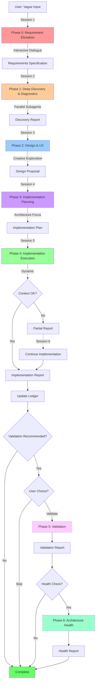

# ANDA-Native Development Workflow
## Continuous Evolution Within Architectural Constraints

---

## **1. Introduction & Core Philosophy**

### **1.1. Executive Summary**

This document defines the **ANDA-Native Development Workflow** - a sophisticated 6-phase system designed for continuous feature development within the Living Blueprint Architecture (ANDA). Unlike traditional development workflows that struggle with architectural drift, or migration workflows that transform existing code, this system enables the **creation of new features and enhancement of existing functionality** while maintaining absolute compliance with ANDA mandates (M-CELL-1 through M-CELL-4).

The workflow embodies the principle of **"Precision in Requirements, Creativity in Design, Rigor in Implementation"** - transforming vague human prompts into crystal-clear specifications, exploring innovative UI/UX solutions, and executing implementations that respect architectural constraints without compromise.

### **1.2. The Three-Stage Philosophy**

The workflow operates on a fundamental three-stage transformation:

```yaml
Stage 1 - PRECISION (Phase 0):
  Input: Vague, incomplete, ambiguous human language
  Process: Interactive clarification dialogue
  Output: Crystal-clear, precise, agent-ready requirements
  Philosophy: TRANSLATION not EXPANSION
  Goal: "What does the user ACTUALLY want?"

Stage 2 - CREATIVITY (Phases 1-2):
  Input: Clear requirements
  Process: Discovery + Design exploration
  Output: Innovative, practical UI/UX solutions
  Philosophy: THIS is where expansion happens
  Goal: "How could we build this beautifully?"

Stage 3 - RIGOR (Phases 3-4):
  Input: Design vision
  Process: Architectural planning + Mandate-enforced implementation
  Output: Production-ready ANDA-compliant code
  Philosophy: Execute with zero architectural compromise
  Goal: "Implement perfectly within constraints"
```

**Critical Distinction:**
- **Requirements ≠ Feature Expansion** - Phase 0 does NOT suggest new features or expand scope
- **Design = Innovation Space** - Phase 2 explores UI/UX possibilities, suggests improvements
- **Implementation = Constraint Enforcement** - Phases 3-4 respect ANDA mandates absolutely

### **1.3. Workflow Structure: 4+2 Phases**

```
CORE WORKFLOW (Always Executed):
├── Phase 0: Requirement Elicitation (Interactive Dialogue)
├── Phase 1: Deep Discovery & Diagnostic Analysis (Parallel Investigation)
├── Phase 2: Design & UX Specification (Creative Exploration)
├── Phase 3: Implementation Planning (Architecture Focus)
└── Phase 4: Implementation Execution (Dynamic Multi-Session)

OPTIONAL PHASES (Smart Triggers):
├── Phase 5: Validation (Recommended for complex features)
└── Phase 6: Architecture Health Assessment (Periodic system-wide check)
```

**Session Management:**
- Each phase = New clean session
- Handoff via structured MD reports
- Multi-session implementation when needed (context monitoring)
- Human approval between phases

### **1.4. System Goals & Principles**

**Primary Goals:**

* **Requirement Precision**: Transform vague human input into actionable specifications
* **Design Innovation**: Explore creative UI/UX solutions within practical constraints
* **Architectural Integrity**: 100% ANDA mandate compliance without exception
* **Development Velocity**: Efficient workflows with optional validation for speed
* **Codebase Leanness**: Maintain AI-agent-friendly, navigable codebase
* **Zero Drift**: Continuous architecture health monitoring prevents accumulation

**Guiding Principles:**

* **Translation Not Expansion**: Requirements phase clarifies intent, doesn't add features
* **Creativity in Constraints**: Design phase innovates within ANDA boundaries
* **Mandate Enforcement**: All implementations satisfy M-CELL-1 through M-CELL-4
* **Evidence Over Assumption**: Agents discover truth, never assume
* **Session Cleanliness**: Fresh context each phase prevents degradation
* **Dynamic Scaling**: Simple features fast-tracked, complex features validated
* **Ledger-First Development**: Query before, update after for AI agent memory

---

## **2. The 6-Phase Workflow Architecture**

### **2.1. Phase Overview with Session Flow**



---

### **2.2. Phase 0: Requirement Elicitation**

**Primary Agent:** `RequirementAnalyst`  
**Mission:** Transform vague human input into crystal-clear, precise requirements through interactive dialogue  
**Session:** Fresh context, stores conversation history  
**Philosophy:** **TRANSLATION NOT EXPANSION** - Clarify intent, don't suggest features

#### **Core Protocol**

```yaml
Mission: Extract user's TRUE intent with surgical precision

Step 1: Parse Initial Input
  - Read user's vague request
  - Identify ambiguities and missing information
  - Categorize request type:
      • New feature (net-new functionality)
      • Enhancement (improve existing)
      • Bug fix (correct broken behavior)
      • Refactor (improve code quality)
  
Step 2: Interactive Clarification Dialogue
  
  CRITICAL: This is NOT requirements gathering for a spec document.
            This is PRECISION ENGINEERING of language.
  
  Ask questions to ELIMINATE ambiguity:
    ❌ DON'T: "Would you like version comparison?"
    ✅ DO: "When you say 'version history', do you mean:"
            [A] A timeline showing who changed what and when
            [B] Ability to restore previous versions
            [C] Side-by-side comparison of versions
            [D] Something else (please describe)
  
  Continue dialogue until:
    ✓ Every ambiguous term defined
    ✓ Scope boundaries crystal clear
    ✓ Success criteria explicit
    ✓ Evidence provided (if fixing/enhancing)

Step 3: Evidence Gathering (If Applicable)
  
  For bugs/enhancements, request concrete evidence:
    - Screenshots of current behavior
    - Browser console logs
    - Example data
    - Steps to reproduce
    - Expected vs actual behavior
  
  DO NOT proceed without evidence when required.

Step 4: Requirement Synthesis
  
  Transform dialogue into structured specification:
    - Feature description (precise, unambiguous)
    - Scope boundaries (what's IN, what's OUT)
    - Success criteria (what makes this complete)
    - Acceptance criteria (how to verify it works)
    - Constraints (must/must not do)
    - Priority (critical/important/nice-to-have)
  
  CRITICAL: Zero feature expansion here.
            If user wants "version history", output "version history".
            Do NOT suggest "version history + comparison + rollback".

Step 5: User Confirmation
  
  Present complete specification:
    "Here's my complete understanding of your request:
     [Detailed, precise specification]
     
     Have I captured this correctly? [Yes/Revise]"
  
  Iterate until user approves.
```

#### **Dialogue Patterns**

**Pattern 1: Clarifying Vague Terms**

```
User: "I want to add versioning to forecasts"

Agent: "I need to clarify what you mean by 'versioning.' Please select the closest match:

[A] Automatic history tracking - System saves every change automatically
[B] Manual snapshots - User explicitly creates named versions
[C] Time-based checkpoints - System creates versions on schedule
[D] Approval workflow - Versions created when forecasts are approved

Which describes what you want?"

User: [Selects B]

Agent: "Thank you. For manual snapshots:
- What triggers creation? (button click, dropdown, auto-prompt?)
- What gets captured? (full forecast data, just changed values, with comments?)
- Where does user access versions? (sidebar, modal, new page tab?)

Please describe or sketch the user experience you envision."
```

**Pattern 2: Defining Scope Boundaries**

```
User: "Fix the broken filter on projects page"

Agent: "I see you want to fix a filter issue. To understand the problem:

1. Which specific filter is broken? (date range, status, category, search, other?)
2. What's the broken behavior? (doesn't apply, throws error, UI issue, performance?)
3. Can you provide:
   - Screenshot of the broken filter
   - Browser console output (F12 → Console tab)
   - Steps that trigger the issue

Please share these so I understand exactly what needs fixing."

User: [Provides evidence]

Agent: "Perfect. Let me confirm:

ISSUE: Date range filter on projects page doesn't apply when 'Custom' is selected
EVIDENCE: Screenshot shows selected dates, but table doesn't filter
CONSOLE: No errors logged
EXPECTED: Table should filter to projects within selected date range

Is this accurate? [Yes/Revise]"
```

**Pattern 3: Extracting Success Criteria**

```
User: "Make the dashboard faster"

Agent: "I need to understand what 'faster' means in concrete terms:

1. What specifically feels slow? (page load, data refresh, interactions, all?)
2. What's the current performance? (if known: seconds to load, etc.)
3. What's the target performance? (specific time goal or 'noticeably faster'?)
4. Are there specific actions that are slowest? (which ones?)

These details will help me understand the actual requirement."

User: "The main KPI cards take 5+ seconds to load"

Agent: "Understood. Let me confirm:

SCOPE: Improve load time of main KPI cards on dashboard
CURRENT: 5+ seconds to display
TARGET: What load time would meet your expectations?
  [A] <1 second (instant feel)
  [B] 1-2 seconds (fast feel)
  [C] 2-3 seconds (acceptable)
  
Please select target performance."
```

#### **What This Phase Does NOT Do**

```yaml
❌ Does NOT suggest feature enhancements:
   User: "I want version history"
   Agent: ❌ "Great! We could also add version comparison, rollback, and approval workflow!"
   Agent: ✅ "Understood. Version history for forecasts. [proceed to clarify details]"

❌ Does NOT expand scope:
   User: "Fix the date filter"
   Agent: ❌ "While fixing it, should we also add date presets and custom ranges?"
   Agent: ✅ "Understood. Fix date filter. [proceed to clarify bug details]"

❌ Does NOT make design decisions:
   User: "Add version history"
   Agent: ❌ "I'll put it in a sidebar with a timeline view"
   Agent: ✅ "Where should users access this? [ask user preference]"

✅ Does transform vague to precise:
   User: "forecasts should have versions"
   Agent: ✅ Clarifies → "Manual snapshot system where users can create named versions"
   
✅ Does establish boundaries:
   User: "fix the filter"
   Agent: ✅ Determines → "Date range filter, Custom selection mode, doesn't apply to table"
```

#### **Technical Specifications**

* **Tool Access:** `bash`, `write` (reports only), `read`, `grep`, `list`
* **Operational Parameters:**

```yaml
REQUIREMENTS_DIR: "thoughts/shared/workflows/[workflow-id]/"
MAX_CLARIFICATION_ROUNDS: 10
EVIDENCE_REQUIRED_FOR: ["bug-fix", "enhancement"]
REQUIRE_USER_CONFIRMATION: true
EXPANSION_FORBIDDEN: true
```

#### **Output: Requirements Specification Report**

**Location:** `thoughts/shared/workflows/wf_YYYYMMDD_HHMMSS_feature-name/00_requirements_specification.md`

**Standard Format:**

```markdown
---
phase: "0-requirements"
workflow_id: "wf_20251010_143000_forecast-versioning"
agent: "RequirementAnalyst"
timestamp: "2025-10-10T14:30:00Z"
status: "complete"
request_type: "new-feature"
complexity: "medium"
clarification_rounds: 3
user_approved: true
---

# Requirements Specification Report

## Executive Summary

User requests manual versioning capability for forecasts, enabling users to create named snapshots that can be viewed later. This is a net-new feature requiring UI components, API procedures, and database schema additions.

## Original User Input

> "In the projects page I want to create a versioned history of the forecast"

## Clarified Requirements

### Feature Description

**Manual Forecast Versioning System**

Users shall be able to create named snapshots (versions) of forecast data at any time. Each version captures:
- All forecast line items with values
- Creator and timestamp
- Optional version comment/notes

Users can view a list of all versions and compare current forecast against any historical version.

### Scope Definition

**IN SCOPE:**
- Manual version creation (user-initiated)
- Version list display (chronological timeline)
- Version detail view (see historical data)
- Version comparison (current vs historical)

**OUT OF SCOPE:**
- Automatic versioning
- Version restoration/rollback
- Version approval workflow
- Version branching/merging

### Success Criteria

1. Users can create a new version from forecast edit page
2. Versions list shows all historical versions with metadata
3. Users can view any historical version's complete data
4. Users can compare current forecast against any version
5. All version data persists in database

### Acceptance Criteria

**User Actions:**
- [ ] Click "Create Version" button in forecast edit UI
- [ ] Enter version name and optional comment
- [ ] Submit to save version snapshot
- [ ] View chronological list of all versions
- [ ] Click any version to see historical data
- [ ] Compare current vs historical side-by-side

**System Behavior:**
- [ ] Versions immutable after creation
- [ ] Versions stored with full forecast data snapshot
- [ ] Version list sorted newest-first
- [ ] Version comparison highlights differences

### Constraints

- Must fit within existing forecast edit workflow
- Must not slow down forecast editing performance
- Must respect user permissions (can only version own forecasts)
- Must comply with ANDA architecture (Cell-based, tRPC, Drizzle)

### Evidence Provided

- Screenshot: Current forecast edit page UI
- User workflow: How forecasts are currently edited
- Example data: Forecast structure and fields

### Priority

**High** - Requested for upcoming project review cycle

## User Confirmation

User approved this specification on 2025-10-10 at 14:45:00Z after 3 rounds of clarification.

## Next Phase Requirements

**For Phase 1 (Discovery):**
- Locate existing forecast edit components
- Understand current forecast data model
- Map database schema for forecasts table
- Identify integration points for versioning UI

**For Phase 2 (Design):**
- Design version creation UI flow
- Design version list/timeline display
- Design version detail view
- Design comparison interface

## Session Metadata

```yaml
workflow_id: wf_20251010_143000_forecast-versioning
phase: 0
agent: RequirementAnalyst
session_number: 1
clarification_rounds: 3
evidence_artifacts: ["screenshot_forecast_edit.png"]
estimated_complexity: medium
estimated_sessions: 4-5
```
```

---

### **2.3. Phase 1: Deep Discovery & Diagnostic Analysis (MERGED)**

**Primary Agent:** `SystemExplorer`  
**Mission:** Comprehensively understand current system state through parallel investigation and conditional diagnostics  
**Session:** New (receives Requirements Report)  
**Philosophy:** **DISCOVER DON'T ASSUME** - Evidence-based understanding only

#### **Core Protocol**

```yaml
Mission: Build complete picture of current system relevant to requirements

Step 1: Parse Requirements
  - Read Requirements Specification
  - Extract affected system areas:
      • Which components might be involved?
      • Which database tables?
      • Which API endpoints?
      • Which user flows?
  - Plan discovery scope

Step 2: Parallel Discovery (ALWAYS - 6-8 Subagents Simultaneously)
  
  Launch all subagents at once for speed:
  
  Subagent 1 - codebase-locator:
    Task: Find all relevant files/components
    Output: List of files related to forecasts
  
  Subagent 2 - database-schema-analyzer:
    Task: Current schema for forecasts and related tables
    Output: Table definitions, relationships, constraints
  
  Subagent 3 - api-procedure-mapper:
    Task: Existing tRPC procedures for forecasts
    Output: Available procedures, their signatures
  
  Subagent 4 - cell-pattern-analyzer:
    Task: Identify existing Cell patterns we can follow
    Output: Similar Cells, reusable patterns
  
  Subagent 5 - dependency-tracer:
    Task: Map integration points and dependencies
    Output: Component import chains, data flows
  
  Subagent 6 - ledger-historian:
    Task: Query ledger for similar features
    Output: Related implementations, lessons learned

Step 3: Conditional Diagnostic Analysis
  
  Analyze discovery findings:
  
  IF requirements involve EXISTING components:
    → Launch diagnostic subagents in parallel:
    
    Diagnostic Subagent 1 - codebase-analyzer:
      Task: Deep read of existing component code
      Output: Current implementation details, patterns used
    
    Diagnostic Subagent 2 - performance-profiler:
      Task: Current performance baseline
      Output: Metrics for comparison later
    
    Diagnostic Subagent 3 - anti-pattern-detector:
      Task: Identify existing architectural issues
      Output: Technical debt, violations to fix
    
    Diagnostic Subagent 4 - behavioral-assertion-extractor:
      Task: Extract implicit requirements from current code
      Output: What must be preserved during changes
  
  ELSE (pure new feature, no existing code):
    → Light validation only:
      - Check for naming conflicts
      - Verify integration points available
      - Confirm no architectural blockers

Step 4: Risk Assessment
  
  Analyze all findings for risks:
    - Database migration complexity (schema changes needed?)
    - Integration complexity (many touch points?)
    - Performance impact (expensive queries?)
    - Architectural challenges (fits ANDA patterns?)
    - Technical debt (must fix first?)

Step 5: Synthesis & Recommendations
  
  Combine all subagent findings into unified report:
    - Current State: Comprehensive picture
    - Gaps: What doesn't exist that we need
    - Risks: Potential challenges
    - Opportunities: Existing patterns to reuse
    - Recommendations: Suggested approach
```

#### **Parallel Investigation Pattern**

```yaml
Orchestration Strategy:

Time = 0:
  → Launch all discovery subagents simultaneously
  → Each works independently with read-only tools
  
Time = 2-3 minutes:
  → All discovery subagents return findings
  → SystemExplorer analyzes for diagnostic needs
  
Time = 3:
  → IF diagnostics needed:
      → Launch diagnostic subagents simultaneously
  → ELSE:
      → Proceed to synthesis
  
Time = 5-6 minutes (if diagnostics launched):
  → All diagnostic subagents return findings
  → Proceed to synthesis

Time = 6-8 minutes:
  → SystemExplorer synthesizes all findings
  → Generates comprehensive Discovery Report

Total Time: 8-10 minutes (vs 30+ minutes sequential)
```

#### **Discovery vs Diagnostic: When Each Runs**

```yaml
ALWAYS RUN (Discovery):
  ✓ codebase-locator: Find relevant files
  ✓ database-schema-analyzer: Current schema
  ✓ api-procedure-mapper: Existing procedures
  ✓ cell-pattern-analyzer: Patterns to follow
  ✓ dependency-tracer: Integration points
  ✓ ledger-historian: Similar features

CONDITIONALLY RUN (Diagnostics):
  Trigger: Existing components found that need modification
  
  ✓ codebase-analyzer: Deep code comprehension
  ✓ performance-profiler: Performance baseline
  ✓ anti-pattern-detector: Technical debt scan
  ✓ behavioral-assertion-extractor: Implicit requirements

SKIP DIAGNOSTICS WHEN:
  - Pure new feature (no existing code to modify)
  - Simple addition (append-only, no integration)
  - Explicitly scoped (requirements already defined boundaries)
```

#### **Technical Specifications**

* **Tool Access:** `bash`, `write` (reports only), `read`, `grep`, `glob`, `list`, `supabase_*`, `ledger-query`
* **Subagent Delegation:** `task` tool for parallel execution
* **Operational Parameters:**

```yaml
DISCOVERY_DIR: "thoughts/shared/workflows/[workflow-id]/"
MAX_PARALLEL_SUBAGENTS: 8
SUBAGENT_TIMEOUT: 300000  # 5 minutes
DIAGNOSTIC_TRIGGER: "existing_components_found"
SYNTHESIS_REQUIRED: true
```

#### **Output: Discovery & Diagnostic Report**

**Location:** `thoughts/shared/workflows/wf_YYYYMMDD_HHMMSS_feature-name/01_discovery_diagnostic.md`

```markdown
---
phase: "1-discovery-diagnostics"
workflow_id: "wf_20251010_143000_forecast-versioning"
agent: "SystemExplorer"
timestamp: "2025-10-10T14:50:00Z"
status: "complete"
subagents_launched: 10
diagnostics_performed: true
risks_identified: 2
---

# Discovery & Diagnostic Report

## Executive Summary

Comprehensive analysis of forecast system reveals existing forecast editing infrastructure that can be extended. Database schema requires new `forecast_versions` table. No architectural blockers identified. Medium complexity due to snapshot logic.

## Discovery Findings

### Existing Components

**Forecast Editing:**
- Cell: `components/cells/forecast-wizard/` (multi-step wizard)
- Manifest: Present with 8 behavioral assertions
- Pipeline: Configured with validation gates
- Size: 6 files, largest 220 lines ✓ compliant
- Status: ANDA-compliant Cell

**Related Components:**
- `forecast-entry-form`: Data entry sub-component
- `forecast-summary`: Display component
- `forecast-calculations`: Business logic hooks

### Database Schema (Current)

**Forecasts Table:**
```sql
forecasts (
  id uuid PRIMARY KEY,
  project_id uuid NOT NULL,
  status text NOT NULL,
  created_by uuid NOT NULL,
  created_at timestamp NOT NULL,
  updated_at timestamp NOT NULL,
  -- forecast data in related tables
)
```

**Forecast Line Items:**
```sql
forecast_line_items (
  id uuid PRIMARY KEY,
  forecast_id uuid NOT NULL,
  category text NOT NULL,
  amount decimal(15,2) NOT NULL,
  -- ... other fields
)
```

### API Procedures (Current)

**Existing tRPC Procedures:**
- `forecasts.getByProject` - Retrieves forecast for project
- `forecasts.update` - Updates forecast data
- `forecasts.getForecastDetails` - Detailed forecast view
- Domain router: `forecasts.router.ts` (42 lines ✓ compliant)

### Cell Patterns (Reusable)

**Versioning Pattern Found:**
- `budget-waterfall` Cell uses similar data snapshotting
- Pattern: Store complete data copy with metadata
- Lesson: Use JSONB column for flexibility

### Integration Points

**Where Versioning UI Fits:**
- Forecast wizard (step 4 - Review step)
- Add "Create Version" button in header
- Version history in sidebar or modal

## Diagnostic Analysis

### Existing Component Deep Dive

**Forecast Wizard Analysis:**
- Well-structured ANDA Cell ✓
- Multi-step flow: Select → Modify → Review → Confirm
- State management: Zustand store for draft persistence
- Current issue: No versioning capability (expected)

**Performance Baseline:**
- Current load time: ~800ms for forecast data
- Target with versioning: <1s (acceptable overhead)

### Anti-Patterns Detected

None. Existing forecast system is ANDA-compliant.

### Behavioral Assertions (Current)

From forecast-wizard manifest:
- Wizard MUST preserve data between steps
- Calculations MUST recalculate on value changes
- User CANNOT proceed with validation errors
- [5 more assertions...]

**Must Preserve:** All existing behavior must remain unchanged

## Risk Assessment

### Risk 1: Database Schema Migration (Medium)

**Impact:** New table + potential data volume
**Mitigation:** Design efficient schema, add indexes
**Complexity:** Medium - straightforward table addition

### Risk 2: Snapshot Data Size (Low)

**Impact:** Storing full forecast snapshots could be large
**Mitigation:** Use JSONB compression, lifecycle policy
**Complexity:** Low - handle in design phase

## Gaps & Requirements

### What Doesn't Exist (Needs Building):

1. **Database:**
   - `forecast_versions` table
   - Version metadata storage
   - Snapshot data storage

2. **API Layer:**
   - `forecasts.createVersion` procedure
   - `forecasts.getVersions` procedure
   - `forecasts.getVersionById` procedure
   - `forecasts.compareVersions` procedure (optional - confirm in design)

3. **UI Components:**
   - Version creation dialog/modal
   - Version history timeline/list
   - Version detail view
   - Comparison view (if confirmed needed)

## Opportunities

### Reusable Patterns

- Version UI can follow `budget-waterfall` pattern
- Timeline display can use existing timeline component
- Modal structure can follow existing modal patterns

### Architecture Alignment

- Forecast wizard already ANDA-compliant
- New components can integrate cleanly
- Specialized procedure pattern fits perfectly

## Recommendations

### Approach

1. **Database First:**
   - Design `forecast_versions` schema
   - Plan migration strategy

2. **API Layer:**
   - Create specialized procedures (one per operation)
   - Keep procedures <200 lines
   - Domain router aggregation <50 lines

3. **UI Components:**
   - Create new Cells for version history
   - Integrate into existing forecast wizard
   - Maintain existing behavioral assertions

### Implementation Sequence

1. Database schema + migration
2. tRPC procedures (create, list, get, compare)
3. Version creation UI (modal/dialog Cell)
4. Version history UI (timeline Cell)
5. Version detail view (modal Cell)
6. Integration with forecast wizard

## Next Phase Requirements

**For Phase 2 (Design):**
- Design version creation UX (modal? inline? sidebar?)
- Design version timeline UI (list? timeline? cards?)
- Design version detail view layout
- Design comparison interface (if needed)
- Define behavioral assertions for new Cells

**Key Considerations:**
- Keep version creation workflow simple (1-2 clicks)
- Make version history easily accessible
- Ensure comparison view is clear and useful

## Session Metadata

```yaml
workflow_id: wf_20251010_143000_forecast-versioning
phase: 1
agent: SystemExplorer
session_number: 2
duration: 8 minutes
subagents_launched: 10
discovery_subagents: 6
diagnostic_subagents: 4
files_analyzed: 15
database_tables_analyzed: 2
api_procedures_found: 3
risks_identified: 2
opportunities_found: 3
```
```

---

### **2.4. Phase 2: Design & UX Specification**

**Primary Agent:** `DesignArchitect`  
**Mission:** Explore creative UI/UX solutions and specify design vision  
**Session:** New (receives Requirements + Discovery Reports)  
**Philosophy:** **THIS IS WHERE CREATIVITY HAPPENS** - Practical innovation within constraints

#### **Core Protocol**

```yaml
Mission: Transform requirements into beautiful, practical UI/UX design

Step 1: Synthesize Context
  - Read Requirements Specification (what user wants)
  - Read Discovery Report (what exists, what's possible)
  - Understand constraints and opportunities

Step 2: Creative UI/UX Exploration
  
  THIS IS THE EXPANSION PHASE:
    - Explore design alternatives
    - Consider user experience improvements
    - Suggest practical enhancements
    - Stay within "balanced to ambitious" range
  
  Design Philosophy:
    ✓ Practical and implementable
    ✓ Modern UX patterns
    ✓ Accessibility-first
    ✓ Consistent with existing design
    ✗ No AI/ML features unless explicitly requested
    ✗ No over-engineering
    ✗ No unnecessary complexity

Step 3: UI/UX Specifications
  
  Create comprehensive design covering:
  
  3a. Visual Design:
    - Component layouts (ASCII mockups)
    - Interaction flows (step-by-step user journey)
    - State transitions (what user sees when)
    - Visual hierarchy (importance, grouping)
    - Responsive behavior (mobile considerations if applicable)
  
  3b. Component Structure:
    - Which Cells needed (M-CELL-1 compliance)
    - Sub-components within Cells
    - Reusable UI primitives (from components/ui/)
    - State management approach (Zustand, local state)
  
  3c. User Experience:
    - Primary user flows (happy paths)
    - Edge cases (error states, empty states, loading)
    - Interaction patterns (click, hover, keyboard)
    - Feedback mechanisms (success, error messages)
  
  3d. Accessibility Requirements:
    - WCAG AA compliance minimum
    - Keyboard navigation
    - Screen reader support
    - ARIA labels and roles
    - Focus management

Step 4: Behavioral Assertions (M-CELL-4)
  
  Define ≥3 behavioral assertions per Cell:
    - What MUST be true functionally
    - How user interactions MUST behave
    - What data MUST be displayed correctly
    - What validation MUST occur
  
  Format: Testable, specific, critical

Step 5: Design Alternatives (When Applicable)
  
  For complex features, present options:
    - Option A: Simpler, faster to implement
    - Option B: Balanced, practical enhancements
    - Option C: More ambitious, richer experience
  
  For each option:
    - Describe user experience
    - Estimate implementation complexity
    - Highlight trade-offs

Step 6: ANDA Compliance Validation
  
  Verify design respects architecture:
    ✓ All functionality as Cells (M-CELL-1)
    ✓ Can be implemented with files ≤400 lines (M-CELL-3)
    ✓ Behavioral assertions defined (M-CELL-4)
    ✓ Specialized procedure pattern fits
```

#### **Creative Expansion Guidelines**

```yaml
User requested: "version history"

❌ DON'T expand to out-of-scope features:
   "Also add approval workflow, version branching, merge conflicts"

✅ DO suggest practical UX improvements:
   "Add quick filters to version timeline (last 7 days, last month, all)"
   "Include visual diff highlighting in comparison view"
   "Add version tagging (milestone, draft, final)"

Principle: Enhance the EXPERIENCE of requested feature, don't add new features.
```

#### **Design Alternative Framework**

```yaml
When to Offer Alternatives:
  - UI placement has multiple valid options
  - Interaction pattern can vary (modal vs sidebar vs inline)
  - Richness vs simplicity trade-off exists

Structure:
  Option A - Simple:
    Focus: Fast implementation, core functionality
    Time: ~2 days
    Trade-off: Basic but complete
  
  Option B - Balanced:
    Focus: Practical enhancements, modern UX
    Time: ~3-4 days
    Trade-off: Best effort-to-value ratio
  
  Option C - Ambitious:
    Focus: Rich interactions, delightful experience
    Time: ~5-7 days
    Trade-off: More implementation complexity

Present options, let user choose (or recommend Option B as default).
```

#### **Technical Specifications**

* **Tool Access:** `bash`, `write` (reports only), `read`, `grep`, `list`, `shadcn_*`
* **Operational Parameters:**

```yaml
DESIGN_DIR: "thoughts/shared/workflows/[workflow-id]/"
MOCKUP_FORMAT: "ascii"
DESIGN_ALTERNATIVES: 1-3
ACCESSIBILITY_STANDARD: "WCAG_AA"
REQUIRE_BEHAVIORAL_ASSERTIONS: true
MIN_ASSERTIONS_PER_CELL: 3
```

#### **Output: Design Proposal Report**

**Location:** `thoughts/shared/workflows/wf_YYYYMMDD_HHMMSS_feature-name/02_design_proposal.md`

```markdown
---
phase: "2-design"
workflow_id: "wf_20251010_143000_forecast-versioning"
agent: "DesignArchitect"
timestamp: "2025-10-10T15:10:00Z"
status: "complete"
cells_proposed: 2
design_alternatives: 2
accessibility_grade: "AA"
---

# Design Proposal Report

## Executive Summary

Proposed design adds version management to existing forecast wizard through two new Cells: version-creation-modal and version-history-panel. Design integrates seamlessly with current UX while adding powerful versioning capability.

## Design Philosophy

**Approach:** Balanced - Practical enhancements with modern UX  
**Focus:** Seamless integration, minimal disruption, intuitive workflows  
**Constraints:** ANDA-compliant Cells, ≤400 lines per file, type-safe data flow

## UI/UX Specifications

### User Flow: Creating a Version

```
Step 1: User in Forecast Review Step
  ┌─────────────────────────────────────────────┐
  │  Forecast Wizard - Review                   │
  │                                              │
  │  [< Back]                    [Create Version▼] [Save & Close]
  │                                              │
  │  ┌──────────────────────────────────────┐  │
  │  │  Budget Summary                       │  │
  │  │  Total: $1,250,000                    │  │
  │  │  ...                                  │  │
  │  └──────────────────────────────────────┘  │
  └─────────────────────────────────────────────┘

Step 2: User Clicks "Create Version" Dropdown
  Options appear:
    ✓ Create New Version...
    ━━━━━━━━━━━━━━━━━━━━
    📋 Version History (5)

Step 3: User Selects "Create New Version..."
  Modal appears:
  
  ┌─────────────────────────────────────┐
  │  Create Forecast Version        [×] │
  ├─────────────────────────────────────┤
  │                                     │
  │  Version Name*                      │
  │  [Q4 Planning Draft           ]     │
  │                                     │
  │  Description (optional)             │
  │  ┌─────────────────────────────┐   │
  │  │Initial Q4 forecast before   │   │
  │  │executive review             │   │
  │  └─────────────────────────────┘   │
  │                                     │
  │  This version will capture:         │
  │  • All forecast line items (247)    │
  │  • Current calculations             │
  │  • Project metadata                 │
  │                                     │
  │        [Cancel]  [Create Version]   │
  └─────────────────────────────────────┘

Step 4: Success Confirmation
  Toast notification: "✓ Version 'Q4 Planning Draft' created"
  Dropdown button shows: [Create Version▼] → [Versions (6)▼]
```

### User Flow: Viewing Version History

```
Step 1: User Clicks "Versions (6)" Dropdown
  Options:
    ✓ Create New Version...
    ━━━━━━━━━━━━━━━━━━━━
    📋 View All Versions

Step 2: Sidebar Panel Slides In

┌─────────────────────────────────────────────┐
│  Forecast Wizard        [Version History ×] │
│                                              │
│  ┌──────────────────┐  ┌─────────────────┐ │
│  │  Wizard Content  │  │ Version History │ │
│  │                  │  │                 │ │
│  │  [Steps]         │  │ 🔍 [Search...] │ │
│  │  [Content]       │  │                 │ │
│  │                  │  │ ┌─────────────┐ │ │
│  │                  │  │ │v6 • 2h ago  │ │ │
│  │                  │  │ │Q4 Planning  │ │ │
│  │                  │  │ │Draft        │ │ │
│  │                  │  │ │👤 John Doe  │ │ │
│  │                  │  │ │[View][Compare]│ │
│  │                  │  │ └─────────────┘ │ │
│  │                  │  │ ┌─────────────┐ │ │
│  │                  │  │ │v5 • 1d ago  │ │ │
│  │                  │  │ │Initial Est. │ │ │
│  │                  │  │ │👤 Jane Smith│ │ │
│  │                  │  │ │[View][Compare]│ │
│  │                  │  │ └─────────────┘ │ │
│  │                  │  │      ...        │ │
│  └──────────────────┘  └─────────────────┘ │
└─────────────────────────────────────────────┘

Step 3: User Clicks "View" on a Version
  Modal appears showing historical snapshot

  ┌─────────────────────────────────────┐
  │  Version: Q4 Planning Draft     [×] │
  ├─────────────────────────────────────┤
  │  Created: Oct 10, 2025 2:30 PM      │
  │  By: John Doe                       │
  │                                     │
  │  "Initial Q4 forecast before        │
  │   executive review"                 │
  │                                     │
  │  ┌─────────────────────────────┐   │
  │  │ Forecast Data (Read-Only)   │   │
  │  │                             │   │
  │  │ Category        Amount      │   │
  │  │ ─────────────  ──────────   │   │
  │  │ Labor          $650,000     │   │
  │  │ Materials      $400,000     │   │
  │  │ ...                         │   │
  │  └─────────────────────────────┘   │
  │                                     │
  │              [Close]                │
  └─────────────────────────────────────┘

Step 4: User Clicks "Compare" on a Version
  Comparison view shows diff

  ┌──────────────────────────────────────────┐
  │  Compare: Current vs Q4 Planning Draft  [×]│
  ├──────────────────────────────────────────┤
  │  Category      Current    v6      Δ      │
  │  ───────────  ─────────  ───────  ─────  │
  │  Labor        $650,000   $650,000   —    │
  │  Materials    $420,000   $400,000  +20K  │ ← Highlighted
  │  Equipment    $180,000   $200,000  -20K  │ ← Highlighted
  │  ...                                      │
  │                                          │
  │  Total        $1,250,000 $1,250,000  —   │
  │                                          │
  │              [Close]                     │
  └──────────────────────────────────────────┘
```

## Component Structure

### Cell 1: forecast-version-creator

**Location:** `components/cells/forecast-version-creator/`

**Purpose:** Modal dialog for creating new forecast versions

**Files:**
- `component.tsx` - Main modal component (~120 lines)
- `hooks/use-version-creation.ts` - Creation logic (~80 lines)
- `manifest.json` - Behavioral assertions
- `pipeline.yaml` - Validation gates
- `__tests__/component.test.tsx` - Test suite

**Props:**
```typescript
interface ForecastVersionCreatorProps {
  forecastId: string
  forecastData: ForecastSnapshot  // Current forecast data to save
  onSuccess: (versionId: string) => void
  onCancel: () => void
}
```

**State Management:** Local state (no Zustand needed)

**Behavioral Assertions (M-CELL-4):**
1. Modal MUST prevent submission with empty version name
2. Modal MUST capture complete forecast data snapshot on creation
3. Modal MUST display success toast and close on successful creation
4. Modal MUST show error message if creation fails
5. Modal MUST be keyboard accessible (Esc to close, Enter to submit)

### Cell 2: forecast-version-history

**Location:** `components/cells/forecast-version-history/`

**Purpose:** Sidebar panel displaying version timeline with view/compare actions

**Files:**
- `component.tsx` - Main sidebar component (~180 lines)
- `components/version-card.tsx` - Individual version display (~60 lines)
- `components/version-detail-modal.tsx` - Detail view modal (~140 lines)
- `components/version-comparison-modal.tsx` - Comparison view (~200 lines)
- `hooks/use-version-list.ts` - Data fetching (~50 lines)
- `manifest.json` - Behavioral assertions
- `pipeline.yaml` - Validation gates
- `__tests__/component.test.tsx` - Test suite

**Props:**
```typescript
interface ForecastVersionHistoryProps {
  forecastId: string
  currentData: ForecastSnapshot  // For comparison
  isOpen: boolean
  onClose: () => void
}
```

**State Management:** Local state for modals, tRPC queries for data

**Behavioral Assertions (M-CELL-4):**
1. Panel MUST load and display all versions in chronological order (newest first)
2. Version cards MUST show creator, timestamp, and version name
3. "View" action MUST open modal with complete historical snapshot (read-only)
4. "Compare" action MUST highlight differences between current and selected version
5. Search MUST filter versions by name (case-insensitive)
6. Panel MUST be closable via [×] button or Esc key

## Data Flow

```yaml
Version Creation:
  User fills form
  → onClick "Create Version"
  → Cell calls: trpc.forecasts.createVersion.useMutation()
  → API procedure captures data snapshot
  → Database inserts into forecast_versions table
  → Success callback updates UI
  → Toast notification

Version History:
  Panel opens
  → Cell calls: trpc.forecasts.getVersions.useQuery({ forecastId })
  → API procedure queries forecast_versions table
  → Returns: Array<{ id, name, createdAt, createdBy, comment }>
  → Cell renders list of version cards

Version Detail View:
  User clicks "View"
  → Cell calls: trpc.forecasts.getVersionById.useQuery({ versionId })
  → API procedure retrieves full snapshot data
  → Modal displays read-only forecast data

Version Comparison:
  User clicks "Compare"
  → Cell has: currentData (prop) + selectedVersion (from query)
  → Compute diff locally (category-by-category comparison)
  → Modal displays side-by-side with highlighted differences
```

## Design Alternatives

### Option A: Simple (Selected)

**Description:** As specified above - dropdown + modal + sidebar panel

**Implementation Time:** ~3-4 days  
**Complexity:** Medium  
**Trade-offs:**
- ✓ Clean integration with existing wizard
- ✓ Intuitive version management
- ✓ Familiar interaction patterns
- ✓ ANDA-compliant (2 Cells, files ≤400 lines)
- ○ Comparison view is basic (sufficient but not fancy)

### Option B: Ambitious (Alternative)

**Description:** Dedicated version management page with advanced features

**Differences from Option A:**
- Full-page version timeline (not sidebar)
- Visual diff with syntax highlighting
- Version branching and tagging
- Batch operations (delete multiple versions)

**Implementation Time:** ~6-8 days  
**Complexity:** High  
**Trade-offs:**
- ✓ More powerful version management
- ✓ Better for power users
- ✗ More complex to implement
- ✗ Requires additional navigation/routing
- ⚠️ May exceed 400-line limit without further extraction

**Recommendation:** Start with Option A, can enhance to Option B later if needed.

## Accessibility Requirements

### WCAG AA Compliance

**Keyboard Navigation:**
- Tab order: Natural flow through interactive elements
- Esc: Close modals and panels
- Enter: Submit forms, activate primary actions
- Arrow keys: Navigate version list (optional enhancement)

**Screen Reader Support:**
- All modals have `aria-labelledby` and `aria-describedby`
- Version cards have `aria-label` with complete context
- Comparison table has proper table semantics
- Loading states announced with `aria-live="polite"`

**Visual Accessibility:**
- Color contrast: Minimum 4.5:1 for text
- Diff highlighting: Not color-only (use icons + color)
- Focus indicators: Visible on all interactive elements
- Text sizing: Respects user font size preferences

## Integration with Existing System

### Forecast Wizard Integration

**Location:** Review step (Step 4)

**Changes Required:**
- Add dropdown button in wizard header
- Import and render version creator modal
- Import and render version history panel
- Pass forecast data as props

**Behavioral Preservation:**
- All existing wizard assertions MUST remain unchanged
- Version UI MUST NOT interfere with wizard navigation
- Draft persistence MUST continue working

### Database Schema Requirements

**New Table Needed:** `forecast_versions`

```sql
CREATE TABLE forecast_versions (
  id uuid PRIMARY KEY DEFAULT gen_random_uuid(),
  forecast_id uuid NOT NULL REFERENCES forecasts(id) ON DELETE CASCADE,
  version_number integer NOT NULL,
  version_name text NOT NULL,
  version_comment text,
  snapshot_data jsonb NOT NULL,  -- Complete forecast data
  created_by uuid NOT NULL REFERENCES users(id),
  created_at timestamp NOT NULL DEFAULT now(),
  
  UNIQUE(forecast_id, version_number)
);

CREATE INDEX idx_forecast_versions_forecast_id ON forecast_versions(forecast_id);
CREATE INDEX idx_forecast_versions_created_at ON forecast_versions(created_at DESC);
```

### API Procedures Required

**4 Specialized Procedures:**

1. `forecasts.createVersion` - Create new version snapshot
2. `forecasts.getVersions` - List all versions for forecast
3. `forecasts.getVersionById` - Get complete version data
4. `forecasts.deleteVersion` - Delete version (optional - confirm in planning)

**Domain Router:** `forecasts.router.ts` (update to include new procedures)

## ANDA Compliance Verification

### Mandate M-CELL-1: All Functionality as Cells
✓ **PASS** - All UI functionality implemented as Cells:
  - forecast-version-creator (creation UI)
  - forecast-version-history (history/comparison UI)

### Mandate M-CELL-3: Zero God Components
✓ **PASS** - File size estimates:
  - Largest file: version-comparison-modal.tsx (~200 lines)
  - All files under 400-line limit
  - Complex components extracted into sub-components

### Mandate M-CELL-4: Explicit Behavioral Contracts
✓ **PASS** - Behavioral assertions defined:
  - forecast-version-creator: 5 assertions
  - forecast-version-history: 6 assertions

### Specialized Procedure Architecture
✓ **PLANNED** - Will comply:
  - Each procedure in separate file
  - Estimated sizes: 150-180 lines each (well under 200)
  - Domain router aggregation only

## Next Phase Requirements

**For Phase 3 (Implementation Planning):**

**Database:**
- Design complete `forecast_versions` schema
- Plan migration strategy
- Consider version retention policy

**API Layer:**
- Specify each tRPC procedure signature
- Define Zod input/output schemas
- Plan snapshot data structure

**UI Components:**
- Break down Cell implementation sequence
- Plan component extraction strategy
- Define testing approach

**Integration:**
- Specify forecast wizard modifications
- Plan import updates
- Define validation checkpoints

## Session Metadata

```yaml
workflow_id: wf_20251010_143000_forecast-versioning
phase: 2
agent: DesignArchitect
session_number: 3
duration: 20 minutes
cells_designed: 2
design_alternatives_explored: 2
mockups_created: 5
accessibility_reviewed: true
anda_compliance_verified: true
```
undefined```

### **2.5. Phase 3: Implementation Planning**

**Primary Agent:** `ImplementationArchitect`  
**Mission:** Transform design vision into detailed technical architecture and implementation roadmap  
**Session:** New (receives Requirements + Discovery + Design Reports)  
**Philosophy:** **ARCHITECTURE FOCUS** - Technical specifications, not UI/UX

#### **Core Protocol**

```yaml
Mission: Create surgical implementation plan with complete technical specifications

Step 1: Synthesize All Context
  - Requirements: What user wants
  - Discovery: Current system state
  - Design: UI/UX vision
  
  Build complete mental model of implementation

Step 2: Database Architecture
  
  Design schema changes:
    - New tables (with exact DDL)
    - Column definitions (types, constraints, indexes)
    - Relationships (foreign keys, cascades)
    - Migration strategy (safe, reversible)
    - Performance considerations (indexes, partitioning)

Step 3: API Layer Architecture
  
  Specialized Procedure Design:
    For each API operation:
      - Create procedure specification
      - File: procedures/[domain]/[action]-[entity].procedure.ts
      - Max size: 200 lines
      - Input: Zod schema definition
      - Output: Zod schema definition
      - Business logic: Detailed steps
      - Error handling: All edge cases
  
  Domain Router Design:
    - File: procedures/[domain]/[domain].router.ts
    - Max size: 50 lines
    - Purpose: Aggregation only
    - NO business logic in router

Step 4: Cell Implementation Strategy
  
  For each Cell from design:
    - Directory structure
    - File breakdown (all ≤400 lines)
    - Component hierarchy
    - State management approach
    - Custom hooks needed
    - Utility functions needed
    - Test strategy
    - Manifest content (≥3 assertions)
    - Pipeline configuration

Step 5: Integration Plan
  
  Define how components connect:
    - Import updates required
    - Props flow diagram
    - Data flow sequence
    - Event handling
    - Error boundaries

Step 6: Implementation Sequence
  
  Order steps for safe execution:
    1. Database migrations (infrastructure first)
    2. API procedures (data layer)
    3. Domain router (aggregation)
    4. Test API with curl (validation)
    5. Cell structure creation (scaffolding)
    6. Cell implementation (UI)
    7. Integration (wiring)
    8. Testing (validation)
    9. Ledger update (documentation)
  
  Define validation checkpoints between steps.

Step 7: ANDA Compliance Pre-Validation
  
  Verify plan ensures mandate compliance:
    ✓ M-CELL-1: All functionality as Cells
    ✓ M-CELL-2: Complete atomic plan (no optional phases)
    ✓ M-CELL-3: File extraction planned (all ≤400 lines)
    ✓ M-CELL-4: Manifests planned (≥3 assertions each)
    ✓ Specialized procedures (≤200 lines each)
    ✓ Domain routers (≤50 lines)

Step 8: Complexity Assessment
  
  Estimate implementation scope:
    - Total steps: Count
    - Estimated time: Hours
    - Risk level: Low/Medium/High
    - Multi-session likelihood: Yes/No
    
  Flag if plan suggests multi-session execution.
```

#### **Technical Specifications**

* **Tool Access:** `bash`, `write` (plans only), `read`, `grep`, `list`
* **Operational Parameters:**

```yaml
PLANS_DIR: "thoughts/shared/workflows/[workflow-id]/"
PLAN_FORMAT: "implementation-v3-anda-compliant"
REQUIRE_ANDA_PRE_VALIDATION: true
REQUIRE_COMPLEXITY_ASSESSMENT: true
MAX_PROCEDURE_SIZE: 200
MAX_ROUTER_SIZE: 50
MAX_CELL_FILE_SIZE: 400
```

#### **Output: Implementation Plan Report**

**Location:** `thoughts/shared/workflows/wf_YYYYMMDD_HHMMSS_feature-name/03_implementation_plan.md`

*(Detailed implementation plan template follows standard format with database DDL, procedure specifications, Cell breakdown, and step-by-step implementation sequence)*

---

### **2.6. Phase 4: Implementation Execution (Dynamic Multi-Session)**

**Primary Agent:** `ImplementationExecutor`  
**Mission:** Execute implementation plan with mandate enforcement and dynamic session management  
**Session:** New (receives all prior reports), may span multiple sessions  
**Philosophy:** **EXECUTE WITH ZERO COMPROMISE** - ANDA mandates are non-negotiable

#### **Core Protocol**

```yaml
Mission: Transform plan into production-ready ANDA-compliant code

Step 1: Analyze Implementation Complexity
  
  Read implementation plan:
    - Count total steps
    - Estimate token consumption per step
    - Calculate total estimated tokens
  
  Decision Logic:
    IF total_estimated_tokens < 160k (80% of 200k):
      → Execute entire plan in single session
    ELSE:
      → Create execution strategy (multi-session)
      → Get user approval for strategy
      → Execute first phase

Step 2: Context Monitoring (Continuous)
  
  Throughout implementation:
    - Track token usage after each step
    - Calculate remaining capacity
    - Estimate tokens needed for remaining steps
    
    IF current_usage + estimated_remaining > 160k:
      → Stop gracefully
      → Generate partial implementation report
      → Provide continuation plan

Step 3: Execute Implementation Steps
  
  For each step in plan:
    a. Read step specification
    b. Implement changes:
       - Write/edit files
       - Follow ANDA mandates strictly
       - Keep all files ≤400 lines
       - Use specialized procedure pattern
       - Create manifests with ≥3 assertions
    c. Validate incrementally:
       - TypeScript compiles
       - Tests pass (if applicable)
       - Build succeeds (periodic check)
    d. Document progress

Step 4: ANDA Mandate Enforcement
  
  CONTINUOUS COMPLIANCE CHECKING:
  
  M-CELL-1 Enforcement:
    - All functionality implemented as Cells
    - No business logic outside Cell structure
  
  M-CELL-2 Enforcement:
    - Complete implementation (no TODOs)
    - Delete old code if replacing
    - No parallel implementations
  
  M-CELL-3 Enforcement:
    - Monitor file sizes continuously
    - Extract to sub-components if approaching 400
    - NEVER commit files >400 lines
  
  M-CELL-4 Enforcement:
    - Create manifest.json for each Cell
    - Include ≥3 behavioral assertions
    - Create pipeline.yaml with validation gates
  
  Specialized Procedure Enforcement:
    - One procedure per file
    - Each procedure ≤200 lines
    - Domain routers ≤50 lines
    - No business logic in routers

Step 5: Implementation Patterns
  
  React Query Memoization:
    ```typescript
    // ALWAYS memoize objects/arrays
    const queryInput = useMemo(() => ({
      projectId,
      filters: { status: 'active' }
    }), [projectId])
    ```
  
  Date Handling in tRPC:
    ```typescript
    // ALWAYS use string → Date transformation
    .input(z.object({
      date: z.string().transform(val => new Date(val))
    }))
    ```
  
  Drizzle Query Patterns:
    ```typescript
    // ALWAYS use Drizzle helpers, not raw SQL
    import { eq, inArray } from 'drizzle-orm'
    .where(inArray(table.id, ids))
    ```

Step 6: Ledger Update
  
  On completion:
    - Append entry to ledger.jsonl
    - Document all artifacts (created/modified/deleted)
    - Include mandate compliance confirmation
    - Note any recommendations for next workflow
```

#### **Dynamic Session Splitting Logic**

```yaml
Context Monitoring:
  THRESHOLD: 160k tokens (80% of 200k limit)
  CHECK_FREQUENCY: After each major step
  
  Calculation:
    current_tokens = measure_current_usage()
    remaining_steps = count_incomplete_steps()
    avg_tokens_per_step = current_tokens / completed_steps
    estimated_remaining = remaining_steps * avg_tokens_per_step
    projected_total = current_tokens + estimated_remaining
    
    IF projected_total > 160k:
      → STOP and generate continuation plan

Graceful Stop Protocol:
  1. Complete current step fully
  2. Run incremental validation
  3. Generate Partial Implementation Report:
     - What was completed (steps 1-N)
     - Current system state
     - What remains (steps N+1 to End)
     - Continuation instructions
  4. Save all work
  5. Exit session

Continuation Session:
  User starts new session with:
    - Original implementation plan
    - Partial implementation report
    - Continuation instructions
  
  Executor resumes:
    - Load context from reports
    - Verify completed steps
    - Continue from next step
```

#### **Output: Implementation Report**

**Single Session:**
`thoughts/shared/workflows/wf_YYYYMMDD_HHMMSS_feature-name/04_implementation_report.md`

**Multi-Session:**
```
04a_implementation_partial.md      # Session 1 partial
04b_implementation_continuation.md # Session 2 continuation plan
04c_implementation_report.md       # Final complete report
```

---

### **2.7. Phase 5: Validation (OPTIONAL - Smart Trigger)**

**Primary Agent:** `ValidationSpecialist`  
**Mission:** Comprehensively validate implementation meets all requirements and mandates  
**Session:** New (receives Implementation Report)  
**Trigger:** Complex features, multi-cell changes, periodic checks, manual request

#### **Smart Trigger Logic**

```yaml
Suggest Validation When:
  - Multiple Cells created (≥2)
  - New tRPC procedures added
  - Database schema modified
  - Multi-session implementation
  - Every 5th simple workflow
  - Every 3rd medium workflow
  - Every complex workflow
  - Manual --validate flag

Recommendation Format:
  Implementation complete!
  
  ⚠️ VALIDATION RECOMMENDED
  Reason: Multiple Cells created (2), database schema modified
  
  Run validation now? [Y/n/always/never]
    Y: Run full validation (Phase 5 + 6)
    n: Skip validation (trust implementation)
    always: Set preference (always validate)
    never: Disable smart triggers
```

#### **Validation Checklist**

```yaml
1. Technical Validation:
   ✓ TypeScript compilation: Zero errors
   ✓ Test coverage: ≥80%
   ✓ Build: Production build successful
   ✓ Linting: Zero warnings
   ✓ Type safety: Zero 'any' types introduced

2. Functional Validation:
   ✓ Feature works as specified in requirements
   ✓ All acceptance criteria met
   ✓ Edge cases handled
   ✓ Error states display correctly
   ✓ Loading states work properly

3. Performance Validation:
   ✓ Performance ≤110% of baseline
   ✓ No unnecessary re-renders
   ✓ Queries optimized
   ✓ No memory leaks

4. Accessibility Validation:
   ✓ WCAG AA compliance maintained
   ✓ Keyboard navigation works
   ✓ Screen reader support verified
   ✓ Focus management correct

5. Architecture Mandate Compliance:
   ✓ M-CELL-1: All functionality as Cells
   ✓ M-CELL-2: Complete atomic implementation
   ✓ M-CELL-3: All files ≤400 lines
   ✓ M-CELL-4: Manifests with ≥3 assertions
   ✓ Specialized procedures ≤200 lines
   ✓ Domain routers ≤50 lines

6. Integration Validation:
   ✓ All imports work correctly
   ✓ No broken dependencies
   ✓ API contracts maintained
   ✓ Data flow verified
```

---

### **2.8. Phase 6: Architecture Health Assessment (OPTIONAL - Periodic)**

**Primary Agent:** `ArchitectureHealthMonitor`  
**Mission:** Assess system-wide ANDA architecture health and detect drift  
**Session:** New (receives Validation Report if available)  
**Trigger:** After validation, every 10 workflows, monthly scan, manual request

#### **Health Assessment Protocol**

```yaml
1. ANDA Pillar Integrity Scan:
   - Type safety coverage: grep -r ": any"
   - Direct DB calls: grep -r "supabase\.from" apps/
   - Cell quality: count manifests vs total cells

2. Mandate Compliance Audit:
   - M-CELL-1: Scan for business logic outside Cells
   - M-CELL-2: Detect parallel implementations
   - M-CELL-3: Find files >400 lines
   - M-CELL-4: Check manifest coverage

3. Specialized Procedure Compliance:
   - Scan procedure file sizes
   - Scan router file sizes
   - Detect monolithic files (>500 lines = emergency)

4. Anti-Pattern Detection:
   Critical: Monolithic files, parallel implementations
   High: Procedure/router violations
   Medium: Missing types, large non-Cells
   Low: Feature flags, TODOs

5. Trend Analysis:
   - Compare last 5-10 workflows
   - Identify degrading metrics
   - Project future health

6. Health Score Calculation:
   Formula: (pillars + mandates - anti-patterns)
   EXCELLENT: ≥90
   GOOD: 75-89
   FAIR: 60-74
   POOR: <60 (Warning issued)

7. Recommendations:
   IF POOR: Urgent refactoring needed
   IF FAIR: Specific improvements suggested
   IF GOOD/EXCELLENT: Optional optimizations
```

---

## **3. Report Format Standards**

### **3.1. Universal Report Structure**

```markdown
---
# Frontmatter (Machine-Readable YAML)
phase: "[phase-number-name]"
workflow_id: "wf_YYYYMMDD_HHMMSS_feature-name"
agent: "[AgentName]"
timestamp: "ISO 8601"
status: "complete | partial | blocked"
complexity: "low | medium | high"
session_duration: "[N] minutes"
[phase-specific fields...]
---

# [Phase Name] Report

## Executive Summary

[2-3 paragraphs for humans]

## [PHASE-SPECIFIC CONTENT SECTIONS]

[Varies by phase]

## Artifacts Generated

| Type | Path | Purpose |
|------|------|---------|
| report | path/to/report.md | This report |
| ... | ... | ... |

## Next Phase Requirements

**For [Next Phase Agent]:**
- Input needed: [specific sections to read]
- Context required: [what to understand]
- Prerequisites: [what must be true]

## Architecture Compliance

- **M-CELL-1**: [✓ Pass | ⚠️ Check | ❌ Violation | N/A]
- **M-CELL-2**: [✓ Pass | ⚠️ Check | ❌ Violation | N/A]
- **M-CELL-3**: [✓ Pass | ⚠️ Check | ❌ Violation | N/A]
- **M-CELL-4**: [✓ Pass | ⚠️ Check | ❌ Violation | N/A]

## Session Metadata

```yaml
workflow_id: wf_20251010_143000_feature-name
phase: N
agent: AgentName
session_number: N
[additional metadata...]
```
```

### **3.2. Report Storage Structure**

```
thoughts/shared/workflows/
├── wf_20251010_143000_forecast-versioning/
│   ├── 00_requirements_specification.md
│   ├── 01_discovery_diagnostic.md
│   ├── 02_design_proposal.md
│   ├── 03_implementation_plan.md
│   ├── 04_implementation_report.md
│   ├── 04a_implementation_partial.md       # If multi-session
│   ├── 04b_implementation_continuation.md   # If multi-session
│   ├── 05_validation_report.md              # Optional
│   └── 06_architecture_health.md            # Optional
└── wf_20251011_090000_filter-fix/
    └── ...
```

---

## **4. Session Management & Handoff**

### **4.1. Session Handoff Protocol**

```yaml
Between Every Phase:
  1. Current agent generates report
  2. Report saved to workflow directory
  3. User reviews report (optional but encouraged)
  4. User starts NEW session
  5. User invokes next agent with:
     - Workflow ID
     - Prior phase reports
  6. New agent loads context from reports
  7. New agent executes its phase
  
Key Principle: Fresh context each phase prevents degradation
```

### **4.2. Multi-Session Implementation Handoff**

```yaml
When Executor Splits Implementation:

Session N (Partial):
  1. Executor completes steps 1-M
  2. Detects context threshold approaching
  3. Stops gracefully after completing step M
  4. Generates partial report:
     - Completed steps: 1-M
     - Remaining steps: M+1 to End
     - Current system state
     - Continuation instructions
  5. Saves all work, exits

Session N+1 (Continuation):
  1. User provides:
     - Original implementation plan (03_*.md)
     - Partial report (04a_*.md)
     - Continuation instructions
  2. Executor loads context
  3. Verifies completed work
  4. Resumes from step M+1
  5. Completes remaining steps
  6. Generates final report
```

---

## **5. Smart Triggers & Optional Phases**

### **5.1. Validation Trigger Logic**

```yaml
Automatic Suggestion:
  IF any of:
    - cells_created >= 2
    - trpc_procedures_added > 0
    - database_schema_modified == true
    - multi_session_implementation == true
    - workflow_count_since_last_validation >= 5
  THEN:
    recommend_validation = true

User Interaction:
  Display recommendation with reason
  Offer choices: [Y/n/always/never]
  
  Y: Run validation now
  n: Skip this time
  always: Set user preference (always validate)
  never: Disable smart triggers

Implementation:
  Recommendation comes from Implementation Report
  Executor includes recommendation section:
    "Validation Recommended: [reason]"
```

### **5.2. Architecture Health Trigger Logic**

```yaml
Automatic Trigger:
  IF any of:
    - validation_performed AND issues_detected
    - workflow_count_since_last_health_check >= 10
    - monthly_scheduled_scan == true
    - manual_flag == "--health-check"
  THEN:
    run_health_assessment = true

Execution:
  Health check runs independently
  Can run with or without validation
  Results inform next workflow selection

Governance:
  IF health_score < 60:
    → Issue warning (don't block)
    → Recommend urgent refactoring
    → Provide prioritized fix list
```

---

## **6. Complete Workflow Example**

### **Scenario: Add Forecast Versioning Feature**

```yaml
═══════════════════════════════════════════════
USER INITIATES WORKFLOW
═══════════════════════════════════════════════

User: "In the projects page I want to create a versioned history of the forecast"

═══════════════════════════════════════════════
SESSION 1: PHASE 0 - REQUIREMENT ELICITATION
═══════════════════════════════════════════════

Agent: RequirementAnalyst
Duration: ~10 minutes (3 clarification rounds)

Dialogue:
  Agent: "I need to clarify what you mean by 'versioned history'..."
  User: [Answers questions]
  Agent: "Can you provide a screenshot of the current forecast UI?"
  User: [Provides screenshot]
  Agent: "Here's my complete understanding: [spec]. Correct?"
  User: "Yes, approved"

Output: 00_requirements_specification.md
  - Manual snapshot system
  - Version list with timeline
  - Version detail view
  - Comparison capability

═══════════════════════════════════════════════
SESSION 2: PHASE 1 - DISCOVERY & DIAGNOSTICS
═══════════════════════════════════════════════

Agent: SystemExplorer
Duration: ~8 minutes (parallel subagents)

Parallel Investigation:
  → codebase-locator: Found forecast-wizard Cell
  → database-schema-analyzer: Analyzed forecasts table
  → api-procedure-mapper: Found 3 existing procedures
  → cell-pattern-analyzer: Found versioning pattern in budget-waterfall
  → dependency-tracer: Mapped 12 importing components
  → ledger-historian: No similar features

Diagnostic Analysis:
  → Existing forecast-wizard is ANDA-compliant ✓
  → No anti-patterns detected ✓
  → Performance baseline: ~800ms

Output: 01_discovery_diagnostic.md
  - Current forecast system mapped
  - New table needed: forecast_versions
  - 4 new tRPC procedures needed
  - 2 new Cells required
  - Risk level: Medium

═══════════════════════════════════════════════
SESSION 3: PHASE 2 - DESIGN & UX
═══════════════════════════════════════════════

Agent: DesignArchitect
Duration: ~20 minutes

Design Exploration:
  - Dropdown + modal for version creation
  - Sidebar panel for version history
  - Version detail modal (read-only)
  - Comparison view with diff highlighting

Cell Design:
  1. forecast-version-creator (modal, ~120 lines)
  2. forecast-version-history (sidebar, 4 sub-components)

Behavioral Assertions:
  - Version creator: 5 assertions defined
  - Version history: 6 assertions defined

Design Alternatives:
  Option A (Simple): Selected - 3-4 days
  Option B (Ambitious): Alternative - 6-8 days

Output: 02_design_proposal.md
  - Complete UI/UX specifications
  - ASCII mockups for all flows
  - Component structure breakdown
  - Accessibility requirements
  - ANDA compliance verified ✓

═══════════════════════════════════════════════
SESSION 4: PHASE 3 - IMPLEMENTATION PLANNING
═══════════════════════════════════════════════

Agent: ImplementationArchitect
Duration: ~15 minutes

Database Design:
  CREATE TABLE forecast_versions (
    id uuid PRIMARY KEY,
    forecast_id uuid REFERENCES forecasts(id),
    version_number integer,
    version_name text,
    snapshot_data jsonb,
    ...
  )

API Procedures (Specialized):
  1. forecasts/create-version.procedure.ts (~180 lines)
  2. forecasts/get-versions.procedure.ts (~150 lines)
  3. forecasts/get-version-by-id.procedure.ts (~120 lines)
  4. forecasts/compare-versions.procedure.ts (~170 lines)
  Router: forecasts.router.ts (update, stays <50 lines)

Cell Breakdown:
  forecast-version-creator/:
    - component.tsx (120 lines)
    - hooks/use-version-creation.ts (80 lines)
    - manifest.json (5 assertions)
    - pipeline.yaml
    - __tests__/

  forecast-version-history/:
    - component.tsx (180 lines)
    - components/version-card.tsx (60 lines)
    - components/version-detail-modal.tsx (140 lines)
    - components/version-comparison-modal.tsx (200 lines)
    - hooks/use-version-list.ts (50 lines)
    - manifest.json (6 assertions)
    - pipeline.yaml
    - __tests__/

Implementation Sequence:
  9 steps with validation checkpoints

Complexity: Medium, single session estimated

Output: 03_implementation_plan.md
  - Complete technical specifications
  - ANDA compliance pre-validated ✓
  - All procedures ≤200 lines ✓
  - All Cell files ≤400 lines ✓

═══════════════════════════════════════════════
SESSION 5: PHASE 4 - IMPLEMENTATION EXECUTION
═══════════════════════════════════════════════

Agent: ImplementationExecutor
Duration: ~90 minutes (single session)

Execution:
  Step 1: Database migration ✓ (5 min)
  Step 2: Create-version procedure ✓ (15 min)
  Step 3: Get-versions procedure ✓ (10 min)
  Step 4: Get-version-by-id procedure ✓ (8 min)
  Step 5: Compare-versions procedure ✓ (12 min)
  Step 6: Update forecasts router ✓ (5 min)
  Step 7: Test API with curl ✓ (5 min)
  Step 8: Create version-creator Cell ✓ (20 min)
  Step 9: Create version-history Cell ✓ (30 min)
  
Context Check: 145k tokens used (within threshold)
Continue to completion...

  Step 10: Integrate with forecast wizard ✓ (10 min)
  Step 11: Create tests ✓ (15 min)
  Step 12: Build validation ✓ (5 min)
  Step 13: Update ledger ✓ (2 min)

Files Created: 18
Files Modified: 3
All Files Verified: ≤400 lines ✓
All Procedures: ≤200 lines ✓
Manifests: Complete with assertions ✓

Output: 04_implementation_report.md
  - Complete artifact list
  - All validations passed ✓
  - Mandate compliance confirmed ✓
  
Recommendation:
  "✓ Implementation complete
   
   ⚠️ VALIDATION RECOMMENDED
   Reason: Multiple Cells created (2), database schema modified
   
   Run validation? [Y/n/always/never]"

User: Y (runs validation)

═══════════════════════════════════════════════
SESSION 6: PHASE 5 - VALIDATION (OPTIONAL)
═══════════════════════════════════════════════

Agent: ValidationSpecialist
Duration: ~5 minutes

Technical Validation:
  ✓ TypeScript: Zero errors
  ✓ Tests: 85% coverage (target: 80%)
  ✓ Build: Production build successful
  ✓ Linting: Zero warnings

Functional Validation:
  ✓ Version creation works
  ✓ Version history displays correctly
  ✓ Version detail view accurate
  ✓ Comparison highlights differences

Architecture Mandates:
  ✓ M-CELL-1: All functionality as Cells
  ✓ M-CELL-2: Complete atomic implementation
  ✓ M-CELL-3: Max file size: 200 lines
  ✓ M-CELL-4: Manifests complete (11 assertions total)

Specialized Procedures:
  ✓ All procedures ≤200 lines
  ✓ Router updated, still 48 lines

Status: ✓ ALL VALIDATIONS PASSED

Output: 05_validation_report.md

Trigger: Run architecture health? [Y/n]
User: Y

═══════════════════════════════════════════════
SESSION 7: PHASE 6 - ARCHITECTURE HEALTH (OPTIONAL)
═══════════════════════════════════════════════

Agent: ArchitectureHealthMonitor
Duration: ~3 minutes

ANDA Pillar Integrity:
  - Type Safety: 96/100 (10 any types remaining)
  - Cell Quality: 90/100 (7/7 Cells complete)
  - Ledger Completeness: 100/100

Mandate Compliance:
  - M-CELL-1: 95/100 (1 component needs migration)
  - M-CELL-2: 100/100 (0 parallel implementations)
  - M-CELL-3: 100/100 (0 god components)
  - M-CELL-4: 100/100 (all manifests complete)

Specialized Architecture:
  - Procedure Compliance: 100/100
  - Router Compliance: 100/100
  - Monolithic Files: 0

Anti-Patterns:
  - Critical: 0
  - High: 0
  - Medium: 1 (missing types in helper.ts)
  - Total Debt: 1/10 points

Architecture Health Score: 94/100 - EXCELLENT ✓

Trend: STABLE (last 5 workflows: 90, 91, 92, 93, 94)

Recommendations:
  [Medium] Add types to app/utils/helper.ts (1 hour)

Governance: Migrations may continue confidently

Output: 06_architecture_health.md

═══════════════════════════════════════════════
WORKFLOW COMPLETE
═══════════════════════════════════════════════

Result:
  ✓ Feature: Forecast versioning fully implemented
  ✓ Compliance: ALL mandates satisfied
  ✓ Architecture: System health EXCELLENT (94/100)
  ✓ Quality: All validations passed
  ✓ Documentation: Complete audit trail in 7 reports

Ready for: Next workflow
```

---

## **7. Operational Guidelines**

### **7.1. When to Use This Workflow**

```yaml
✓ USE for:
  - New feature development
  - Existing feature enhancement
  - Bug fixes requiring code changes
  - Refactoring for quality improvement
  - UI/UX improvements
  - Database schema additions

✗ DON'T USE for:
  - Simple typo fixes (direct edit)
  - Documentation updates (direct edit)
  - Configuration changes (direct edit)
  - Emergency hotfixes (expedited process)
```

### **7.2. Workflow Invocation Commands**

```bash
# Start new workflow
$ anda-workflow "user request here"

# Start with validation forced
$ anda-workflow "user request" --validate

# Start with health check
$ anda-workflow "user request" --health-check

# Start with both
$ anda-workflow "user request" --validate --health-check

# Continue multi-session implementation
$ anda-workflow --continue wf_20251010_143000_feature-name

# Set preferences
$ anda-workflow --set-preference always-validate
$ anda-workflow --set-preference never-suggest-validation
```

### **7.3. Quality Gates**

```yaml
Cannot Proceed to Next Phase IF:
  Phase 0: User hasn't approved requirements
  Phase 1: Discovery incomplete or errors detected
  Phase 2: Design violates ANDA mandates
  Phase 3: Plan fails architecture compliance pre-check
  Phase 4: Implementation violates any mandate
  Phase 5: Critical validations fail
  Phase 6: N/A (informational only)

Hard Blocks (Must Fix):
  - File >400 lines
  - Procedure >200 lines
  - Router >50 lines
  - Cell missing manifest
  - Manifest <3 assertions
  - TypeScript errors
  - Build failures
```

### **7.4. Common Pitfalls & Prevention**

```yaml
Pitfall 1: Scope Creep in Requirements
  Prevention: Phase 0 does NOT expand features
  Detection: User approval required before proceeding

Pitfall 2: Assumptions in Discovery
  Prevention: Subagents use read tools, not memory
  Detection: Evidence required for all findings

Pitfall 3: Over-Engineering in Design
  Prevention: "Balanced to Ambitious" range, no AI/ML
  Detection: Complexity assessment in design phase

Pitfall 4: Mandate Violations in Implementation
  Prevention: Continuous compliance checking
  Detection: File size monitoring, manifest validation

Pitfall 5: Context Overflow in Multi-Step Implementation
  Prevention: 80% threshold monitoring
  Detection: Automatic graceful stop with continuation
```

### **7.5. Troubleshooting**

```yaml
Issue: Phase N agent confused by prior report
  Solution: Regenerate report with clearer structure
  Prevention: Follow report format standards strictly

Issue: Multi-session implementation loses context
  Solution: Provide original plan + partial report + continuation
  Prevention: Partial reports include complete state

Issue: Validation fails after implementation
  Solution: Review implementation report for root cause
  Prevention: Incremental validation during implementation

Issue: Architecture health declining
  Solution: Address recommendations before continuing
  Prevention: Regular health checks (every 10 workflows)

Issue: User unclear on what to provide
  Solution: Phase 0 agent guides with specific questions
  Prevention: Interactive dialogue with examples
```

---

## **8. Conclusion**

The ANDA-Native Development Workflow represents a sophisticated evolution of AI-driven development that respects architectural constraints while enabling continuous feature delivery. By separating **precision** (requirements), **creativity** (design), and **rigor** (implementation), the workflow ensures both innovation and integrity.

### **Key Success Factors**

1. **Requirement Precision** - Transform vague to crystal-clear without expansion
2. **Discovery Thoroughness** - Evidence-based understanding, zero assumptions
3. **Design Creativity** - Practical innovation within ANDA boundaries
4. **Architectural Rigor** - Mandate enforcement without compromise
5. **Session Cleanliness** - Fresh context prevents degradation
6. **Smart Validation** - Optional phases optimize for speed and safety
7. **Continuous Monitoring** - Architecture health prevents drift

### **Operational Model**

```yaml
Development Cycle:
  1. User provides vague request
  2. Phase 0 clarifies to precision
  3. Phase 1 discovers current state
  4. Phase 2 explores creative solutions
  5. Phase 3 plans technical architecture
  6. Phase 4 executes with mandate enforcement
  7. Phase 5 validates (smart trigger)
  8. Phase 6 monitors health (periodic)
  9. Ledger updated, ready for next cycle

Result:
  ✓ Features delivered continuously
  ✓ Architecture integrity maintained
  ✓ Codebase stays AI-agent-friendly
  ✓ Zero drift accumulation
  ✓ Complete audit trail
  ✓ Sustainable development velocity
```

### **The ANDA Promise**

By following this workflow, you ensure:
- **100% ANDA Compliance** - Every feature respects M-CELL-1 through M-CELL-4
- **Sustainable Velocity** - Fast development without technical debt
- **AI Agent Reliability** - Codebase optimized for agent comprehension
- **Architectural Integrity** - Continuous health monitoring prevents drift
- **Complete Traceability** - Every decision documented in ledger

**This is continuous evolution within constraints - the future of AI-native development.**

---

*Document Version: 1.0*  
*Created: 2025-10-10*  
*Architecture: Aster*  
*Status: Production-Ready*
