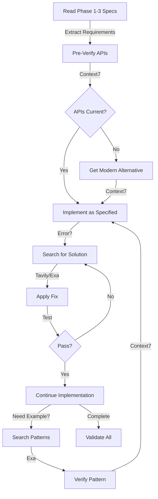

# Enhanced ModernizationImplementer Tool Strategy Guide

## Executive Summary

This guide details the strategic enhancement of the ModernizationImplementer with real-time documentation (Context7), intelligent search (Tavily/Exa), and version awareness tools. These additions transform the implementer from a specification executor into an intelligent, adaptive implementation authority that handles API evolution, resolves errors rapidly, and ensures production-ready code.

## 🎯 Tool Enhancement Rationale

### Why These Specific Tools?

#### 1. Context7 - Real-Time Documentation
**Purpose**: Bridge the gap between planning (Phase 3) and implementation (Phase 4)
- **Problem Solved**: APIs deprecate, methods change, best practices evolve
- **Value**: Current, accurate syntax and patterns
- **Use Case**: Before implementing any library-specific code

#### 2. Tavily - Intelligent Web Search
**Purpose**: Rapid error resolution and troubleshooting
- **Problem Solved**: Implementation blockers, cryptic errors
- **Value**: Community solutions, ranked by relevance
- **Use Case**: When encountering errors or unexpected behavior

#### 3. Exa - Neural Code Search
**Purpose**: Find production-ready implementation patterns
- **Problem Solved**: "How do others implement this?"
- **Value**: Real-world examples from successful projects
- **Use Case**: When needing implementation patterns or examples

#### 4. WebFetch - Package Intelligence
**Purpose**: Version awareness and changelog access
- **Problem Solved**: Version mismatches, breaking changes
- **Value**: Current package information, migration guides
- **Use Case**: When implementing version-specific features

## 🔄 Enhanced Implementation Workflow

### The Intelligent Implementation Pipeline



## 📚 Tool Usage Patterns

### Pattern 1: API Verification Flow
```typescript
// BEFORE implementing any library feature
async function preImplementationCheck(feature: Feature) {
  // 1. Check if API exists
  const exists = await context7.verify(feature.api);
  
  // 2. If deprecated, get alternative
  if (!exists || exists.deprecated) {
    const alternative = await context7.getModern(feature.intent);
    return alternative;
  }
  
  // 3. Get exact current syntax
  return await context7.getSyntax(feature.api);
}
```

### Pattern 2: Error Resolution Cascade
```typescript
// WHEN encountering errors
async function resolveError(error: Error) {
  // 1. Try Tavily for exact error
  let solution = await tavily.search(`"${error.message}" fix`);
  
  // 2. If no solution, try Exa semantic search
  if (!solution) {
    solution = await exa.searchNeural(error.context);
  }
  
  // 3. Verify solution with Context7
  return await context7.verify(solution);
}
```

### Pattern 3: Implementation Example Discovery
```typescript
// WHEN needing patterns
async function findPattern(requirement: Requirement) {
  // 1. Search for similar implementations
  const examples = await exa.findCode(requirement);
  
  // 2. Verify patterns are current
  const verified = await context7.checkPattern(examples[0]);
  
  // 3. Adapt to context
  return adaptPattern(verified, requirement.context);
}
```

### Pattern 4: Version-Aware Implementation
```typescript
// WHEN dealing with dependencies
async function versionAwareImplement(dep: Dependency) {
  // 1. Check current version
  const current = await webfetch.npmVersion(dep.name);
  
  // 2. If different from plan, check changelog
  if (current !== dep.plannedVersion) {
    const changes = await webfetch.getChangelog(dep);
    
    // 3. Get migration guidance if needed
    if (changes.breaking) {
      return await context7.getMigration(dep);
    }
  }
}
```

## 🎯 Strategic Tool Orchestration

### Decision Tree for Tool Selection

```
Implementation Task
├── Library/Framework Specific?
│   └── Yes → Context7 First
│       ├── Get current API
│       ├── Check deprecations
│       └── Verify syntax
│
├── Encountered Error?
│   └── Yes → Error Resolution Tools
│       ├── Exact match → Tavily
│       ├── Semantic → Exa
│       └── Verify fix → Context7
│
├── Need Examples?
│   └── Yes → Pattern Discovery
│       ├── Find examples → Exa
│       ├── Verify current → Context7
│       └── Apply pattern
│
└── Version Concerns?
    └── Yes → Version Intelligence
        ├── Check version → WebFetch
        ├── Get changelog → WebFetch
        └── Migration help → Context7
```

## 💡 Best Practices

### DO's ✅

#### Context7 Best Practices
- **DO** include library name and version
- **DO** verify before implementing
- **DO** check for deprecations first
- **DO** get type definitions when using TypeScript
- **DO** document when using modern alternatives

#### Search Tool Best Practices
- **DO** quote exact error messages
- **DO** include library context
- **DO** verify solutions before applying
- **DO** prefer recent solutions (check dates)
- **DO** credit sources in documentation

#### Version Intelligence Best Practices
- **DO** check versions before major implementations
- **DO** read breaking changes in changelogs
- **DO** test after version-specific adaptations
- **DO** document version dependencies

### DON'Ts ❌

#### Context7 Anti-Patterns
- **DON'T** use for architectural decisions
- **DON'T** explore unspecified features
- **DON'T** override Phase 3 specifications
- **DON'T** add features found in docs

#### Search Tool Anti-Patterns
- **DON'T** apply solutions blindly
- **DON'T** use outdated solutions (>2 years)
- **DON'T** ignore security warnings in solutions
- **DON'T** implement beyond specifications

#### Version Intelligence Anti-Patterns
- **DON'T** upgrade packages without plan approval
- **DON'T** use pre-release versions
- **DON'T** ignore peer dependencies
- **DON'T** mix version strategies

## 📊 Tool Synergy Examples

### Example 1: Handling Deprecated React Lifecycle
```typescript
// Phase 3 Plan specifies: componentWillReceiveProps

// 1. Context7 Detection
const check = await context7.query(
  "componentWillReceiveProps React 18. use context7"
);
// Result: Deprecated, use getDerivedStateFromProps or hooks

// 2. Exa Pattern Search
const patterns = await exa.search(
  "migrate componentWillReceiveProps to hooks React 18"
);
// Result: Multiple migration patterns found

// 3. Context7 Verification
const verified = await context7.query(
  "Verify useEffect for props changes pattern. use context7"
);

// 4. Implementation
useEffect(() => {
  // Props change logic
}, [props.specificProp]);
```

### Example 2: Resolving TypeScript Error
```typescript
// Error: Type 'string | undefined' is not assignable to type 'string'

// 1. Tavily Quick Fix
const fix = await tavily.search(
  '"Type string undefined not assignable" TypeScript fix'
);
// Result: Use nullish coalescing or type guard

// 2. Context7 Best Practice
const bestPractice = await context7.query(
  "TypeScript strict null checks best practice. use context7"
);

// 3. Apply Solution
const value: string = props.value ?? ''; // Nullish coalescing
```

### Example 3: Performance Optimization
```typescript
// Phase 3 requests: "Optimize large list rendering"

// 1. Exa Production Examples
const examples = await exa.search(
  "React virtual list performance optimization production"
);

// 2. Context7 Current Best Practice
const current = await context7.query(
  "React 18 list virtualization libraries comparison. use context7"
);
// Recommends: @tanstack/react-virtual

// 3. WebFetch Version Check
const version = await webfetch(
  "https://registry.npmjs.org/@tanstack/react-virtual/latest"
);

// 4. Context7 Implementation Guide
const implementation = await context7.query(
  "@tanstack/react-virtual basic setup TypeScript. use context7"
);
```

## 🔍 Validation & Quality Assurance

### Tool-Assisted Validation

1. **Syntax Validation**
   ```bash
   # Use Context7 to verify syntax patterns
   "Is this syntax correct for React 18? [code]. use context7"
   ```

2. **Type Validation**
   ```bash
   # Get proper types from Context7
   "TypeScript types for [library] [method]. use context7"
   ```

3. **Performance Validation**
   ```bash
   # Search for benchmarks
   tavily.search("[solution] performance benchmark")
   ```

4. **Security Validation**
   ```bash
   # Check for vulnerabilities
   webfetch("https://registry.npmjs.org/-/npm/v1/security/advisories")
   ```

## 📈 Success Metrics

### Measurable Improvements

| Metric | Without Tools | With Tools |
|--------|---------------|------------|
| **API Currency** | May use deprecated | Always current |
| **Error Resolution Time** | 15-30 min manual search | 2-5 min automated |
| **Pattern Discovery** | Trial and error | Proven examples |
| **Version Compatibility** | Runtime discovery | Pre-implementation check |
| **Implementation Confidence** | Assumption-based | Verification-based |

### Quality Indicators

- **Deprecation Avoidance**: 0 deprecated APIs in final code
- **Error Recovery**: 90%+ errors resolved via tools
- **Pattern Reuse**: 80%+ using verified patterns
- **Version Alignment**: 100% compatible implementations
- **Documentation**: All tool decisions recorded

## 🚀 Implementation Checklist

### Pre-Implementation
- [ ] Context7 available and responding
- [ ] Search tools accessible
- [ ] Package registry reachable
- [ ] Phase 1-3 documents loaded

### During Implementation
- [ ] APIs verified before use
- [ ] Errors resolved via search
- [ ] Patterns verified current
- [ ] Versions checked and compatible

### Post-Implementation
- [ ] All tool usage documented
- [ ] Deprecations noted and resolved
- [ ] Solutions credited
- [ ] Performance validated

## 🎯 Tool Integration Code

### Add to ModernizationImplementer

```typescript
class EnhancedImplementer {
  private tools = {
    context7: new Context7Client(),
    tavily: new TavilyClient(),
    exa: new ExaClient(),
    webfetch: new WebFetchClient()
  };
  
  async implementWithIntelligence(spec: Specification) {
    // Pre-verify all APIs
    await this.verifyAPIs(spec);
    
    // Implement with real-time assistance
    const result = await this.implementWithTools(spec);
    
    // Validate with current best practices
    await this.validateImplementation(result);
    
    return result;
  }
  
  private async verifyAPIs(spec: Specification) {
    for (const api of spec.apis) {
      const status = await this.tools.context7.verify(api);
      if (status.deprecated) {
        api.modernAlternative = await this.tools.context7.getModern(api);
      }
    }
  }
  
  private async handleError(error: Error): Promise<Solution> {
    // Cascade through tools for best solution
    const solutions = await Promise.all([
      this.tools.tavily.search(error.message),
      this.tools.exa.findSimilar(error.context)
    ]);
    
    // Verify best solution with Context7
    return this.tools.context7.verify(solutions[0]);
  }
}
```

## Summary

The enhanced ModernizationImplementer with Context7, Tavily, Exa, and WebFetch represents a paradigm shift from blind execution to intelligent implementation. These tools provide:

1. **Real-Time Accuracy**: Always current APIs and syntax
2. **Rapid Problem Resolution**: Errors solved in minutes, not hours
3. **Pattern Confidence**: Proven implementations from production code
4. **Version Intelligence**: Proactive compatibility management
5. **Quality Assurance**: Verified best practices throughout

The key is using these tools **tactically** - to enhance implementation fidelity, not to explore beyond specifications. Each tool serves a specific purpose in the implementation pipeline, working together to ensure that specifications from Phases 1-3 are implemented with modern, production-ready code.

This enhancement completes the transformation of your 4-phase workflow, adding intelligence to the execution phase while maintaining the integrity of the planning and design that precedes it.