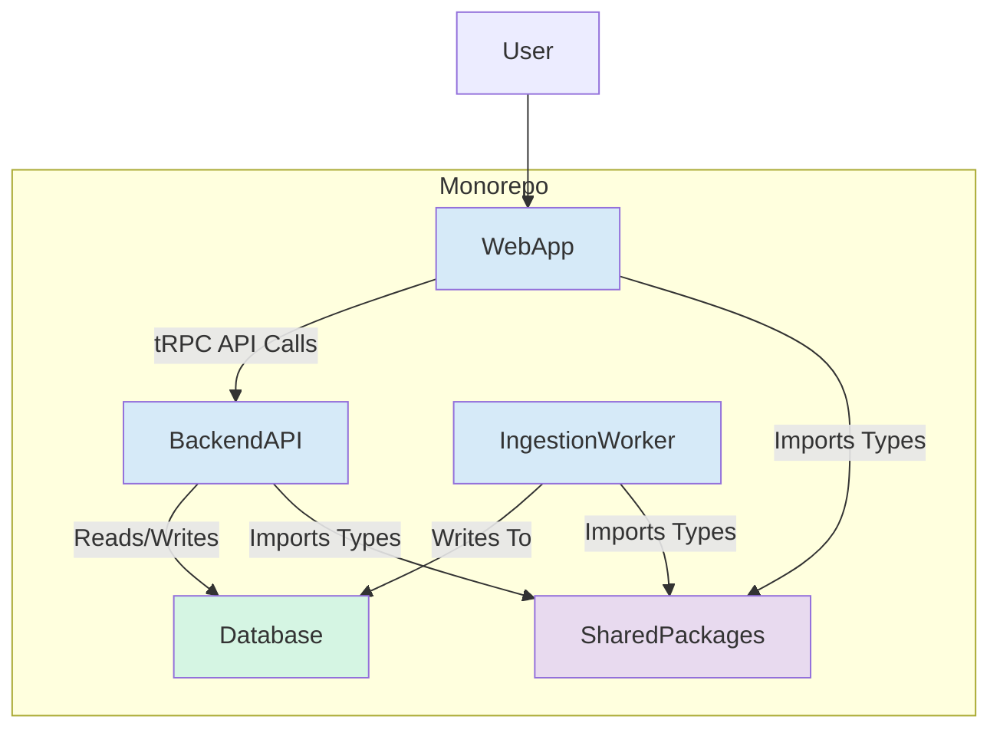
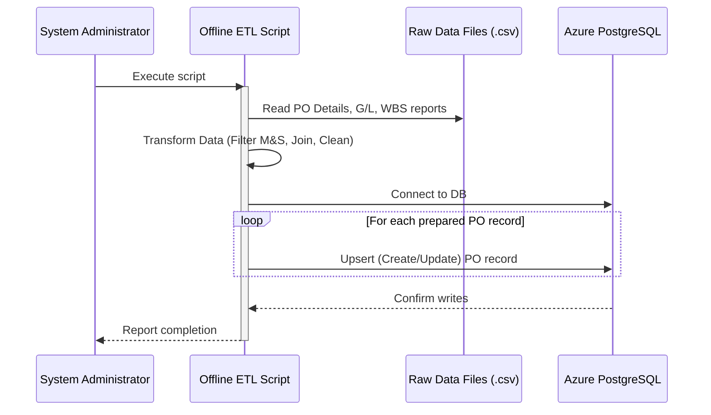
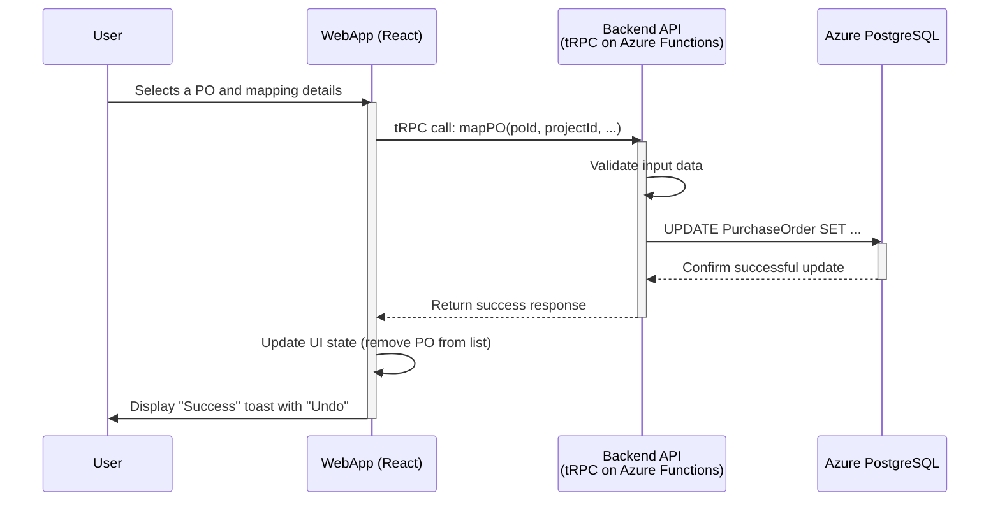
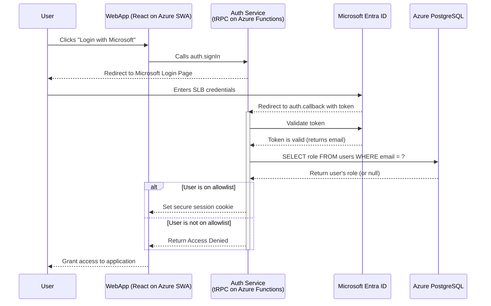
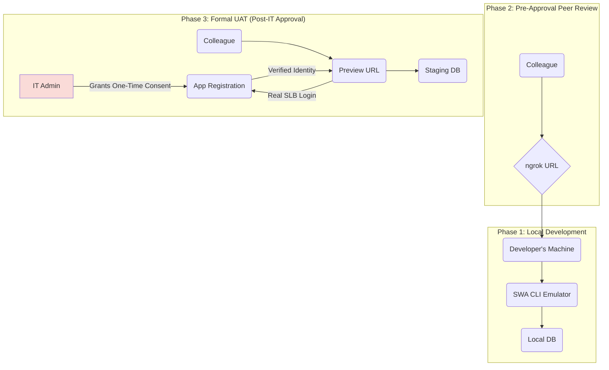

## **Architecture Document: Cost Management Hub**

### High Level Architecture

#### **Technical Summary**

This architecture outlines a pragmatic and modern **Client-Server model** designed to prioritize a rapid time-to-market for the MVP while establishing a clear path for future evolution. The system features a **React (Vite + TypeScript)** frontend that communicates with a **tRPC backend API**, ensuring end-to-end type safety. A separate **Node.js worker** will handle the daily data ingestion from the provided CSV report. The entire system is designed to be deployed on a scalable, developer-friendly cloud platform. This approach directly supports the PRD's goals by providing a robust, testable, and maintainable foundation that can be extended in the future to the more complex local-first model.

#### **Platform and Infrastructure Choice**

To align with the modern, type-safe stack and the need for scalability and ease of use, I recommend the following platform choices:

  * **Platform**: **Vercel** for the frontend application and serverless tRPC API functions, and a managed service like **Render** for the data ingestion worker and the Postgres database.
  * **Key Services**:
      * **Vercel**: Hosting the React web app and the tRPC API endpoints.
      * **Render (or similar)**: Hosting a managed **Postgres** database and a background worker for the Python ingestion script.
  * **Deployment Regions**: Vercel (Global Edge Network), Backend Services (e.g., US East).

#### **Repository Structure**

As defined in the PRD, the project will be organized in a **Monorepo**.

  * **Monorepo Tool**: I recommend using **Turborepo** for its high performance and efficient build caching.
  * **Package Organization**: We will use a standard structure, such as `apps/web` for the frontend, `apps/ingestion-worker` for the data script, and `packages/shared` for shared code like type definitions.

Understood. That's a critical constraint and the right decision for compliance and leveraging existing resources. The proposed architecture can be mapped directly to Azure services.

I've updated the **Platform and Infrastructure Choice** and the corresponding diagram to reflect an Azure-native approach. The rest of the high-level architecture (repository structure, patterns, etc.) remains the same.

-----

### High Level Architecture (Revised for Azure)

#### **Platform and Infrastructure Choice**

  * **Platform**: **Microsoft Azure**.
  * **Key Services**:
      * **Azure Static Web Apps**: To host the React frontend application, providing a global CDN and seamless CI/CD integration.
      * **Azure Functions**: To run the serverless **tRPC API** endpoints (integrated with Static Web Apps) and to host the scheduled daily **Data Ingestion Worker** (using a Timer Trigger).
      * **Azure Database for PostgreSQL**: To provide a fully managed, scalable Postgres database.
  * **Deployment Regions**: We can deploy the backend resources to a region like **Australia East**.

#### **High Level Architecture Diagram**

```mermaid
graph TD
    subgraph External Systems
        A[Power BI / SAP] --"Manual Daily Export"--> B(PO Report .csv);
    end

    subgraph Azure (Backend Services)
        C[Ingestion Worker <br> (Azure Function)];
        D[(Azure DB for PostgreSQL)];
        C --"Writes Enriched Data"--> D;
    end
    
    subgraph Azure (Static Web Apps)
        E[User] --> F{React Web App};
        F --"tRPC API Calls"--> G[API <br> (Azure Functions)];
    end

    C -- "Upload via script or manual trigger" --> B
    G --"Reads/Writes"--> D;

    style A fill:#D6EAF8
    style D fill:#D5F5E3
```

-----

### Tech Stack

#### **Cloud Infrastructure**
* **Provider**: Microsoft Azure
* **Key Services**: Azure Static Web Apps, Azure Functions, Azure Database for PostgreSQL
* **Deployment Regions**: Australia East

#### **Technology Stack Table**

| Category | Technology | Version | Purpose | Rationale |
| :--- | :--- | :--- | :--- | :--- |
| **Frontend Language** | TypeScript | `~5.4.5` | Type-safe development | Enforces type safety, improves code quality and maintainability. |
| **Frontend Framework**| React | `~18.3.1` | Building the user interface | Vast ecosystem, strong community, and excellent performance. |
| **UI Components** | shadcn/ui | `~0.8.0` | UI component library | Modern, accessible, and composable components built on Tailwind CSS. |
| **State & Data** | TanStack Query | `~5.37.1` | Server state management | Handles data fetching, caching, and optimistic updates efficiently. |
| **Backend Language** | TypeScript | `~5.4.5` | Type-safe development | Enables code and type sharing with the frontend in a monorepo. |
| **Backend Runtime** | Node.js | `~20.11.0` | Server-side environment | Long-Term Support (LTS) version, excellent for building fast APIs. |
| **API Style** | tRPC | `~11.0.0` | Type-safe API layer | Provides end-to-end type safety between client and server without code generation. |
| **Database** | PostgreSQL | `16` | Primary data store | Robust, reliable, and powerful open-source relational database. |
| **ORM** | Drizzle ORM | `~0.30.10`| Database toolkit | Lightweight, TypeScript-native ORM for type-safe database queries. |
| **Unit/Integration** | Vitest | `~1.6.0` | Frontend/Backend testing | A fast, modern testing framework compatible with the Vite ecosystem. |
| **E2E Testing** | Playwright | `~1.44.0` | End-to-end testing | Robust, cross-browser testing to validate critical user flows. |
| **Build Tool** | Vite | `~5.2.11` | Frontend build tooling | Provides extremely fast Hot Module Replacement (HMR) and optimized builds. |
| **IaC Tool** | Bicep | `~0.26.0` | Infrastructure as Code | Azure's native, declarative language for deploying cloud resources. |
| **CI/CD** | GitHub Actions | - | Continuous Integration/Deployment | Native integration with GitHub for automated builds, tests, and deployments to Azure. |
| **Monitoring** | Azure Monitor | - | Platform observability | Native Azure service for collecting, analyzing, and acting on telemetry. |
| **Logging** | App Insights | - | Application logging & diagnostics | Part of Azure Monitor, provides rich analytics and performance monitoring. |
| **CSS Framework** | Tailwind CSS | `~3.4.3` | Styling | A utility-first CSS framework for rapidly building custom designs. |

---

### Data Models

These models define the core business entities of the application. We will create shared TypeScript interfaces for these in our monorepo to ensure end-to-end type safety.

#### **Project**

  * **Purpose**: The central container for an initiative, holding all its financial planning and tracking data.
  * **Key Attributes**: `id`, `name`, `subBusinessLine`, `startDate`, `endDate`.
  * **TypeScript Interface**:
    ```typescript
    interface Project {
      id: string;
      name: string;
      subBusinessLine: string;
      startDate: Date;
      endDate: Date;
    }
    ```
  * **Relationships**: Has many Revenue Forecasts, Cost Assumptions, and Purchase Orders.

-----

#### **Cost Assumption**

  * **Purpose**: Represents a specific, hierarchical budget line item within a project.
  * **Key Attributes**: `id`, `projectId`, `costLine`, `spendType`, `spendSubCategory`, `parentId` (for hierarchy).
  * **TypeScript Interface**:
    ```typescript
    interface CostAssumption {
      id: string;
      projectId: string;
      costLine: 'M&S' | 'Other'; // Enum for known types
      spendType: 'Operational' | 'Maintenance';
      spendSubCategory: string;
      parentId: string | null; // Self-referencing for tree structure
    }
    ```
  * **Relationships**: Belongs to one Project, has many Budget Forecasts, has many Purchase Orders.

-----

#### **Purchase Order (PO) (Revised)**

  * **Purpose**: Represents the enriched spend data for a single PO line item, ingested from the daily report and ready for mapping and analysis.
  * **Key Attributes**: Includes core PO identifiers, financial data, contextual information to aid in mapping, and application-specific status fields.
  * **TypeScript Interface**:
    ```typescript
    interface PurchaseOrder {
      // === Core Identifiers ===
      poNumber: string; //
      poLineItem: string; //
      purchaseRequisitionNumber?: string; //
      wbs?: string; // Will be used to derive the project name

      // === Descriptive Details ===
      materialNumber?: string; //
      materialDescription: string; //
      quantity: number; //
      unitOfMeasure: string; //

      // === Financial Data ===
      netOrderValueUSD: number; //
      invoicedValueUSD: number; // This will come from 'Effective Invoice Amount in Document currency'

      // === Contextual Data for Mapping & Filtering ===
      companyCode: 'AU01' | 'NZ01' | 'PG01' | 'TL02'; //
      plantCode: string; //
      createdBy: string; // e.g., 'BATCH-FLM', 'Ariba ECC...'
      vendorCategory: 'OPS' | 'GLD' | 'EMS' | 'EHQ' | '3rd Party'; //
      vendorName: string; //

      // === Dates ===
      creationDate: Date; //
      supplierPromiseDate?: Date; //

      // === Statuses ===
      approvalStatus: 'Approved' | 'Blocked'; //
      gtsFlag: string; //

      // === Application-Specific Fields ===
      status: 'Pending' | 'Mapped'; // The status within our application
      mappingComment?: string;
      actionFlag?: 'Cancel' | 'De-expedite';
      projectId?: string; // Foreign key once mapped
      costAssumptionId?: string; // Foreign key once mapped
      mappedByUserId?: string; // Foreign key once mapped
    }
    ```

-----


### Components

Based on our chosen architecture, the system will be composed of the following logical components, all managed within our monorepo:

#### **1. Frontend Application (WebApp)**

  * **Responsibility**: To render the entire user interface and handle all user interactions. This includes managing client-side state (with Zustand), fetching and caching server data (with TanStack Query), and presenting the data-rich views defined in the UI/UX spec.
  * **Key Interfaces**: It consumes the type-safe tRPC API for all communication with the backend.
  * **Dependencies**: Backend API, Shared Types Package.
  * **Technology Stack**: React, Vite, TypeScript, Tailwind CSS, shadcn/ui.

-----

#### **2. Backend API (tRPC Service)**

  * **Responsibility**: To handle all business logic, data validation, user authentication/authorization, and database interactions. It exposes a set of type-safe procedures for the frontend to consume.
  * **Key Interfaces**: Provides tRPC procedures (queries and mutations) that the frontend calls.
  * **Dependencies**: Database, Shared Types Package.
  * **Technology Stack**: Node.js, TypeScript, tRPC, Drizzle ORM. Deployed as **Azure Functions**.

-----

#### **3. Data Ingestion Worker**

  * **Responsibility**: To run on a daily schedule, read the raw PO data from the input CSV, perform all necessary data cleaning and enrichment (e.g., joining with G/L account data), and then create or update the records in the Postgres database.
  * **Key Interfaces**: Reads from a CSV source (e.g., from Azure Blob Storage) and writes directly to the Postgres Database.
  * **Dependencies**: Database, Shared Types Package.
  * **Technology Stack**: Node.js/Python, Drizzle ORM. Deployed as a scheduled **Azure Function**.

-----

#### **4. Shared Packages**

  * **Responsibility**: To provide shared code, utilities, and especially TypeScript type definitions (like the `PurchaseOrder` interface) to the other components.
  * **Key Interfaces**: Exports shared types and functions.
  * **Dependencies**: None. It is a dependency for the other components.
  * **Technology Stack**: TypeScript.

-----

#### **Component Interaction Diagram**


```mermaid
graph TD
    User --> WebApp;

    subgraph "Monorepo"
        WebApp -- "tRPC API Calls" --> BackendAPI;
        IngestionWorker -- "Writes To" --> Database;
        BackendAPI -- "Reads/Writes" --> Database;

        WebApp -- "Imports Types" --> SharedPackages;
        BackendAPI -- "Imports Types" --> SharedPackages;
        IngestionWorker -- "Imports Types" --> SharedPackages;
    end

    style WebApp fill:#D6EAF8
    style BackendAPI fill:#D6EAF8
    style IngestionWorker fill:#D6EAF8
    style SharedPackages fill:#E8DAEF
    style Database fill:#D5F5E3
```

-----

### External APIs

Based on the current MVP scope defined in the PRD, the application is self-contained. The primary data source is a manually provided CSV file, and there are no other features that require integration with any third-party or external APIs.

Therefore, for the MVP, **no external API integrations are required**.

-----

### Core Workflows (Revised)

#### **1. Offline Data Ingestion & Preparation**

This diagram shows the revised, offline process for preparing and loading PO data into the application's database. This is performed by an administrator and is separate from the web application itself.


```mermaid
sequenceDiagram
    participant Admin as System Administrator
    participant Script as Offline ETL Script
    participant RawFiles as Raw Data Files (.csv)
    participant Database as Azure PostgreSQL

    Admin->>Script: Execute script
    activate Script
    Script->>RawFiles: Read PO Details, G/L, WBS reports
    Script->>Script: Transform Data (Filter M&S, Join, Clean)
    Script->>Database: Connect to DB
    loop For each prepared PO record
        Script->>Database: Upsert (Create/Update) PO record
    end
    Database-->>Script: Confirm writes
    Script-->>Admin: Report completion
    deactivate Script
```

-----

#### **2. User PO Mapping Workflow (Unchanged)**

This workflow, which details how a user interacts with the live application, remains correct. The web application reads from and writes to the database, which is populated by the offline script above.


```mermaid
sequenceDiagram
    participant User
    participant WebApp as WebApp (React)
    participant BackendAPI as Backend API <br> (tRPC on Azure Functions)
    participant Database as Azure PostgreSQL

    User->>WebApp: Selects a PO and mapping details
    activate WebApp
    WebApp->>BackendAPI: tRPC call: mapPO(poId, projectId, ...)
    activate BackendAPI
    BackendAPI->>BackendAPI: Validate input data
    BackendAPI->>Database: UPDATE PurchaseOrder SET ...
    activate Database
    Database-->>BackendAPI: Confirm successful update
    deactivate Database
    BackendAPI-->>WebApp: Return success response
    deactivate BackendAPI
    WebApp->>WebApp: Update UI state (remove PO from list)
    WebApp->>User: Display "Success" toast with "Undo"
    deactivate WebApp
```

### **Revised Authentication Architecture**

The core security principle is the **separation of identity from application roles**.

  * **Microsoft Entra ID** will be used exclusively for **Authentication** (verifying a user is a valid employee).
  * The application's **PostgreSQL Database** will handle **Authorization** (determining what an authenticated user is allowed to do).

#### **A. Data Model Updates (Database Schema)**

The PostgreSQL schema will be updated with a `users` table to act as the application's authorization source of truth.

```sql
-- Manages user access and roles within the application
CREATE TABLE users (
    id UUID PRIMARY KEY DEFAULT gen_random_uuid(),
    email TEXT UNIQUE NOT NULL, -- The user's corporate email (@slb.com)
    name TEXT, -- Synced from Microsoft profile on first login
    role TEXT NOT NULL DEFAULT 'User', -- e.g., 'Admin', 'User'
    last_login_at TIMESTAMPTZ,
    created_at TIMESTAMPTZ NOT NULL DEFAULT NOW(),
    updated_at TIMESTAMPTZ NOT NULL DEFAULT NOW()
);

-- Index on email for fast lookups during the auth callback
CREATE INDEX idx_users_email ON users(email);
```

#### **B. Backend API (tRPC on Azure Functions) Updates**

The backend will orchestrate the authentication flow using a standard OIDC library (like `@auth/core` or MSAL Node) and a dedicated set of tRPC procedures.

  * **New "Auth Service" Component**:
    1.  **`auth.signIn`**: Redirects the user to the Microsoft login page.
    2.  **`auth.callback`**: Handles the redirect from Microsoft, validates the token, checks the user's email against the `users` table allowlist, and creates a secure session cookie with the user's role from our database.
    3.  **`auth.getSession`**: A protected procedure to retrieve the current user's session data.
    4.  **`auth.signOut`**: Clears the session.
  * **Protected Procedures**: All other tRPC procedures must be protected, requiring a valid session and using the role from the session for authorization checks.

#### **C. Frontend Application (React) Updates**

  * **UI**: The application will feature a prominent "Login with Microsoft" button. The main app views will be protected, and a global component will display the user's name and a "Logout" button.
  * **State Management**: A global store (Zustand) will hold the user's session data (`{ name, email, role }`), populated by calling `auth.getSession` on application load.

-----

### **Phased Development and Testing Workflow**

This workflow enables rapid development and testing before formal IT admin consent is required.

#### **Phase 1: Local Development**

  * **Environment**: Developer's local machine using the Azure SWA CLI to emulate the cloud environment and a local PostgreSQL instance.
  * **Process**: The SWA CLI provides a mock login, allowing the developer to provide mock user data (e.g., `{"email": "dev@slb.com"}`) which is then looked up in the local database's allowlist.

#### **Phase 2: Pre-Approval Peer Review**

  * **Environment**: Developer's local machine, securely exposed via a tunneling tool like **`ngrok`**.
  * **Process**: A colleague's email is added to the allowlist in the developer's local database. The colleague accesses the `ngrok` URL, uses the mock login with their own details, and the request is tunneled to the developer's machine for a full end-to-end test, requiring **zero IT interaction**.

#### **Phase 3: Formal UAT and Production (Post-IT Approval)**

  * **The IT Gate**: This phase begins after IT grants the **one-time, tenant-wide admin consent** for the application's Entra ID App Registration.
  * **Environment**: Automated Pull Request **Preview Environments** on Azure for UAT (connected to a Staging DB) and the `main` branch deployment for Production (connected to the Production DB).
  * **Process**: A tester's email is added to the Staging DB allowlist. The tester logs in with their real SLB credentials via the official Microsoft login page, and the backend verifies their identity against the staging database.

-----

### **Diagram Updates**

#### **Revised High Level Architecture Diagram**

This diagram now illustrates the authentication flow.


```mermaid
sequenceDiagram
    participant User
    participant WebApp as WebApp (React on Azure SWA)
    participant AuthService as Auth Service <br> (tRPC on Azure Functions)
    participant EntraID as Microsoft Entra ID
    participant Database as Azure PostgreSQL

    User->>WebApp: Clicks "Login with Microsoft"
    WebApp->>AuthService: Calls auth.signIn
    AuthService-->>User: Redirect to Microsoft Login Page
    User->>EntraID: Enters SLB credentials
    EntraID-->>AuthService: Redirect to auth.callback with token
    activate AuthService
    AuthService->>EntraID: Validate token
    EntraID-->>AuthService: Token is valid (returns email)
    AuthService->>Database: SELECT role FROM users WHERE email = ?
    Database-->>AuthService: Return user's role (or null)
    alt User is on allowlist
        AuthService-->>WebApp: Set secure session cookie
    else User is not on allowlist
        AuthService-->>WebApp: Return Access Denied
    end
    deactivate AuthService
    WebApp-->>User: Grant access to application
```

#### **Phased Testing Strategy Diagram**


```mermaid
graph TD
    subgraph "Phase 1: Local Development"
        A(Developer's Machine) --> B(SWA CLI Emulator);
        B --> C(Local DB);
    end

    subgraph "Phase 2: Pre-Approval Peer Review"
        D(Colleague) --> E{ngrok URL};
        E --> A;
    end

    subgraph "Phase 3: Formal UAT (Post-IT Approval)"
        F[IT Admin] -- "Grants One-Time Consent" --> G(App Registration);
        H(Colleague) --> I(Preview URL);
        I -- "Real SLB Login" --> G;
        G -- "Verified Identity" --> I;
        I --> J(Staging DB);
    end

    style F fill:#FADBD8
```


