### **Architecture Document: Cost Management Hub**

## High Level Architecture

### **Technical Summary**

This architecture outlines a pragmatic and modern **Client-Server model** featuring an **Application-Level, Allowlist-Based Authentication** system. The architecture is designed to prioritize a rapid and secure development lifecycle, allowing for pre-approval demos before final IT consent. A **React (Vite + TypeScript)** frontend communicates with a **tRPC backend API**, ensuring end-to-end type safety. All components and services will be deployed on **Microsoft Azure**, leveraging its scalable and managed services. This approach provides a clear path for development, testing, and a seamless transition to a fully secured production environment.

-----

### **Platform and Infrastructure Choice**

  * **Platform**: **Microsoft Azure**.
  * **Key Services**:
      * **Azure Static Web Apps**: To host the React frontend and provide a global CDN.
      * **Azure Functions**: To run the serverless tRPC API and the scheduled daily data ingestion script.
      * **Azure Database for PostgreSQL**: To provide a fully managed, scalable Postgres database.

-----

### **Repository Structure**

  * The project will be organized in a **Monorepo** to manage the frontend, backend, and shared packages in a single repository.

-----

### **High Level Architecture Diagram**

This diagram reflects the application-level authentication flow with Microsoft Entra ID.

```mermaid
graph TD
    subgraph "User's Browser"
        User -- "1. Clicks 'Login'" --> WebApp;
    end

    subgraph "Microsoft Entra ID"
        LoginPage[Corporate Login Page]
    end

    subgraph "Azure (Application Components)"
        subgraph "Backend API (Next.js)"
            AuthService[Auth.js Service <br> (Login, Callback, Session)];
            MainAPI[Main tRPC API <br> (Business Logic)];
        end

        Database[(Azure DB for PostgreSQL <br> with Users table)];
        WebApp{React Web App};
    end

    WebApp -- "2. Initiates Login" --> AuthService;
    AuthService -- "3. Redirects to Microsoft" --> LoginPage;
    LoginPage -- "4. User signs in, redirects back" --> AuthService;
    AuthService -- "5. Validates token, checks allowlist in DB" --> Database;
    Database -- "6. Confirms user exists & gets role" --> AuthService;
    AuthService -- "7. Creates session, returns user data" --> WebApp;
    WebApp -- "8. User is Authenticated" --> User;

    WebApp -- "Authenticated API Calls" --> MainAPI;
    MainAPI -- "Reads/Writes Data" --> Database;
```

-----

### **Architectural and Design Patterns**

  * **Application-Level Authorization (Allowlist)**: Authentication (verifying identity) is handled by Microsoft Entra ID. Authorization (determining who can use the app and their role) is managed within our application's database.
  * **Modern Client-Server Architecture**: The foundational pattern for the MVP.
  * **Server State Management**: Using **TanStack Query** to handle all data fetching and caching on the client side.
  * **Type-Safe API**: Using **tRPC** to ensure there are no data inconsistencies between the frontend and backend.

---
### Tech Stack

#### **Cloud Infrastructure**
* **Provider**: Microsoft Azure
* **Key Services**: Azure Static Web Apps, Azure Functions, Azure Database for PostgreSQL
* **Deployment Regions**: Australia East

---
#### **Technology Stack Table**

| Category | Technology | Version | Purpose | Rationale |
| :--- | :--- | :--- | :--- | :--- |
| **Frontend Language** | TypeScript | `~5.4.5` | Type-safe development | Enforces type safety, improves code quality and maintainability. |
| **Frontend Framework**| React | `~18.3.1` | Building the user interface | Vast ecosystem, strong community, and excellent performance. |
| **UI Components** | shadcn/ui | `~0.8.0` | UI component library | Modern, accessible, and composable components built on Tailwind CSS. |
| **State & Data** | TanStack Query | `~5.37.1` | Server state management | Handles data fetching, caching, and optimistic updates efficiently. |
| **Backend Language** | TypeScript | `~5.4.5` | Type-safe development | Enables code and type sharing with the frontend in a monorepo. |
| **Backend Runtime** | Node.js | `~20.11.0`| Server-side environment | Long-Term Support (LTS) version, excellent for building fast APIs. |
| **Authentication** | Auth.js (NextAuth) | `~5.0.0` | Authentication handling | Robust library for handling authentication flows, especially with OAuth providers. |
| **API Style** | tRPC | `~11.0.0` | Type-safe API layer | Provides end-to-end type safety between client and server without code generation. |
| **Database** | PostgreSQL | `16` | Primary data store | Robust, reliable, and powerful open-source relational database. |
| **ORM** | Drizzle ORM | `~0.30.10`| Database toolkit | Lightweight, TypeScript-native ORM for type-safe database queries. |
| **Unit/Integration** | Vitest | `~1.6.0` | Frontend/Backend testing | A fast, modern testing framework compatible with the Vite ecosystem. |
| **E2E Testing** | Playwright | `~1.44.0` | End-to-end testing | Robust, cross-browser testing to validate critical user flows. |
| **Build Tool** | Vite | `~5.2.11` | Frontend build tooling | Provides extremely fast Hot Module Replacement (HMR) and optimized builds. |
| **IaC Tool** | Bicep | `~0.26.0` | Infrastructure as Code | Azure's native, declarative language for deploying cloud resources. |
| **CI/CD** | GitHub Actions | - | Continuous Integration/Deployment | Native integration with GitHub for automated builds, tests, and deployments to Azure. |
| **Monitoring** | Azure Monitor | - | Platform observability | Native Azure service for collecting, analyzing, and acting on telemetry. |
| **Logging** | App Insights | - | Application logging & diagnostics | Part of Azure Monitor, provides rich analytics and performance monitoring. |
| **CSS Framework** | Tailwind CSS | `~3.4.3` | Styling | A utility-first CSS framework for rapidly building custom designs. |

---

### Data Models

These models define the core business entities. We will create shared TypeScript interfaces for these in our monorepo's `packages/shared` directory to ensure end-to-end type safety.

#### **1. User**

  * **Purpose**: To act as the centrally managed allowlist for application access and to store user roles for authorization.
  * **Key Attributes**: `id`, `email`, `name`, `role`, `last_login_at`.
  * **TypeScript Interface**:
    ```typescript
    interface User {
      id: string;
      email: string;
      name: string;
      role: 'Admin' | 'User' | 'Coordinator';
      lastLoginAt?: Date;
    }
    ```

-----

#### **2. Project**

  * **Purpose**: The central container for an initiative, holding all its financial planning and tracking data.
  * **Key Attributes**: `id`, `name`, `subBusinessLine`, `startDate`, `endDate`.
  * **TypeScript Interface**:
    ```typescript
    interface Project {
      id: string;
      name: string;
      subBusinessLine: string;
      startDate: Date;
      endDate: Date;
    }
    ```
  * **Relationships**: Has many Revenue Forecasts, Cost Assumptions, and Purchase Orders.

-----

#### **3. Revenue Forecast**

  * **Purpose**: Stores the versioned, monthly revenue plan for a project, allowing for historical analysis of how revenue expectations have changed.
  * **Key Attributes**: `id`, `projectId`, `forecastMonth`, `expectedRevenue`, `actualRevenue`, `version`.
  * **TypeScript Interface**:
    ```typescript
    interface RevenueForecast {
      id: string;
      projectId: string;
      forecastMonth: Date; // Represents the first day of the month
      expectedRevenue: number;
      actualRevenue?: number;
      version: number;
    }
    ```
  * **Relationships**: Belongs to one Project.

-----

#### **4. Cost Assumption**

  * **Purpose**: Represents a specific, hierarchical budget line item within a project.
  * **Key Attributes**: `id`, `projectId`, `costLine`, `spendType`, `spendSubCategory`, `parentId`.
  * **TypeScript Interface**:
    ```typescript
    interface CostAssumption {
      id: string;
      projectId: string;
      parentId: string | null; // Self-referencing for tree structure
      costLine: 'M&S' | 'Other';
      spendType: 'Operational' | 'Maintenance';
      spendSubCategory: string;
    }
    ```
  * **Relationships**: Belongs to one Project, has many Budget Forecasts, has many Purchase Orders.

-----

#### **5. Budget Forecast**

  * **Purpose**: Stores the versioned, monthly budget for a specific, lowest-level cost assumption category.
  * **Key Attributes**: `id`, `costAssumptionId`, `forecastMonth`, `budgetedCost`, `version`.
  * **TypeScript Interface**:
    ```typescript
    interface BudgetForecast {
      id: string;
      costAssumptionId: string;
      forecastMonth: Date; // Represents the first day of the month
      budgetedCost: number;
      version: number;
    }
    ```
  * **Relationships**: Belongs to one Cost Assumption.

-----

#### **6. Provisional Mapping**

  * **Purpose**: Stores the proactive mapping information entered by a user for a Purchase Requisition (PR) or SRM number *before* the corresponding PO has been ingested.
  * **Key Attributes**: `id`, `purchaseRequisitionNumber`, `srmShoppingCartNumber`, `projectId`, `costAssumptionId`, `created_by_user_id`.
  * **TypeScript Interface**:
    ```typescript
    interface ProvisionalMapping {
      id: string;
      purchaseRequisitionNumber?: string;
      srmShoppingCartNumber?: string;
      projectId: string;
      costAssumptionId: string;
      createdByUserId: string;
    }
    ```
  * **Relationships**: Links a User, Project, and Cost Assumption to a PR/SRM number.

-----

#### **7. Purchase Order (PO)**

  * **Purpose**: Represents the enriched spend data for a single PO line item, ingested from the daily report.
  * **Key Attributes**: Includes core PO identifiers, financial data, contextual information to aid in mapping, and application-specific status fields.
  * **TypeScript Interface**:
    ```typescript
    interface PurchaseOrder {
      // === Core Identifiers ===
      poNumber: string;
      poLineItem: string;
      purchaseRequisitionNumber?: string;
      wbs?: string;

      // === Descriptive Details ===
      materialNumber?: string;
      materialDescription: string;
      quantity: number;
      unitOfMeasure: string;

      // === Financial Data ===
      netOrderValueUSD: number;
      invoicedValueUSD: number;

      // === Contextual Data for Mapping & Filtering ===
      companyCode: 'AU01' | 'NZ01' | 'PG01' | 'TL02';
      plantCode: string;
      createdBy: string;
      vendorCategory: 'OPS' | 'GLD' | 'EMS' | 'EHQ' | '3rd Party';
      vendorName: string;

      // === Dates ===
      creationDate: Date;
      supplierPromiseDate?: Date;

      // === Statuses ===
      approvalStatus: 'Approved' | 'Blocked';
      gtsFlag: string;

      // === Application-Specific Fields ===
      status: 'Pending' | 'Mapped';
      mappingComment?: string;
      actionFlag?: 'Cancel' | 'De-expedite';
      projectId?: string;
      costAssumptionId?: string;
      mappedByUserId?: string;
    }
    ```

### Components

Based on our chosen architecture, the system will be composed of the following logical components, all managed within our monorepo:

#### **1. Frontend Application (WebApp)**

  * **Responsibility**: To render the entire user interface and handle all user interactions. This includes managing client-side state (with Zustand), fetching and caching server data (with TanStack Query), and handling the authentication flow with Auth.js.
  * **Key Interfaces**: It consumes the type-safe tRPC API for all business logic communication with the backend.
  * **Dependencies**: Backend API, Shared Types Package.
  * **Technology Stack**: React, Vite, TypeScript, Tailwind CSS, shadcn/ui.

-----

#### **2. Backend API (tRPC Service)**

  * **Responsibility**: To handle all business logic, data validation, and database interactions. Crucially, it will also manage the core authentication and authorization logic, including the `signIn` callback that checks the user against the database allowlist.
  * **Key Interfaces**: Provides tRPC procedures (queries and mutations) that the frontend calls.
  * **Dependencies**: Database, Shared Types Package, Auth.js.
  * **Technology Stack**: Node.js, TypeScript, tRPC, Drizzle ORM. Deployed as **Azure Functions**.

-----

#### **3. Offline ETL Script**

  * **Responsibility**: As we decided, this is an offline script run by an administrator. Its job is to read the raw PO data from the input CSV, perform all necessary data cleaning and enrichment, and then create or update the records in the Postgres database.
  * **Key Interfaces**: Reads from local CSV files and writes directly to the Postgres Database.
  * **Dependencies**: Database, Shared Types Package.
  * **Technology Stack**: Node.js/Python, Drizzle ORM.

-----

#### **4. Shared Packages**

  * **Responsibility**: To provide shared code, utilities, and especially TypeScript type definitions (like the `PurchaseOrder` and `User` interfaces) to the other components.
  * **Key Interfaces**: Exports shared types and functions.
  * **Dependencies**: None. It is a dependency for the other components.
  * **Technology Stack**: TypeScript.

-----

#### **Component Interaction Diagram**

```mermaid
graph TD
    User --> WebApp;

    subgraph "Monorepo"
        WebApp -- "tRPC API Calls" --> BackendAPI;
        OfflineScript -- "Writes To" --> Database;
        BackendAPI -- "Reads/Writes" --> Database;

        WebApp -- "Imports Types" --> SharedPackages;
        BackendAPI -- "Imports Types" --> SharedPackages;
        OfflineScript -- "Imports Types" --> SharedPackages;
    end
    
    subgraph "Manual Process"
        Admin[Admin User] -- "Runs" --> OfflineScript
    end


    style WebApp fill:#D6EAF8
    style BackendAPI fill:#D6EAF8
    style OfflineScript fill:#E8DAEF
    style SharedPackages fill:#E8DAEF
    style Database fill:#D5F5E3
```



---
### External APIs

Based on the current MVP scope, the application's core business logic is self-contained and does not require direct integration with any third-party APIs for its functionality. The primary data source is the offline ETL script.

Therefore, for the MVP, **no external business logic API integrations are required**.

*(Note: The authentication process involves a redirection flow to Microsoft Entra ID, which is managed by the `Auth.js` library. This is considered an authentication provider integration rather than a direct external API call for business data.)*

You've raised an excellent point. I focused on the primary technical and interactive workflows, but for completeness, we absolutely should include the project setup and reporting flows.

I've expanded the **Core Workflows** section to include these user journeys.

-----

### Core Workflows (Expanded)

#### **1. User Authentication & Authorization Workflow**

*(As previously defined)*
This workflow details how a user is authenticated by Microsoft Entra ID and then authorized by our application's internal database allowlist.


-----

#### **2. Offline Data Ingestion & Preparation**

*(As previously defined)*
This workflow shows the offline process for preparing and loading PO data into the database.


-----

#### **3. Project & Budget Setup Workflow (New)**

This workflow shows how a Core User creates a new project and defines its initial financial plan.


-----

#### **4. User PO Mapping Workflow**

*(As previously defined)*
This workflow illustrates the primary user interaction for mapping a Purchase Order within the application.


-----

#### **5. Budget vs. Actuals Reporting Workflow (New)**

This workflow shows how a user views a project's dashboard to compare the budget with actual, mapped spending.


### Database Schema

This is the proposed schema for the PostgreSQL database, designed to support all the requirements of the application. It uses `snake_case` for table and column names, which is a standard convention.

```sql
-- Users who will be performing mapping and creating projects
CREATE TABLE users (
    id UUID PRIMARY KEY DEFAULT gen_random_uuid(),
    name VARCHAR(255) NOT NULL,
    email VARCHAR(255) UNIQUE NOT NULL,
    role VARCHAR(50) NOT NULL CHECK (role IN ('Admin', 'User', 'Coordinator')), -- Defines app-specific roles
    last_login_at TIMESTAMPTZ,
    created_at TIMESTAMPTZ NOT NULL DEFAULT NOW(),
    updated_at TIMESTAMPTZ NOT NULL DEFAULT NOW()
);

-- Central table for projects
CREATE TABLE projects (
    id UUID PRIMARY KEY DEFAULT gen_random_uuid(),
    name VARCHAR(255) NOT NULL,
    sub_business_line VARCHAR(100),
    start_date DATE,
    end_date DATE,
    created_at TIMESTAMPTZ NOT NULL DEFAULT NOW(),
    updated_at TIMESTAMPTZ NOT NULL DEFAULT NOW()
);

-- Table to store the versioned history of revenue forecasts for a project
CREATE TABLE revenue_forecasts (
    id UUID PRIMARY KEY DEFAULT gen_random_uuid(),
    project_id UUID NOT NULL REFERENCES projects(id),
    forecast_month DATE NOT NULL, -- The first day of the month
    expected_revenue DECIMAL(18, 2),
    actual_revenue DECIMAL(18, 2),
    version INT NOT NULL,
    created_at TIMESTAMPTZ NOT NULL DEFAULT NOW(),
    UNIQUE(project_id, forecast_month, version)
);

-- The hierarchical structure for cost categories
CREATE TABLE cost_assumptions (
    id UUID PRIMARY KEY DEFAULT gen_random_uuid(),
    project_id UUID NOT NULL REFERENCES projects(id),
    parent_id UUID REFERENCES cost_assumptions(id), -- Self-referencing for hierarchy
    cost_line VARCHAR(100) NOT NULL,
    spend_type VARCHAR(100) NOT NULL,
    spend_sub_category VARCHAR(255) NOT NULL,
    created_at TIMESTAMPTZ NOT NULL DEFAULT NOW()
);

-- Table to store the versioned history of budget forecasts for a cost category
CREATE TABLE budget_forecasts (
    id UUID PRIMARY KEY DEFAULT gen_random_uuid(),
    cost_assumption_id UUID NOT NULL REFERENCES cost_assumptions(id),
    forecast_month DATE NOT NULL, -- The first day of the month
    budgeted_cost DECIMAL(18, 2),
    version INT NOT NULL,
    created_at TIMESTAMPTZ NOT NULL DEFAULT NOW(),
    UNIQUE(cost_assumption_id, forecast_month, version)
);

-- Table for the proactive, pre-PO mapping feature
CREATE TABLE provisional_mappings (
    id UUID PRIMARY KEY DEFAULT gen_random_uuid(),
    purchase_requisition_number VARCHAR(100) UNIQUE,
    srm_shopping_cart_number VARCHAR(100) UNIQUE,
    project_id UUID NOT NULL REFERENCES projects(id),
    cost_assumption_id UUID NOT NULL REFERENCES cost_assumptions(id),
    created_by_user_id UUID NOT NULL REFERENCES users(id),
    created_at TIMESTAMPTZ NOT NULL DEFAULT NOW(),
    CHECK (purchase_requisition_number IS NOT NULL OR srm_shopping_cart_number IS NOT NULL)
);

-- The main table for all ingested and enriched PO data
CREATE TABLE purchase_orders (
    -- Core Identifiers
    po_number VARCHAR(100) NOT NULL,
    po_line_item VARCHAR(50) NOT NULL,
    purchase_requisition_number VARCHAR(100),
    wbs VARCHAR(100),

    -- Descriptive Details
    material_number VARCHAR(100),
    material_description TEXT,
    quantity DECIMAL(18, 3),
    unit_of_measure VARCHAR(50),

    -- Financial Data
    net_order_value_usd DECIMAL(18, 2),
    invoiced_value_usd DECIMAL(18, 2),

    -- Contextual Data
    company_code VARCHAR(10),
    plant_code VARCHAR(10),
    created_by VARCHAR(100),
    vendor_category VARCHAR(50),
    vendor_name VARCHAR(255),

    -- Dates
    creation_date DATE,
    supplier_promise_date DATE,

    -- Statuses
    approval_status VARCHAR(50),
    gts_flag VARCHAR(100),

    -- Application-Specific Fields
    status VARCHAR(50) NOT NULL DEFAULT 'Pending', -- 'Pending' or 'Mapped'
    mapping_comment TEXT,
    action_flag VARCHAR(50),
    project_id UUID REFERENCES projects(id),
    cost_assumption_id UUID REFERENCES cost_assumptions(id),
    mapped_by_user_id UUID REFERENCES users(id),
    
    ingested_at TIMESTAMPTZ NOT NULL DEFAULT NOW(),
    updated_at TIMESTAMPTZ NOT NULL DEFAULT NOW(),

    -- Composite Primary Key
    PRIMARY KEY (po_number, po_line_item)
);

-- Indexes for performance on frequently queried columns
CREATE INDEX idx_po_project_id ON purchase_orders(project_id);
CREATE INDEX idx_po_cost_assumption_id ON purchase_orders(cost_assumption_id);
CREATE INDEX idx_po_pr_number ON purchase_orders(purchase_requisition_number);
```

### Frontend Architecture

The definitive guide for the frontend is the **UI/UX Specification (`front-end-spec.md`)**. This section summarizes the key architectural decisions from that document and the PRD.

#### **Component Architecture**
The frontend will be built using a **Component-Based Architecture** with React. A project-specific component library will be created, founded on **shadcn/ui**, which provides a set of high-quality, accessible components that we can directly modify and style within our codebase. Refer to the UI/UX Spec for a list of core components.

---
#### **State Management Architecture**
Client-side state will be managed using two libraries, each with a distinct purpose:
* **TanStack Query (React Query)**: Will be used to manage all **server state**. This includes fetching, caching, synchronizing, and updating data from our backend API. It also handles optimistic updates, which is critical for our "Instant Apply + Undo" UX pattern.
* **Zustand**: Will be used for simple, **global UI state** that is not tied to the server, such as managing the visibility of a sidebar or the current theme.

---
#### **Routing Architecture**
Routing will be handled by the chosen frontend framework's standard library (e.g., React Router for Vite). The architecture will support protected routes that check for a valid user session before rendering a page. The primary navigation structure is defined in the UI/UX Specification's Information Architecture section.

---
#### **Frontend Services Layer**
All communication with the backend will be handled through a dedicated service layer that uses **tRPC**. This ensures end-to-end type safety between the client and the server. All API request and response payloads will use the shared TypeScript types defined in the monorepo's `packages/shared` directory.

### Backend Architecture

The backend is designed to be a scalable, secure, and type-safe set of serverless functions that serve the frontend application.

#### **Service Architecture**

We will use a **Serverless Architecture** built on **Azure Functions**. The API will be a collection of tRPC routers, where each router groups related procedures for a specific domain (e.g., `projectRouter`, `poRouter`, `authRouter`). This approach keeps the business logic organized and allows for independent deployment and scaling.

  * **Function Organization**: Each tRPC router can be exposed as a single Azure Function with multiple endpoints, or related functions can be grouped within a single Function App.
  * **Business Logic**: All business logic will reside within the tRPC procedures, which will call upon the Data Access Layer to interact with the database.

-----

#### **Database Architecture**

The backend will interact with the **Azure Database for PostgreSQL**, which serves as the single source of truth.

  * **Data Access Layer**: All database operations will be handled exclusively through a dedicated Data Access Layer built with **Drizzle ORM**. We will implement the **Repository Pattern** to abstract database queries from the business logic, making the system more modular and easier to test.
  * **Schema**: The database will follow the schema we defined in the "Database Schema" section.

-----

#### **Authentication and Authorization**

We will implement the **Application-Level Authorization (Allowlist)** model we've defined.

  * **Authentication (Who you are)**: This is handled by **Microsoft Entra ID**. The backend, using the `Auth.js` library, will redirect the user to Microsoft for sign-in.
  * **Authorization (What you can do)**: This is handled by our application. After Entra ID successfully authenticates a user, the backend's `signIn` callback will query our Postgres `users` table. If the user's verified email is on our allowlist, a session is created. Otherwise, access is denied. The user's role (`Admin`, `User`, etc.) will be pulled from our database and included in their session.

##### **Authentication Flow**


### Unified Project Structure

This structure separates applications (`apps`) from shared code (`packages`), which is a best practice for monorepos. It ensures that our frontend, backend API, and worker can all share common code and types seamlessly.

```plaintext
/cost-management-hub/
├── .github/                    # CI/CD workflows (e.g., GitHub Actions)
├── apps/
│   ├── web/                    # The React frontend application
│   │   ├── src/
│   │   │   ├── app/            # Main app routes and layouts (using App Router)
│   │   │   ├── components/     # UI components specific to this app
│   │   │   ├── lib/            # Utility functions, hooks
│   │   │   └── services/       # tRPC client and data fetching hooks
│   │   └── package.json
│   └── worker/                 # The offline ETL ingestion script
│       ├── src/
│       │   ├── index.ts        # Main script entry point
│       │   └── lib/            # Transformation logic
│       └── package.json
├── packages/
│   ├── ui/                     # Shared shadcn/ui components
│   │   ├── components/
│   │   └── package.json
│   ├── shared-types/           # Shared TypeScript interfaces (User, PO, etc.)
│   │   ├── src/
│   │   └── package.json
│   ├── eslint-config/          # Shared ESLint configuration
│   └── tsconfig/               # Shared TypeScript configurations
├── .env.example                # Template for environment variables
├── package.json                # Root package.json with workspaces
└── turbo.json                  # Turborepo configuration
```

### Development Workflow

The project will follow a phased lifecycle to allow for internal testing and stakeholder demos before engaging with corporate IT for final production approval.

#### **Phase 1: Local Development**

  * **Environment**: Developer's local machine.
  * **Process**: The developer works on the application using the local dev server (`npm run dev`) and a local PostgreSQL instance (e.g., via Docker). The `Auth.js` mock `CredentialsProvider` allows for instant, offline login by entering an email from the local database's allowlist, enabling a fast and efficient build-test-debug loop.

-----

#### **Phase 2: Pre-Approval Peer Review**

  * **Goal**: To share a working MVP with trusted colleagues for feedback without IT interaction.
  * **Process**: The developer adds their colleague's email to the allowlist in their local database. They then use a tunneling tool like `ngrok` to create a temporary, secure public URL for their `localhost` environment, which can be shared for live testing.

-----

#### **Phase 3: Pre-Approval Executive Demos**

  * **Goal**: To demonstrate the MVP to managers and stakeholders.
  * **Process**: The developer runs the application in their local development environment and provides a guided tour via a live screen share (e.g., on Microsoft Teams).

-----

#### **Phase 4: The IT Approval Gate**

  * **Trigger**: This phase begins after the MVP has been validated internally and is ready for formal User Acceptance Testing (UAT).
  * **Process**: The developer submits a formal request to the IT team to grant the one-time, tenant-wide admin consent for the application's Microsoft Entra ID App Registration.

-----

#### **Phase 5: Formal UAT and Production (Post-Approval)**

  * **UAT Environment**: Pull Request Preview Environments on Azure Static Web Apps, which connect to a dedicated Staging Database.
  * **UAT Process**: A tester's email is added to the allowlist in the Staging Database. They access the preview URL and log in with their real corporate credentials via Microsoft Entra ID.
  * **Production**: The `main` branch is deployed to the production Azure Static Web Apps environment, which connects to the Production Database.

-----

#### **Workflow Diagram**


### Deployment Architecture

This architecture leverages a modern CI/CD approach using GitHub Actions and Azure Static Web Apps to create a seamless, automated path from development to production.

#### **Deployment Strategy**

  * **Frontend Deployment**: The frontend React application will be deployed to **Azure Static Web Apps**. This service automatically handles the build process, deploys static assets to a global CDN for optimal performance, and hosts the associated backend API functions.
  * **Backend Deployment**:
      * The backend **tRPC API** will be deployed as **Azure Functions**, tightly integrated with the main Azure Static Web Apps resource.
      * The offline **ETL Script** will be deployed as a separate, scheduled **Azure Function** that runs on its own timer.

-----

#### **CI/CD Pipeline**

We will use **GitHub Actions** to automate our deployment workflow. The pipeline will be defined in a YAML file within the `.github/workflows/` directory of our monorepo.

  * **On Pull Request**: When a pull request is created against the `main` branch, a workflow will automatically build the application, run all tests (unit, integration, and E2E), and deploy the changes to a temporary **Preview Environment** on Azure Static Web Apps for UAT.
  * **On Merge to `main`**: Once a pull request is approved and merged, the changes will be automatically deployed to the **Production Environment**.

<!-- end list -->

```yaml
# .github/workflows/azure-deploy.yml (Conceptual Outline)
name: Azure Static Web App CI/CD

on:
  push:
    branches:
      - main
  pull_request:
    types: [opened, synchronize, reopened, closed]
    branches:
      - main

jobs:
  build_and_deploy_job:
    # ... steps to build, test, and deploy to Azure ...
```

-----

#### **Environments**

| Environment | Frontend URL | Backend API | Database | Purpose |
| :--- | :--- | :--- | :--- | :--- |
| **Local** | `http://localhost:5173` | Local dev server | Local Docker | Development & Debugging |
| **Preview (UAT)** | `<hash>.azurestaticapps.net` | Integrated Azure Functions | Staging DB | User Acceptance Testing |
| **Production** | `costhub.yourcompany.com` | Integrated Azure Functions | Production DB | Live Application |

### Security and Performance

#### **Security Requirements**
* **Authentication**: The application will use **Microsoft Entra ID** for identity verification, ensuring only valid corporate users can attempt to log in. This is managed by the `Auth.js` library.
* **Authorization**: Authorization is managed at the application level. After a user is authenticated, the backend API will check their email against the `users` table in our database. Only users on this **allowlist** will be granted a session.
* **Role-Based Access Control (RBAC)**: Backend tRPC procedures will be protected based on the `role` stored in the user's session (e.g., 'Admin', 'User'). This ensures that users can only perform actions they are authorized for.
* **Infrastructure Security**: We will use **Azure Managed Identities** for secure communication between Azure services (e.g., the API Function App accessing the database) without storing secrets in application code. All secrets will be managed through environment variables or Azure Key Vault.

---
#### **Performance Optimization**
* **Frontend Performance**: The user experience will be highly performant by leveraging:
    * **TanStack Query**: For intelligent data caching, background refetching, and reducing network requests.
    * **Code Splitting**: By route, to ensure users only download the code they need.
    * **List Virtualization**: For the main PO inbox, to ensure smooth scrolling with thousands of rows.
    * **Service Worker Caching**: To provide an instantaneous shell load for repeat visitors.
* **Backend Performance**:
    * **Serverless Scaling**: Azure Functions will automatically scale the API and worker based on demand.
    * **Database Indexing**: The PostgreSQL database will have indexes on all frequently queried columns to ensure fast lookups.
    * **Materialized Views**: For the reporting dashboard, we will use materialized views in Postgres to pre-aggregate data, ensuring that complex analytics can be displayed instantly.

### Testing Strategy

We will adopt a standard testing pyramid approach, emphasizing a strong foundation of fast, isolated tests complemented by broader integration and end-to-end tests.

#### **Testing Pyramid**

```text
      / \
     / E2E \       <-- Few, slow, but critical user flows (Playwright)
    /-------\
   /         \
  / Integration \  <-- More, testing component/service interactions (Vitest)
 /---------------\
/   Unit Tests    \  <-- Many, fast, isolated tests (Vitest)
-------------------
```

-----

#### **Test Organization**

  * **Frontend Tests (`apps/web`)**: Unit and integration tests for React components, written with Vitest and React Testing Library, will be co-located with the component files (e.g., `MyComponent.test.tsx`).
  * **Backend Tests (`apps/api`)**: Unit and integration tests for tRPC routers and services will live within the backend application package.
  * **E2E Tests (`/e2e`)**: A dedicated `e2e` directory at the root of the monorepo will contain the Playwright tests for our critical, "golden path" user flows.

-----

#### **Test Examples**

##### **Frontend Component Test (Vitest + RTL)**

```typescript
// Example: src/components/Button.test.tsx
import { render, screen, fireEvent } from '@testing-library/react';
import { Button } from './Button';
import { describe, it, expect, vi } from 'vitest';

describe('Button', () => {
  it('should render and respond to clicks', () => {
    // Arrange
    const handleClick = vi.fn();
    render(<Button onClick={handleClick}>Click Me</Button>);
    
    // Act
    const buttonElement = screen.getByText(/Click Me/i);
    fireEvent.click(buttonElement);
    
    // Assert
    expect(handleClick).toHaveBeenCalledTimes(1);
  });
});
```

##### **Backend API Test (Vitest + Mocks)**

```typescript
// Example: apps/api/src/routers/project.test.ts
import { describe, it, expect, vi } from 'vitest';
// ... imports for router and procedure

describe('projectRouter.create', () => {
  it('should create a new project successfully', async () => {
    // Arrange
    const mockDb = { project: { create: vi.fn().mockResolvedValue({ id: '123', name: 'Test Project' }) } };
    const caller = projectRouter.createCaller({ db: mockDb });
    const input = { name: 'Test Project', startDate: new Date() };

    // Act
    const result = await caller.create(input);

    // Assert
    expect(mockDb.project.create).toHaveBeenCalledWith({ data: input });
    expect(result.name).toBe(input.name);
  });
});
```

##### **E2E Test (Playwright)**

```typescript
// Example: e2e/login.spec.ts
import { test, expect } from '@playwright/test';

test('should allow a user on the allowlist to log in', async ({ page }) => {
  // Arrange
  await page.goto('/');

  // Act
  await page.getByRole('button', { name: /Login/i }).click();
  // ... (mock provider interaction)
  await page.getByLabel(/Email/i).fill('test@example.com');
  await page.getByRole('button', { name: /Sign In/i }).click();

  // Assert
  await expect(page.getByRole('heading', { name: /Dashboard/i })).toBeVisible();
});
```

### Coding Standards

These standards are mandatory for all code contributed to the monorepo. They are designed to maintain a clean, consistent, and secure codebase.

#### **Critical Fullstack Rules**
* **Single Source of Truth for Types**: All shared data types (e.g., `PurchaseOrder`, `User`) **MUST** be defined in the `packages/shared-types` package and imported from there. Do not define duplicate or inline types for API payloads in the frontend or backend.
* **Strict Module Responsibility**: Keep files small and focused (ideally under 200 lines). A React component should only handle UI logic. A tRPC router should only handle API logic. Database logic belongs in Drizzle repositories/services.
* **Environment Variables**: All environment variables must be accessed through a centralized configuration module. Do not use `process.env` directly in application components or services.
* **State Management Discipline**: Use **TanStack Query** for all server-side data fetching and caching. Use **Zustand** only for simple, global, client-side UI state (e.g., sidebar visibility). Do not use Zustand to store server data.
* **Secure by Default**: All tRPC procedures that access or modify sensitive data **MUST** be protected procedures that validate the user's session and authorize their role before execution.

---
#### **Naming Conventions**

| Element | Convention | Example |
| :--- | :--- | :--- |
| Components | PascalCase | `UserProfile.tsx` |
| Hooks | camelCase (use prefix) | `useAuth.ts` |
| API Procedures | camelCase | `getUserProfile` |
| Database Tables | snake_case | `purchase_orders` |
| File Names | kebab-case | `user-profile.tsx` |
Okay, let's continue.

We are on the final section of the architecture document: **Error Handling Strategy**. This defines how we will manage and respond to errors in a consistent, user-friendly, and secure way.

-----

### Error Handling Strategy

Our strategy is centered around leveraging tRPC's robust, type-safe error handling to provide a seamless experience from the backend to the frontend.

#### **Error Flow**

This diagram shows the typical flow when an error occurs during an API call.


-----

#### **Error Response Format**

We will use tRPC's standard error format. All errors sent from the backend to the frontend will have a predictable structure, including:

  * **`code`**: A standard HTTP-like status code (e.g., `BAD_REQUEST`, `UNAUTHORIZED`, `INTERNAL_SERVER_ERROR`).
  * **`message`**: A developer-facing description of the error.
  * **`data`**: An optional object containing additional, structured information.

-----

#### **Frontend Error Handling**

  * **API Errors**: All API errors will be caught by **TanStack Query**'s `onError` callbacks in our data-fetching hooks. This provides a single, consistent place to handle them.
  * **User Feedback**: User-facing errors will be displayed using the non-intrusive **shadcn/ui `Toast` component**. Messages will be generic and user-friendly. We will *never* show raw technical error details to the user.
  * **Logging**: Detailed error information will be sent to **Azure Application Insights** for debugging.
  * **Rendering Errors**: We will use **React Error Boundaries** to catch rendering errors in component trees, preventing a single component crash from taking down the entire application.

-----

#### **Backend Error Handling**

  * **Custom Errors**: We will define a set of custom, application-specific error codes within tRPC (e.g., `BUDGET_LOCKED`, `USER_NOT_ON_ALLOWLIST`) to handle predictable business logic failures.
  * **Global Handler**: A global middleware in our tRPC server will catch any unhandled exceptions. It will log the full error details to Application Insights and return a generic `INTERNAL_SERVER_ERROR` to the client, ensuring no sensitive stack traces are ever leaked.