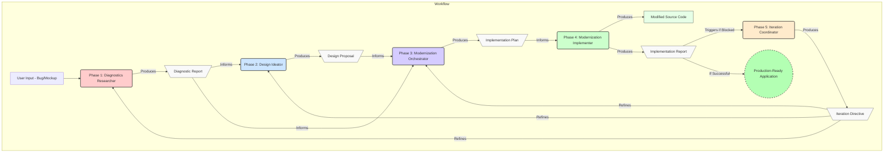

# **AI Native Development Architecture**

## **AI-Native Evolutionary Development Architecture**

### **1. Introduction & Core Philosophy**

#### **1.1. Executive Summary**

This document outlines the architecture of an AI-Native Evolutionary Development system, a 5-phase sequential workflow designed to manage software development from initial concept to production-ready application. The system is composed of five primary agents that orchestrate sixteen specialized subagents, each performing a distinct task within the workflow. The architecture's core is a linear cascade process: Diagnosis, Design, Orchestration, and Implementation, followed by an optional Iteration phase to handle refinements. It uniformly addresses all development scenarios—from building new applications based on non-functional mockups to modernizing complex existing systems—by treating every task as a continuous evolution of a system's current state. This process is enhanced by a suite of integrated, real-time tools for API verification (`Context7`), database analysis (`Supabase`), UI component discovery (`shadcn`), and web research (`Tavily`, `Exa`), ensuring that all outputs are current, feasible, and based on industry best practices. The system's output is a series of detailed artifacts—diagnostic reports, design proposals, and implementation plans—that serve as precise blueprints, maintaining a strict separation between specification and the final implementation phase.

#### **1.2. The Unifying Principle: "Continuous Evolution"**

The foundational philosophy of this architecture is the principle of "Continuous Evolution," which posits that all software development is a form of system modernization. The system fundamentally reframes the development process by treating a non-functional mockup as a system with issues to diagnose, identical in principle to a legacy application requiring an upgrade. This unifying view is based on a critical insight:

* A button that doesn't work is a bug to be diagnosed.
* An empty dashboard represents a data flow problem to be investigated.
* A missing feature is a functional gap requiring a diagnostic and design cycle.

By applying this lens, the architecture eliminates the traditional, often inefficient, distinction between greenfield and brownfield development. Every project, regardless of its starting point, is considered the "current state" of a system. The 5-phase workflow is the engine that evolves this current state to a desired future state. This approach allows for the consistent application of a robust, diagnostic-led methodology across the entire software lifecycle. The `DiagnosticsResearcher` agent embodies this by investigating all "system issues," whether they originate from a user's bug report or a blank canvas. The subsequent phases then methodically transform these diagnostic findings into tangible, production-ready code.

#### **1.3. System Goals & Principles**

The architecture is engineered to achieve specific goals through a set of unwavering operational principles.

**Primary Goals:**

* **Quality & Reliability:** The system is designed to produce high-quality, reliable software through exhaustive validation. It employs specialized agents for workflow validation (`workflow-validator`), documentation verification (`documentation-verifier`), security monitoring (`library-update-monitor`), and test coverage analysis (`test-coverage-analyzer`). An entire phase is dedicated to iterative refinement (`IterationCoordinator`) to ensure solutions converge on optimal quality.
* **Velocity & Efficiency:** The architecture heavily leverages parallel processing, with primary agents like `DesignIdeator` and `ModernizationOrchestrator` orchestrating multiple subagents simultaneously to complete complex analysis in minutes. The integration of UI component systems like `shadcn` is explicitly intended to "accelerate development".
* **Risk Mitigation:** Proactive risk management is a core function. The `ModernizationOrchestrator` acts as a "Risk Strategist," and the `library-update-monitor` is designed to be "Security-first". The workflow itself is designed to "prevent cascading failures" by catching issues at phase boundaries.

**Guiding Principles:**

* **Specification Over Implementation:** A strict boundary is maintained between the planning (Phases 1-3) and execution (Phase 4) stages. The first three primary agents are explicitly forbidden from writing or editing implementation code; their sole output is precise specifications. The `ModernizationImplementer` is designated as the "EXCLUSIVE implementation authority".
* **Evidence-Based Diagnosis:** Every finding must be supported by evidence. The `DiagnosticsResearcher`'s philosophy dictates that all conclusions must be "traceable to specific code, logs, or authoritative external sources," a principle upheld by the use of research and analysis subagents.
* **Security as Priority 0:** Security is non-negotiable and precedes all other work. The `library-update-monitor` scans for CVEs, and the `ModernizationOrchestrator`'s planning framework mandates that any discovered security vulnerabilities must be addressed before any bug fixes or feature development can begin.
* **Verification Before Action:** Assumptions are minimized by verifying information with real-time tools. The `ModernizationImplementer` must verify APIs with `Context7` before use, and the `documentation-verifier` exists to confirm the availability of components and methods specified in designs.
* **Parallel Investigation for Comprehensive Insight:** To achieve both speed and depth, primary agents orchestrate multiple specialized subagents in parallel, synthesizing their findings to form a complete, multi-faceted understanding of the system.
* **Anti-Pattern Prevention:** The system is hardwired to detect and prevent common anti-patterns, particularly the proliferation of versioned components (e.g., `-fixed`, `-v2`) and work on orphaned (unimported) code. Multiple agents are tasked with identifying these issues so that only active, base components are targeted for implementation.

### **2. The 5-Phase Modernization Workflow**

The system's architecture is built upon a linear cascade model, a sequential 5-phase workflow where the output of each phase serves as the primary input for the next. This structure ensures that context is progressively enriched and validated at each stage, transforming an initial problem statement into a production-ready solution. Each phase is governed by a distinct primary agent responsible for a specific value-adding transformation, from diagnosis to final implementation. The `workflow-validator` subagent is designed to enforce this structure, ensuring each phase meets its success criteria before allowing progression.

#### **2.2. Phase 1: Diagnosis (DiagnosticsResearcher)**

* **Primary Agent:** `DiagnosticsResearcher`.
* **Purpose:** This initial phase is dedicated to the deep investigation and root cause analysis of system issues. Its mission is to systematically reproduce problems, trace them to their fundamental causes, research known solutions, and synthesize these findings into a comprehensive report. This phase establishes the factual, evidence-based foundation for all subsequent work.
* **Inputs:** An initial problem statement, which can range from a user-reported bug with logs and screenshots to a non-functional UI mockup or a legacy system targeted for modernization.
* **Process:** The `DiagnosticsResearcher` orchestrates a parallel investigation by delegating tasks to specialized subagents such as the `codebase-analyzer`, `web-search-researcher`, and `database-schema-analyzer`. It then synthesizes the findings from these multiple streams into a unified understanding.
* **Output:** A surgical **Diagnostic Report**. This artifact, stored in `thoughts/shared/diagnostics/`, contains a precise description of all issues, their root causes with exact file and line references, validated solutions from authoritative sources, and a component activity verification (active vs. orphaned). This report is the mandatory input for Phase 2.

#### **2.3. Phase 2: Design (DesignIdeator)**

* **Primary Agent:** `DesignIdeator`.
* **Purpose:** Phase 2 translates the problems identified in the diagnostic report into tangible, world-class UI/UX solutions. It is responsible for creating a complete design vision that is both innovative and technically feasible. A key function is to produce three progressive design alternatives—**Conservative**, **Balanced**, and **Ambitious**—allowing stakeholders to make informed decisions based on clear trade-offs in timeline and risk.
* **Inputs:** The primary input is the **Diagnostic Report** from Phase 1.
* **Process:** The `DesignIdeator` orchestrates its own parallel research using subagents like `visual-design-scanner`, `component-pattern-analyzer`, `accessibility-auditor`, and `competitive-ui-analyzer`. It heavily utilizes the integrated `shadcn` toolkit to discover, verify, and select production-ready UI components from various registries, comparing them against competitor patterns and project requirements.
* **Output:** A detailed **Design Proposal**. This document, stored in `thoughts/shared/proposals/`, serves as the blueprint for implementation. It includes visual mockups, accessibility specifications, a component manifest with exact installation commands for `shadcn` components, and a risk assessment for each of the three design alternatives.

#### **2.4. Phase 3: Orchestration (ModernizationOrchestrator)**

* **Primary Agent:** `ModernizationOrchestrator`.
* **Purpose:** Acting as the central planner, this phase synthesizes the "what's wrong" from Phase 1 and the "what it should look like" from Phase 2 into a "how to build it" blueprint. It validates the technical feasibility of the chosen design, resolves all dependencies, and creates a risk-aware, prioritized implementation plan.
* **Inputs:** The **Diagnostic Report** (Phase 1), the **Design Proposal** (Phase 2), and the user's selected design alternative.
* **Process:** The `ModernizationOrchestrator` orchestrates a five-subagent parallel feasibility assessment, which includes the critical `library-update-monitor` to scan for security vulnerabilities (CVEs). It applies a strict priority framework where security patches are always Priority 0, followed by bug fixes, core design implementation, and technical enhancements.
* **Output:** A surgical **Implementation Plan**. Stored in `thoughts/shared/plans/`, this plan is the "definitive contract" for the implementation phase. It contains a prioritized task list, precise technical specifications, dependency management instructions, quality gates, and success criteria.

#### **2.5. Phase 4: Implementation (ModernizationImplementer)**

* **Primary Agent:** `ModernizationImplementer`.
* **Purpose:** This is the exclusive execution phase where the specifications from the preceding three phases are transformed into working, production-ready code. This agent is the only one in the entire workflow with the authority to write, edit, and patch source files.
* **Inputs:** The complete set of specifications: the **Diagnostic Report** (Phase 1), the **Design Proposal** (Phase 2), and the **Implementation Plan** (Phase 3).
* **Process:** The `ModernizationImplementer` executes the implementation plan task by task, adhering strictly to the established priority order. It leverages its full suite of real-time tools to enhance execution: `Context7` is used to verify APIs and handle deprecations, `shadcn` tools are used to install and integrate UI components, `Supabase` tools are used for database migrations and validation, and `Tavily`/`Exa` are used for real-time troubleshooting of implementation errors.
* **Output:** The primary output is the modified source code. A secondary artifact is the **Implementation Report**, stored in `thoughts/shared/implementations/`, which documents all changes made, tools used, and the final validation results (e.g., test coverage, build status).

#### **2.6. Phase 5: Iteration (IterationCoordinator)**

* **Primary Agent:** `IterationCoordinator`.
* **Purpose:** Phase 5 acts as an intelligent feedback loop and quality control mechanism. It is triggered only when the implementation phase (Phase 4) is blocked or fails to meet its success criteria. Its purpose is to prevent costly full-workflow restarts by orchestrating surgical, targeted re-runs of the specific upstream phase that caused the issue.
* **Inputs:** The **Implementation Report** from Phase 4, specifically any documented blockers, failures, or unmet quality gates.
* **Triggers:** The process is initiated by specific failure conditions, including "Implementation Blocked," "Design Infeasible," "Requirements Changed," or "Performance Inadequate".
* **Process:** The agent traces the implementation failure back to its root cause in a prior phase's decision-making (e.g., an infeasible design from Phase 2, an incorrect diagnosis from Phase 1). It then uses the `context-distiller` subagent to create a highly focused brief containing the accumulated learnings and coordinates a re-run of only the necessary phase. It monitors these cycles for convergence to ensure they are productive and not oscillating.
* **Output:** A refined set of specifications from the re-executed phase, which is then handed back to Phase 4 for another implementation attempt. The primary artifact is an **Iteration Directive** context package for the targeted agent.

Excellent. As recommended, I will now produce the updated version of **Section 3**, integrating the detailed technical specifications from the old document into the superior narrative structure of the new one. This creates a single, comprehensive section that details both the strategic roles and the precise operational parameters of each agent.

-----

### **3. Agent Architecture & Delegation Model**

The system operates on a hierarchical delegation model composed of two distinct tiers of AI agents: five **Primary Agents** and sixteen **Specialized Subagents**. The Primary Agents act as orchestrators, each governing one of the five workflow phases. They are responsible for high-level strategy, decision-making, and the synthesis of complex information. To execute their directives, they delegate focused, tactical tasks to the Specialized Subagents, who possess deep expertise in a single domain, such as security scanning, code analysis, or UI component discovery. This model ensures a clear separation of concerns, allowing for both strategic oversight and deep, efficient execution.

#### **3.1. Primary Agents**

The five Primary Agents are the pillars of the workflow. Each possesses a unique identity, philosophy, and set of responsibilities tailored to its phase.

**1. DiagnosticsResearcher (Phase 1: Diagnosis)**

* **Core Mission:** A systematic bug investigation specialist that orchestrates comprehensive diagnostic analysis through parallel subagent coordination. Its purpose is to reproduce issues, identify root causes, discover known solutions, and produce surgical diagnostic reports that enable perfect implementation in later phases.
* **Identity & Philosophy:** This agent operates as a "Root Cause Detective" and "Investigation Orchestrator". Its philosophy is grounded in "Evidence-Based Diagnosis," asserting that every finding must be traceable to specific code, logs, or authoritative external sources. It is explicitly **not** an implementer and maintains an absolute boundary between diagnosis and implementation.
* **Key Responsibilities:**
  * Assessing the severity and scope of system issues.
  * Orchestrating parallel investigations using subagents like `codebase-analyzer` and `web-search-researcher`.
  * Synthesizing findings into a comprehensive, structured Diagnostic Report.
* **Technical Specifications & Configuration:**
  * **Tool Access Permissions:** `bash`, `write` (reports only), `read`, `grep`, `glob`, `list`, `todowrite`, `todoread`, `webfetch`, `tavily_*`, `exa_*`, `context7_*`, `supabase_*`. **CRITICAL:** `edit: false`, `patch: false` (Cannot modify source code).
  * **Operational Parameters:**

        ```yaml
        DIAGNOSTICS_DIR: "thoughts/shared/diagnostics/"
        MAX_PARALLEL_TASKS: 3
        SEARCH_DEPTH: "comprehensive"
        REPORT_FORMAT: "diagnostic-v2"
        SEVERITY_LEVELS: ["Critical", "High", "Medium", "Low"]
        DB_INVESTIGATION_TRIGGERS: ["data integrity", "query performance", "schema mismatch", "constraint violation", "migration issue"]
        ```

**2. DesignIdeator (Phase 2: Design)**

* **Core Mission:** A world-class UI/UX proposal generator that transforms diagnostic findings into three progressive design alternatives (Conservative, Balanced, Ambitious). It synthesizes diagnostic context, design patterns, and industry trends into implementation-ready specifications.
* **Identity & Philosophy:** This agent acts as a "Design Orchestrator" and "Accessibility Champion". Its philosophy centers on "Context-Driven Design," where diagnostic findings directly shape solutions, and "Specification Over Implementation," creating detailed blueprints for flawless execution. It is explicitly **not** an implementer or a bug fixer.
* **Key Responsibilities:**
  * Orchestrating parallel design research across visual, component, and accessibility subagents.
  * Discovering and verifying available UI components using `shadcn` tools.
  * Producing a detailed Design Proposal with mockups, component specifications, and an installation manifest.
* **Technical Specifications & Configuration:**
  * **Tool Access Permissions:** `bash`, `write` (proposals only), `read`, `grep`, `glob`, `list`, `todowrite`, `todoread`, `webfetch`, `context7_*`, `shadcn_*` (all MCP tools). **CRITICAL:** `edit: false`, `patch: false`.
  * **Operational Parameters:**

        ```yaml
        PROPOSALS_DIR: "thoughts/shared/proposals/"
        DESIGN_ALTERNATIVES: 3
        TIME_ESTIMATES: ["1-2 days", "3-5 days", "1-2 weeks"]
        DESIGN_APPROACHES: ["Conservative", "Balanced", "Ambitious"]
        MOCKUP_FORMAT: "ascii"
        ```

**3. ModernizationOrchestrator (Phase 3: Orchestration)**

* **Core Mission:** The master orchestrator that synthesizes diagnostic findings (Phase 1) and design proposals (Phase 2) into a comprehensive, risk-aware implementation blueprint. It validates technical feasibility and produces a plan that enables flawless Phase 4 execution.
* **Identity & Philosophy:** It is a "Synthesis Master" and "Risk Strategist". Its philosophy is built on "Synthesis Excellence," ensuring every finding from previous phases is addressed, and "Risk-Aware Planning," which involves anticipating and mitigating issues before they arise. It is explicitly **not** an implementer or a designer.
* **Key Responsibilities:**
  * Orchestrating a five-subagent parallel feasibility assessment to validate the design.
  * Applying a strict priority framework, with security patches always taking precedence (Priority 0).
  * Generating a detailed Implementation Plan with technical specifications, dependency management, and validation strategies.
* **Technical Specifications & Configuration:**
  * **Tool Access Permissions:** `bash`, `write` (plans only), `read`, `grep`, `glob`, `list`, `todowrite`, `todoread`, `webfetch`, `tavily_*`, `context7_*`, `supabase_*`. **CRITICAL:** `edit: false`, `patch: false`.
  * **Operational Parameters:**

        ```yaml
        PLANS_DIR: "thoughts/shared/plans/"
        SYNTHESIS_DEPTH: "comprehensive"
        RISK_LEVELS: ["Critical", "High", "Medium", "Low"]
        IMPLEMENTATION_PHASES: ["Security", "Bug Fixes", "Core Design", "Enhancements", "Validation"]
        CONFIDENCE_THRESHOLD: 0.8
        MAX_PARALLEL_TASKS: 5
        ```

**4. ModernizationImplementer (Phase 4: Implementation)**

* **Core Mission:** The exclusive implementation authority that transforms the specifications from the first three phases into working, production-ready code. It is the only agent in the entire workflow with the authority to write, edit, and patch source files.
* **Identity & Philosophy:** This agent is an "Enhanced Code Surgeon" and "Component System Integrator". Its guiding philosophy is "Implementation Excellence Through Intelligence," where it combines the provided specifications with real-time knowledge from its integrated tools to achieve a perfect execution. It is explicitly **not** a replanner, feature creeper, or architecture modifier.
* **Key Responsibilities:**
  * Executing the Implementation Plan in the strict priority order established in Phase 3.
  * Using `Context7` to verify APIs, `Tavily`/`Exa` for troubleshooting, and `shadcn` tools to install and integrate UI components.
  * Performing incremental validation after each step to ensure system stability.
* **Technical Specifications & Configuration:**
  * **Tool Access Permissions:** `bash`, `write`, `read`, `grep`, `glob`, `list`, `todowrite`, `todoread`, `webfetch`, `tavily_*`, `exa_*`, `context7_*`, `supabase_*`, `shadcn_*` (with exclusive installation rights). **EXCLUSIVE:** `edit: true`, `patch: true`.
  * **Operational Parameters:**

        ```yaml
        IMPLEMENTATIONS_DIR: "thoughts/shared/implementations/"
        VALIDATION_CHECKPOINTS: ["syntax", "types", "tests", "build", "integration"]
        ROLLBACK_THRESHOLD: 3
        CONFIDENCE_LEVELS: ["Verified", "Tested", "Assumed", "Unknown"]
        SHADCN_COMPONENT_DIR: "components/ui/"
        ```

**5. IterationCoordinator (Phase 5: Iteration)**

* **Core Mission:** An intelligent feedback loop manager that orchestrates surgical re-runs of specific workflow phases when Phase 4 implementation reveals issues requiring upstream adjustments. It prevents costly full workflow restarts by managing targeted refinements with accumulated learning.
* **Identity & Philosophy:** It operates as a "Surgical Coordinator" and "Efficiency Guardian". Its philosophy is "Minimal Intervention Excellence," where the smallest change that resolves an issue is the best, and "Learning-Driven Iteration," where each cycle must incorporate lessons from previous attempts to ensure convergence. It is explicitly **not** an implementer or a replanner.
* **Key Responsibilities:**
  * Analyzing implementation reports to trace blockers back to their originating phase (1, 2, or 3).
  * Using the `context-distiller` subagent to create a focused brief for the targeted phase re-run.
  * Monitoring iteration cycles for convergence to ensure they are productive and not diverging.
* **Technical Specifications & Configuration:**
  * **Tool Access Permissions:** `bash`, `write` (reports only), `read`, `grep`, `glob`, `list`, `todowrite`, `todoread`. **CRITICAL:** `edit: false`, `patch: false`.
  * **Operational Parameters:**

        ```yaml
        ITERATIONS_DIR: "thoughts/shared/iterations/"
        MAX_ITERATIONS: 3
        ITERATION_TRIGGERS: ["Implementation Blocked", "Design Infeasible", "Requirements Changed", "Performance Inadequate"]
        CONVERGENCE_THRESHOLDS:
          improvement_rate: 0.2
          confidence_target: 0.8
          oscillation_limit: 2
        ```

#### **3.2. Specialized Subagents**

The sixteen subagents are the tactical executors, providing specialized analysis and data to the Primary Agents. They operate on a read-only basis (with the exception of their own output generation) and are orchestrated to provide the deep, focused intelligence required for each phase of the workflow.

| Subagent Name | Description | Primary Tools | Orchestrated By (Primary Agents) |
| :--- | :--- | :--- | :--- |
| **accessibility-auditor** | WCAG compliance specialist that audits for accessibility issues and provides remediation guidance. | `read`, `grep`, `glob` | `DesignIdeator`, `ModernizationOrchestrator` |
| **codebase-analyzer** | Deep code comprehension specialist for tracing execution flows, analyzing legacy implementations, and quantifying technical debt. | `read`, `grep`, `glob`, `supabase` | `DiagnosticsResearcher`, `ModernizationOrchestrator` |
| **codebase-locator** | Lightning-fast file discovery specialist with a critical focus on identifying active vs. orphaned components and anti-pattern files. | `read`, `grep`, `glob` | `DiagnosticsResearcher` |
| **codebase-pattern-finder** | Extracts working code patterns, serving error handling patterns to `DiagnosticsResearcher` and reusable architectures to `ModernizationOrchestrator`. | `read`, `grep`, `glob` | `DiagnosticsResearcher`, `ModernizationOrchestrator` |
| **competitive-ui-analyzer**| Elite competitive intelligence specialist for UI/UX patterns that maps competitor features to available `shadcn` components. | `read`, `grep`, `glob`, `tavily`, `exa`, `shadcn` | `DesignIdeator` |
| **component-pattern-analyzer**| Component architecture specialist that analyzes patterns, detects version suffixes (`-fixed`, `-v2`), and recommends `shadcn` consolidation opportunities.| `read`, `grep`, `glob`, `shadcn` | `DesignIdeator`, `ModernizationOrchestrator` |
| **context-distiller** | Context compression specialist that synthesizes multiple phase documents into focused briefs for the `IterationCoordinator`. | `read`, `grep`, `glob` | `IterationCoordinator` |
| **database-schema-analyzer**| Supabase database specialist that analyzes schema structure, identifies mismatches with code, and suggests optimizations. | `read`, `grep`, `glob`, `supabase` | `DiagnosticsResearcher`, `ModernizationOrchestrator` |
| **documentation-verifier**| Component and API verification specialist that confirms availability and compatibility using `shadcn` registries and `Context7`. | `read`, `grep`, `glob`, `context7`, `shadcn`| `DesignIdeator`, `ModernizationOrchestrator` |
| **library-update-monitor**| Security-first dependency monitor that tracks npm packages and `shadcn` components for CVEs and breaking changes. | `read`, `grep`, `glob`, `context7`, `shadcn` | `ModernizationOrchestrator` |
| **performance-profiler**| Performance bottleneck detective that identifies slow queries, render issues, and memory leaks. | `read`, `grep`, `glob`, `supabase` | `DiagnosticsResearcher`, `ModernizationOrchestrator` |
| **test-coverage-analyzer**| Testing strategy specialist that analyzes current test coverage, identifies gaps, and recommends test scenarios. | `read`, `grep`, `glob` | `ModernizationOrchestrator` |
| **ui-component-explorer**| Elite UI component discovery specialist leveraging `shadcn` registries to find production-ready components. | `read`, `grep`, `glob`, `shadcn` | `DesignIdeator` |
| **visual-design-scanner**| Visual design evaluation specialist that analyzes UI for consistency, hierarchy, spacing, and color usage. | `read`, `grep`, `glob` | `DesignIdeator` |
| **web-search-researcher**| Elite web research specialist using `Context7`, `Tavily`, and `Exa` to find bug solutions, documentation, and best practices. | `read`, `grep`, `glob`, `tavily`, `exa`, `context7`| `DiagnosticsResearcher`, `DesignIdeator`, `ModernizationOrchestrator` |
| **workflow-validator** | Quality gate enforcer that validates phase outputs against defined success criteria before allowing workflow progression. | `read`, `grep`, `glob` | System-wide Quality Gate |

### **4. Cognitive & Orchestration Patterns**

The system's effectiveness stems from a collection of standardized patterns that govern how agents analyze problems, orchestrate tasks, and ensure quality. These protocols are embedded within the agents' core logic and represent the system's "best practices" for AI-driven development.

#### **4.1. The Cognitive Model (`ULTRATHINK`)**

`ULTRATHINK` is the system's mechanism for invoking a state of enhanced cognition and deep analysis. It's not a separate agent but a directive that, when provided by the user or triggered by high complexity, modifies an agent's standard operating parameters. It allows the system to "think harder" about particularly complex or ambiguous problems.

* **Triggers:** An agent will either request `ULTRATHINK` or benefit from it when encountering specific complex scenarios. Common triggers include:
  * Synthesizing findings from multiple, conflicting sources.
  * Determining the priority order for a complex implementation plan.
  * Resolving dependency conflicts or planning a difficult database migration.
  * Analyzing the impact of an API deprecation discovered in real-time.
  * Deciding if a failed implementation requires a workflow iteration.
* **Effects:** When `ULTRATHINK` is active, an agent's analytical depth and operational parameters are increased. This includes:
  * Expanding search queries to include more results and iterations.
  * Applying stricter validation, requiring a higher number of corroborating sources before reaching a conclusion.
  * Performing deeper analysis, such as comparative trade-off matrices for design decisions or comprehensive impact assessments for dependency changes.
* **Delegation:** Primary Agents can delegate tasks with this enhanced cognitive state to their subagents, ensuring that deep analysis is performed at the tactical level where it's needed most (e.g., `Task(prompt="ultrathink: Analyze root cause...", subagent_type="codebase-analyzer")`).

#### **4.2. Investigation & Analysis Patterns**

To ensure efficiency and comprehensiveness, agents utilize several key orchestration patterns for investigation and analysis.

* **Parallel Feasibility Assessment:** This is a cornerstone pattern used by `DesignIdeator` and `ModernizationOrchestrator` to gain a holistic understanding of a design's feasibility in approximately five minutes. The orchestrating agent launches multiple, distinct subagents simultaneously, each analyzing the problem from a different perspective:
  * `documentation-verifier` checks for component and API availability.
  * `library-update-monitor` scans for security vulnerabilities (CVEs) and dependency issues.
  * `performance-profiler` assesses potential performance impacts.
  * `component-pattern-analyzer` looks for reusable patterns and anti-patterns.
  * `test-coverage-analyzer` discovers the current testing baseline.
    The findings are then synthesized by the primary agent to make a go/no-go decision.
* **Database Investigation & Validation:** When an issue involves data, agents follow a structured database-first debugging pattern. They use `Supabase` tools to query the database directly to determine if an issue lies in data storage or data transformation. This involves discovering the actual schema, comparing it to code expectations, analyzing query performance for bottlenecks, and validating data integrity.
* **`shadcn` Component Discovery & Integration:** When implementing UI, the system follows a registry-first approach. Agents like `DesignIdeator` and `ModernizationImplementer` use the `shadcn` toolkit to search available registries (`@shadcn`, `@acme`, custom) for production-ready components that match design requirements. This pattern includes dependency analysis, comparison of alternatives, and the generation of exact installation commands, significantly accelerating development by replacing custom implementation with battle-tested components.
* **Error Resolution Pattern:** When the `ModernizationImplementer` encounters an error, it follows a systematic, tool-driven resolution workflow. It first categorizes the error as either data-related or code-related. Data errors trigger a database investigation with `Supabase`. Code errors trigger a multi-platform web search using `Tavily` and `Exa` to find solutions on Stack Overflow and GitHub, with `Context7` as a fallback for official documentation.

#### **4.3. Component Anti-Pattern & Verification Protocol**

This is a critical, system-wide quality gate that prevents development effort from being wasted on dead, outdated, or problematic code. It is a mandatory first step in any analysis involving code files.

1. **Anti-Pattern Suffix Detection:** The system first scans for files with versioning suffixes that indicate repeated, failed fix attempts (e.g., `-fixed`, `-v2`, `-worldclass`, `-new`). The presence of these files is flagged as a critical warning and a sign of underlying technical debt.
2. **Orphan Detection:** For every component, the system uses `grep` to verify it is actively imported somewhere in the codebase. Components with zero imports are classified as "orphaned" and represent dead code.
3. **Redirection:** All analysis and implementation work is automatically redirected from any detected anti-pattern or orphaned files to the active, base version of the component. Agents are explicitly forbidden from modifying these problematic files.

#### **4.4. Security Priority 0 Protocol**

This protocol represents the architecture's immutable, security-first stance.

* **The Rule:** During the feasibility assessment in Phase 3, the `library-update-monitor` scans all runtime dependencies and UI components for known security vulnerabilities (CVEs) and risks like XSS.
* **The Effect:** Any discovered critical or high-severity vulnerability is immediately assigned **Priority 0**. This priority level supersedes all other tasks in the implementation plan, including bug fixes and feature development. The `ModernizationImplementer` is required to resolve all Priority 0 security issues before any other implementation work can begin. This protocol ensures that security is not an afterthought but the most critical gate in the development workflow.

### **5. Toolchain & Integrations**

The system's agents are equipped with a sophisticated suite of external tools that provide real-time data, documentation, and operational capabilities. This toolchain is critical for grounding the agents' analyses and implementations in the current reality of the web and the target codebase, rather than relying on potentially outdated training data. Each tool serves a distinct strategic purpose within the workflow.

#### **5.1. Context7**

* **Description:** A real-time API documentation and best practices retrieval tool. It allows agents to query for up-to-the-minute information on library and framework APIs, including method signatures, deprecation notices, and version-specific usage patterns.
* **Strategic Role in the Workflow:** Context7 is the system's primary mechanism for **Verification Before Action**.
  * The `ModernizationImplementer` uses it *before* writing any library-dependent code to verify that the planned implementation uses current, non-deprecated APIs. This prevents bugs and technical debt caused by API changes.
  * The `documentation-verifier` subagent relies on it to confirm the feasibility of a design, ensuring that components and methods specified in a `DesignIdeator` proposal actually exist and are compatible with the project's stack.
  * The `library-update-monitor` uses it to research the impact of breaking changes when recommending dependency updates.

#### **5.2. Tavily & Exa**

* **Description:** A duo of advanced web search APIs. Tavily excels at optimized data extraction, news, and searching community forums like Stack Overflow. Exa provides powerful semantic search capabilities, making it ideal for finding conceptual patterns and production-ready code examples on platforms like GitHub.
* **Strategic Role in the Workflow:** These tools form the system's problem-solving and research backbone.
  * **Error Resolution:** When the `ModernizationImplementer` encounters an implementation error, its first step is to query Tavily for known solutions, prioritizing authoritative community sources.
  * **Pattern Discovery:** For `DesignIdeator` and `ModernizationImplementer`, Exa is used to find real-world, production-grade implementation patterns for features or components, moving beyond basic documentation to see how they are used in practice.
  * **Competitive Intelligence:** The `competitive-ui-analyzer` subagent leverages both tools to research industry best practices and analyze how competitors solve common UI/UX challenges.

#### **5.3. Supabase Toolkit**

* **Description:** A suite of tools for direct interaction with a project's Supabase (PostgreSQL) database. This allows agents to introspect the schema, query data, and analyze performance without going through an application's API layer.
* **Strategic Role in the Workflow:** Supabase tools are the "ground truth" for all data-related issues, enabling a **Database-First Debugging** pattern.
  * **Diagnostics:** The `DiagnosticsResearcher` and `database-schema-analyzer` use the toolkit to determine if the root cause of a bug lies in the database (e.g., incorrect data, schema mismatch) or in the application code that transforms it.
  * **Schema Validation:** The `ModernizationImplementer` uses it to validate that the actual database schema matches the expectations of the code, preventing runtime errors from schema drift.
  * **Migration Planning:** The `ModernizationOrchestrator` uses it to analyze the current schema and plan safe, dependency-aware migration paths.

#### **5.4. shadcn/ui Toolkit**

* **Description:** A set of tools for discovering, installing, and managing UI components from `shadcn/ui` compatible registries. It provides a direct interface to a rich ecosystem of production-ready, accessible components.
* **Strategic Role in the Workflow:** The `shadcn` toolkit is the primary enabler for **Accelerating UI Development** and promoting consistency.
  * **Design Phase:** The `DesignIdeator` and its subagents (`ui-component-explorer`, `competitive-ui-analyzer`) use the tools to search and explore available components. This ensures that designs are based on what is actually available and installable, dramatically reducing the need for custom component development.
  * **Implementation Phase:** The `ModernizationImplementer` is the exclusive agent with the authority to use the `shadcn` tools to **install and integrate** these components directly into the codebase, managing dependencies and registry configurations as specified in the Phase 3 plan.
  * **Quality Assurance:** The `library-update-monitor` uses it to track component versions and scan for deprecations or security issues within the UI layer.

### **6. Artifact Flow & Data Model**

The system's workflow is not only defined by its agents but also by the structured artifacts they produce. These documents serve as the data model, acting as formal, stateful handoffs between phases. Each artifact is a self-contained package of specifications and context, building upon the output of the previous phase to ensure a complete and traceable line of reasoning from initial diagnosis to final implementation.

#### **6.1. Primary Artifacts**

The workflow progresses through the creation and consumption of five key documents:

1. **Diagnostic Report (Output of Phase 1)**

      * **Agent:** `DiagnosticsResearcher`
      * **Location:** `thoughts/shared/diagnostics/`
      * **Description:** This is the foundational document that provides an evidence-based analysis of the system's current state. It contains a full accounting of all diagnosed issues, their root causes with precise file and line references, validated solutions from external research, a verification of which components are active versus orphaned, and specific implementation guidance for fixes. It serves as the primary input for the Design and Orchestration phases.

2. **Design Proposal (Output of Phase 2)**

      * **Agent:** `DesignIdeator`
      * **Location:** `thoughts/shared/proposals/`
      * **Description:** This artifact translates the problems from the Diagnostic Report into a tangible design solution. It presents three distinct, progressive design alternatives (Conservative, Balanced, Ambitious) and includes visual mockups, accessibility requirements, and a risk assessment for each. Critically, it contains a detailed **`shadcn` Component Specification**, which includes an **Installation Manifest** with exact, copy-pasteable commands for installing all required UI components.

3. **Implementation Plan (Output of Phase 3)**

      * **Agent:** `ModernizationOrchestrator`
      * **Location:** `thoughts/shared/plans/`
      * **Description:** This is the "definitive contract" for the implementation phase. It synthesizes the findings from the first two phases into a single, comprehensive blueprint. The plan contains a strictly ordered **Implementation Priority** list (where security patches are always Priority 0), detailed technical specifications, a dependency management strategy, risk mitigation plans, and a complete validation strategy with success criteria.

4. **Implementation Report (Output of Phase 4)**

      * **Agent:** `ModernizationImplementer`
      * **Location:** `thoughts/shared/implementations/`
      * **Description:** This document serves as a complete audit trail of the implementation work. It provides a summary of all changes, including security patches applied, bugs fixed, and design specifications implemented. It also contains a `shadcn` Integration Report, a log of all tool assistance used during the process, and a record of any anti-patterns that were detected and handled. This report is the primary input for Phase 5 if any issues were encountered.

5. **Iteration Directive (Output of Phase 5)**

      * **Agent:** `IterationCoordinator`
      * **Location:** `thoughts/shared/iterations/`
      * **Description:** This is not a full-fledged report but a highly compressed, targeted brief. It is generated only when an implementation is blocked. The directive contains the specific focus for a phase re-run, a list of successful elements to preserve, a list of failed approaches to avoid, and the key learnings from the failed implementation attempt. It enables a surgical refinement of a specific upstream phase without restarting the entire workflow.

#### **6.2. Artifact Flow Diagram**

The following diagram illustrates the linear cascade of artifacts through the 5-phase workflow, including the feedback loop managed by the Iteration Coordinator.



### **7. Use Cases & Applicability**

The 5-phase modernization workflow is a universal model designed to handle any software development task by treating it as a form of system evolution. Whether starting with a blank slate or modifying a decades-old application, the system applies the same rigorous, diagnostic-led process. The following use cases illustrate its applicability.

#### **7.1. Greenfield Development (from a Mockup)**

This scenario applies when the starting point is a new idea, a simple wireframe, or a non-functional UI mockup.

* **Philosophical Approach:** The system treats the mockup as a "system with bugs," where the primary "bug" is the complete lack of functionality. Each non-interactive element is a functional gap requiring a diagnostic and design cycle.
* **Workflow Application:**
  * **Phase 1 (Diagnosis):** `DiagnosticsResearcher` analyzes the mockup to understand the implied requirements needed to make it functional. Its **Diagnostic Report** serves as a foundational requirements analysis, documenting all the functional gaps.
  * **Phase 2 (Design):** `DesignIdeator` takes this analysis and produces a technically feasible design, selecting appropriate `shadcn` components and defining the complete user experience.
  * **Phase 3 (Orchestration):** `ModernizationOrchestrator` creates a comprehensive **Implementation Plan** that includes project scaffolding, dependency setup, and a prioritized epic/story structure for building the application from scratch.
  * **Phase 4 (Implementation):** `ModernizationImplementer` executes the plan, building the new application feature by feature.

#### **7.2. Brownfield Modernization (Enhancing an Existing System)**

This is the classic use case, involving an existing application that requires significant upgrades, performance improvements, or refactoring.

* **Philosophical Approach:** The legacy application is treated as the "current state" of the system, which the workflow will evolve to a desired "future state."
* **Workflow Application:**
  * **Phase 1 (Diagnosis):** `DiagnosticsResearcher` performs a deep analysis of the existing codebase, using subagents like `codebase-analyzer` and `database-schema-analyzer` to quantify technical debt, find root causes for performance issues, and identify architectural anti-patterns.
  * **Phase 2 (Design):** `DesignIdeator` proposes designs that integrate seamlessly with the existing system, often recommending the replacement of bespoke legacy components with standardized `shadcn` equivalents.
  * **Phase 3 (Orchestration):** The `ModernizationOrchestrator`'s plan focuses on risk mitigation, detailing safe database migration paths, dependency update sequences, and a step-by-step implementation that minimizes disruption.
  * **Phase 4 (Implementation):** `ModernizationImplementer` carefully executes the plan, modifying the live codebase with precision.

#### **7.3. Bug Investigation & Resolution**

This use case applies when a specific defect is reported in an existing application.

* **Philosophical Approach:** This is the most direct application of the "system with issues" philosophy. The bug is the issue to be diagnosed and resolved.
* **Workflow Application:**
  * **Phase 1 (Diagnosis):** This is the primary phase. `DiagnosticsResearcher` is expertly suited for this, using its parallel investigation patterns to rapidly identify the bug's root cause and a validated solution. The resulting **Diagnostic Report** is a highly detailed bug report.
  * **Phase 2 (Design):** This phase is often minimal for simple code fixes. However, if the bug stems from a flawed user experience, `DesignIdeator` proposes a UI/UX change that not only fixes the bug but also improves overall usability.
  * **Phase 3 & 4 (Orchestration & Implementation):** The fix is planned to ensure no regressions are introduced and then implemented precisely as specified.

#### **7.4. Feature Addition & Refactoring**

This scenario covers adding new capabilities to an existing application or improving the internal structure of the code.

* **Philosophical Approach:** A missing feature is a "functional gap," and code needing refactoring is a "maintainability issue." Both are treated as problems to be diagnosed.
* **Workflow Application:**
  * **Phase 1 (Diagnosis):** For a new feature, `DiagnosticsResearcher` analyzes the best integration points and identifies potential conflicts. For refactoring, it analyzes and quantifies the existing technical debt to justify the effort.
  * **Phase 2 (Design):** `DesignIdeator` creates the full UI/UX for the new feature. For refactoring, it ensures the external-facing behavior and design remain consistent and unchanged.
  * **Phase 3 (Orchestration):** The work is broken down into a series of safe, incremental steps. For a new feature, this ensures it's built on a solid foundation; for refactoring, it ensures the changes can be made without breaking the system.
  * **Phase 4 (Implementation):** The new feature is built or the refactoring is applied according to the risk-mitigated plan.
