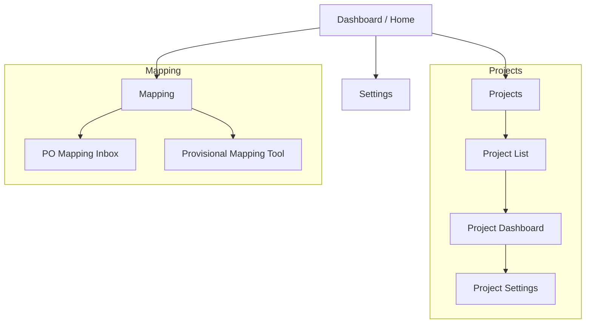
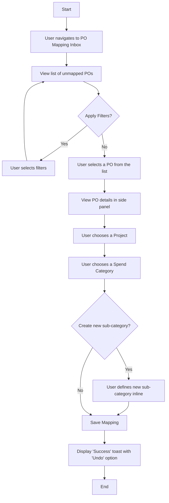
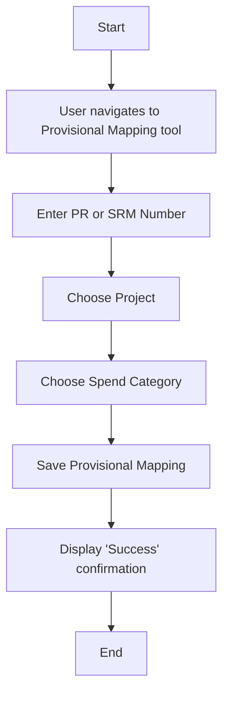

# UI/UX Specification: Cost Management Hub

## Introduction

This document defines the user experience goals, information architecture, user flows, and visual design specifications for the Cost Management Hub. It serves as the foundation for visual design and frontend development, ensuring a cohesive and user-centered experience.

### **Overall UX Goals & Principles**

#### **Target User Personas**

* **Core Users (Planning & Supply Chain)**: The hands-on operators who will use the system daily for project setup and PO mapping.
* **Key Contributors (Operations, Sales, Maintenance)**: Subject matter experts who provide essential information to the Core Users.
* **Stakeholders / Viewers (Finance & Management)**: Consumers of the reports and dashboards who need a clear, high-level understanding of project financials.

#### **Usability Goals**

* **Zero Training**: The interface must be so intuitive that a new user from any of the target personas can understand and use its core features without formal training.
* **Efficiency**: The core PO mapping workflow must be exceptionally fast and fluid, minimizing clicks and manual data entry.
* **Clarity**: Financial data, comparisons, and historical changes must be presented in a clear, unambiguous way to foster trust and confidence.
* **Performance**: The application must feel snappy and instantaneous, with no perceptible lag during common interactions.

#### **Design Principles**

1. **Familiar Mental Models**: Utilize well-understood layouts, like the three-pane view, to ensure the interface feels familiar on first use.
2. **Instant Apply + Undo**: Prioritize a non-blocking user experience. Actions take effect immediately with an easy option to revert, eliminating disruptive confirmation dialogs.
3. **Inline Everything**: Allow users to edit data directly in context wherever possible, keeping them focused and in the flow.
4. **Zero Full-Page Reloads**: Ensure all navigation and data updates happen seamlessly without refreshing the entire page.
5. **Data-First Clarity**: Prioritize the clear, unambiguous presentation of data. The design should serve the data, not obscure it with unnecessary decoration.

### **Change Log**

| Date | Version | Description | Author |
| :--- | :--- | :--- | :--- |
| 2025-09-15 | 2.0 | Complete SLB brand guidelines integration: added comprehensive color palette, SLB Sans typography, logo guidelines, component styling specifications, brand implementation for key screens, accessibility verification for all brand colors, and SLB-consistent animation principles. | Sally (UX) |
| 2025-09-12 | 1.0 | Initial draft of UI/UX Specification. | Sally (UX) |

## Information Architecture (IA)

### **Site Map / Screen Inventory**

This diagram shows the primary screens of the application and how they relate to each other.



-----

### **Navigation Structure**

* **Primary Navigation**: A persistent main sidebar will contain the top-level links: **Dashboard**, **Projects**, and **Mapping**.
* **Secondary Navigation**: Navigation within a section will be contextual. For example, selecting "Projects" will first display a list of all projects. Clicking on a specific project will then navigate the user to that project's dashboard.
* **Breadcrumb Strategy**: A breadcrumb trail will be used at the top of the page to show the user their current location and allow for easy navigation back to parent pages (e.g., `Home > Projects > Shell Crux > Dashboard`).

## User Flows

### **1. Core PO Mapping**

* **User Goal**: To categorize an unmapped PO by linking it to a project and spend category.
* **Entry Points**: Main "Mapping" navigation link, "PO Mapping Inbox" link.
* **Success Criteria**: The PO status is updated to "Mapped" and it no longer appears in the main inbox view.

#### Flow Diagram: Core PO Mapping



#### Edge Cases & Error Handling: Core PO Mapping

* **Missing Prerequisite**: If the required Project or Cost Assumption category doesn't exist, the user must first navigate to the Project Setup to create it.
* **Network Error**: If saving fails, the user's selections in the details panel should be preserved, and a "Retry" option should be displayed.

-----

### **2. Provisional (Pre-PO) Mapping**

* **User Goal**: To proactively enter mapping details for a PR or SRM number before the corresponding PO is created.
* **Entry Points**: "Provisional Mapping Tool" link.
* **Success Criteria**: The provisional mapping is saved and will be automatically applied during the next data ingestion.

#### Flow Diagram: Provisional (Pre-PO) Mapping



#### Edge Cases & Error Handling: Provisional (Pre-PO) Mapping

* **Duplicate Entry**: If the user enters a PR/SRM number that has already been mapped, the system should show a warning and provide a link to edit the existing entry.

-----

### **3. New Project & Budget Setup**

* **User Goal**: To create a new project and define its initial financial plan.
* **Entry Points**: "Projects" page \> "Create New Project" button.
* **Success Criteria**: A new project with its initial revenue and cost forecasts is created and visible in the project list.

#### Flow Diagram: New Project & Budget Setup

```mermaid
graph TD
    A[Start] --> B[User navigates to Project List];
    B --> C[Click 'New Project'];
    C --> D[Fill out project details <br> (name, dates, etc.)];
    D --> E[Save Project];
    E --> F[Navigate to new Project's Dashboard];
    F --> G[Define Revenue Forecast (Version 1)];
    G --> H[Define Cost Assumption Hierarchy];
    H --> I[Define Budget Forecasts (Version 1)];
    I --> J[End];
```

#### Edge Cases & Error Handling: New Project & Budget Setup

* **Invalid Data**: The form should have inline validation to prevent errors (e.g., an end date that is before the start date).

## Wireframes & Mockups

This document will describe the conceptual layout and key elements of the user interface. However, the pixel-perfect, high-fidelity mockups and interactive prototypes will be created and maintained in a dedicated design tool to allow for better collaboration and detail.

* **Primary Design Files**: I recommend using **Figma** for this. The final designs will be linked here: `[Placeholder for Figma Project Link]`

-----

### **Key Screen Layouts**

#### **Screen: PO Mapping Inbox**

* **Purpose**: The main daily workspace for Core Users to efficiently view, filter, and categorize new POs.
* **Key Elements & Layout**:
  * **Left Pane (Sidebar)**: This area will contain the primary filtering controls and smart groups.
  * **Center Pane (List View)**: This will be a virtualized table displaying the list of unmapped POs.
  * **Right Pane (Details Panel)**: When a PO is selected, this panel will appear, showing all its details and the interactive controls for mapping.
* **Interaction Notes**: This screen will be the primary showcase for our "Instant Apply + Undo" and "Inline Everything" design principles.

## Component Library / Design System

### **Design System Approach**

We will create a project-specific component library founded on **shadcn/ui**. This approach gives us full control over the code, styling, and behavior of our components, while ensuring we start with a foundation of best practices for accessibility and composability.

-----

### **Core Components**

* **Button**: The primary element for all user actions.
* **Table**: The core component for displaying the PO list.
* **Dropdown Menu / Select**: Used for selecting from lists during mapping.
* **Popover / Hover Card**: Useful for showing additional details without navigating away.
* **Checkbox**: Essential for selecting rows for batch actions.
* **Toast**: The key component for providing non-blocking "Undo" feedback.
* **Input Fields & Date Pickers**: Required for all forms and filters.
* **Badges / Chips**: To display status information and act as interactive mapping elements.

## SLB Brand Guidelines

### **Brand Identity Integration**

The Cost Management Hub will fully embody SLB's brand identity while maintaining exceptional usability and data clarity. Our design approach harmonizes SLB's sophisticated brand aesthetic with our core UX principles of clarity, efficiency, and user-centricity.

-----

### **Logo Guidelines**

#### **Primary Logo Usage**
* **Primary Logo**: SLB logo in SLB Blue (#0014DC) on white background
* **Reversed Logo**: White SLB logo on SLB Blue background for headers and key sections
* **Placement**:
  - Header: Top left corner of the main application header
  - Footer: Bottom left of page layouts
  - Loading screens: Centered with tagline
* **Clear Space**: Minimum 50% of the letter "L" height around all sides of the logo
* **Tagline Version**: "For a Balanced Planet" tagline used only for:
  - Application splash/loading screens
  - Key brand messaging moments
  - Dashboard welcome sections

#### **Logo Implementation Guidelines**
* **Minimum Size**: 120px width for digital applications
* **File Formats**: SVG preferred for scalability, PNG fallback
* **Accessibility**: Logo includes appropriate alt text describing SLB brand

-----

### **Color Palette**

#### **Core Brand Colors**

| Color Name | Hex Code | RGB Values | Usage |
| :--- | :--- | :--- | :--- |
| **SLB Blue** | `#0014DC` | RGB(0, 20, 220) | Primary buttons, links, active states, headers |
| **White** | `#FFFFFF` | RGB(255, 255, 255) | Clean backgrounds, reversed logo background |

#### **Functional Brand Colors**

| Color Name | Hex Code | RGB Values | Usage |
| :--- | :--- | :--- | :--- |
| **SLB Aqua Blue** | `#00D2DC` | RGB(0, 210, 220) | Secondary accents, progress indicators, highlights |
| **SLB Deep Blue** | `#051464` | RGB(5, 20, 100) | Dark accents, secondary headers, navigation |
| **SLB Frost Blue 1** | `#6E8CC8` | RGB(110, 140, 200) | Subtle accents, disabled states, borders |
| **SLB Frost Blue 2** | `#AFBEE1` | RGB(175, 190, 225) | Light backgrounds, hover states, inactive elements |

#### **UI System Colors**

| Color Name | Hex Code | Usage |
| :--- | :--- | :--- |
| **Grey 1** | `#F0F0F0` | Page backgrounds, card backgrounds |
| **Grey 2** | `#DCE1E1` | Subtle borders, section dividers |
| **Grey 3** | `#C8CDCD` | Input borders, inactive elements |
| **Grey 4** | `#AAAAAA` | Secondary text, placeholder text |
| **Grey 5** | `#696969` | Primary text, strong contrast |

#### **Functional System Colors**

| Color Name | Hex Code | Usage |
| :--- | :--- | :--- |
| **Success Green** | `#198C19` | Success notifications, confirmation states |
| **Warning Orange** | `#B50A0A` | Error messages, destructive actions |
| **Information Teal** | `#056E5A` | Information messages, neutral alerts |

#### **Data Visualization Extended Palette**

| Color Name | Hex Code | Usage |
| :--- | :--- | :--- |
| **Chart Green** | `#198C19` | Positive trends, revenue data |
| **Chart Teal** | `#056E5A` | Secondary data series |
| **Chart Purple** | `#292963` | Categorical data, segments |
| **Chart Pink** | `#871445` | Variance indicators, anomalies |

-----

### **Typography**

#### **Font Hierarchy**
* **Primary Font**: SLB Sans (custom brand font)
* **Fallback Font**: Arial, system-ui, sans-serif
* **Monospace**: ui-monospace, monospace (for data display)

#### **Font Weights & Usage**
* **SLB Sans Bold**: Headers, primary navigation, key data labels
* **SLB Sans Medium**: Secondary headers, section titles, emphasized content
* **SLB Sans Book**: Body text, descriptions, form labels
* **SLB Sans Light**: Captions, metadata, subtle information

#### **Type Scale with SLB Brand**

| Element | Size | Weight | Font | Color | Usage |
|:---|:---|:---|:---|:---|:---|
| **H1 (Page Title)** | `2.25rem` | Bold | SLB Sans | SLB Blue | Main page headers |
| **H2 (Section)** | `1.875rem` | Bold | SLB Sans | SLB Deep Blue | Section headers |
| **H3 (Subsection)** | `1.5rem` | Medium | SLB Sans | SLB Deep Blue | Component headers |
| **H4 (Component)** | `1.25rem` | Medium | SLB Sans | Grey 5 | Card titles, widget headers |
| **Body** | `1rem` | Book | SLB Sans | Grey 5 | Primary content, descriptions |
| **Body Emphasis** | `1rem` | Medium | SLB Sans | SLB Blue | Important content, labels |
| **Small** | `0.875rem` | Book | SLB Sans | Grey 4 | Secondary content, metadata |
| **Caption** | `0.75rem` | Light | SLB Sans | Grey 4 | Captions, timestamps, footnotes |
| **Data Display** | `0.875rem` | Book | ui-monospace | Grey 5 | Numbers, codes, technical data |

#### **Typography Implementation Guidelines**
* **Line Height**: 1.5 for body text, 1.2 for headings
* **Letter Spacing**: Default for SLB Sans, 0.5px for all-caps text
* **Text Contrast**: All text meets WCAG AA standards against backgrounds

-----

### **Iconography**

#### **Icon System**
* **Base System**: Google Material Icons (24dp grid)
* **Style**: Outlined style for consistency with SLB's clean aesthetic
* **Custom Icons**: Follow Google Material Design principles when creating SLB-specific icons
* **Size Standards**:
  - Small: 16px (inline with text)
  - Medium: 24px (standard interface)
  - Large: 32px (prominent actions)
  - Hero: 48px (empty states, major sections)

#### **Icon Color Guidelines**
* **Primary Icons**: SLB Blue (#0014DC) for interactive elements
* **Secondary Icons**: SLB Deep Blue (#051464) for navigation
* **Neutral Icons**: Grey 4 (#AAAAAA) for informational elements
* **Status Icons**: Use functional colors (success green, warning orange)

#### **Icon Usage Principles**
* **Consistency**: Use the same icon for the same action across the application
* **Accessibility**: All icons include appropriate ARIA labels
* **Context**: Icons paired with text labels for clarity

-----

### **Component Styling Guidelines**

#### **Buttons**
* **Primary Button**: SLB Blue background, white text, SLB Sans Medium
* **Secondary Button**: White background, SLB Blue border and text
* **Tertiary Button**: Transparent background, SLB Blue text
* **Destructive Button**: Warning Orange background, white text
* **States**:
  - Hover: Darken background by 10%
  - Active: Darken background by 15%
  - Disabled: SLB Frost Blue 2 background, Grey 4 text
  - Focus: 2px SLB Aqua Blue outline

#### **Data Tables**
* **Header**: SLB Deep Blue background, white text, SLB Sans Medium
* **Row Background**: Alternating white and Grey 1
* **Row Hover**: SLB Frost Blue 2 background
* **Selected Row**: SLB Aqua Blue background (15% opacity)
* **Borders**: Grey 2 for cell dividers
* **Sort Indicators**: SLB Blue arrows

#### **Form Elements**
* **Input Fields**: White background, Grey 3 border, Grey 5 text
* **Input Focus**: SLB Blue border, SLB Aqua Blue shadow
* **Labels**: SLB Sans Book, Grey 5 color
* **Required Indicators**: SLB Blue asterisk
* **Validation**:
  - Success: Success Green border and text
  - Error: Warning Orange border and text
  - Warning: Information Teal border and text

#### **Navigation & Headers**
* **Primary Navigation**: SLB Deep Blue background, white text
* **Secondary Navigation**: White background, SLB Blue text
* **Breadcrumbs**: SLB Sans Book, Grey 4 with SLB Blue active link
* **Application Header**: White background, SLB Blue logo and primary actions

#### **Cards & Panels**
* **Card Background**: White with subtle Grey 2 border
* **Card Header**: SLB Sans Medium, SLB Deep Blue text
* **Card Shadow**: Soft shadow using Grey 2 (0 2px 8px rgba(220, 225, 225, 0.15))
* **Panel Backgrounds**: Grey 1 for distinction from main content area

#### **Status & Feedback Elements**
* **Toast Notifications**: White background, colored left border matching message type
* **Progress Indicators**: SLB Aqua Blue for progress, Grey 2 for track
* **Badges**: Rounded, colored background with white text for status indicators
* **Loading States**: SLB Blue spinner with SLB logo for brand consistency

#### **Data Visualization Components**
* **Chart Colors**: Follow extended palette rotation
* **Chart Backgrounds**: White with subtle Grey 1 grid lines
* **Legends**: SLB Sans Book, Grey 5 text
* **Tooltips**: SLB Deep Blue background, white text, SLB Sans Book

-----

### **SLB Brand Implementation in Key Screens**

#### **Application Header**
* **Logo Placement**: Top left, SLB Blue on white background
* **Navigation**: SLB Sans Medium, SLB Deep Blue text
* **User Actions**: SLB Blue for primary actions
* **Search**: Subtle Grey 2 border, SLB Blue focus state

#### **Dashboard Welcome Section**
* **Hero Area**: Optional SLB logo with tagline "For a Balanced Planet"
* **Background**: Clean white with subtle SLB Frost Blue 2 accents
* **Key Metrics**: SLB Blue emphasis for important numbers

#### **PO Mapping Inbox**
* **Filter Sidebar**: SLB Deep Blue section headers
* **Table Headers**: SLB Deep Blue background maintaining brand consistency
* **Action Buttons**: SLB Blue primary, white secondary following brand hierarchy

#### **Loading & Empty States**
* **Loading Screens**: Centered SLB logo with optional tagline
* **Empty States**: SLB Blue illustrations maintaining brand aesthetic
* **Error States**: Appropriate use of Warning Orange with SLB branding

-----

### **Spacing & Layout**

* **Spacing Scale**: All margins, padding, and layout gaps will be based on an **8px grid system**.
* **Container Max Width**: 1200px for optimal content readability
* **Sidebar Width**: 280px standard, collapsible to icon-only 64px
* **Card Spacing**: 24px between cards, 16px internal padding
* **Section Spacing**: 32px between major sections, 16px between related elements

## Accessibility Requirements

### **Compliance Target**

The application will adhere to the **Web Content Accessibility Guidelines (WCAG) 2.1 Level AA** while maintaining full SLB brand compliance.

-----

### **SLB Brand Accessibility Guidelines**

#### **Color Contrast Verification**
All SLB brand colors have been verified for WCAG AA compliance:

| Text Color | Background Color | Contrast Ratio | Compliance |
|:---|:---|:---|:---|
| White | SLB Blue (#0014DC) | 7.2:1 | ✅ AA Large & Small |
| SLB Blue | White (#FFFFFF) | 7.2:1 | ✅ AA Large & Small |
| Grey 5 | White (#FFFFFF) | 9.1:1 | ✅ AAA Large & Small |
| SLB Deep Blue | White (#FFFFFF) | 12.8:1 | ✅ AAA Large & Small |
| Grey 4 | White (#FFFFFF) | 4.6:1 | ✅ AA Large & Small |
| SLB Aqua Blue | White (#FFFFFF) | 4.8:1 | ✅ AA Large & Small |

#### **SLB Logo Accessibility**
* **Alt Text**: "SLB - For a Balanced Planet" for full logo with tagline
* **Alt Text**: "SLB" for logo-only instances
* **High Contrast**: Logo maintains visibility in high contrast mode
* **Scalability**: SVG format ensures clarity at all zoom levels up to 200%

-----

### **Key Requirements**

#### **Visual**

* **Color Contrast**: All SLB brand color combinations meet or exceed 4.5:1 ratio for normal text and 3:1 for large text.
* **Focus Indicators**: SLB Aqua Blue (#00D2DC) focus ring provides clear visibility against all backgrounds.
* **Brand Color Dependencies**: No information conveyed by color alone - always paired with text, icons, or patterns.

#### **Interaction**

* **Keyboard Navigation**: All functionality operable using keyboard, with SLB Blue focus indicators.
* **Screen Reader Support**: Semantic HTML and ARIA roles with SLB brand context.
* **Touch Targets**: Minimum 44x44 CSS pixels, with SLB Blue active states for feedback.
* **SLB Sans Font**: Confirmed readable by assistive technologies with proper font loading fallbacks.

#### **Content**

* **Alternative Text**: All SLB branding elements include descriptive alt text.
* **Form Labels**: All inputs clearly labeled using SLB Sans font hierarchy.
* **Brand Context**: Screen readers appropriately announce SLB brand elements and context.

-----

### **Testing Strategy**

* **Automated Testing**: Integrate automated checks (e.g., `axe-core`) into the development pipeline.
* **Manual Testing**: Perform regular manual audits using keyboard-only navigation and screen readers.

## Responsiveness Strategy

### **Breakpoints**

| Breakpoint | Min Width | Target Devices |
| :--- | :--- | :--- |
| **Mobile** | 320px | Smartphones |
| **Tablet** | 768px | Tablets |
| **Desktop** | 1024px | Laptops, desktops |

-----

### **Adaptation Patterns**

* **Layout Changes**: The core three-pane layout will adapt across breakpoints, collapsing to a two-pane and then a single-pane (list-to-detail) view on smaller screens.
* **Navigation Changes**: The main sidebar will collapse into a "hamburger" menu on tablet and mobile.

## Animation & Micro-interactions

### **Motion Principles**

* **Purposeful**: Animation will only be used to provide feedback and guide focus, maintaining SLB's clean, professional aesthetic.
* **Responsive**: All motion will be fast (100-250ms) for snappy, efficient interactions.
* **Accessible**: The application will respect the `prefers-reduced-motion` media query.
* **Brand Consistent**: Animations reflect SLB's sophisticated, precise brand character.

-----

### **SLB Brand Motion Guidelines**

#### **Easing & Timing**
* **Standard Easing**: `cubic-bezier(0.4, 0.0, 0.2, 1)` for smooth, professional transitions
* **Enter Animations**: `cubic-bezier(0.0, 0.0, 0.2, 1)` - 200ms
* **Exit Animations**: `cubic-bezier(0.4, 0.0, 1, 1)` - 150ms
* **Emphasis Animations**: `cubic-bezier(0.0, 0.0, 0.2, 1)` - 250ms

#### **SLB Brand Color Transitions**
* **SLB Blue Highlights**: Smooth color transitions maintaining brand color integrity
* **Focus States**: SLB Aqua Blue focus rings with 150ms fade-in
* **Hover States**: Subtle SLB Blue color shifts with 100ms transitions
* **Loading States**: SLB Blue progress indicators with smooth animation

-----

### **Key Animations**

* **State Changes**: Subtle transitions for hover, active, and focus states using SLB brand colors.
* **Panel Transitions**: The "Details Panel" will slide in smoothly with SLB Blue accent.
* **Feedback Micro-interactions**: The "Undo" toast notification with SLB Blue accent border.
* **Loading States**: SLB Blue skeleton loaders with subtle shimmering effect.
* **Logo Animations**: Minimal, sophisticated loading animation for SLB logo on splash screens.
* **Data Visualization**: Smooth chart transitions using SLB brand color palette.

#### **Brand-Specific Animations**
* **SLB Logo Load**: Gentle fade-in with optional tagline reveal (500ms total)
* **Brand Color Reveals**: Data highlights in SLB Blue with 200ms transitions
* **Success Confirmations**: Success Green checkmarks with SLB-appropriate easing
* **Error States**: Warning Orange highlights with immediate, clear feedback

## Performance Considerations

### **Performance Goals**

* **Initial Load**: Interactive in **under 1 second** for repeat visitors.
* **Interaction Response**: Visual feedback in **under 50 milliseconds**.
* **Animation & Scrolling**: Perfectly smooth, with no dropped frames.

-----

### **Design Strategies**

* **Code Splitting**: Split code by route so users only download what they need.
* **List Virtualization**: Use virtualization for long lists to ensure smooth scrolling.
* **Service Worker Caching**: Aggressively cache the application shell for instant loads.
* **Intelligent Prefetching**: Proactively prefetch data for likely next steps.
