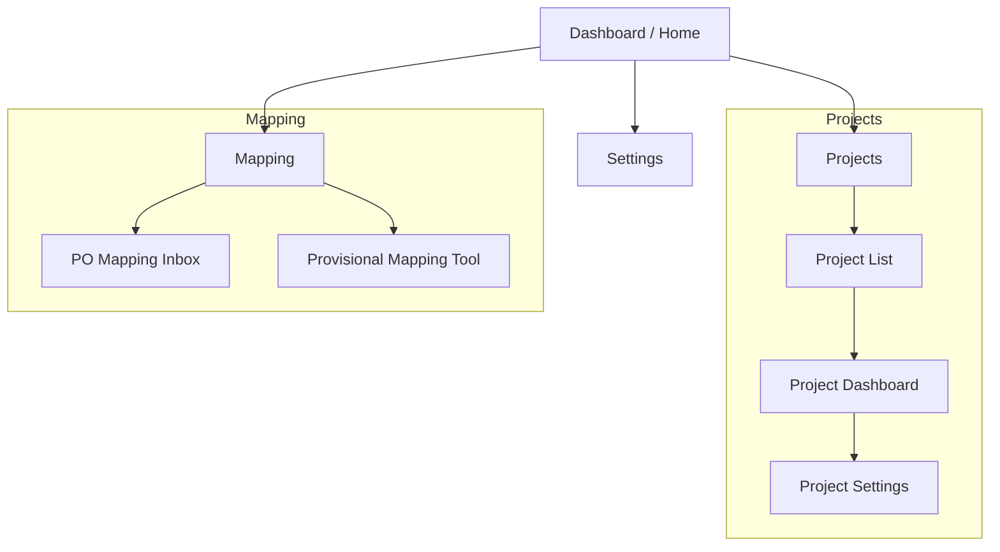
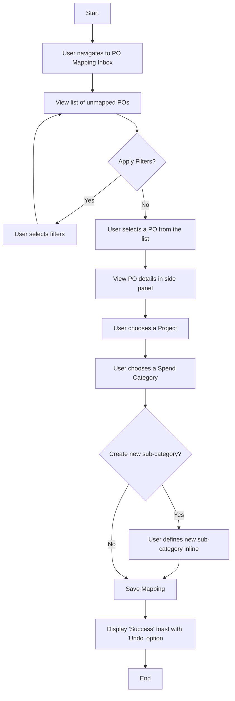
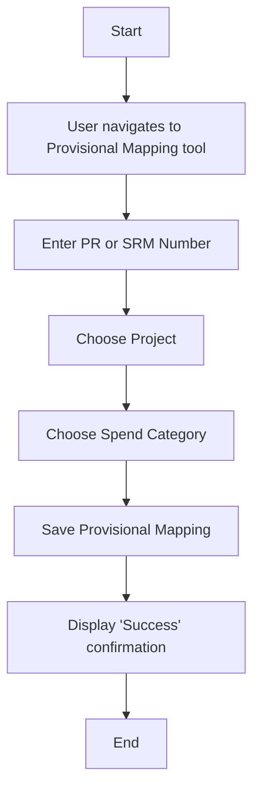

# UI/UX Specification: Cost Management Hub

## Introduction

This document defines the user experience goals, information architecture, user flows, and visual design specifications for the Cost Management Hub. It serves as the foundation for visual design and frontend development, ensuring a cohesive and user-centered experience.

### **Overall UX Goals & Principles**

#### **Target User Personas**

* **Core Users (Planning & Supply Chain)**: The hands-on operators who will use the system daily for project setup and PO mapping.
* **Key Contributors (Operations, Sales, Maintenance)**: Subject matter experts who provide essential information to the Core Users.
* **Stakeholders / Viewers (Finance & Management)**: Consumers of the reports and dashboards who need a clear, high-level understanding of project financials.

#### **Usability Goals**

* **Zero Training**: The interface must be so intuitive that a new user from any of the target personas can understand and use its core features without formal training.
* **Efficiency**: The core PO mapping workflow must be exceptionally fast and fluid, minimizing clicks and manual data entry.
* **Clarity**: Financial data, comparisons, and historical changes must be presented in a clear, unambiguous way to foster trust and confidence.
* **Performance**: The application must feel snappy and instantaneous, with no perceptible lag during common interactions.

#### **Design Principles**

1. **Familiar Mental Models**: Utilize well-understood layouts, like the three-pane view, to ensure the interface feels familiar on first use.
2. **Instant Apply + Undo**: Prioritize a non-blocking user experience. Actions take effect immediately with an easy option to revert, eliminating disruptive confirmation dialogs.
3. **Inline Everything**: Allow users to edit data directly in context wherever possible, keeping them focused and in the flow.
4. **Zero Full-Page Reloads**: Ensure all navigation and data updates happen seamlessly without refreshing the entire page.
5. **Data-First Clarity**: Prioritize the clear, unambiguous presentation of data. The design should serve the data, not obscure it with unnecessary decoration.

### **Change Log**

| Date | Version | Description | Author |
| :--- | :--- | :--- | :--- |
| 2025-09-12 | 1.0 | Initial draft of UI/UX Specification. | Sally (UX) |

## Information Architecture (IA)

### **Site Map / Screen Inventory**

This diagram shows the primary screens of the application and how they relate to each other.

```mermaid
graph TD
    A[Dashboard / Home] --> B[Projects];
    A --> C[Mapping];
    A --> D[Settings];

    subgraph Projects
        B --> B1[Project List];
        B1 --> B2[Project Dashboard];
        B2 --> B3[Project Settings];
    end

    subgraph Mapping
        C --> C1[PO Mapping Inbox];
        C --> C2[Provisional Mapping Tool];
    end
```

-----

### **Navigation Structure**

* **Primary Navigation**: A persistent main sidebar will contain the top-level links: **Dashboard**, **Projects**, and **Mapping**.
* **Secondary Navigation**: Navigation within a section will be contextual. For example, selecting "Projects" will first display a list of all projects. Clicking on a specific project will then navigate the user to that project's dashboard.
* **Breadcrumb Strategy**: A breadcrumb trail will be used at the top of the page to show the user their current location and allow for easy navigation back to parent pages (e.g., `Home > Projects > Shell Crux > Dashboard`).

## User Flows

### **1. Core PO Mapping**

* **User Goal**: To categorize an unmapped PO by linking it to a project and spend category.
* **Entry Points**: Main "Mapping" navigation link, "PO Mapping Inbox" link.
* **Success Criteria**: The PO status is updated to "Mapped" and it no longer appears in the main inbox view.

#### Flow Diagram: Core PO Mapping

```mermaid
graph TD
    A[Start] --> B[User navigates to PO Mapping Inbox];
    B --> C[View list of unmapped POs];
    C --> D{Apply Filters?};
    D -- Yes --> E[User selects filters];
    E --> C;
    D -- No --> F[User selects a PO from the list];
    F --> G[View PO details in side panel];
    G --> H[User chooses a Project];
    H --> I[User chooses a Spend Category];
    I --> J{Create new sub-category?};
    J -- Yes --> K[User defines new sub-category inline];
    K --> L[Save Mapping];
    J -- No --> L;
    L --> M[Display 'Success' toast with 'Undo' option];
    M --> N[End];
```

#### Edge Cases & Error Handling: Core PO Mapping

* **Missing Prerequisite**: If the required Project or Cost Assumption category doesn't exist, the user must first navigate to the Project Setup to create it.
* **Network Error**: If saving fails, the user's selections in the details panel should be preserved, and a "Retry" option should be displayed.

-----

### **2. Provisional (Pre-PO) Mapping**

* **User Goal**: To proactively enter mapping details for a PR or SRM number before the corresponding PO is created.
* **Entry Points**: "Provisional Mapping Tool" link.
* **Success Criteria**: The provisional mapping is saved and will be automatically applied during the next data ingestion.

#### Flow Diagram: Provisional (Pre-PO) Mapping

```mermaid
graph TD
    A[Start] --> B[User navigates to Provisional Mapping tool];
    B --> C[Enter PR or SRM Number];
    C --> D[Choose Project];
    D --> E[Choose Spend Category];
    E --> F[Save Provisional Mapping];
    F --> G[Display 'Success' confirmation];
    G --> H[End];
```

#### Edge Cases & Error Handling: Provisional (Pre-PO) Mapping

* **Duplicate Entry**: If the user enters a PR/SRM number that has already been mapped, the system should show a warning and provide a link to edit the existing entry.

-----

### **3. New Project & Budget Setup**

* **User Goal**: To create a new project and define its initial financial plan.
* **Entry Points**: "Projects" page \> "Create New Project" button.
* **Success Criteria**: A new project with its initial revenue and cost forecasts is created and visible in the project list.

#### Flow Diagram: New Project & Budget Setup

```mermaid
graph TD
    A[Start] --> B[User navigates to Project List];
    B --> C[Click 'New Project'];
    C --> D[Fill out project details <br> (name, dates, etc.)];
    D --> E[Save Project];
    E --> F[Navigate to new Project's Dashboard];
    F --> G[Define Revenue Forecast (Version 1)];
    G --> H[Define Cost Assumption Hierarchy];
    H --> I[Define Budget Forecasts (Version 1)];
    I --> J[End];
```

#### Edge Cases & Error Handling: New Project & Budget Setup

* **Invalid Data**: The form should have inline validation to prevent errors (e.g., an end date that is before the start date).

## Wireframes & Mockups

This document will describe the conceptual layout and key elements of the user interface. However, the pixel-perfect, high-fidelity mockups and interactive prototypes will be created and maintained in a dedicated design tool to allow for better collaboration and detail.

* **Primary Design Files**: I recommend using **Figma** for this. The final designs will be linked here: `[Placeholder for Figma Project Link]`

-----

### **Key Screen Layouts**

#### **Screen: PO Mapping Inbox**

* **Purpose**: The main daily workspace for Core Users to efficiently view, filter, and categorize new POs.
* **Key Elements & Layout**:
  * **Left Pane (Sidebar)**: This area will contain the primary filtering controls and smart groups.
  * **Center Pane (List View)**: This will be a virtualized table displaying the list of unmapped POs.
  * **Right Pane (Details Panel)**: When a PO is selected, this panel will appear, showing all its details and the interactive controls for mapping.
* **Interaction Notes**: This screen will be the primary showcase for our "Instant Apply + Undo" and "Inline Everything" design principles.

## Component Library / Design System

### **Design System Approach**

We will create a project-specific component library founded on **shadcn/ui**. This approach gives us full control over the code, styling, and behavior of our components, while ensuring we start with a foundation of best practices for accessibility and composability.

-----

### **Core Components**

* **Button**: The primary element for all user actions.
* **Table**: The core component for displaying the PO list.
* **Dropdown Menu / Select**: Used for selecting from lists during mapping.
* **Popover / Hover Card**: Useful for showing additional details without navigating away.
* **Checkbox**: Essential for selecting rows for batch actions.
* **Toast**: The key component for providing non-blocking "Undo" feedback.
* **Input Fields & Date Pickers**: Required for all forms and filters.
* **Badges / Chips**: To display status information and act as interactive mapping elements.

## Branding & Style Guide

### **Visual Identity**

The initial visual identity will be minimal and professional, prioritizing usability and data clarity.

-----

### **Color Palette**

| Color Type | Hex Code (Example) | Usage |
| :--- | :--- | :--- |
| **Primary/Accent** | `#3b82f6` | Buttons, links, active states |
| **Success** | `#22c55e` | Success notifications |
| **Warning** | `#f59e0b` | Non-critical alerts |
| **Error / Destructive**| `#ef4444` | Error messages, delete actions |
| **Neutral (Text)** | `#0f172a` | Main body text, headings |
| **Neutral (Borders)** | `#e2e8f0` | Borders, dividers |
| **Neutral (Background)**| `#f8fafc` | Page and component backgrounds |

-----

### **Typography**

* **Font Family (Sans-serif)**: `system-ui, sans-serif`
* **Font Family (Monospace)**: `ui-monospace, monospace`

#### **Type Scale**

| Element | Size | Weight |
|:---|:---|:---|
| H1 | `2.25rem` | Bold |
| H2 | `1.875rem` | Bold |
| H3 | `1.5rem` | Semi-Bold |
| Body | `1rem` | Normal |
| Small | `0.875rem` | Normal |

-----

### **Iconography**

* **Icon Library**: We will use **Lucide Icons**.

-----

### **Spacing & Layout**

* **Spacing Scale**: All margins, padding, and layout gaps will be based on an **8px grid system**.

## Accessibility Requirements

### **Compliance Target**

The application will adhere to the **Web Content Accessibility Guidelines (WCAG) 2.1 Level AA**.

-----

### **Key Requirements**

#### **Visual**

* **Color Contrast**: Must meet the 4.5:1 ratio for normal text.
* **Focus Indicators**: All interactive elements must have a clearly visible focus state.

#### **Interaction**

* **Keyboard Navigation**: All functionality must be operable using only a keyboard.
* **Screen Reader Support**: Use semantic HTML and ARIA roles.
* **Touch Targets**: Minimum target size of 44x44 CSS pixels.

#### **Content**

* **Alternative Text**: All meaningful images must have descriptive `alt` text.
* **Form Labels**: All form inputs will have clearly associated labels.

-----

### **Testing Strategy**

* **Automated Testing**: Integrate automated checks (e.g., `axe-core`) into the development pipeline.
* **Manual Testing**: Perform regular manual audits using keyboard-only navigation and screen readers.

## Responsiveness Strategy

### **Breakpoints**

| Breakpoint | Min Width | Target Devices |
| :--- | :--- | :--- |
| **Mobile** | 320px | Smartphones |
| **Tablet** | 768px | Tablets |
| **Desktop** | 1024px | Laptops, desktops |

-----

### **Adaptation Patterns**

* **Layout Changes**: The core three-pane layout will adapt across breakpoints, collapsing to a two-pane and then a single-pane (list-to-detail) view on smaller screens.
* **Navigation Changes**: The main sidebar will collapse into a "hamburger" menu on tablet and mobile.

## Animation & Micro-interactions

### **Motion Principles**

* **Purposeful**: Animation will only be used to provide feedback and guide focus.
* **Responsive**: All motion will be fast (100-250ms).
* **Accessible**: The application will respect the `prefers-reduced-motion` media query.

-----

### **Key Animations**

* **State Changes**: Subtle transitions for hover, active, and focus states.
* **Panel Transitions**: The "Details Panel" will slide in smoothly.
* **Feedback Micro-interactions**: The "Undo" toast notification will slide in and out.
* **Loading States**: Use subtle skeleton loaders with a shimmering effect.

## Performance Considerations

### **Performance Goals**

* **Initial Load**: Interactive in **under 1 second** for repeat visitors.
* **Interaction Response**: Visual feedback in **under 50 milliseconds**.
* **Animation & Scrolling**: Perfectly smooth, with no dropped frames.

-----

### **Design Strategies**

* **Code Splitting**: Split code by route so users only download what they need.
* **List Virtualization**: Use virtualization for long lists to ensure smooth scrolling.
* **Service Worker Caching**: Aggressively cache the application shell for instant loads.
* **Intelligent Prefetching**: Proactively prefetch data for likely next steps.
