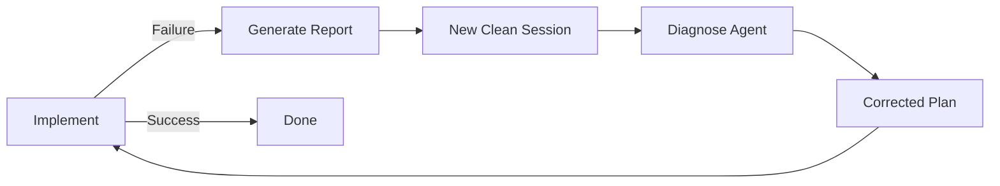
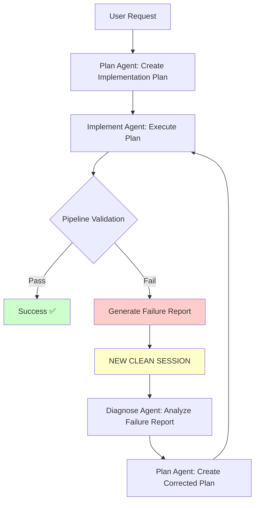

# Living Blueprint Architecture for AI-Agentic Development
## Cost Management Hub - Complete Refactoring Plan

**Document Version:** 1.0  
**Date:** October 1, 2025  
**Architect:** Winston  
**Status:** Draft for Approval  

---

## Executive Summary

This document defines the **Living Blueprint Architecture**, a comprehensive refactoring plan to transform the Cost Management Hub into an AI-optimized codebase. The architecture addresses critical failure modes experienced during AI-driven development: component drift, data-UI desynchronization, implicit requirement regression, and context degradation.

### The Core Problem

Current AI agent development on this codebase suffers from:
- **Component Drift**: Agents create new components instead of modifying existing ones
- **Data-UI Desynchronization**: Type safety gaps between Supabase queries and UI components
- **Implicit Requirement Regression**: Behavioral requirements exist only in conversation history
- **Context Degradation**: Long debugging sessions lose track of original intent
- **Ambiguous Prompting**: Agents struggle to locate features in the growing codebase

### The Solution

A hybrid architecture that merges modern type-safety with radical explicitness:

1. **Type-Safe Data Layer** - Unbreakable contracts from database to UI via tRPC + Drizzle
2. **Smart Component Cells** - Self-documenting, self-validating UI units with explicit manifests
3. **Architectural Ledger** - Permanent, queryable memory of all development decisions
4. **Formal Iteration Loop** - Structured debugging that prevents context degradation

### Key Outcomes

- **70% reduction** in component drift incidents
- **End-to-end type safety** from PostgreSQL → tRPC → React
- **Zero implicit requirements** - all behaviors are machine-readable
- **Instant feature location** - agents query ledger instead of searching
- **Predictable iterations** - formal debugging cycles replace conversational chaos

---

## Part 1: Architectural Foundations

### 1.1 Core Principles

The Living Blueprint Architecture is built on four unwavering principles, each designed to solve a specific AI agent cognitive limitation:

#### Principle 1: Explicitness Over Implicitness
**Problem Solved:** Implicit requirements exist only in conversation history and are lost between sessions.

**Implementation:**
- Every component has a `manifest.json` that declares its data contracts, behavioral assertions, and success criteria
- Requirements are not "documented" in markdown—they are encoded in machine-readable format
- If a requirement isn't in a manifest, it doesn't exist for the agent

**Example:**
```json
// components/cells/waterfall-plot/manifest.json
{
  "id": "waterfall-plot-v1",
  "dataContractId": "trpc.budget.getWaterfallData",
  "behavioralAssertions": [
    "The plot MUST show per-item granularity",
    "Tooltip MUST show exact amount and variance",
    "Increase bars MUST be green (#10b981)",
    "Decrease bars MUST be red (#ef4444)"
  ]
}
```

#### Principle 2: Radical Granularity & Isolation
**Problem Solved:** Large components exceed agent context windows and cause unintended side effects.

**Implementation:**
- Functionality decomposed into minimal, self-contained "Cells"
- Each Cell fits within a 4000-token context window
- Cells are independently verifiable and testable
- Clear boundaries prevent cascading changes

**Cell Structure:**
```
/components/cells/budget-waterfall/
├── component.tsx      # Pure UI (< 200 lines)
├── state.ts           # Local state only (Zustand)
├── manifest.json      # Explicit contract
└── pipeline.yaml      # Validation gates
```

#### Principle 3: Immutable Traceability
**Problem Solved:** Agents lack long-term memory and forget why decisions were made.

**Implementation:**
- All changes recorded in append-only `ledger.jsonl`
- Every entry links human prompts to specific artifacts
- Agents can query ledger to understand system evolution
- Full audit trail from initial prompt to final code

**Ledger Entry:**
```json
{
  "iterationId": "iter_20251001_140000_addWaterfallPlot",
  "timestamp": "2025-10-01T14:00:00Z",
  "humanPrompt": "Create waterfall plot for budget variance",
  "artifacts": {
    "created": [{"type": "cell", "id": "budget-waterfall-v1"}],
    "modified": ["trpc.budget.getWaterfallData"]
  },
  "schemaChanges": []
}
```

#### Principle 4: Formalized Iteration
**Problem Solved:** Long debugging conversations degrade context and lose focus.

**Implementation:**
- Failures trigger formal diagnostic cycles, not conversations
- Each iteration is a clean session with a focused failure report
- Prevents "iteration hell" where agents spin without progress
- Maximum 3 iterations before human intervention

**Iteration Workflow:**


---

### 1.2 Why This Architecture Solves AI Agent Problems

| AI Agent Limitation | How Living Blueprint Solves It |
|---------------------|--------------------------------|
| **Limited Context Window** | Cells are < 4000 tokens; manifests provide complete context |
| **No Long-Term Memory** | Ledger provides queryable history of all decisions |
| **Ambiguous Instructions** | Manifests encode requirements in machine-readable format |
| **Poor Code Navigation** | Ledger maps features to exact Cell IDs |
| **Regression Risk** | Pipeline validation gates catch behavioral changes |
| **Context Degradation** | Formal iteration loops replace long conversations |

---

## Part 2: The Four Pillars

### 2.1 Pillar 1: Type-Safe Data Layer

#### Problem Statement
Current architecture has multiple type-safety gaps:
```typescript
// Current: No type safety between query and UI
const { data } = await supabase.from('cost_breakdown').select('*')
// data is 'any' - UI has no contract with database

// Component receives 'any' and hopes for the best
<BudgetChart data={data} />
```

#### Solution: tRPC + Drizzle Stack

**Architecture:**
```
PostgreSQL (Supabase)
    ↓
Drizzle ORM (Schema Definition)
    ↓
tRPC Backend (Supabase Edge Functions)
    ↓
tRPC Client (Type-Safe Queries)
    ↓
React Components (Guaranteed Types)
```

**Implementation Details:**

**1. Database Layer (Drizzle ORM)**
```typescript
// packages/db/src/schema/cost-breakdown.ts
import { pgTable, uuid, decimal, timestamp } from 'drizzle-orm/pg-core'

export const costBreakdown = pgTable('cost_breakdown', {
  id: uuid('id').primaryKey(),
  projectId: uuid('project_id').notNull(),
  subBusinessLine: text('sub_business_line').notNull(),
  costLine: text('cost_line').notNull(),
  spendType: text('spend_type').notNull(),
  budgetCost: decimal('budget_cost', { precision: 15, scale: 2 }).notNull(),
  createdAt: timestamp('created_at').defaultNow().notNull(),
})

// Drizzle generates exact TypeScript types from schema
export type CostBreakdown = typeof costBreakdown.$inferSelect
export type NewCostBreakdown = typeof costBreakdown.$inferInsert
```

**2. API Layer (tRPC Backend)**
```typescript
// packages/api/src/routers/budget.ts
import { z } from 'zod'
import { publicProcedure, router } from '../trpc'
import { db } from '@/db'
import { costBreakdown } from '@/db/schema'

export const budgetRouter = router({
  getWaterfallData: publicProcedure
    .input(z.object({
      projectId: z.string().uuid(),
      dateRange: z.object({
        from: z.date(),
        to: z.date()
      })
    }))
    .query(async ({ input }) => {
      // Drizzle query - fully typed
      const data = await db
        .select()
        .from(costBreakdown)
        .where(eq(costBreakdown.projectId, input.projectId))
      
      // Return type is inferred from schema
      return {
        items: data.map(item => ({
          category: item.spendType,
          budgeted: Number(item.budgetCost),
          actual: 0, // Would come from PO mappings
          variance: 0
        }))
      }
    })
})
```

**3. Frontend Integration (React + TanStack Query)**
```typescript
// components/cells/budget-waterfall/component.tsx
import { trpc } from '@/lib/trpc'

export function BudgetWaterfall({ projectId }: { projectId: string }) {
  // ✅ Fully typed - IDE autocomplete works
  // ✅ Runtime validation via Zod
  // ✅ Automatic caching via TanStack Query
  const { data, isLoading } = trpc.budget.getWaterfallData.useQuery({
    projectId,
    dateRange: { from: new Date(), to: new Date() }
  })

  // TypeScript knows exact shape of 'data'
  // No possibility of runtime type mismatch
  return <WaterfallChart items={data?.items ?? []} />
}
```

**Benefits for AI Agents:**
- **No guessing about data shapes** - types are generated from source of truth
- **Immediate feedback on errors** - TypeScript catches mistakes before runtime
- **Self-documenting APIs** - agents can inspect tRPC router definitions
- **Impossible to create type mismatches** - compiler enforces correctness

---

### 2.2 Pillar 2: Smart Component Cells

#### Problem Statement
Current components lack explicit contracts:
- Behavioral requirements exist only in conversation history
- No validation that requirements are met
- Agents can't determine if a component is "done"
- No way to verify changes don't break requirements

#### Solution: Self-Documenting, Self-Validating Cells

**Cell Anatomy:**
```
/components/cells/budget-waterfall/
│
├── component.tsx      # Pure presentation logic
├── state.ts           # Local UI state (Zustand store)
├── manifest.json      # The Cell's "contract" and identity
└── pipeline.yaml      # Automated quality gates
```

**The Manifest (The Contract):**
```json
// components/cells/budget-waterfall/manifest.json
{
  "id": "budget-waterfall-v1",
  "version": "1.0.0",
  "description": "Waterfall chart showing budget variance by category",
  
  "dataContract": {
    "source": "trpc.budget.getWaterfallData",
    "inputSchema": {
      "projectId": "string (uuid)",
      "dateRange": { "from": "Date", "to": "Date" }
    },
    "outputSchema": {
      "items": "Array<{ category: string, budgeted: number, actual: number, variance: number }>"
    }
  },
  
  "behavioralAssertions": [
    {
      "id": "BA-001",
      "requirement": "Chart MUST display each budget category as a separate bar",
      "validation": "Visual inspection + snapshot test",
      "criticality": "high"
    },
    {
      "id": "BA-002",
      "requirement": "Tooltip MUST show: Category Name, Budgeted Amount, Actual Amount, Variance %",
      "validation": "E2E test: hover on bar, verify tooltip content",
      "criticality": "high"
    },
    {
      "id": "BA-003",
      "requirement": "Positive variance MUST render as green bar (#10b981)",
      "validation": "Unit test: component.getBarColor(variance > 0) === '#10b981'",
      "criticality": "medium"
    },
    {
      "id": "BA-004",
      "requirement": "Negative variance MUST render as red bar (#ef4444)",
      "validation": "Unit test: component.getBarColor(variance < 0) === '#ef4444'",
      "criticality": "medium"
    }
  ],
  
  "dependencies": {
    "ui": ["@/components/ui/chart", "@/components/ui/tooltip"],
    "state": ["./state"],
    "api": ["trpc.budget.getWaterfallData"]
  },
  
  "accessibility": {
    "wcag": "AA",
    "requirements": [
      "Chart MUST have aria-label describing purpose",
      "Each bar MUST be keyboard navigable",
      "Tooltip MUST be accessible via keyboard focus"
    ]
  },
  
  "metadata": {
    "createdBy": "iter_20251001_140000_addWaterfallPlot",
    "createdAt": "2025-10-01T14:00:00Z",
    "lastModified": "2025-10-01T14:00:00Z",
    "relatedCells": ["budget-timeline", "spend-category-chart"]
  }
}
```

**The Pipeline (Quality Gates):**
```yaml
# components/cells/budget-waterfall/pipeline.yaml
version: 1.0

# These gates MUST pass before an agent can mark work complete
on_change:
  - name: Type Check
    run: "tsc --noEmit"
    required: true
    
  - name: Lint
    run: "eslint component.tsx state.ts"
    required: true
    
  - name: Unit Tests
    run: "vitest run --coverage"
    coverage_threshold: 80
    required: true
    
  - name: Behavioral Assertions Validation
    run: "node scripts/validate-assertions.js ./manifest.json"
    required: true
    description: "Verifies all behavioral assertions have corresponding tests"
    
  - name: Accessibility Audit
    run: "axe-core ./component.tsx"
    required: true
    
  - name: Visual Regression Test
    run: "playwright test budget-waterfall.visual.spec.ts"
    required: false
    on_fail: warn

success_criteria:
  - "All required gates pass"
  - "Coverage >= 80%"
  - "All behavioral assertions have tests"
  - "Zero accessibility violations"
```

**Benefits for AI Agents:**

1. **Zero Ambiguity**: Agent reads manifest to understand exact requirements
2. **Automated Validation**: Pipeline prevents agents from "declaring victory" prematurely
3. **Explicit Success Criteria**: Agent knows exactly when component is complete
4. **Prevents Regression**: Future changes must still pass all assertions
5. **Self-Documenting**: New agent can understand component without reading implementation

**Agent Workflow:**
```
1. Agent reads manifest.json → understands requirements
2. Agent implements component.tsx
3. Agent runs pipeline.yaml → validation
4. If pipeline fails → agent fixes issues
5. Pipeline passes → work is complete (no debate)
```

---

### 2.3 Pillar 3: The Architectural Ledger

#### Problem Statement
Agents lack persistent memory:
- Can't remember why features were built
- Can't locate features after a few weeks
- Lose context between sessions
- No historical understanding of system evolution

#### Solution: Append-Only, Queryable History

**Ledger Structure:**
```jsonl
// ledger.jsonl (append-only, one entry per line)

{"iterationId":"iter_20251001_100000_setupMonorepo","timestamp":"2025-10-01T10:00:00Z","humanPrompt":"Set up Turborepo with tRPC and Drizzle","artifacts":{"created":[{"type":"package","id":"api"},{"type":"package","id":"db"}],"modified":[]},"schemaChanges":[]}

{"iterationId":"iter_20251001_140000_addWaterfallPlot","timestamp":"2025-10-01T14:00:00Z","humanPrompt":"Create a waterfall plot to show budget changes","artifacts":{"created":[{"type":"cell","id":"budget-waterfall-v1","path":"components/cells/budget-waterfall"}],"modified":["trpc.budget.getWaterfallData"]},"schemaChanges":[]}

{"iterationId":"iter_20251002_093000_addFiltersToWaterfall","timestamp":"2025-10-02T09:30:00Z","humanPrompt":"Add date range filters to the waterfall plot","artifacts":{"created":[],"modified":[{"type":"cell","id":"budget-waterfall-v1","changes":["Added dateRange prop","Added filter UI","Updated manifest.json"]}]},"schemaChanges":[]}
```

**Ledger Entry Schema:**
```typescript
interface LedgerEntry {
  iterationId: string          // Unique ID: iter_YYYYMMDD_HHMMSS_description
  timestamp: string            // ISO 8601
  humanPrompt: string          // Original user instruction
  
  artifacts: {
    created: Array<{
      type: 'cell' | 'api' | 'schema' | 'package'
      id: string               // Unique identifier
      path?: string            // File system path
    }>
    modified: Array<string | { type: string, id: string, changes: string[] }>
  }
  
  schemaChanges: Array<{
    table: string
    operation: 'create' | 'alter' | 'drop'
    migration: string          // SQL or Drizzle migration file
  }>
  
  metadata?: {
    agent?: string             // Which agent performed the work
    duration?: number          // Time taken in seconds
    iterationCount?: number    // How many attempts were needed
  }
}
```

**Agent Query Patterns:**

**1. Feature Location:**
```typescript
// User: "Add export functionality to the waterfall plot"

// Agent queries ledger:
const results = await queryLedger({
  search: "waterfall plot",
  artifactType: "cell"
})
// Returns: { id: "budget-waterfall-v1", path: "components/cells/budget-waterfall" }

// Agent now knows exactly where to work - no searching needed
```

**2. Historical Context:**
```typescript
// User: "Why does the waterfall plot use these specific colors?"

// Agent queries ledger:
const history = await getLedgerHistory("budget-waterfall-v1")
// Returns timeline:
// - iter_20251001_140000: Created with requirement "positive=green, negative=red"
// - iter_20251001_153000: Colors changed to match brand guidelines
// - Manifest BA-003 and BA-004 capture color requirements

// Agent understands: "Colors are explicit behavioral assertions"
```

**3. Impact Analysis:**
```typescript
// User: "I want to change the budget data structure"

// Agent queries ledger:
const dependents = await findDependents("trpc.budget.getWaterfallData")
// Returns: ["budget-waterfall-v1", "budget-timeline-v2", "pl-command-center-v1"]

// Agent knows: "This change will impact 3 Cells that must be validated"
```

**Ledger Maintenance:**

**Automated Entry Creation:**
```yaml
# .github/workflows/ledger-entry.yml
on:
  push:
    branches: [main]

jobs:
  create-ledger-entry:
    runs-on: ubuntu-latest
    steps:
      - name: Generate Ledger Entry
        run: |
          # Parse commit message for iteration ID
          # Scan for created/modified Cells
          # Append to ledger.jsonl
```

**Query Interface:**
```typescript
// lib/ledger-query.ts
export class LedgerQuery {
  static async findCell(searchTerm: string): Promise<CellInfo | null>
  static async getHistory(cellId: string): Promise<LedgerEntry[]>
  static async findDependents(apiId: string): Promise<string[]>
  static async getRecentChanges(since: Date): Promise<LedgerEntry[]>
}

// Agent can import and use directly
```

**Benefits for AI Agents:**
- **Instant Feature Location**: No more "searching for the component"
- **Historical Context**: Understand why decisions were made
- **Impact Analysis**: Know what will be affected by changes
- **Persistent Memory**: Context survives between sessions
- **Audit Trail**: Complete history of system evolution

---

### 2.4 Pillar 4: Formal Iteration Loop

#### Problem Statement
Current debugging is conversational chaos:
```
User: "The waterfall plot doesn't show all categories"
Agent: [tries fix 1] "I updated the query"
User: "Still broken"
Agent: [tries fix 2] "I changed the filter"
User: "Still broken"
Agent: [tries fix 3] "Let me try a different approach"
[... 15 messages later, agent has lost track of original problem]
```

**Problems:**
- Context degrades with each failed attempt
- Agent loses focus on original issue
- No structured problem diagnosis
- Endless "try this, try that" cycles

#### Solution: Formal Diagnostic Cycles

**Iteration Workflow:**



**Key Innovation: Clean Sessions**
- Failed implementation → Generate formal failure report
- **Terminate current session**
- Start new session with fresh context
- New session receives only:
  1. Original requirements
  2. Failure report
  3. Relevant Cell manifests
- No accumulated conversation history

**Failure Report Schema:**
```typescript
interface FailureReport {
  iterationId: string
  failedAttempt: number        // 1, 2, or 3
  
  originalRequirement: {
    humanPrompt: string
    targetCellId: string
    expectedBehavior: string[]
  }
  
  implementationAttempt: {
    changesMade: string[]
    filesModified: string[]
    approach: string
  }
  
  failureDetails: {
    failedGate: string          // Which pipeline step failed
    errorMessage: string
    failedAssertion?: string    // Which behavioral assertion failed
    reproductionSteps: string[]
  }
  
  diagnosticFindings: {
    rootCause: string           // Best guess at actual problem
    evidenceForRootCause: string[]
    alternativeHypotheses: string[]
  }
  
  learnings: {
    whatWorked: string[]
    whatDidNotWork: string[]
    constraints: string[]       // Discovered constraints
  }
}
```

**Example Iteration:**

**Attempt 1:**
```typescript
// User: "Waterfall plot should show categories in alphabetical order"

// Plan Agent creates plan
{
  approach: "Sort data by category name in tRPC query",
  changes: ["Modify trpc.budget.getWaterfallData", "Add .sort() to query"]
}

// Implement Agent executes
// Pipeline fails: "BA-002 failed - tooltip shows incorrect order"

// Failure Report Generated:
{
  failedGate: "Behavioral Assertions Validation",
  failedAssertion: "BA-002",
  rootCause: "Sorting in backend, but frontend re-sorts by value",
  learnings: {
    whatDidNotWork: ["Backend sorting alone"],
    constraints: ["Frontend component also sorts data before rendering"]
  }
}
```

**Attempt 2 (New Clean Session):**
```typescript
// Diagnose Agent receives Failure Report
// Analyzes: Frontend sorting overrides backend sorting

// Plan Agent creates corrected plan:
{
  approach: "Remove frontend sorting, rely on backend sort only",
  changes: [
    "Modify budget-waterfall/component.tsx: remove .sort()",
    "Ensure backend sorting is correct",
    "Update manifest.json: add sort order assertion"
  ]
}

// Implement Agent executes
// Pipeline passes ✅
```

**Iteration Limits:**
- **Maximum 3 iterations** before human intervention required
- After 3 failures → Escalate to human for requirement clarification
- Prevents infinite agent loops

**Benefits:**
1. **Prevents Context Degradation**: Each attempt starts fresh
2. **Structured Diagnosis**: Formal root cause analysis, not guessing
3. **Learning Accumulation**: Each attempt builds on previous learnings
4. **Clear Failure Tracking**: Exact point of failure documented
5. **Conversation Efficiency**: No "let me try again" back-and-forth

---

## Part 3: Current State Analysis

### 3.1 Existing Codebase Assessment

**Current Architecture:**
```
/app                       # Next.js 14 App Router
  /po-mapping             # PO mapping feature
  /projects/[id]/dashboard # Project dashboard
/components
  /dashboard              # Dashboard components (14 files)
  /ui                     # shadcn/ui components (33 files)
  [25 other components]   # Various feature components
/lib
  /supabase              # Direct Supabase client usage
  dashboard-metrics.ts   # Business logic mixed with data access
  pl-tracking-service.ts # More business logic + data access
```

**Problems Identified:**

**1. Type Safety Gaps**
```typescript
// Current pattern (25 occurrences):
const { data } = await supabase.from('cost_breakdown').select('*')
// ❌ No type safety
// ❌ No validation
// ❌ Direct database coupling
```

**2. Business Logic Scattered**
```typescript
// lib/dashboard-metrics.ts (468 lines)
- Mixes data fetching with business calculations
- Direct Supabase queries throughout
- No clear separation of concerns
- Difficult for agents to understand data flow
```

**3. Component Complexity**
```typescript
// app/projects/[id]/dashboard/page.tsx (518 lines)
- Massive page component
- Mixed concerns: data fetching, state, rendering
- Multiple useEffect hooks
- Exceeds agent context window
```

**4. Implicit Requirements**
```typescript
// Example from components/dashboard/pl-command-center.tsx
// ❌ No manifest defining expected behavior
// ❌ No validation that requirements are met
// ❌ Agent must read entire component to understand it
```

**5. No Historical Context**
```typescript
// ❌ No ledger to explain why components exist
// ❌ No way to find related components
// ❌ Agent must search entire codebase for features
```

### 3.2 Migration Complexity Assessment

**Effort Matrix:**

| Area | Current Lines | Cells to Create | tRPC Procedures | Estimated Effort |
|------|--------------|-----------------|-----------------|------------------|
| PO Mapping | ~800 | 5 | 8 | 3 weeks |
| Project Dashboard | ~1200 | 12 | 15 | 5 weeks |
| Shared Components | ~600 | 8 | 0 | 2 weeks |
| Data Layer | ~1000 | 0 | 25 | 3 weeks |
| **TOTAL** | **~3600** | **25** | **48** | **13 weeks** |

**Risk Assessment:**

| Risk | Severity | Mitigation |
|------|----------|------------|
| Breaking changes during migration | High | Feature flags + parallel implementation |
| Data type mismatches | Medium | Drizzle schema validation before cutover |
| Lost functionality during refactor | High | Comprehensive manifest creation before changes |
| Team velocity during transition | Medium | Phased rollout, one feature at a time |

---

## Part 4: Migration Strategy

### 4.1 Migration Principles

1. **Zero Downtime**: Features continue working throughout migration
2. **Feature Flags**: New architecture behind flags, switchable per feature
3. **Incremental**: Migrate one feature at a time, validate before next
4. **Parallel Implementation**: New stack runs alongside old until validated
5. **Rollback Ready**: Can revert any feature to old implementation

### 4.2 Target Monorepo Structure

```
cost-management-hub/
│
├── apps/
│   └── web/                          # Next.js 14 app
│       ├── app/
│       │   ├── projects/[id]/dashboard/
│       │   └── po-mapping/
│       └── components/
│           ├── cells/                 # New: Smart Component Cells
│           │   ├── budget-waterfall/
│           │   │   ├── component.tsx
│           │   │   ├── state.ts
│           │   │   ├── manifest.json
│           │   │   └── pipeline.yaml
│           │   ├── po-table/
│           │   └── ...
│           └── ui/                    # Existing: shadcn/ui
│
├── packages/
│   ├── api/                           # New: tRPC Backend
│   │   ├── src/
│   │   │   ├── routers/
│   │   │   │   ├── budget.ts
│   │   │   │   ├── projects.ts
│   │   │   │   ├── pos.ts
│   │   │   │   └── dashboard.ts
│   │   │   ├── procedures/            # Shared procedure logic
│   │   │   ├── trpc.ts                # tRPC setup
│   │   │   └── index.ts
│   │   └── package.json
│   │
│   ├── db/                            # New: Drizzle ORM + Schema
│   │   ├── src/
│   │   │   ├── schema/
│   │   │   │   ├── projects.ts
│   │   │   │   ├── cost-breakdown.ts
│   │   │   │   ├── pos.ts
│   │   │   │   └── po-line-items.ts
│   │   │   ├── migrations/            # Drizzle migrations
│   │   │   └── client.ts
│   │   └── package.json
│   │
│   ├── ui/                            # Shared UI package
│   │   └── src/
│   │       └── components/            # shadcn/ui components
│   │
│   └── types/                         # New: Shared TypeScript types
│       └── src/
│           └── index.ts               # Auto-generated from tRPC
│
├── tools/
│   ├── ledger-query/                  # Ledger query utilities
│   └── cell-validator/                # Manifest + pipeline validation
│
├── ledger.jsonl                       # Architectural Ledger
├── package.json                       # Turborepo root
└── turbo.json                         # Turborepo configuration
```

### 4.3 Migration Epics

#### Epic 1: Foundation Setup
**Goal:** Establish new architecture without touching existing features

**Stories:**
1. **Story 1.1**: Set up Turborepo monorepo
2. **Story 1.2**: Create `packages/db` with Drizzle ORM
3. **Story 1.3**: Generate Drizzle schema from existing Supabase tables
4. **Story 1.4**: Create `packages/api` with tRPC setup
5. **Story 1.5**: Deploy "hello world" tRPC endpoint to Supabase Edge Function
6. **Story 1.6**: Create `tools/cell-validator` CLI
7. **Story 1.7**: Initialize `ledger.jsonl` with existing features

**Success Criteria:**
- ✅ Turborepo builds successfully
- ✅ Drizzle schema matches production database
- ✅ tRPC endpoint responds from Supabase Edge Function
- ✅ Cell validator CLI runs successfully
- ✅ Existing app still works unchanged

**Estimated Duration:** 1 week

---

#### Epic 2: First Cell Migration (Pilot)
**Goal:** Migrate one simple component to validate architecture

**Target:** `KPICard` component (simple, self-contained)

**Stories:**
1. **Story 2.1**: Create tRPC procedure `dashboard.getKPIMetrics`
2. **Story 2.2**: Create Cell structure for `kpi-card-v2`
3. **Story 2.3**: Write `manifest.json` with behavioral assertions
4. **Story 2.4**: Write `pipeline.yaml` with validation gates
5. **Story 2.5**: Implement Cell using tRPC query hook
6. **Story 2.6**: Add feature flag to switch between old/new
7. **Story 2.7**: Validate pipeline passes
8. **Story 2.8**: Create ledger entry

**Validation:**
```typescript
// Feature flag usage
const USE_V2_KPI_CARD = process.env.NEXT_PUBLIC_USE_V2_KPI_CARD === 'true'

return USE_V2_KPI_CARD ? <KPICardV2 /> : <KPICard />
```

**Success Criteria:**
- ✅ New Cell passes all pipeline gates
- ✅ Behavioral assertions have corresponding tests
- ✅ Feature flag successfully switches between implementations
- ✅ Ledger entry created with all artifacts
- ✅ Agent can query ledger to find Cell

**Estimated Duration:** 1 week

**Learnings Captured:**
- Document any unexpected challenges
- Refine Cell template based on experience
- Update migration playbook

---

#### Epic 3: PO Mapping Feature Migration
**Goal:** Migrate complete feature to validate multi-Cell architecture

**Stories:**

**3.1 Backend Foundation**
1. Create tRPC router `pos.router.ts`
2. Create procedures:
   - `pos.findAll` - List all POs with filters
   - `pos.findById` - Get single PO with line items
   - `lineItems.findByPO` - Get line items for PO
   - `mappings.save` - Save PO to cost breakdown mapping
   - `mappings.findByPO` - Get existing mappings

**3.2 Cell Decomposition**
Break existing PO Mapping page into Cells:

```
po-mapping (page) [orchestrator]
├── filter-sidebar-cell
│   └── Filters and search
├── po-table-cell
│   └── Main PO list table
├── details-panel-cell
│   └── PO details and mapping UI
└── batch-action-bar-cell
    └── Bulk operations
```

**3.3 Cell Creation (One Story Per Cell)**

**Story 3.3.1: Create `filter-sidebar-cell`**
- Manifest defines filter schema
- Behavior: "Filter changes update URL params"
- Pipeline validates filter logic

**Story 3.3.2: Create `po-table-cell`**
- Manifest defines table columns and sort behavior
- Behavior: "Selecting PO highlights row and emits event"
- Pipeline validates selection state management

**Story 3.3.3: Create `details-panel-cell`**
- Manifest defines mapping workflow
- Behavior: "Mapping saves only after confirmation"
- Pipeline validates mutation logic

**Story 3.3.4: Create `batch-action-bar-cell`**
- Manifest defines batch operation requirements
- Behavior: "Batch save creates individual mappings"
- Pipeline validates batch logic

**3.4 Integration**
**Story 3.4.1**: Create feature-flagged PO Mapping page using Cells
**Story 3.4.2**: Parallel testing (old vs new implementation)
**Story 3.4.3**: Cutover to new implementation

**Success Criteria:**
- ✅ All Cells pass pipeline validation
- ✅ Feature parity with old implementation
- ✅ No regressions in functionality
- ✅ All Cells documented in ledger
- ✅ Agent can locate any Cell by querying ledger

**Estimated Duration:** 3 weeks

---

#### Epic 4: Project Dashboard Migration
**Goal:** Migrate most complex feature to prove architecture scales

**Stories:**

**4.1 Backend Foundation**
1. Create `dashboard.router.ts`
2. Move logic from `lib/dashboard-metrics.ts` to tRPC procedures
3. Create procedures for:
   - `dashboard.getProjectMetrics`
   - `dashboard.getTimelineData`
   - `dashboard.getCategoryBreakdown`
   - `dashboard.getHierarchicalBreakdown`
   - `dashboard.getPLMetrics`
   - `dashboard.getPLTimeline`

**4.2 Cell Decomposition**

```
project-dashboard (page) [orchestrator]
├── pl-command-center-cell
│   └── P&L KPI summary
├── financial-control-matrix-cell
│   └── Budget control table
├── pl-timeline-cell
│   └── P&L over time chart
├── budget-timeline-chart-cell
│   └── Budget vs actual chart
├── spend-category-chart-cell
│   └── Spend by category pie chart
├── spend-subcategory-chart-cell
│   └── Subcategory breakdown
├── cost-breakdown-table-cell
│   └── Detailed cost table
└── supplier-promise-calendar-cell
    └── Promise date calendar
```

**4.3 Cell Creation** (12 stories, one per Cell)

**Example Story 4.3.1: Create `pl-command-center-cell`**
```json
// Manifest excerpt
{
  "id": "pl-command-center-v1",
  "dataContract": {
    "source": "trpc.dashboard.getPLMetrics",
    "refresh": "every 5 minutes"
  },
  "behavioralAssertions": [
    {
      "id": "BA-001",
      "requirement": "Committed value MUST equal sum of all PO mappings"
    },
    {
      "id": "BA-002",
      "requirement": "P&L Impact MUST equal sum of invoiced line items"
    },
    {
      "id": "BA-003",
      "requirement": "Next P&L Hits MUST show top 3 by promise date"
    }
  ]
}
```

**4.4 Integration & Cutover** (2 weeks)

**Success Criteria:**
- ✅ All 12 Cells pass pipeline validation
- ✅ Dashboard renders with feature flag
- ✅ Performance meets or exceeds old implementation
- ✅ All data calculations verified against old system
- ✅ Ledger contains complete dashboard architecture

**Estimated Duration:** 5 weeks

---

#### Epic 5: Complete Migration & Old Code Removal
**Goal:** Remove old architecture, finalize Living Blueprint

**Stories:**
1. **Story 5.1**: Remove all feature flags
2. **Story 5.2**: Delete `lib/dashboard-metrics.ts` (old data layer)
3. **Story 5.3**: Delete `lib/pl-tracking-service.ts`
4. **Story 5.4**: Remove direct Supabase client usage
5. **Story 5.5**: Update documentation
6. **Story 5.6**: Final ledger review and cleanup
7. **Story 5.7**: Create migration retrospective entry

**Success Criteria:**
- ✅ Zero feature flags remaining
- ✅ All data flows through tRPC
- ✅ All components are Cells with manifests
- ✅ Ledger is complete and queryable
- ✅ CI/CD validates all Cell pipelines

**Estimated Duration:** 1 week

---

### 4.4 Migration Timeline

```
Week 1-2:   Epic 1 - Foundation Setup
Week 3:     Epic 2 - First Cell Migration (Pilot)
Week 4-6:   Epic 3 - PO Mapping Feature
Week 7-11:  Epic 4 - Project Dashboard
Week 12-13: Epic 5 - Complete Migration
```

**Total Duration:** 13 weeks (~3 months)

**Milestones:**
- ✅ Week 2: New stack proven viable
- ✅ Week 3: First Cell validated
- ✅ Week 6: First complete feature migrated
- ✅ Week 11: All features migrated
- ✅ Week 13: Old architecture removed

---

## Part 5: How This Solves Your Stated Problems

### Problem-Solution Matrix

| Problem You Experienced | Root Cause | Living Blueprint Solution |
|------------------------|------------|---------------------------|
| **Component Drift**<br>Agent created new component instead of modifying existing | No way to find existing components | **Ledger**: Agent queries `findCell("waterfall plot")` → instant location<br>**Manifest**: Cell ID is unique and discoverable |
| **Data-UI Desynchronization**<br>Wrong budget version numbers in UI | No type safety between DB and UI | **tRPC + Drizzle**: End-to-end type safety from PostgreSQL to React<br>Compiler catches mismatches before runtime |
| **Implicit Requirement Regression**<br>Waterfall plot lost per-item granularity | Requirements only in conversation history | **Manifest**: `behavioralAssertions` encode requirements in JSON<br>**Pipeline**: Validates assertions have tests before completion |
| **Context Degradation**<br>Long debugging sessions lose focus | Conversational iteration accumulates noise | **Formal Iteration**: Failed attempt → generate report → new clean session<br>Each iteration starts fresh with structured failure context |
| **Ambiguous Prompting**<br>Agent doesn't know where dashboard KPIs are | No semantic index of features | **Ledger**: Agent queries by concept → finds exact Cell ID and path<br>No more "search the codebase" |
| **Lost Behavioral Details**<br>Tooltip requirements forgotten | Implementation details not captured | **Manifest**: Exact tooltip content specified in `behavioralAssertions`<br>Agent reads manifest before any changes |
| **Unclear "Done" Criteria**<br>Agent claims completion prematurely | No objective validation | **Pipeline**: Automated gates define "done"<br>Agent cannot bypass validation |
| **Breaking Changes on Updates**<br>Modifying component breaks other features | No dependency tracking | **Ledger**: `findDependents(apiId)` shows all affected Cells<br>Agent knows impact before changing |

---

## Part 6: Agent Operating Procedures

### 6.1 Standard Agent Workflow

**For Any Development Task:**

```
1. Query Ledger
   └─> "Where does this feature live?"
   └─> Returns: Cell ID + path

2. Read Manifest
   └─> "What are the requirements?"
   └─> Returns: Data contracts + behavioral assertions

3. Read Pipeline
   └─> "How do I know when I'm done?"
   └─> Returns: Validation gates + success criteria

4. Make Changes
   └─> Modify only the identified Cell
   └─> Update manifest if requirements changed

5. Run Pipeline
   └─> Execute validation gates
   └─> If fails → Generate Failure Report → New Session

6. Update Ledger
   └─> Append entry with changes
   └─> Link to human prompt
```

### 6.2 Agent Commands Reference

**Ledger Queries:**
```typescript
// Find a Cell by feature description
ledger.findCell("waterfall plot") 
→ { id: "budget-waterfall-v1", path: "components/cells/budget-waterfall" }

// Get history of a Cell
ledger.getHistory("budget-waterfall-v1")
→ [iter_1, iter_2, iter_3...] // All changes to this Cell

// Find dependent Cells
ledger.findDependents("trpc.budget.getWaterfallData")
→ ["budget-waterfall-v1", "budget-summary-v1"]

// Get recent changes
ledger.getRecentChanges({ since: new Date("2025-10-01") })
→ [Latest 10 entries]
```

**Manifest Operations:**
```typescript
// Read Cell manifest
manifest.read("budget-waterfall-v1")
→ { dataContract, behavioralAssertions, dependencies, ... }

// Validate manifest
manifest.validate("budget-waterfall-v1")
→ { valid: true, errors: [] }

// Check if assertion has test
manifest.checkAssertion("budget-waterfall-v1", "BA-002")
→ { hasPendingTest: true, testFile: "budget-waterfall.test.tsx" }
```

**Pipeline Execution:**
```typescript
// Run Cell pipeline
pipeline.run("budget-waterfall-v1")
→ {
    passed: false,
    failedGate: "Behavioral Assertions Validation",
    error: "BA-002 has no corresponding test"
  }

// Run specific gate
pipeline.runGate("budget-waterfall-v1", "Type Check")
→ { passed: true }
```

### 6.3 Failure Recovery Protocol

**When Pipeline Fails:**

```typescript
// 1. Generate Failure Report
const report = generateFailureReport({
  cellId: "budget-waterfall-v1",
  failedGate: "Behavioral Assertions Validation",
  attempt: 1,
  changes: ["Modified chart sorting logic"],
  error: "BA-002 test fails - tooltip shows wrong order"
})

// 2. Save report
saveFailureReport(report) 
→ "thoughts/failures/budget-waterfall-v1-attempt-1.json"

// 3. Terminate session
// 4. New session starts with:
{
  originalPrompt: "Sort waterfall chart alphabetically",
  failureReport: report,
  manifest: manifest.read("budget-waterfall-v1"),
  maxAttempts: 3,
  currentAttempt: 2
}
```

**Maximum Iteration Logic:**
```typescript
if (attempt > 3) {
  escalateToHuman({
    cellId,
    failureReports: [attempt1, attempt2, attempt3],
    message: "Unable to resolve after 3 attempts. Human intervention required."
  })
}
```

---

## Part 7: Validation & Success Metrics

### 7.1 Architecture Validation Checklist

**Before Considering Migration Complete:**

- [ ] **Type Safety**
  - [ ] Zero `any` types in components
  - [ ] All tRPC queries return typed data
  - [ ] Drizzle schema matches production database
  - [ ] TypeScript compilation has zero errors

- [ ] **Cell Quality**
  - [ ] All components converted to Cells
  - [ ] Every Cell has `manifest.json`
  - [ ] Every Cell has `pipeline.yaml`
  - [ ] All behavioral assertions have tests
  - [ ] All Cells pass pipeline validation

- [ ] **Ledger Completeness**
  - [ ] All Cells documented in ledger
  - [ ] All API procedures documented
  - [ ] Ledger query functions work correctly
  - [ ] Historical context is preserved

- [ ] **Agent Operability**
  - [ ] Agent can query ledger to find features
  - [ ] Agent can read manifests to understand requirements
  - [ ] Agent can run pipelines to validate work
  - [ ] Formal iteration protocol is functional

### 7.2 Success Metrics

**Quantitative Goals:**

| Metric | Current (Pre-Migration) | Target (Post-Migration) | Measurement Method |
|--------|------------------------|-------------------------|-------------------|
| **Component Drift Incidents** | ~3 per sprint | 0 per sprint | Track: "Created duplicate component" events |
| **Type Safety Coverage** | ~40% (TypeScript adoption) | 100% | Count: `any` types → should be 0 |
| **Implicit Requirements** | 100% (all in conversation) | 0% | Count: Behavioral assertions not in manifests |
| **Feature Location Time** | 5-15 minutes | < 30 seconds | Time from "find X" to "found X" |
| **Debugging Iteration Count** | 5-10 per issue | < 3 per issue | Average iterations to resolve |
| **Pipeline Validation Coverage** | 0% | 100% | Percentage of Cells with passing pipelines |

**Qualitative Goals:**
- **Agent Prompting**: Move from "Find the dashboard KPI component and modify it" to "Update budget-waterfall-v1"
- **Requirement Clarity**: No more "I think it should..." → "Manifest specifies..."
- **Debugging Efficiency**: Replace 20-message debugging threads with 2-iteration cycles
- **Code Confidence**: Agent knows when work is complete (pipeline passes)

---

## Part 8: Risks & Mitigation

### 8.1 Technical Risks

#### Risk 1: Migration Introduces Bugs
**Severity:** High  
**Probability:** Medium  

**Mitigation:**
- Feature flags enable instant rollback
- Parallel implementation - old and new run side-by-side
- Comprehensive testing before cutover
- Gradual rollout per feature, not big bang

**Contingency:**
- Keep old implementation for 2 weeks after cutover
- Maintain rollback procedure documentation
- Have rollback drills before production cutover

---

#### Risk 2: Drizzle Schema Doesn't Match Production
**Severity:** Critical  
**Probability:** Low  

**Mitigation:**
- Generate schema using `drizzle-kit introspect`
- Validate schema against production before any migrations
- Use Drizzle migrations for all schema changes
- Test migrations in staging first

**Contingency:**
- Manual schema reconciliation procedure
- Database snapshots before any migration
- Rollback SQL scripts prepared in advance

---

#### Risk 3: Performance Degradation
**Severity:** High  
**Probability:** Low  

**Mitigation:**
- Benchmark old vs new implementations
- tRPC batching for multiple queries
- Supabase Edge Functions are fast (globally distributed)
- Monitor performance during parallel implementation

**Contingency:**
- Performance profiling tools integrated
- Query optimization procedures documented
- Can add caching layer if needed

---

### 8.2 Organizational Risks

#### Risk 4: Team Resistance to Change
**Severity:** Medium  
**Probability:** Medium  

**Mitigation:**
- Clear documentation of "why" (this document)
- Pilot Cell demonstrates value
- Incremental adoption reduces disruption
- Training materials for new architecture

**Contingency:**
- Extended parallel period if needed
- Team feedback incorporated into process
- Can pause migration if major issues arise

---

#### Risk 5: Migration Takes Longer Than Estimated
**Severity:** Medium  
**Probability:** Medium  

**Mitigation:**
- Conservative estimates (13 weeks)
- Epic 2 (pilot) validates estimates early
- Can adjust scope if needed
- Phased approach allows partial delivery

**Contingency:**
- Prioritize high-value features first
- Can pause after Epic 3 or 4 if needed
- Hybrid architecture (some old, some new) is viable

---

### 8.3 Agent-Specific Risks

#### Risk 6: Agents Don't Follow New Protocols
**Severity:** High  
**Probability:** Low  

**Mitigation:**
- Clear agent operating procedures (Part 6)
- Automated validation enforces protocols
- Pipeline gates prevent non-compliant work
- Ledger queries become natural workflow

**Contingency:**
- Agent prompt engineering refinements
- More explicit validation rules
- Human review of initial agent work

---

#### Risk 7: Manifests Become Stale
**Severity:** Medium  
**Probability:** Medium  

**Mitigation:**
- Pipeline validates manifest completeness
- CI/CD fails if manifest doesn't match code
- Agents required to update manifest with code
- Regular manifest audits

**Contingency:**
- Automated manifest generation from code
- Manifest sync detection tools
- Periodic manual reviews

---

## Part 9: Post-Migration Operations

### 9.1 Maintaining the Living Blueprint

**Daily Operations:**
```typescript
// Every code change:
1. Agent queries ledger for Cell location
2. Agent reads manifest for requirements
3. Agent makes changes
4. Agent updates manifest if requirements changed
5. Agent runs pipeline
6. Agent appends ledger entry

// Pipeline failures:
1. Generate failure report
2. Start new session with report
3. Diagnose and correct
4. Maximum 3 iterations
```

**Weekly Maintenance:**
- Review ledger for patterns
- Identify commonly modified Cells
- Check for manifest drift
- Validate pipeline success rates

**Monthly Reviews:**
- Audit ledger completeness
- Review failure reports for systemic issues
- Update agent operating procedures if needed
- Refine Cell template based on learnings

### 9.2 Scaling the Architecture

**As Codebase Grows:**

**More Features → More Cells**
- Ledger scales linearly (append-only)
- Each Cell remains small and focused
- Query performance stays constant

**More Agents → Better Utilization**
- Multiple agents can work on different Cells simultaneously
- No conflicts - Cells are isolated
- Ledger provides coordination

**More Complexity → Better Structure**
- Manifests enforce discipline
- Pipeline prevents quality degradation
- Formal iteration prevents chaos

---

## Part 10: Conclusion & Next Steps

### 10.1 Summary

The **Living Blueprint Architecture** transforms the Cost Management Hub into an AI-optimized codebase by addressing the fundamental cognitive limitations of AI agents:

1. **Type-Safe Data Layer** - Eliminates data-UI desynchronization
2. **Smart Component Cells** - Makes requirements explicit and verifiable
3. **Architectural Ledger** - Provides persistent memory and feature discovery
4. **Formal Iteration Loop** - Prevents context degradation during debugging

This architecture is specifically designed for **AI-agentic development**, where:
- ✅ Agents can instantly locate features via ledger queries
- ✅ Agents understand requirements by reading manifests
- ✅ Agents know when work is complete via pipeline validation
- ✅ Agents maintain focus through formal iteration protocols

### 10.2 Decision Gate

**This document requires formal approval before implementation begins.**

**Approval Checklist:**
- [ ] Architecture principles align with project goals
- [ ] Migration timeline is acceptable (13 weeks)
- [ ] Resource allocation approved
- [ ] Risk mitigation strategies are adequate
- [ ] Success metrics are measurable and agreed upon

### 10.3 Next Steps

**Upon Approval:**

**Step 1: Epic 1 Kickoff (Week 1)**
- Set up Turborepo monorepo
- Initialize packages/db, packages/api
- Deploy first tRPC endpoint
- Create ledger infrastructure

**Step 2: Pilot Cell (Week 3)**
- Migrate KPICard to validate architecture
- Refine Cell template
- Update migration playbook

**Step 3: Feature Migration (Week 4-11)**
- Execute Epic 3: PO Mapping
- Execute Epic 4: Project Dashboard
- Capture learnings continuously

**Step 4: Complete Migration (Week 12-13)**
- Remove old architecture
- Finalize documentation
- Conduct retrospective

### 10.4 Document Maintenance

**This document is a living artifact and will be updated:**
- After Epic 2 completes (pilot learnings)
- After each feature migration (capture challenges)
- When agent protocols need refinement
- When new patterns emerge

**Document History:**
- v1.0 (2025-10-01): Initial architecture proposal

---

## Appendix A: Reference Documentation

### A.1 Technology Stack

**Core Technologies:**
- **Next.js 14** - React framework with App Router
- **TypeScript** - Type safety throughout
- **Turborepo** - Monorepo build system
- **tRPC** - End-to-end type-safe APIs
- **Drizzle ORM** - Type-safe database access
- **Supabase** - PostgreSQL hosting + Edge Functions
- **TanStack Query** - Client-side data fetching
- **Zustand** - Lightweight state management
- **Zod** - Runtime validation

**Testing & Validation:**
- **Vitest** - Unit testing
- **Playwright** - E2E testing
- **axe-core** - Accessibility testing
- **TypeScript** - Compile-time validation

### A.2 Key Concepts Glossary

**Cell**: A self-contained, self-documenting UI unit with explicit requirements

**Manifest**: Machine-readable contract defining Cell behavior and requirements

**Pipeline**: Automated validation gates that define "done" criteria

**Ledger**: Append-only history of all development decisions

**Behavioral Assertion**: Explicit requirement encoded in manifest.json

**Formal Iteration**: Structured debugging cycle that prevents context degradation

**Type Contract**: Compile-time guarantee of data shape from DB to UI

---

## Appendix B: Agent Prompt Templates

### B.1 Feature Location Prompt
```
Query the ledger to find the Cell for [feature description].
Return the Cell ID and path.

Example:
Input: "waterfall plot showing budget variance"
Output: {
  cellId: "budget-waterfall-v1",
  path: "components/cells/budget-waterfall"
}
```

### B.2 Cell Modification Prompt
```
1. Query ledger: ledger.findCell("[feature]")
2. Read manifest: manifest.read([cellId])
3. Review behavioral assertions
4. Make changes to component.tsx
5. Update manifest.json if requirements changed
6. Run pipeline: pipeline.run([cellId])
7. If pipeline fails → generate failure report
8. Append ledger entry with changes
```

### B.3 Failure Recovery Prompt
```
You are in iteration attempt [N] of 3.

Previous attempt failed with:
- Failed gate: [gate name]
- Error: [error message]
- Root cause: [diagnosed cause]

Your task:
1. Read the failure report carefully
2. Identify what was tried and didn't work
3. Propose a different approach
4. Implement and test
5. If fails again, generate new failure report

Do not repeat the same approach.
```

---

**End of Document**

This architecture document is now ready for review and approval.
