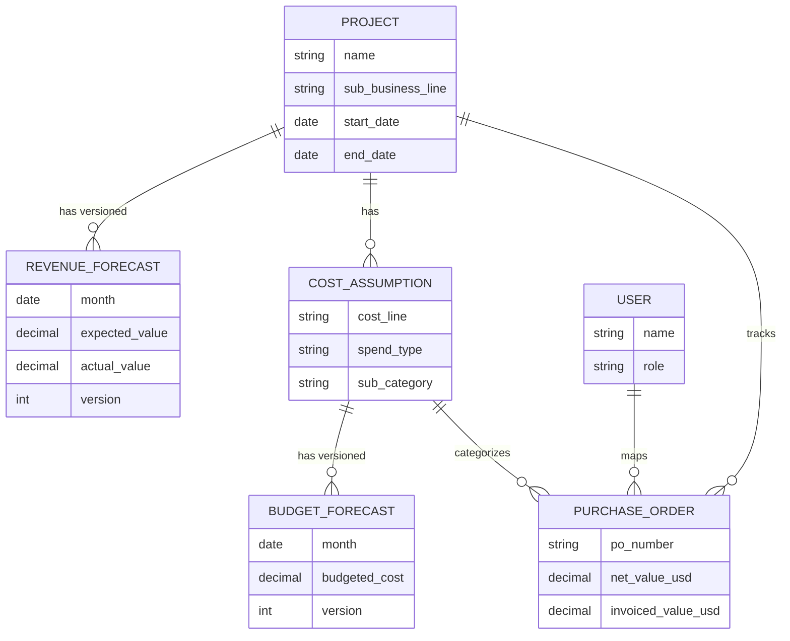

# **Project Vision: Cost Management Hub**

## 1. The Problem

* You struggle to track project costs against initial assumptions in real-time.
* It's very challenging to link specific spending (Purchase Orders) to the correct projects and cost buckets.
* The current process, which relies on Excel, is manual, disconnected from the sales team's P&L exercise, and leads to reactive, "after the fact" explanations for cost overruns.
* You feel you are "never in control" of project spending.

**Is this an accurate summary of the core problem?**

## 2. Existing Alternatives

* The Sales team creates a project P&L on an Excel sheet.
* You manually track POs against these assumptions on a separate Excel sheet.
* To explain budget deviations, you manually look at all invoiced POs and try to link them back to projects.

**Does this cover how you currently handle this process?**

## 3. The Solution

* A web application that acts as an intelligent layer on top of your existing business systems.
* It will ingest PO data daily from your business system's reports.
* It will provide a central place to input and track versioned P&L/budget assumptions for each project.
* Its core feature will be a "PO Mapping Inbox" to link new POs to specific projects and hierarchical spend categories.

**Does this high-level description match your proposed solution?**

## 4. Unique Value Proposition (UVP)

Based on my analysis, your product's core value is providing **real-time project cost control, moving you from reactive reporting to proactive, data-driven decision-making.** It gives you the power to see budget deviations *as they happen*, not weeks later.

**Does this statement resonate with you as the primary value?**

## 5. MVP Scope Confirmation

* The initial product (MVP) will focus exclusively on managing the **M&S (Materials and Supplies) cost line**, as this will have the highest impact.
* We will filter the ingested PO data to only include POs relevant to M&S, likely using the "Valuation Class" and "G/L Account" fields from the PO details report.
* Other cost lines will be considered as future expansions after the MVP is successful.

## **6. The Project Entity**

This remains the central container for an initiative. It will now also track its duration and hold the versioned revenue forecasts.

* **Key Attributes:**
  * Project Name (e.g., "Shell Crux")
  * Sub Business Line (e.g., "WIS", "TCP")
  * Project Start Date
  * Project End Date
* **Relationships:**
  * A Project has a versioned, monthly **Revenue Forecast**.
  * A Project has many **Cost Assumptions**.
  * Many **Purchase Orders** will be mapped to a single Project.

## **7. The Revenue Forecast Entity**

To handle the versioned monthly tracking you described, we'll think of this as a set of records linked to each Project.

* **Key Attributes:**
  * Month/Year Timestamp
  * Expected Revenue
  * Actual Revenue
  * Version Number / Effective Date (to track changes over time)
* **Relationships:**
  * Belongs to one **Project**.

## **8. The Cost Assumption Entity**

This still represents a specific budget line item within a project. It will now also be linked to a time-based cost forecast.

* **Key Attributes:**
  * Cost Line (e.g., "M\&S")
  * Spend Type (e.g., "Operational", "Maintenance")
  * Spend Sub Category (and further optional levels)
* **Relationships:**
  * Belongs to one **Project**.
  * Has a versioned, monthly **Budget Forecast**.
  * Many **Purchase Orders** will be mapped to it. When mapped, their aggregated values (total, open, invoiced) can be compared against this entity's budget forecast.

## **9. The Budget Forecast Entity**

Similar to the revenue forecast, this tracks the expected monthly cost for a specific budget line item.

* **Key Attributes:**
  * Month/Year Timestamp
  * Budgeted Cost
  * Version Number / Effective Date (to track changes)
* **Relationships:**
  * Belongs to one **Cost Assumption**.

## **10. The Purchase Order (PO) Entity**

This entity remains the same, representing the ingested spend data. We can add more attributes from the PO details report later as needed.

## **11. The User Entity**

This entity remains the same, representing the person mapping the POs.

### **Updated Diagram**

Here is the revised diagram showing the new `RevenueForecast` and `BudgetForecast` entities.

## 12. The "Project & Budget Setup" Journey

* **User Goal**: To create a new project in the system and populate its initial, versioned financial plan.
* **Key Steps**:
    1. A user (like a Resource Manager or Financial Controller) creates a new **Project**, giving it a name, sub-business line, and start/end dates.
    2. They input the initial **Revenue Forecast**, specifying the expected revenue for each month of the project's duration.
    3. They create the **Cost Assumption** structure, defining the spend types and sub-categories (e.g., M&S -> Maintenance -> BOP Recert / Spares).
    4. For each lowest-level sub-category, they input the initial **Budget Forecast**, assigning the expected cost for each month.
    5. The system saves this initial plan as "Version 1". The user can later update these forecasts, creating a new version each time.

## 13. The "PO Ingestion" Journey

* **User Goal**: To get new purchase order data into the application's database, ready for mapping.
* **Key Steps**:
    1. The system receives the "PO Details Report" file, which is manually downloaded daily.
    2. It filters the report to only include POs related to the **M&S cost line**, using the "Valuation Class" and "G/L Account" fields.
    3. The relevant PO data is extracted and loaded into the database. Each new PO line is initially marked with a status of "Pending Mapping".

## 14. The "PO Mapping" Journey

* **User Goal**: To categorize new, unprocessed POs by linking them to the correct project and spend category. This is the core interactive workflow of the app.
* **Key Steps**:
    1. A "Processor" (Resource Manager or M&S Coordinator) logs in and navigates to the "PO Mapping Inbox".
    2. The inbox displays only POs with a "Pending Mapping" status.
    3. The user applies filters to narrow down the list, such as by `Company Code`, `Plant`, `Sub Business Line`, `SLB Vendor Category`, or by pasting in a list of PO numbers.
    4. The user selects one or more POs.
    5. They assign the selected PO(s) to the appropriate **Project** and the specific **Cost Assumption** sub-category.
    6. Upon saving, the PO status is updated to "Mapped" and it is removed from the inbox view.

## 15. The "Reporting & Analytics" Journey

* **User Goal**: To view a project's financial health, track spending against budget, and understand how forecasts have evolved.
* **Key Steps**:
    1. A user selects a project to view its main dashboard.
    2. The dashboard shows high-level numbers: Budgeted Cost vs. Total PO Value (split into Invoiced and Open amounts).
    3. The user can drill down from high-level spend types (Operational vs. Maintenance) into sub-categories, and all the way down to the individual PO lines that make up the total.
    4. The user can access a timeline view to see how the project's revenue and budget forecasts have changed over time (e.g., comparing the plan at the end of Q2 vs. today).

## 15. Summary of the Data Ingestion Plan

Based on your answers, here is the plan for getting data into the application:

* **Source**: The data will come from a **CSV file** downloaded daily from Power BI. This file will contain **both new and existing POs**.
* **Method (MVP)**: For the initial version, a **Python script** will be developed to handle the data loading. This script will process the CSV and update the application's database. A user-facing upload feature will be considered for a future release.
* **Logic**: The script will use the combination of **`PO Number` + `PO Line Item`** as the unique identifier. It will update any changed attributes for existing POs (like invoice status) while ensuring that any **manual mapping data is preserved**.
* **Transformation**: As part of its processing, the script will perform an enrichment step, joining the PO data with a separate **G/L Account mapping report**. This, along with the "Valuation Class", will be used to accurately filter for the M&S POs required for the MVP.

