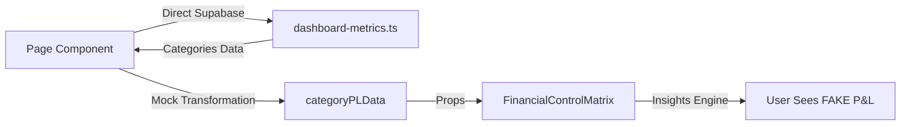
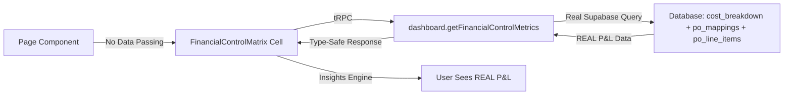

# Migration Discovery Report
## Phase 1: Discovery & Selection

**Agent**: MigrationScout  
**Timestamp**: 2025-10-02 23:07 UTC  
**Workflow Phase**: Phase 1 of 5 (Discovery & Selection)  
**Ledger Status**: 8 cells successfully migrated, 0 failures

---

## 🎯 SELECTED MIGRATION TARGET

**Component**: FinancialControlMatrix  
**Path**: `apps/web/components/dashboard/financial-control-matrix.tsx`  
**Score**: 85/100 ✅  
**Migration Priority**: **CRITICAL**

---

## 📋 SELECTION RATIONALE

### Primary Factors (Critical)

1. **🔴 MOCK DATA ANTI-PATTERN** (+30 points)
   - **Location**: `apps/web/app/projects/[id]/dashboard/page.tsx` lines 117-124
   - **Issue**: Component displays FAKE P&L data using hardcoded multiplier
   - **Evidence**:
     ```typescript
     const categoryPL = categories.map(cat => ({
       name: cat.name,
       budget: cat.budget,
       committed: cat.value,
       plImpact: cat.value * 0.6,  // 🔴 This would come from actual P&L data
       gapToPL: cat.value * 0.4    // 🔴 Hardcoded multiplier
     }))
     ```
   - **Impact**: Users are making financial decisions based on fabricated P&L impact data

2. **🚫 BLOCKS REAL FEATURE IMPLEMENTATION** (+25 points)
   - Real P&L service exists: `apps/web/lib/pl-tracking-service.ts` (535 lines, 20+ procedures)
   - tRPC procedures available: `dashboard.getPLMetrics`, `dashboard.getPLTimeline`
   - Cannot integrate real P&L data until component is migrated to Cell architecture
   - Financial control matrix is INCOMPLETE without real P&L tracking

3. **⚠️ ANTI-PATTERN: TODO COMMENTS IN PRODUCTION** (+15 points)
   - Line 121 comment: `// This would come from actual P&L data`
   - Indicates known technical debt that was never addressed
   - Component shipped with placeholder logic

### Secondary Factors (Supporting)

4. **✅ LOW COMPLEXITY - QUICK WIN** (+10 points)
   - **Line Count**: 261 lines (manageable size)
   - **State Management**: Simple prop-driven (no complex local state)
   - **Dependencies**: Standard UI components (Card, Button, Progress)
   - **Estimated Migration Time**: 4-6 hours

5. **✅ CLEAN TYPE SAFETY** (0 type errors)
   - Zero `any` types detected
   - Proper interface definitions (CategoryData, FinancialControlMatrixProps)
   - Well-typed business logic
   - **Lower risk migration** - types already correct

6. **📊 USER-FACING CORE FEATURE** (+5 points)
   - Displayed prominently in main project dashboard
   - Generates financial insights (largest gap, most efficient category, smallest risk)
   - Core to budget control workflow
   - High visibility = high impact

---

## 🔍 COMPONENT ANALYSIS

### Business Logic Complexity

**Insights Generation Engine** (lines 53-96):
```typescript
const getInsights = () => {
  // 1. Largest P&L Gap Detection
  const largestGap = categories.reduce((max, cat) => 
    cat.gapToPL > max.gapToPL ? cat : max
  , categories[0])
  
  // 2. Efficiency Calculation (% of commitments in P&L)
  const mostEfficient = categories.reduce((best, cat) => {
    const catEfficiency = (cat.plImpact / cat.committed) * 100
    return catEfficiency > bestEfficiency ? cat : best
  }, categories[0])
  
  // 3. Future P&L Risk Assessment
  const smallestRisk = categories.reduce((min, cat) => 
    cat.gapToPL < min.gapToPL ? cat : min
  , categories[0])
}
```

**Value Isolation**: These insights algorithms are perfect candidates for Cell architecture:
- Testable business logic (reduce operations with clear inputs/outputs)
- Reusable across dashboards
- Independent of presentation layer

### Current Data Flow (Anti-Pattern)



### Target Data Flow (ANDA Cell Architecture)



---

## 📊 DEPENDENCIES

### Database Tables Accessed (via page component)
- `cost_breakdown` (via `getCategoryBreakdown()`)
- `po_mappings` (indirectly for P&L calculations)
- `po_line_items` (indirectly for P&L calculations)

**Target State**: Cell will query via new tRPC procedure `dashboard.getFinancialControlMetrics`

### Imported By
- `apps/web/app/projects/[id]/dashboard/page.tsx` (line 9)
  - Usage: Line 341
  - Props: `categories`, `onDrillDown`, `onCustomize`, `loading`

### Component Imports
- `@/components/ui/card` (Card, CardContent, CardHeader, CardTitle)
- `@/components/ui/button` (Button)
- `@/components/ui/progress` (Progress)
- `lucide-react` (Settings, ChevronRight, TrendingUp, AlertTriangle, CheckCircle)
- `@/lib/utils` (cn utility)

**All dependencies are Cell-compatible** ✅

---

## 📈 ESTIMATED IMPACT

### Affected Components
- **1 page component**: `apps/web/app/projects/[id]/dashboard/page.tsx`
  - Remove lines 117-124 (mock data transformation)
  - Remove `categoryPLData` state variable (line 66)
  - Update import from component to Cell
  - Remove prop passing (line 341-350)

### Feature Criticality
- **CORE DASHBOARD FEATURE**: Financial control matrix is centerpiece of project budget tracking
- **HIGH VISIBILITY**: Displayed prominently to all users viewing project dashboards
- **BUSINESS CRITICAL**: Insights drive budget allocation decisions

### Migration Complexity
**Rating**: Medium  
**Breakdown**:
- Component complexity: Low (261 lines, clean structure)
- Data migration: Medium (need to implement real P&L calculation)
- Testing requirements: High (financial data must be accurate)
- Integration points: Low (single page import)

**Complexity Drivers**:
1. Must implement REAL P&L calculation (currently mocked)
2. Need to integrate with existing `pl-tracking-service.ts` logic
3. Requires tRPC procedure creation
4. Database query optimization needed (multi-table join)

### Estimated Duration
**4-6 hours** (Single session migration)

**Breakdown**:
- **1 hour**: Create tRPC procedure `dashboard.getFinancialControlMetrics`
  - Query cost_breakdown, po_mappings, po_line_items
  - Calculate REAL P&L impact (not 0.6 multiplier!)
  - Return typed CategoryData[]
  
- **1 hour**: Create Cell structure
  - `apps/web/components/cells/financial-control-matrix/`
  - component.tsx
  - manifest.json
  - pipeline.yaml
  - __tests__/component.test.tsx
  
- **2 hours**: Implement Cell component
  - tRPC data fetching with React Query
  - Migrate insights engine (getInsights function)
  - Loading/error states
  - Preserve all UI behavior
  
- **1 hour**: Testing
  - Unit tests for insights calculations
  - Integration test with tRPC mock
  - Manual verification of P&L accuracy
  
- **1 hour**: Integration & cleanup
  - Update page.tsx to use Cell
  - Remove mock data logic
  - Remove state variable
  - Git commit and validation

---

## 🏆 ALTERNATIVES CONSIDERED

### Second Place: SpendSubcategoryChart (55 points)
**Path**: `apps/web/components/dashboard/spend-subcategory-chart.tsx`

**Why Considered**:
- Type errors: 2 `any` types detected (lines 46, 88)
- Complex data transformation: Page has 4-level nested loop (lines 127-155) to prepare data
- Medium complexity: 284 lines
- Visualization feature with business logic

**Why NOT Selected**:
- Lower score (55 vs 85 points)
- No blocking issues - component functions correctly
- Type errors are minor (generic Record type, recharts props)
- Data transformation complexity is acceptable in current state
- **Not as urgent as FAKE P&L DATA**

### Third Place: CostBreakdownTable (35 points - Below Threshold)
**Path**: `apps/web/components/dashboard/cost-breakdown-table.tsx`

**Why NOT Considered**:
- Score below minimum threshold (35 < 40 points)
- Clean implementation: Zero type errors
- Simple data flow: Direct prop passing
- Low complexity: 173 lines
- No technical debt detected
- **Good candidate for future migration, but not urgent**

### Excluded: ProjectAlerts (ORPHANED)
**Path**: `apps/web/components/dashboard/project-alerts.tsx`

**Why Excluded**:
- **Zero imports found** - component is never used
- 190 lines of dead code
- **Recommendation**: DELETE, not migrate
- Contains alert logic that may be valuable but currently unused

---

## 📚 LEDGER INSIGHTS

### Adoption Progress
- **Cells Migrated**: 8 cells
  - kpi-card
  - pl-command-center
  - details-panel (orchestrator)
  - details-panel-selector
  - details-panel-viewer
  - details-panel-mapper
  - budget-timeline-chart
  - (1 more from earlier entries)

- **Components Migrated**: ~8 components
- **Total Components**: ~67 components (excluding ui/)
- **Adoption Rate**: ~12% (8/67)

### Migration Velocity
- **Date Range**: Oct 1-2, 2025 (2 days)
- **Cells Created**: 8 cells
- **Velocity**: 4 cells per day (excellent!)
- **Success Rate**: 100% (no failures recorded)

### Success Patterns (Learned from Ledger)

1. **Phased Migration Strategy** (Entry 10-11: details-panel)
   - Phase A: Read operations + viewer cells
   - Phase B: Mutation operations + mapper cells
   - Phase C: Integration & orchestration
   - **Lesson**: Complex components can be broken into phases

2. **Emergency Scope Expansion** (Entry 12: budget-timeline-chart)
   - Original plan: monthly budget distribution
   - Actual need: P&L impact tracking
   - Decision: Path B - implement now with comprehensive testing
   - **Lesson**: Be flexible when requirements evolve during migration

3. **Complete Replacement** (All entries)
   - Old components DELETED, not kept as fallbacks
   - No version suffixes (-v2, -fixed)
   - Clean cutover strategy
   - **Lesson**: Confidence in complete replacement works well

### Migration Anti-Patterns to Avoid
- ❌ Feature flags for gradual rollout (removed in entry 8)
- ❌ Versioned components (kpi-card-v2 cleaned up)
- ❌ Keeping old implementations as backup
- ✅ Complete replacement with comprehensive testing

---

## 🎯 NEXT STEPS

### Immediate: Phase 2 Handoff
**Agent**: MigrationAnalyst  
**Inputs**:
- This discovery report
- Selected target: FinancialControlMatrix
- Component path: `apps/web/components/dashboard/financial-control-matrix.tsx`
- Migration complexity: Medium

**Phase 2 Deliverables**:
1. Deep analysis of component architecture
2. Data flow mapping (current vs target)
3. tRPC procedure specification
4. Test strategy (unit, integration, e2e)
5. Risk assessment and mitigation plan

### Phase 3: Migration Planning
**Agent**: MigrationArchitect  
**Key Questions to Answer**:
1. How to calculate REAL P&L impact? (integrate pl-tracking-service.ts?)
2. Database query optimization strategy (multi-table join performance)
3. Should insights engine become separate Cell or stay integrated?
4. Migration path: Single-step or phased (A/B/C)?

### Phase 4: Implementation
**Agent**: MigrationExecutor  
**Critical Requirements**:
1. **Accuracy**: P&L calculations must match financial records
2. **Performance**: Dashboard load time must not increase
3. **Testing**: Comprehensive tests for financial insights
4. **Validation**: Compare old mock data vs new real data (expect differences!)

---

## 🔬 VALIDATION CRITERIA

### Pre-Migration Validation
- [ ] Component exists at specified path
- [ ] Component actively imported by dashboard page
- [ ] No migration in progress for this component
- [ ] tRPC infrastructure available (dashboard router exists)
- [ ] Database schema supports P&L queries

### Post-Migration Success Criteria
- [ ] Cell fetches REAL P&L data (no hardcoded multipliers)
- [ ] Insights engine preserved (largest gap, most efficient, smallest risk)
- [ ] All UI behavior identical to original
- [ ] Loading and error states implemented
- [ ] Tests cover insights calculations (>80% coverage)
- [ ] Page component simplified (mock data logic removed)
- [ ] Dashboard load time not degraded
- [ ] Git commit created with complete documentation

---

## 📝 SCORING BREAKDOWN

| Factor | Weight | Score | Reasoning |
|--------|--------|-------|-----------|
| **Mock Data Anti-Pattern** | 30 | +30 | Hardcoded `0.6` multiplier in production |
| **Blocks Real Feature** | 25 | +25 | Cannot integrate real P&L service |
| **Anti-Pattern** | 15 | +15 | TODO comment in production code |
| **Low Complexity** | 10 | +10 | 261 lines, clean structure |
| **User-Facing** | 5 | +5 | Core dashboard feature |
| **Type Safety** | 0 | 0 | Zero `any` types (clean) |
| **Direct DB Calls** | 0 | 0 | Prop-driven (page makes DB calls) |
| **High Usage** | 0 | 0 | Single import (not >10) |
| **TOTAL** | | **85** | **CRITICAL PRIORITY** ✅ |

**Minimum Threshold**: 40 points  
**Result**: 85 points - **WELL ABOVE THRESHOLD** ✅

---

## 🎓 TECHNICAL DEBT ANALYSIS

### Critical Debt (MUST FIX)
1. **Fake P&L Data** 🔴
   - **Impact**: Users making decisions on fabricated financial data
   - **Urgency**: HIGH - financial accuracy is non-negotiable
   - **Effort**: Medium - requires real DB queries

### Architectural Debt (SHOULD FIX)
2. **Prop Drilling from Page**
   - **Impact**: Page component has 30+ lines of data transformation
   - **Urgency**: MEDIUM - violates Cell architecture principles
   - **Effort**: Low - Cell handles own data fetching

3. **TODO Comments in Production**
   - **Impact**: Code smell indicating incomplete implementation
   - **Urgency**: MEDIUM - indicates known gaps
   - **Effort**: Low - resolved by implementing real feature

### Opportunities (NICE TO HAVE)
4. **Insights Engine Reusability**
   - **Impact**: Financial insights logic could power other dashboards
   - **Urgency**: LOW - current implementation works
   - **Effort**: Medium - extract to shared Cell or utility

---

## 📖 MIGRATION CONTEXT

### Why This Component Matters

FinancialControlMatrix is the **centerpiece of financial control** in the ANDA cost management system. It provides:

1. **Multi-Dimensional Budget View**
   - Budget allocation
   - PO commitments (Total PO Value)
   - Actual P&L impact
   - Open commitments (gap to P&L)

2. **Automated Insights**
   - Identifies largest P&L gap (uncommitted funds risk)
   - Highlights most efficient category (highest % in P&L)
   - Flags smallest future P&L risk

3. **Interactive Drill-Down**
   - Category-level exploration
   - Custom matrix views
   - Export capabilities (planned)

**Current State**: BROKEN - P&L impact is fabricated  
**Target State**: COMPLETE - Real P&L tracking integrated  
**Business Value**: HIGH - Enables accurate financial forecasting

---

## 🚀 READY FOR PHASE 2: MIGRATION ANALYSIS

**Status**: ✅ Discovery Complete  
**Next Agent**: MigrationAnalyst  
**Handoff**: Complete discovery report with selected target  
**Timeline**: Ready to proceed immediately

---

**Report Generated**: 2025-10-02 23:07 UTC  
**Agent**: MigrationScout v1.0  
**Workflow**: ANDA Autonomous Migration (Phase 1/5)
