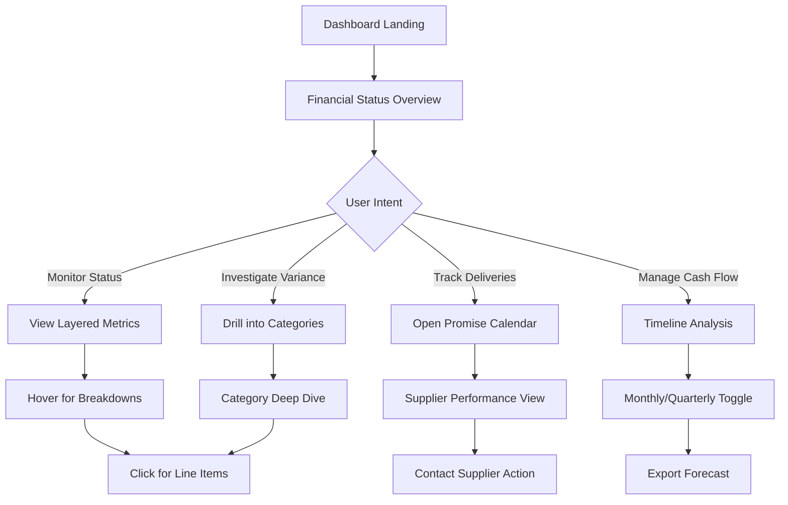

# UX Proposal: Enhanced Financial Dashboard with Three-Tier Tracking

## 1. The User Problem

**How might we help project managers instantly understand their complete financial picture - from approved budgets through committed POs to actual invoiced amounts - while proactively managing upcoming deliveries and potential budget risks?**

Project managers currently lack visibility into the full lifecycle of their spending. They can see budgets and some PO data, but cannot distinguish between:
- Money that's committed but not yet spent (PO issued)
- Money that's actually been invoiced (hit the books)
- Future obligations with specific delivery dates

This creates blind spots in financial planning and reactive rather than proactive management.

## 2. Executive Summary

This proposal introduces a **Financial Clarity System** that provides instant, actionable insights through:
- **Layered Financial Status Cards** showing Budget → Committed → Invoiced in one glance
- **Cash Flow Timeline** visualizing past invoices and future obligations
- **Delivery Command Center** for managing supplier promises and delays
- **Smart Alert System** that surfaces risks before they become problems
- **Progressive Detail Disclosure** from executive summary to line-item drill-down

The design emphasizes **visual hierarchy**, **information density without clutter**, and **actionable insights over raw data**.

## 3. Proposed User Flow



## 4. Core Design Concepts

### 4.1 The Financial Trinity Card

**Concept**: Replace multiple KPI cards with a unified "Financial Trinity" that shows the complete picture.

```
┌─────────────────────────────────────────────────────────┐
│ PROJECT FINANCIAL STATUS                         ⚡ Live │
├─────────────────────────────────────────────────────────┤
│                                                         │
│ APPROVED BUDGET ────────────────────────── $2,500,000  │
│ ████████████████████████████████████████████████████   │
│                                                         │
│ COMMITTED (POs) ─────────────────────────── $2,100,000 │
│ ████████████████████████████████████░░░░░░░░░░░░ 84%   │
│                                                         │
│ INVOICED ───────────────────────────────── $1,260,000  │
│ ██████████████████████████░░░░░░░░░░░░░░░░░░░░░░ 50%  │
│                                                         │
│ ┌─────────────────────────────────────────────────┐    │
│ │ 📊 Key Insights                                  │    │
│ │ • $400K budget remaining (16%)                   │    │
│ │ • $840K in open POs awaiting delivery            │    │
│ │ • Next $120K hits books in 7 days                │    │
│ └─────────────────────────────────────────────────┘    │
└─────────────────────────────────────────────────────────┘
```

**Key Features**:
- Visual hierarchy with size indicating importance
- Nested progress bars showing relationships
- Smart insights auto-generated from data
- Live indicator for real-time updates
- Single card replaces 3-4 traditional KPIs

### 4.2 Cash Flow Timeline (Enhanced)

**Concept**: Transform the budget timeline into a comprehensive cash flow visualization.

```
┌─────────────────────────────────────────────────────────┐
│ CASH FLOW TIMELINE                     [M] [Q] [Y] 🔄  │
├─────────────────────────────────────────────────────────┤
│                                                         │
│  $300K ┤                                    ╭──────     │
│        │                              ╭─────╯           │
│  $200K ┤                       ╭──────╯                 │
│        │                 ╭─────╯    ░░░░░░░░░░░░░░░    │
│  $100K ┤          ╭──────╯         ░░░░░░░░░░░░░░░░░   │
│        │    ╭─────╯               ░░░░░░░░░░░░░░░░░░░  │
│    $0K └────┴─────┴─────┴─────┴─────┴─────┴─────┴──   │
│         Jan  Feb  Mar  Apr  May  Jun  Jul  Aug  Sep    │
│                                       ↑                 │
│         ━━━ Invoiced  ░░░ Promised  ─── Budget         │
│                                                         │
│ ┌─────────────────────────────────────────────────┐    │
│ │ 🎯 Jul 15: $340K invoice from SPOOLTECH         │    │
│ │ 📅 Aug 25: $165K expected from Houston Hub      │    │
│ │ ⚠️  Sep 5: $71K overdue from supplier XYZ       │    │
│ └─────────────────────────────────────────────────┘    │
└─────────────────────────────────────────────────────────┘
```

**Key Features**:
- Solid line for historical invoiced amounts
- Dotted/shaded area for future promises
- Budget line as reference
- Interactive hover for exact amounts
- Event markers for significant dates
- Smart alerts integrated below

### 4.3 Delivery Command Center

**Concept**: A dedicated view for managing supplier promises and delivery schedules.

```
┌─────────────────────────────────────────────────────────┐
│ DELIVERY COMMAND CENTER            Filter: Next 30 Days │
├─────────────────────────────────────────────────────────┤
│                                                         │
│ OVERDUE (2)                                   $142,000 │
│ ┌─────────────────────────────────────────────────┐   │
│ │ ⚠️ Houston Hub - PO #4584412814                  │   │
│ │ 5 days overdue | $71,946 | 8 line items         │   │
│ │ [Contact] [Escalate] [Update Date]              │   │
│ └─────────────────────────────────────────────────┘   │
│                                                         │
│ THIS WEEK (3)                                 $287,500 │
│ ┌─────────────────────────────────────────────────┐   │
│ │ ✓ SPOOLTECH - PO #4584165035                    │   │
│ │ Due: Jul 15 | $340,536 | On Track               │   │
│ │ ▶ View 2 line items                             │   │
│ └─────────────────────────────────────────────────┘   │
│                                                         │
│ NEXT WEEK (5)                                 $425,000 │
│ ┌─────────────────────────────────────────────────┐   │
│ │ 📅 Multiple Suppliers                           │   │
│ │ Aug 22-28 | 5 POs | 23 line items              │   │
│ │ ▶ Expand Details                                │   │
│ └─────────────────────────────────────────────────┘   │
│                                                         │
│ FUTURE (12)                                   $892,000 │
│ [Show All Future Deliveries →]                         │
└─────────────────────────────────────────────────────────┘
```

**Key Features**:
- Priority-based grouping (Overdue → Imminent → Future)
- Action buttons for immediate response
- Expandable details without navigation
- Total value per group for impact assessment
- Smart batching of multiple items

### 4.4 Intelligent Alert System

**Concept**: Context-aware alerts that provide actionable guidance.

```
┌─────────────────────────────────────────────────────────┐
│ 🔔 SMART ALERTS                              [Dismiss] │
├─────────────────────────────────────────────────────────┤
│                                                         │
│ ┌── CRITICAL ─────────────────────────────────────┐    │
│ │ 💰 Cash Flow Risk Detected                      │    │
│ │ $450K in invoices expected next week but only   │    │
│ │ $200K budget remaining. Review upcoming POs.     │    │
│ │ [Review POs] [Request Budget] [See Analysis]    │    │
│ └──────────────────────────────────────────────────┘   │
│                                                         │
│ ┌── WARNING ──────────────────────────────────────┐    │
│ │ 📊 Unusual Spending Pattern                     │    │
│ │ 40% increase in monthly burn rate detected.     │    │
│ │ Current trajectory exceeds budget by Oct.        │    │
│ │ [View Trend] [Adjust Forecast]                  │    │
│ └──────────────────────────────────────────────────┘   │
│                                                         │
│ ┌── OPPORTUNITY ──────────────────────────────────┐    │
│ │ 💡 Budget Optimization Available                │    │
│ │ Cancel 3 duplicate POs to save $85K             │    │
│ │ [Review Duplicates]                             │    │
│ └──────────────────────────────────────────────────┘   │
└─────────────────────────────────────────────────────────┘
```

### 4.5 Category Deep Dive with Drill-Down

**Concept**: Progressive disclosure from category to line item.

```
┌─────────────────────────────────────────────────────────┐
│ SPEND BY CATEGORY                    ⚙️ Configure View │
├─────────────────────────────────────────────────────────┤
│                                                         │
│ Materials & Supplies          $1,234,567 / $1,500,000  │
│ ████████████████████████████████░░░░░░░░░ 82%         │
│ ├─ Invoiced: $740K  ├─ Open POs: $494K  ├─ Free: $266K│
│ ▼ Show Breakdown                                       │
│                                                         │
│ Services                        $456,789 / $600,000    │
│ ████████████████████░░░░░░░░░░░░░░░░░░░░░ 76%        │
│ ├─ Invoiced: $320K  ├─ Open POs: $136K  ├─ Free: $144K│
│ ▶ Show Breakdown                                       │
│                                                         │
│ Equipment                       $234,567 / $400,000    │
│ ███████████████░░░░░░░░░░░░░░░░░░░░░░░░░░ 59%        │
│ ├─ Invoiced: $200K  ├─ Open POs: $34K   ├─ Free: $166K│
│ ▶ Show Breakdown                                       │
└─────────────────────────────────────────────────────────┘
```

When expanded:
```
│ ▼ Materials & Supplies                                 │
│   │                                                    │
│   ├─ Tubing & Coils               $654,321 / $750,000 │
│   │  ████████████████████████░░░░░░░░░░ 87%          │
│   │  • 12 POs | 47 line items | 3 suppliers          │
│   │  • Next delivery: Aug 25 ($82K)                  │
│   │                                                    │
│   ├─ Connectors & Fittings        $345,678 / $400,000 │
│   │  ████████████████████░░░░░░░░░░░░░░ 86%          │
│   │  • 8 POs | 23 line items | 2 suppliers           │
│   │  • ⚠️ 1 overdue delivery ($45K)                   │
│   │                                                    │
│   └─ Specialty Items              $234,568 / $350,000 │
│      ██████████████░░░░░░░░░░░░░░░░░░░░ 67%          │
│      • 5 POs | 15 line items | 4 suppliers           │
```

## 5. Rationale & Codebase Context

### Existing Patterns to Leverage
- **KPICard Component** (`components/dashboard/kpi-card.tsx`): Extend for multi-tier display
- **BudgetComparison** (`components/budget-comparison.tsx`): Transform into Financial Trinity
- **ProjectAlerts** (`components/dashboard/project-alerts.tsx`): Enhance with promise date logic
- **Real-time Updates** (`app/projects/[id]/dashboard/page.tsx:125-155`): Already implemented

### Design Decisions
1. **Unified Views Over Scattered Metrics**: Users need relationships between numbers, not isolated KPIs
2. **Time-Based Organization**: Financial data is inherently temporal - embrace it
3. **Action-Oriented Alerts**: Every alert should have a clear next step
4. **Progressive Disclosure**: Start with executive summary, allow drill-down on demand
5. **Visual Encoding**: Use position, size, and color consistently to convey meaning

## 6. Micro-Interactions & Delight

### Hover States
- **Financial Trinity Bars**: Expand to show exact amounts and percentages
- **Timeline Points**: Display invoice details in tooltip
- **Category Bars**: Preview top 3 line items

### Animations
- **Progress Bars**: Smooth fill animation on load (0.5s ease-out)
- **Alert Entry**: Slide down with subtle bounce (0.3s)
- **Drill-Down**: Accordion expand with fade-in content (0.2s)
- **Real-time Updates**: Pulse animation on changed values

### Empty States
- **No Invoices**: "🎉 No invoices yet! Your committed POs total $X"
- **No Promises**: "📅 No delivery dates set. Contact suppliers to confirm."
- **Under Budget**: "💚 You're under budget! Consider future opportunities."

### Loading States
- **Skeleton Screens**: Maintain layout structure while loading
- **Progressive Loading**: Show cached data immediately, update when fresh
- **Optimistic Updates**: Apply changes instantly, rollback if failed

## 7. Responsive Design Strategy

### Desktop (1600px+)
- Full dashboard with all panels visible
- Side-by-side timeline and delivery center
- 6-column grid for detailed metrics

### Tablet (768px - 1599px)
- Stack Financial Trinity and Timeline vertically
- Collapse delivery center to summary view
- 3-column grid for metrics

### Mobile (< 768px)
- Financial Trinity as hero card
- Swipeable timeline chart
- Collapsible sections with clear headers
- Bottom sheet for drill-downs
- Floating action button for key actions

## 8. Accessibility Considerations

### Screen Reader Support
- Descriptive ARIA labels for all charts
- Table alternatives for visual data
- Announcement of real-time updates

### Keyboard Navigation
- Tab order follows visual hierarchy
- Arrow keys for timeline navigation
- Enter/Space for expanding sections
- Escape to close modals

### Color & Contrast
- WCAG AAA compliance for all text
- Pattern fills in addition to colors
- High contrast mode support
- Color-blind friendly palette

## 9. Performance Optimizations

### Data Loading
- Virtualized lists for line items (100+ items)
- Lazy load historical data beyond 6 months
- Cache supplier promise dates locally
- Debounce real-time updates (500ms)

### Rendering
- Memoize expensive calculations
- Use CSS transforms for animations
- Implement virtual scrolling for tables
- Progressive chart rendering

## 10. Next Steps

### Immediate Actions
1. Create high-fidelity mockups of Financial Trinity card
2. Prototype timeline interaction with real data
3. Design responsive breakpoints for mobile
4. Develop animation specifications

### User Testing
1. A/B test unified vs separate KPI cards
2. Validate alert threshold preferences
3. Test drill-down interaction patterns
4. Measure time-to-insight metrics

### Implementation Priority
1. **Phase 1**: Financial Trinity + Enhanced Metrics
2. **Phase 2**: Cash Flow Timeline + Promise Tracking
3. **Phase 3**: Delivery Command Center
4. **Phase 4**: Smart Alerts + Drill-downs

## Appendix: Design System Extensions

### New Color Tokens
```css
--color-committed: #3B82F6;    /* Blue - POs issued */
--color-invoiced: #10B981;     /* Green - Money spent */
--color-promised: #F59E0B;     /* Amber - Future delivery */
--color-overdue: #EF4444;      /* Red - Past due */
--color-available: #9CA3AF;    /* Gray - Budget remaining */
```

### New Component Patterns
- `LayeredProgressBar`: Nested progress indicators
- `TimelineChart`: Enhanced with event markers
- `DeliveryCard`: Supplier promise tracking
- `SmartAlert`: Context-aware notifications
- `DrillDownTable`: Progressive disclosure table

### Animation Curves
```css
--ease-smooth: cubic-bezier(0.4, 0, 0.2, 1);
--ease-bounce: cubic-bezier(0.68, -0.55, 0.265, 1.55);
--ease-sharp: cubic-bezier(0.4, 0, 0.6, 1);
```

---

This proposal transforms raw financial data into actionable intelligence through thoughtful information architecture, progressive disclosure, and delightful micro-interactions. The design respects existing patterns while introducing powerful new visualizations that give users unprecedented control over their project finances.