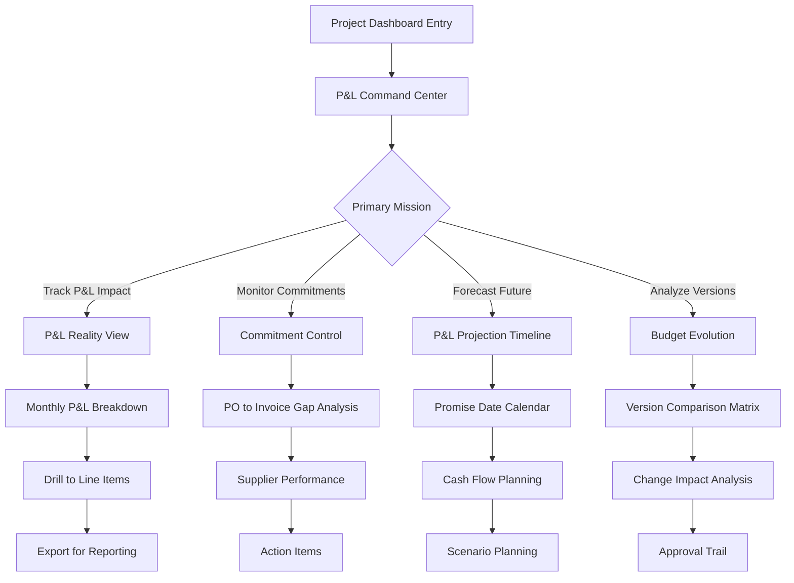

# UX Proposal: Ultimate Financial Control Dashboard with P&L Impact Tracking

## 1. The User Problem (Reframed)

**How might we give project managers ultimate control and visibility over their project's P&L impact - showing exactly what costs have hit the books, what's committed but pending, and when future obligations will impact their financial statements?**

Project managers need to understand three critical financial realities:
1. **P&L Reality**: What has actually hit their income statement (invoiced costs)
2. **Commitment Gap**: What's been committed through POs but hasn't hit the P&L yet
3. **Future P&L Impact**: When and how much will hit their books based on supplier promises

Without this visibility, managers are flying blind - unable to distinguish between paper commitments and actual P&L impact.

## 2. Executive Summary

This enhanced proposal introduces the **Ultimate Financial Control System** - a sophisticated yet intuitive dashboard that provides:
- **P&L Command Center**: Real-time view of actual costs hitting the books vs commitments
- **Budget Evolution Tracker**: Visual history of budget changes across versions
- **Financial Control Matrix**: Three-dimensional view of Budget × Committed × P&L Impact
- **P&L Impact Timeline**: Past actuals and future projections in one unified view
- **Sophisticated Analytics Without Complexity**: Deep insights through visual design, not AI

The design philosophy: **"Every pixel provides control, every interaction reveals insight"**

## 3. Enhanced User Flow



## 4. Revolutionary Design Concepts

### 4.1 The P&L Command Center (Hero Section)

**Concept**: A comprehensive control panel that shows the complete financial lifecycle at a glance.

```
┌───────────────────────────────────────────────────────────────────┐
│ P&L COMMAND CENTER                    Project: Shell Crux    ⚡Live│
├───────────────────────────────────────────────────────────────────┤
│                                                                   │
│ ┌─────────────────────────────────────────────────────────────┐ │
│ │                    FINANCIAL REALITY CHECK                   │ │
│ │                                                              │ │
│ │  APPROVED BUDGET ─────────────────────────── $2,500,000    │ │
│ │  ▓▓▓▓▓▓▓▓▓▓▓▓▓▓▓▓▓▓▓▓▓▓▓▓▓▓▓▓▓▓▓▓▓▓▓▓▓▓▓▓▓▓▓▓▓▓▓▓▓▓▓    │ │
│ │                                                              │ │
│ │  COMMITTED (POs) ─────────────────────────── $2,100,000    │ │
│ │  ▓▓▓▓▓▓▓▓▓▓▓▓▓▓▓▓▓▓▓▓▓▓▓▓▓▓▓▓▓▓▓▓▓▓▓▓▓░░░░░░░░░ 84%      │ │
│ │  └─ Not Yet in P&L: $840,000 ──────────────┘               │ │
│ │                                                              │ │
│ │  P&L IMPACT (Invoiced) ──────────────────── $1,260,000     │ │
│ │  ▓▓▓▓▓▓▓▓▓▓▓▓▓▓▓▓▓▓▓▓▓▓▓▓░░░░░░░░░░░░░░░░░░░░░░ 50.4%     │ │
│ │  └─ Actual costs in books ─────────────────┘               │ │
│ │                                                              │ │
│ └─────────────────────────────────────────────────────────────┘ │
│                                                                   │
│ ┌──────────────────┬──────────────────┬──────────────────────┐ │
│ │ 📊 P&L THIS MONTH│ 📈 NEXT P&L HIT  │ ⚠️ CRITICAL INSIGHT  │ │
│ ├──────────────────┼──────────────────┼──────────────────────┤ │
│ │    $165,000      │   Aug 25: $82K   │ $840K committed but  │ │
│ │    3 invoices    │   Sep 15: $156K  │ not in P&L yet      │ │
│ │    ↑ 23% vs last │   Oct 1: $234K   │ [View Gap Analysis] │ │
│ └──────────────────┴──────────────────┴──────────────────────┘ │
└───────────────────────────────────────────────────────────────────┘
```

**Key Innovations**:
- **Triple-layer progress bars** with clear relationship indicators
- **P&L Gap Callout**: Highlights the critical $840K not yet in books
- **Contextual metrics**: This month's P&L, next hits, critical insights
- **Live indicator**: Real-time data freshness
- **One view, complete story**: No need to look elsewhere

### 4.2 Budget Evolution & Version Control

**Concept**: Visual history showing how budgets evolved and their impact on current state.

```
┌───────────────────────────────────────────────────────────────────┐
│ BUDGET EVOLUTION                           View: [Compact] Detail │
├───────────────────────────────────────────────────────────────────┤
│                                                                   │
│   Version 0 ──────── Version 1 ──────── Version 2 (Current)     │
│   Jun 2025           Jul 2025            Aug 2025                │
│                                                                   │
│   $2,200,000 ──┐                                                 │
│                 ├──→ $2,350,000 ──┐                             │
│                 │    +$150,000     ├──→ $2,500,000              │
│                 │    Scope Add     │    +$150,000                │
│                                    │    Risk Buffer              │
│                                                                   │
│ ┌─────────────────────────────────────────────────────────────┐ │
│ │ Impact Analysis:                                            │ │
│ │ • Original: 14% under-budgeted based on current P&L        │ │
│ │ • V1→V2: Additional $150K prevented overrun                │ │
│ │ • Current utilization would be 95.5% on V0 budget         │ │
│ │ [View Detailed Comparison →]                               │ │
│ └─────────────────────────────────────────────────────────────┘ │
└───────────────────────────────────────────────────────────────────┘
```

### 4.3 P&L Impact Timeline (Revolutionary View)

**Concept**: A sophisticated timeline showing past P&L impacts and future projections based on promise dates.

```
┌───────────────────────────────────────────────────────────────────┐
│ P&L IMPACT TIMELINE                    [Monthly] Quarterly Yearly │
├───────────────────────────────────────────────────────────────────┤
│                                                                   │
│  $400K ┃                                         ╔════════╗      │
│        ┃                                   ╔═════╝░░░░░░░░║      │
│  $300K ┃                            ╔══════╝░░░░░░░░░░░░░░║      │
│        ┃                     ╔══════╝░░░░░░░░░░░░░░░░░░░░░║      │
│  $200K ┃              ╔══════╝    ░░░░░░░░░░░░░░░░░░░░░░░░║      │
│        ┃       ╔══════╝         ░░░░░░░░░░░░░░░░░░░░░░░░░░║      │
│  $100K ┃═══════╝               ░░░░░░░░░░░░░░░░░░░░░░░░░░░║      │
│        ┃                      ░░░░░░░░░░░░░░░░░░░░░░░░░░░░║      │
│    $0K ┗━━━━━━━━━━━━━━━━━━━━━━━━━━━━━━━━━━━━━━━━━━━━━━━━━┛      │
│        Jan  Feb  Mar  Apr  May  Jun  Jul  Aug  Sep  Oct  Nov     │
│                                        ↑                          │
│                                      TODAY                        │
│                                                                   │
│  ═══ Actual P&L Impact    ░░░ Projected P&L Impact (Promises)   │
│  ─── Budget Baseline      ⬤ Significant Invoice                 │
│                                                                   │
│ ┌─────────────────────────────────────────────────────────────┐ │
│ │ Key P&L Events:                                            │ │
│ │ • Jul 15: $340K SPOOLTECH invoice - IN P&L ✓              │ │
│ │ • Aug 25: $165K Houston Hub - EXPECTED (5 days)           │ │
│ │ • Sep 15: $234K Multiple suppliers - PROJECTED            │ │
│ │ • Oct-Nov: $521K based on current promises                │ │
│ └─────────────────────────────────────────────────────────────┘ │
└───────────────────────────────────────────────────────────────────┘
```

**Advanced Features**:
- **Dual visualization**: Solid bars for actual P&L, dotted for projected
- **Cumulative view**: Shows total P&L impact growing over time
- **Event markers**: Significant invoices marked on timeline
- **Smart projections**: Based on supplier promise dates
- **Interactive hover**: Detailed breakdown per month

### 4.4 The Financial Control Matrix

**Concept**: A sophisticated 2D matrix showing the relationship between categories and financial states.

```
┌───────────────────────────────────────────────────────────────────┐
│ FINANCIAL CONTROL MATRIX                         ⚙️ Customize    │
├───────────────────────────────────────────────────────────────────┤
│                                                                   │
│                    Budget    Committed   P&L Impact   Gap to P&L │
│                                                                   │
│ Materials         $1,500K    $1,234K     $740K       $494K      │
│ & Supplies        ▓▓▓▓▓▓     ▓▓▓▓▓░     ▓▓▓░░       ░░░░░      │
│                   100%       82%         49%          33%        │
│                                                                   │
│ Services          $600K      $457K       $320K       $137K      │
│                   ▓▓▓▓▓▓     ▓▓▓▓░░     ▓▓▓░░       ░░░░       │
│                   100%       76%         53%          23%        │
│                                                                   │
│ Equipment         $400K      $235K       $200K       $35K       │
│                   ▓▓▓▓▓▓     ▓▓▓░░░     ▓▓▓░░       ░          │
│                   100%       59%         50%          9%         │
│                                                                   │
│ ┌─────────────────────────────────────────────────────────────┐ │
│ │ 🎯 Insights:                                                │ │
│ │ • Materials has largest P&L gap ($494K uncommitted)        │ │
│ │ • Services most efficient (70% of commitments in P&L)      │ │
│ │ • Equipment has smallest future P&L risk ($35K)           │ │
│ │ [Drill Into Category →]                                    │ │
│ └─────────────────────────────────────────────────────────────┘ │
└───────────────────────────────────────────────────────────────────┘
```

### 4.5 Supplier Promise Calendar (P&L Forecast Tool)

**Concept**: Calendar view showing when costs will hit the P&L based on supplier promises.

```
┌───────────────────────────────────────────────────────────────────┐
│ P&L FORECAST CALENDAR                    August 2025      ◀ ▶   │
├───────────────────────────────────────────────────────────────────┤
│                                                                   │
│  Mon      Tue      Wed      Thu      Fri      Sat      Sun      │
│  ────────────────────────────────────────────────────────────── │
│           1        2        3        4        5        6         │
│           $12K     -        $8K      -        -        -         │
│                                                                   │
│  7        8        9        10       11       12       13        │
│  -        $45K     -        $23K     -        -        -         │
│           ⚠️                                                      │
│                                                                   │
│  14       15       16       17       18       19       20        │
│  -        $156K    -        -        $34K     -        -         │
│           🔴                                                      │
│                                                                   │
│  21       22       23       24       25       26       27        │
│  $67K     -        -        -        $82K     -        -         │
│                                      ⭐                           │
│                                                                   │
│  28       29       30       31       Month Total: $427K         │
│  -        $12K     -        -        Budget Impact: 17%         │
│                                                                   │
│ ┌─────────────────────────────────────────────────────────────┐ │
│ │ Legend: ⚠️ Overdue  🔴 High Value  ⭐ Major Supplier        │ │
│ │ Click any date for line item details                       │ │
│ └─────────────────────────────────────────────────────────────┘ │
└───────────────────────────────────────────────────────────────────┘
```

### 4.6 Ultimate Insights Panel

**Concept**: Sophisticated analytics without complexity - visual insights that drive action.

```
┌───────────────────────────────────────────────────────────────────┐
│ ULTIMATE INSIGHTS                              🧠 Analysis Mode  │
├───────────────────────────────────────────────────────────────────┤
│                                                                   │
│ ┌──────────────────────────┬────────────────────────────────┐   │
│ │ P&L VELOCITY              │ COMMITMENT EFFICIENCY          │   │
│ ├──────────────────────────┼────────────────────────────────┤   │
│ │ ▲ $165K/month            │ 60% of POs invoiced            │   │
│ │   Current Run Rate        │ 40% pending ($840K)           │   │
│ │                           │                                │   │
│ │ ⚡ Acceleration: +23%     │ Avg Days to Invoice: 45       │   │
│ │   vs 3-month average      │ Best Supplier: SPOOLTECH (30) │   │
│ └──────────────────────────┴────────────────────────────────┘   │
│                                                                   │
│ ┌──────────────────────────────────────────────────────────┐   │
│ │ BUDGET CONSUMPTION FORECAST                              │   │
│ ├──────────────────────────────────────────────────────────┤   │
│ │                                                           │   │
│ │ At current velocity:                                     │   │
│ │ ████████████████████░░░░░░░ 84% by Oct 31              │   │
│ │ ██████████████████████████░ 98% by Nov 30              │   │
│ │ ████████████████████████████ 100% by Dec 15            │   │
│ │                                                           │   │
│ │ With pending commitments:                                │   │
│ │ ████████████████████████░░░ 95% when all POs invoice   │   │
│ │                                                           │   │
│ │ 💡 Recommendation: Review Q4 spending plans              │   │
│ └──────────────────────────────────────────────────────────┘   │
│                                                                   │
│ ┌──────────────────────────────────────────────────────────┐   │
│ │ SUPPLIER PERFORMANCE IMPACT ON P&L                       │   │
│ ├──────────────────────────────────────────────────────────┤   │
│ │                                                           │   │
│ │ ON TIME: 67% suppliers = $847K P&L impact on schedule   │   │
│ │ AT RISK: 20% suppliers = $252K P&L may delay            │   │
│ │ OVERDUE: 13% suppliers = $165K P&L impact delayed       │   │
│ │                                                           │   │
│ │ [View Supplier Scorecard →]                              │   │
│ └──────────────────────────────────────────────────────────┘   │
└───────────────────────────────────────────────────────────────────┘
```

## 5. Micro-Interactions & Polish

### Hover Intelligence
- **Progress Bars**: Expand to show exact amounts, percentages, and trend
- **Calendar Dates**: Preview PO details and supplier info
- **Timeline Points**: Show invoice breakdown and impact on specific cost lines
- **Matrix Cells**: Display sub-category breakdown

### Smooth Animations
- **Data Updates**: Subtle glow effect when values change (0.3s)
- **Progress Fills**: Smooth liquid animation on load (0.6s ease-in-out)
- **Panel Transitions**: Slide and fade between views (0.4s)
- **Hover Effects**: Gentle elevation with shadow (0.2s)

### Smart Empty States
- **No P&L Impact Yet**: "📋 POs committed but no invoices received yet"
- **No Future Promises**: "📅 Supplier dates needed for P&L forecasting"
- **Under Budget**: "💚 Strong financial position - $X buffer remaining"

### Loading Optimization
- **Progressive Reveal**: Show structure immediately, fill with data
- **Skeleton States**: Maintain exact layout while loading
- **Cached Metrics**: Show last known values with refresh indicator
- **Background Updates**: Non-blocking data refreshes

## 6. Responsive Excellence

### Desktop (1920px+) - Command Center Mode
- Full 4-panel layout with all visualizations
- Floating insights panel
- Multi-monitor support with detachable panels

### Laptop (1366px - 1919px) - Standard View
- 3-panel layout with tabbed secondary views
- Collapsible insights sidebar
- Maintain all functionality with efficient space use

### Tablet (768px - 1365px) - Focus Mode
- 2-panel vertical stack
- Swipeable chart sections
- Touch-optimized interactions

### Mobile (< 768px) - Essential View
- Single panel with tab navigation
- Bottom sheet for details
- Gesture-based navigation
- Critical metrics prioritized

## 7. Advanced Features

### Data Export & Reporting
- **One-Click P&L Report**: Generate executive summary
- **Custom Date Ranges**: Flexible period selection
- **Multi-Format Export**: PDF, Excel, CSV with formatting preserved
- **Scheduled Reports**: Automated weekly/monthly P&L updates

### Drill-Down Architecture
```
Dashboard → Category → Sub-Category → Line Items → PO Details → Invoice History
```
Each level maintains context and allows return to any previous level.

### Real-Time Collaboration
- **Live Cursors**: See who else is viewing
- **Instant Updates**: Changes reflected immediately
- **Comments**: Contextual discussions on specific metrics
- **Audit Trail**: Complete history of changes and approvals

## 8. Implementation Priorities

### Phase 1: P&L Foundation (Week 1-2)
1. P&L Command Center with triple-layer visualization
2. Basic P&L Timeline (historical only)
3. Core metrics calculation updates

### Phase 2: Intelligence Layer (Week 3-4)
1. Budget Evolution tracking
2. P&L Impact Timeline with projections
3. Financial Control Matrix

### Phase 3: Advanced Control (Week 5-6)
1. Supplier Promise Calendar
2. Ultimate Insights Panel
3. Drill-down navigation

### Phase 4: Polish & Scale (Week 7-8)
1. Micro-interactions and animations
2. Responsive optimization
3. Export and reporting features
4. Performance optimization

## 9. Success Metrics

### User Efficiency
- Time to understand P&L status: < 5 seconds
- Clicks to reach line-item detail: Maximum 3
- Report generation time: < 10 seconds

### Business Impact
- Reduction in budget overruns: Target 30%
- Improved P&L forecast accuracy: Target 90%
- Faster invoice reconciliation: Target 50% reduction

### User Satisfaction
- Dashboard NPS score: Target > 70
- Feature adoption rate: Target > 80%
- Daily active usage: Target > 60%

## 10. Technical Architecture Support

### Component Structure
```typescript
<DashboardLayout>
  <PLCommandCenter />
  <BudgetEvolution />
  <PLTimeline />
  <FinancialMatrix />
  <SupplierCalendar />
  <InsightsPanel />
</DashboardLayout>
```

### Data Flow
1. Real-time Supabase subscriptions for P&L updates
2. Computed metrics cached with 5-minute TTL
3. Promise date aggregations updated hourly
4. Version comparisons computed on-demand

### Performance Targets
- Initial render: < 1 second
- Data refresh: < 500ms
- Interaction response: < 100ms
- Export generation: < 5 seconds

---

## Conclusion

This enhanced design transforms the dashboard from a reporting tool into a **Financial Command Center** that provides:

✅ **Ultimate Control**: Every financial aspect accessible within 3 clicks
✅ **Ultimate Visibility**: P&L impact clearly separated from commitments  
✅ **Ultimate Insights**: Sophisticated analytics through intuitive visualization

The design respects the complexity of financial management while presenting it through an interface so intuitive that new users can understand their P&L status in seconds, yet so powerful that experts can dive deep into any aspect of their financial data.

**"Where commitments meet reality, and insights drive action."**